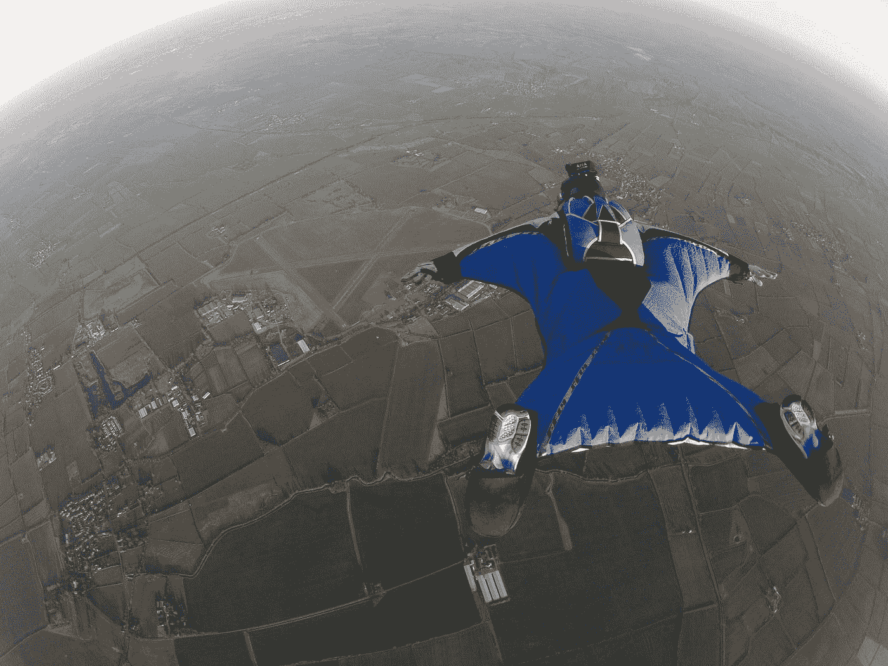

# 为什么你应该寻找和面对你的恐惧

> 原文：<https://medium.com/swlh/why-you-should-seek-confront-your-fears-5e5f87201126>

## 因为威尔·史密斯这么说。

Photo by [Jonathan Francis](https://unsplash.com/@thanfrancis?utm_source=medium&utm_medium=referral) on [Unsplash](https://unsplash.com?utm_source=medium&utm_medium=referral)

你听到了。

清新王子本人希望你和最让你害怕的东西成为最好的朋友。

大威利(我可以整天这样做)在他自己的生活中实现了一个非常有益的认识，他在去年的一次采访中说: