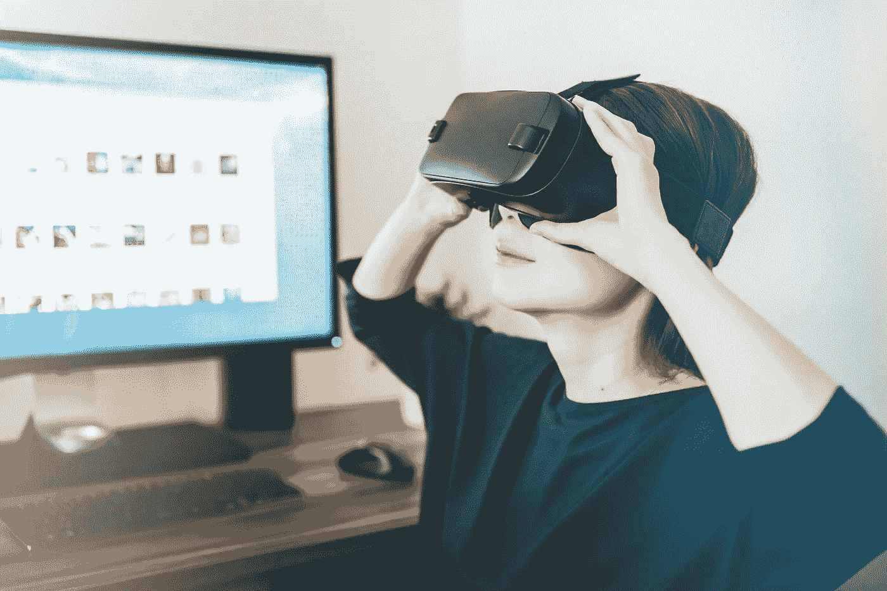
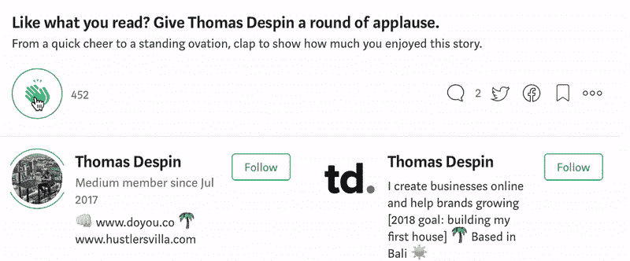

# 为什么有时你应该把生活当成一场游戏？

> 原文：<https://medium.com/swlh/why-you-should-sometimes-take-life-as-a-game-d905baf62ecf>

上学，长大，责任，找工作，工作，好好生活，家庭，纳税，死亡，做公民，尊重法律…

我曾经把自己投射到成年人告诉我的真实世界中，我发现这极其无聊，毫无吸引力。

这就是生活，你不能想做什么就做什么。你将不得不接受它并处理它。

说真的，当你被告知，除了童年，人生第二美好的时光将是生命的最后 5-10 年时，谁还想在地球上呆得更久呢？

就在你死之前，一旦你有能力退休。

所以，我没有留在地球上。

我童年的大部分时间都在创造自己的世界，创造角色，以及他们之间的故事。

我就像是我自己世界的上帝。

我喜欢做一个公平的人。

我让我的世界比我周围的成年人生活的世界更有趣。

他们似乎不太高兴，并把这种情绪投射到我身上。

后来父母离婚，我就一头扎进了互联网的世界。

我发现了 RPG 论坛。对我来说，这是一场革命。

在那里，任何人都可以创造自己的角色，它的故事，它的技能，并通过分享不同主题/小说的信息和图像与他人互动。

这让我得以逃离现实世界。

我当时 13 岁，突然和 20 多岁的人交往，他们不知道我是谁，也不知道我在现实生活中有多大。

爱死了。

重要的是你为我们自己的角色创造的故事，以及他们之间如何互动。

我的角色有点像我，但是你可以想象，他更老，更强壮，更聪明，更友好，也更快乐。

几年来，当我的父母离婚时，对我来说最重要的事情就是从学校回到我的电脑前，最终连接到我自己的现实。

家里的气氛令人无法呼吸。我在网上随机选择的人身上找到了氧气，他们假装成自己创造的虚构角色。

我不记得为什么有一天停止了，但我记得我很依恋我的角色。

我仍然记得我的角色爱上了莎莉，她告诉我她是现实生活中一个 26 岁的加拿大女孩。

我们聊了很多人生，目标，意义，现实等等。我想我骗了她我的真实年龄，说我 18 岁。

然而，真正有趣的是，这些互动，以及被刺激以比在学校或与朋友更高的智力水平来表达自己，

实际上改变了现实世界中的真实的我。

总的来说，我变得更成熟、更开放、更挑剔、更聪明。

他们所谓的虚拟世界对我真实自我的发展产生了影响。

但这只是一场游戏。

对吗？
错了。

把自己投射到一个虚拟的世界里，并且做得好像，改变了最初世界里的我。

因为那些互动，即使是虚拟的，也重新连接了我的大脑。

如果我小时候和青少年时都这样做，为什么成年后不这样做呢？

不过，你不必逃到虚拟现实中去(每个现实在某种程度上都可能是虚拟的……但我需要另一篇文章来讨论这个问题)。

你可以把自己投射到同一个世界的不同现实中，想象你理想中的生活是什么样子。

让它变得有趣，把它当成一个游戏。

把事情看得太重是在扼杀创造力，让你忘记在当今世界，你有机会设计你想要过的生活。

我围绕着我觉得对我有益的东西来设计我的生活，基于迄今为止我被赋予的生活。

我出生在法国，但现在住在巴厘岛，在那里我成立了自己的公司并获得了完全居留权。

我从小就非常害羞，完全排斥其他人，然而当我 20 岁左右的时候，我组织了 200 多名学生聚会作为副业。

我从未在学校或从我的家人那里学到任何有关商业的东西，但现在我的整个生活都是在创造项目，从管理我的服装品牌 doyou.co，到种植好色客别墅，以及很快在一个处女岛上建造一个生态度假村。

我可以继续说下去，但是我相信你已经明白了。

当你允许自己做白日梦，把生活当成一场游戏时，你就开始打开你从未见过的大门。

你拓展了可能性的领域。

把生活当成一场游戏，可以让你增加更多积极的假设:

*   如果我今天开始这项业务呢？
*   如果我对一切说去他妈的，然后独自环游世界呢？
*   如果我只买一个岛呢？

你可能想告诉我，所有这一切都很好，听起来很棒，但生活无论如何都不是一场游戏，并不是所有事情都是可能的，因为你每天都梦想着它。

也许吧。我是说，是的，也许你会尝试一些疯狂的事情，然后失败。

但也许不是。

所以你要么过着从未尝试过的人的生活，因为它可能会失败。

或者你过着一个真正尝试过的人的生活，因为为什么不呢，这看起来很有趣，而且至少有一次机会去完成它。

把生活当成一场游戏，并创造性地从中获得乐趣。

去的路上玩得开心点，

反正也没办法赢，
最后我们都死了。

*原载于*[【doyou.co】](https://doyou.co/blogs/daily-hustle/why-you-should-sometimes-take-life-as-a-game)

## 这篇文章发表在 [The Startup](https://medium.com/swlh) 上，这是 Medium 最大的创业刊物，拥有+ 373，446 名读者。

## 在这里订阅接收[我们的头条新闻](http://growthsupply.com/the-startup-newsletter/)。

