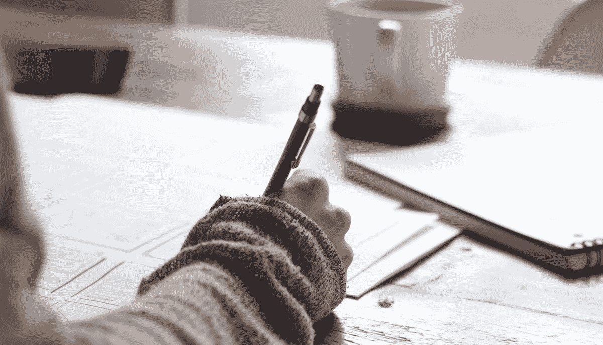
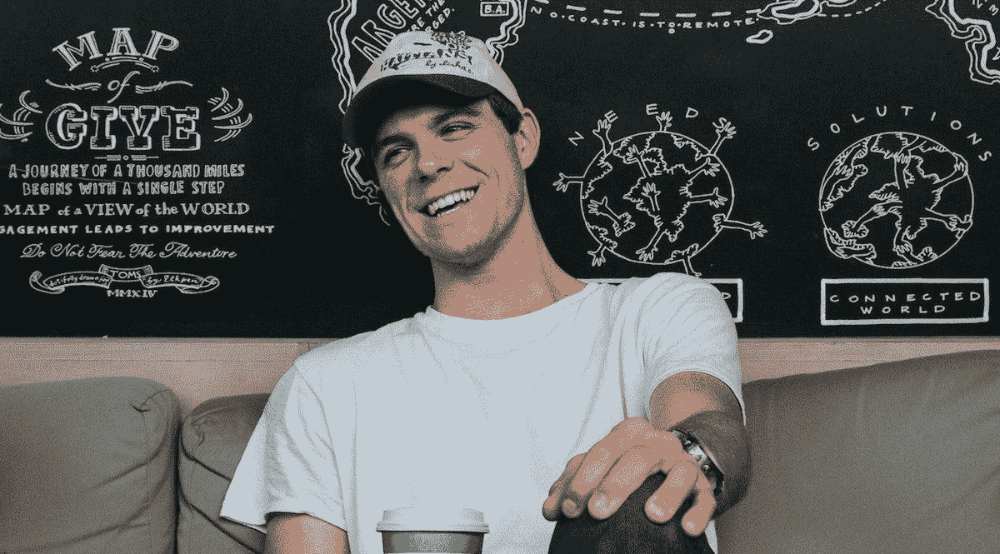

# 为什么你应该每月花一天时间联系、学习和避免“紧急”任务

> 原文：<https://medium.com/swlh/why-you-should-spend-a-day-a-month-connecting-learning-and-avoiding-urgent-tasks-615354d5ab89>

## 如何利用刻意休息的力量

对大多数人来说，休息意味着 15 分钟去喝杯咖啡或者去城外度个周末。但是越来越多的研究表明，要做到最好，我们需要做得更少。

而且不仅仅是在工作时间的意义上。

相反，成功、高效工作日的关键可能就是所谓的**刻意休息**。正如《*休息:为什么你工作更少却能完成更多》一书的作者 Alex Soojung-Kim Pang 所解释的那样*

> “工作和休息其实是伙伴。它们就像波浪的不同部分。没有高潮就没有低谷。你休息得越好，工作起来就越好。”

那么什么是刻意休息呢？我们如何利用它来确保我们的休息时间和工作时间一样高效？

# 为什么我们很难抽出时间

历史上一些最成功的人工作时间最短。

查尔斯·达尔文、斯蒂芬·金和玛娅·安杰洛已经产生了大量有影响力的作品，而不需要每周工作 40、50 或 60 多个小时。

但是对于我们大多数人来说，我们可以工作得更少，但仍能达到我们的长期目标的想法似乎是违反直觉的。这是一个普遍的信念，原因有很多，但这里有几个重要的原因:

*   我们认为更多的工作应该等于更多的产出:大多数行业都以这样或那样的方式支持长时间工作。我们认为生产力不是用更少的资源做更多的事情。而是简单地做更多。
*   **我们害怕被“落在后面”:**在我们竞争激烈的[工作环境](https://blog.rescuetime.com/work-environment/)中，休假的想法令人害怕。我们不仅会错过一些重要的对话，还会担心自己会被落下。
*   工作已经成为我们身份的一个重要组成部分:也许最重要的是，我们觉得自己与所做的工作息息相关。抽出时间会带来各种难以面对的问题。更难回答。正如 Soojun-Kim Pang [所说的那样](http://www.deliberate.rest/?p=22)，“当你的工作是你自己时，当你停止工作时，你就不存在了。”

所有这些理由的问题在于，它们遵从短期思维。

大多数有生产力的人把能够从短期心态中挣脱出来作为他们工作中的突破。

更糟糕的是，短期思维是职场压力和[倦怠](https://blog.rescuetime.com/burnout-syndrome-recovery/)的最大原因之一。我们发现，当可能有更好的选择时，说“当然，我会在这个星期加班”太容易了。

刻意休息解决了这两个问题。它不仅给你的身心一些急需的休息时间。但是它允许你利用工作之外的时间来建立你最终实现长期目标所需的技能、人脉和心态。

*RescueTime 给你准确的信息，告诉你如何度过每一天(以及什么时候该休息)。* [***今天就免费报名***](https://www.rescuetime.com/) *，开始夺回你的时间控制权。*

# 什么是刻意的休息？你如何使用它？

刻意休息是对术语“刻意练习”的一种玩法，它描述了当你在练习一项技能时，不断地、系统地挑战自己的方法(而不是仅仅练习你觉得舒服的东西)。

因此，不是用网飞和冷饮来放松，刻意的休息意味着参与通常是充满活力和精神投入的宁静活动。

但是那听起来不太安宁？

没错。如果你认为休息仅仅是不工作，那么刻意的休息听起来更像是你工作日的延续。但在现实中，我们谈论的是找到让你在工作之余重新充电的活动，同时仍然保持精神上的生产力。

或者，正如 Alex Soojun-Kim Pang 在他的*刻意休息* [*宣言*](http://www.deliberate.rest/?p=22) 中描述的那样:

> “有意识的休息有助于你从一天的压力和疲惫中恢复过来，让新的经历和教训留在你的记忆中，并给你的潜意识空间继续工作。”

以温斯顿·丘吉尔为例。第一次世界大战后，邱吉尔开始画画，他在自己的书《作为消遣的绘画》中称这非常像政治。它需要同样的大胆和果断。你需要对你面前的东西和你想要达到的目标有一个清晰的认识。然而，与此同时，它令人难以置信的恢复，让你表达你的创造力，把你的忧虑放在一边。

对丘吉尔来说，绘画不是一种逃避现实的方式。而是探索他的技能的一种新的和恢复性的方法。

# 在故意休息期间做什么

找到自己版本的刻意休息不容易。

正如 Behance 的联合创始人斯科特·贝尔斯基所说的那样，**我们似乎都渴望在休息时间分散注意力******:****

> **在这些暂时的分心的空隙中，我们的思想回到困扰我们所有人的不确定性和恐惧。。。。我们贪得无厌的获取信息的需求——以享受我们的休息时间为代价——是我们为了让自己安心而做的一种‘工作’”**

**但是如果你能挣脱束缚，找到既能让你恢复活力又能让你兴奋的活动，你就能更好地完成你的最佳工作。**

**当你找到自己的刻意休息方式时，这里有一些策略和地方供你探索:**

# **遥不可及**

**忙碌是刻意休息的敌人。你越容易收到请求、电子邮件和信息，你就越有可能放弃休息时间。**

**正如 Scott Belsky 在他的文章 [*中所写的，停机时间发生了什么？*](https://99u.adobe.com/articles/6947/what-happened-to-downtime-the-extinction-of-deep-thinking-sacred-space#comments)**

> **“早在电视成为每个美国家庭的必需品的时候，父母就开始要求孩子花时间阅读。“看电视时间”变成了一种有控制的努力，因为，否则，它会消耗掉醒着的每一分钟。现在，每一个清醒的时刻都是“关联时间”，我们需要开始控制它。我们需要一些规则。”**

**对于《幸福方程式》的畅销书作者尼尔·帕斯查来说，他在他所谓的“不可触及的日子”中找到了刻意的休息——24 小时，他完全无法触及，可以自由探索他想探索的任何爱好、项目或工作:**

> **“碰不得的日子已经成为我重回正轨的秘密武器。它们是我完成最有创造性和最有价值的工作的方式。分享一个粗略的比较，当我在会议之间写作的时候，我一天可能会写 500 个单词。在一个碰不到的日子，我写 5000 字并不稀奇。这些天，我的工作效率提高了 10 倍。”**

**考虑到你每天的日程安排，一个月中的一天似乎是不可能的。这就是为什么尼尔建议提前安排好(他的预约至少提前 16 周)。通过这种方式，你知道它不会中断其他预定的任务，并且它被锁定，不可协商。**

# **专注于你清单上重要但不紧急的任务**

**有意义的职业建立在重要但不紧急的任务上。比如探索新技能、[完成附带项目](https://blog.rescuetime.com/ben-lang-interview-consistency/)，或者分享你的工作并参与你的社区。不幸的是，当工作压力下降时，这些东西通常最先消失。**

**刻意的休息给你一个机会去完成这些有意义的任务，但是很容易被推到一边。**

**正如贾迪普·本萨尔在[世界经济论坛](https://www.weforum.org/agenda/2017/11/should-you-take-a-sabbatical/)上写道:**

> **“我们需要明白的是，在任何一家公司工作时，我们都需要从长计议。适时的休息有可能让我们恢复活力，激发灵感。一旦带着清晰的头脑回来，我们就可以看到前进的道路，并作为一种更具生产力的资源进一步参与进来。”**

**工作场所的压力不利于长期思考。但是在刻意休息的时候，你可以放手，放松，寻找探索的空间。据*休息*作者彭苏荣:**

> **“略微放松大脑的体验可以让大脑探索不同的想法组合，测试不同的解决方案。然后一旦它到达一个看起来有希望的地方，它就会像啊哈一样跃入你的脑海！瞬间。”**

**刻意休息也不一定只是与工作有关。在我们的生活清单上，我们都有很多重要但不紧急的事情，这些事情会帮助我们感到有成就感和富有成效。**

# **与你一直想联系的人联系**

**人类是群居动物。然而，当我们在漫长的一天工作后感到筋疲力尽时，我们常常想独自充电。虽然时不时躲起来感觉不错，但这不是补充我们创造力、快乐和动力的最佳方式。**

**密歇根大学的 Oscar Ybarra 在一系列研究中发现，参与社交活动的人表现出更高水平的认知能力:**

> **“社会互动有助于锻炼人们的思维……当人们在社会上和精神上与他人交往时，他们会收到相对即时的认知提升。”**

**这并不意味着你应该在所有的休息时间拿起电话或者和朋友出去。(事实上，[新的研究已经证明](https://blogs.scientificamerican.com/beautiful-minds/both-introverts-and-extraverts-get-exhausted-from-too-much-socializing/)当内向和外向的人不得不与太多人交谈时，他们都会感到疲惫)。但简单来说，与让你感觉良好的人交谈可以给你带来认知上的提升。**

# **有意义的职业是一场马拉松。不是短跑。**

**归根结底，刻意休息就像它的名字所暗示的那样:在你不工作的时候和工作的时候一样有目的性。**

**正如彭淑贞所解释的:**

> ***“当你学会如何平衡工作和休息时，你可以保持更高水平的生产力和创造力。”***

**建立一个有意义的职业不是短跑。这是一生的旅程。实现长期目标的唯一捷径是[休息](https://blog.rescuetime.com/weekly-roundup-meaningful-breaks/)，在需要的时候休息，探索[是什么激励着你](https://blog.rescuetime.com/motivation-to-hit-goals/)。不是让你分心的事。**

# **嘿，我是乔里！**

**我帮助公司和有趣的人通过巧妙而专注的写作讲述他们的故事。想一起工作吗？ ***在 hello@jorymackay.com 给我发邮件*****

***这篇文章的一个版本最初发表在* [*改版博客*](https://blog.rescuetime.com/deliberate-rest/) *上。查看更多关于生产力、专注和动力的文章。***

****

## **这篇文章发表在 [The Startup](https://medium.com/swlh) 上，这是 Medium 最大的创业刊物，有 323，238+人关注。**

## **在这里订阅接收[我们的头条新闻](http://growthsupply.com/the-startup-newsletter/)。**

****