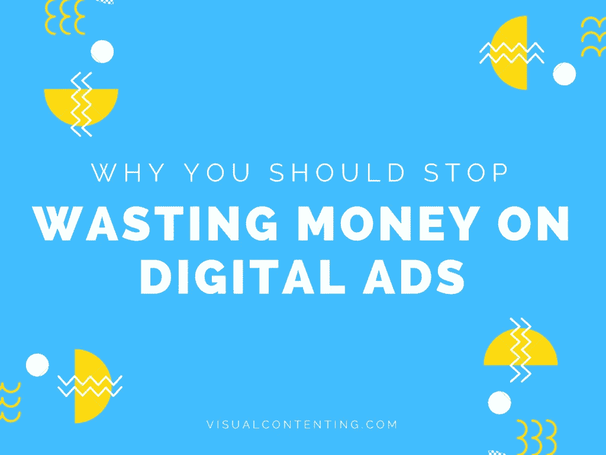

# 为什么你应该停止在数字广告上浪费钱

> 原文：<https://medium.com/swlh/why-you-should-stop-wasting-money-on-digital-ads-bf6e8c778b39>

你知道宝洁公司(P&G)最近[宣布](https://www.adweek.com/brand-marketing/when-procter-gamble-cut-200-million-in-digital-ad-spend-its-marketing-became-10-more-effective/)他们不会投资数字广告吗？

想知道为什么吗？

大多数时候，数字广告甚至无法触及目标受众。大多数互联网用户不想被广告轰炸。在流畅的浏览中遇到中断是非常令人讨厌的…