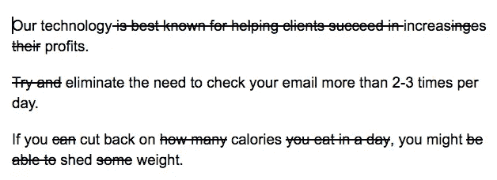
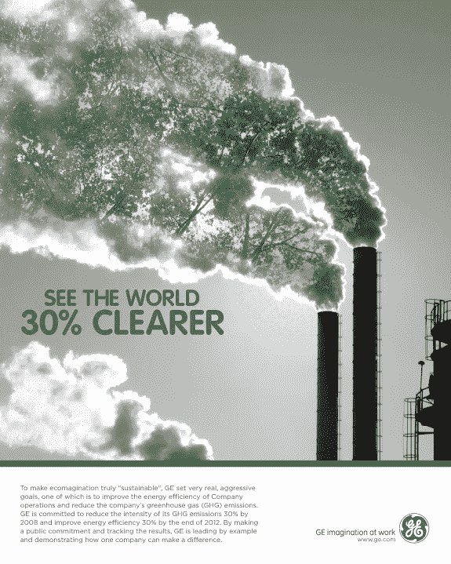

# 为什么你的首要任务应该是教你的销售团队写作

> 原文：<https://medium.com/swlh/why-you-should-teach-your-sales-team-to-write-b8292eb899e9>

Photo by [rawpixel](https://unsplash.com/photos/k6o_7VF2tig?utm_source=unsplash&utm_medium=referral&utm_content=creditCopyText) on [Unsplash](https://unsplash.com/search/photos/business?utm_source=unsplash&utm_medium=referral&utm_content=creditCopyText)

我们每天都在写作——电子邮件、短信、休闲裤、快照、登陆页面、广告、提案、LinkedIn 消息等等。

商业靠写作运行。**伟大的企业**运行在**伟大的作品上。**

*不管这个人是营销人员、销售人员、设计师、程序员还是其他什么，他们的写作技巧都会有回报。那是因为成为一名优秀的作家不仅仅是写清晰的文字。字迹清晰是思路清晰的标志。伟大的作家知道如何沟通。他们让事情变得容易理解。*

*—* [*杰森弗里德*](https://www.goodreads.com/work/quotes/6928276-rework)

# 但是，大多数美国人不是好作家。

*   75%的中学生写作能力低于平均水平。
*   2016 年参加 ACT 考试的学生中，有 40%的人表现不佳，无法通过大学的一门基础英语写作课。
*   [2300](https://www.washingtonpost.com/news/answer-sheet/wp/2017/04/27/why-so-many-college-students-are-lousy-at-writing-and-how-mr-miyagi-can-help/?noredirect=on&utm_term=.f528fffd5828) 大学生写作被测—结论？他们大多数人都写不出一个完整的句子。
*   数百名雇主抱怨糟糕的写作——即使候选人来自精英学校。
*   国家教师质量委员会查看了 2400 份写作课程，确定没有教授写作的系统方法。

> 大多数人不擅长写作，因为没有人教他们写作。

更重要的是，写一个完整的句子和写一个好句子有天壤之别。

# 现代销售周期的大部分是书面内容。

你的第一次联系，求婚，LinkedIn 信息…

这都是书面的。

然而，我们没有向销售人员提供如何写好文章的培训。我们也不会教他们写推销东西的文字。

## 让我向你展示一下学会写好(和为了销售而写)对我有什么帮助。

*   优秀的写作让我自己的商业利润翻了三倍(作为顾问和教练)。我有一封电子邮件，每次发送都能给我带来 2-3 个新客户。不需要跟进。1 封电子邮件，然后关闭——没有太多的周期。
*   优秀的写作帮助我以其他销售人员无法做到的方式获得线索——写针对我的客户的电子书、博客帖子，或者 Slack 和 LinkedIn 群组中的[有用信息。](https://foundr.com/social-selling-slack/)
*   好的文笔让我的一个客户每周有 5-6 次会面，每周有 2-3 笔新交易。
*   优秀的写作让我客户的业务收入翻了一番(见下文)。

text convo with my client the week business doubled

**在几个月的时间里，好的写作让我的利润翻了三倍。**

想象一下，如果你的整个团队提高了 2-3 倍，销售额会有多大的变化。

# 糟糕的写作扼杀交易

这都是关于声誉和专业知识。尤其是如果你从事 B2B 销售。事实上，80%的 B2B 买家只会从他们认为是专家的代表那里购买。糟糕的写作让我们成为非专家。

**文字太多？你压倒了读者，他们失去了兴趣。**

**文字太少？你的读者感到困惑。**

**可读性差？你的潜在客户不知道你在卖什么。他们不会知道你的产品或服务的好处。**

**傻逼语法？** [糟糕的语法可以扼杀一半的交易时间](https://www.huffpost.com/entry/how-bad-grammar-slow-response-times-and-a-competitive_b_56fc0920e4b038fff497f74f/amp)。你似乎不够资格。该公司似乎不太合格。糟糕的语法也意味着信息不清晰。不要把语法当成八年级的科目。基本语法对清晰性至关重要。觉得一个逗号没多大关系？

让我们吃杰瑞吧。(这意味着你想吃掉你的朋友杰瑞)。

杰瑞，我们吃饭吧。(这意味着你想和你的朋友杰瑞一起吃点东西)。

那个小小的逗号改变了整个句子。

**傻逼语法？你的产品或服务的好处被淹没在一团混乱的文字中。**

> 好的文笔有助于更高效的销售周期和更多的成交。

# 改善书写，提高可读性

可读性是指阅读一篇文章的难易程度。可读=清晰。

可读性越强，越有说服力。可读性越强，达成交易所需的来回奔波就越少。

好消息——提高可读性并不难。

职业作家和编辑，比如《邮报》的记者，知道可读性是可以学习的。他们学会了如何变得生动有趣，当一个句子被一个糟糕的动词搞砸了该怎么办，以及为什么要控制句子长度。

*——瓦莱丽·斯特劳斯，华盛顿邮报*

## 但是所有这些难道不会花费大量的时间去学习吗？

没有。

伯克利音乐学院(我的母校)的约翰·马奎尔教授在意识到他的大多数学生不能写出清晰的句子后，进行了一项实验。

他设计了一种教写作的新方法。我会让他告诉其他人:

*几周之内，班上大部分人都写出了得体的句子和由得体的句子组成的半页文章。他们使用了好的动词…*

我研究过他的方法，我认为你可以用新技术很快学会。你不需要照看你的团队，检查他们的写作，或者花几个小时思考你自己用词的清晰度。而且，你不需要有*完美的*语法。事实上,*对话的清晰性*(我喜欢这么称呼它)才是重点。

# 在几周内提高你的写作水平

## 第一步。符合语法

下载[语法](https://www.grammarly.com/)和 [Chrome 扩展](https://chrome.google.com/webstore/detail/grammarly-for-chrome/kbfnbcaeplbcioakkpcpgfkobkghlhen?hl=en)。这绝对值得 30 美元/月。你会看到 1000 倍的投资回报。

## 第二步。短甜的是最好的

*   **保持事情的简短甜蜜**。一个句子应该不长于电脑屏幕上的几行。段落不要超过 4 行(注意这篇文章中的段落)。
*   **用小词**，不要用大词。如果让你在一个复杂的单词和一个简单的单词之间做出选择，让简单的获胜。吓得>怯懦。
*   **删除所有不必要的单词**。马克·吐温和欧内斯特·海明威会花几个小时从他们的作品中剔除每一个不必要的单词。像这样:

不要错误地认为你越是东拉西扯，话越多，你听起来就越聪明。事实正好相反。用简单的词语解释复杂的产品需要相当聪明的人。

## 第三步。写出(真正的)好处

作为销售人员，我们需要抓住要点。问题是，有时候很难知道重点是什么。任何销售信息的要点都是阐明你的产品或服务提供的结果。

一条好的销售信息要简洁明了，并且提到你的公司能为你的潜在客户带来的结果和好处。

**成果收益:**T22*与你的产品/服务合作的*成果。这是潜在客户唯一关心的事情。它是有形的，通常是与客户利润相关的指标。*(如果你不知道哪些指标对你的客户最重要，你需要问他们)。*

**结果效益示例**:我们的公司/产品平均在 3 个月内增加了 57%的利润。或者，我们的电子邮件软件将提高 X%的投递率，平均增加 Y%的利润。

当以节省的*美元或创造的*美元进行沟通时，结果最为有效。**

要找到你的结果收益，从你知道的指标开始。如果你建立了网站，他们提高了 x 倍的流量，然后找出你的客户的平均交易规模，把数字代入。你带动了 x 的流量，带来了 y 的点击量，以及 z 的潜在电子商务销售额。

**行动利益:你的产品或服务是什么。没人在乎你采取的行动/你的产品。**

行动利益示例:我们*建立*响应网站，或者我们的 SaaS 应用*对竞争对手的博客文章进行评分*，这样你就可以窥探他们在内容方面的努力。或者，我们正在*扰乱*事物。

> 行动从来卖不出任何东西。结果销售一切。

下图卖的是什么结果？

Nike ad

*购买这款健身器材的结果是拥有令你自豪的健美身材。*

或者#shareacoke 运动呢？

Coca-Cola ad

分享一杯可乐的结果是和你爱的人关系更亲密。

有时候，大品牌会把结果的好处写进他们的广告里。

GE ad

大品牌和广告公司在销售结果方面非常出色。尝试挑选出他们正在销售的结果是一个很好的实践。它会教你写结果。

## 一步。写出主动动词

[主动动词产生清晰度](https://www.jamesgmartin.center/2013/05/teaching-college-students-to-write/)。这可以说是清晰写作最重要的部分。要点如下:

主动动词:动词前的主语

这个女孩扔了球。

*女孩(主语)扔(动词)球(宾语)*

被动动词:动词后的主语

例子:球是那个女孩扔的。

*球(物体)扔出(动词)女孩(主语)*

可以看到，主动语态很清晰。它简短扼要。没有什么比一篇充满被动语态的文章更糟糕的了。

上面的例子很简单，但是想象一个更复杂的被动语态的句子。读起来很累，因为你的大脑被迫对单词进行重新排序。你的大脑就像——*等等，谁。做了。什么？敬。什么？什么时候？*

这个简单的规则可以使我们的语言清晰，也可以破坏它。

我们很幸运。今天，科技让我们很容易用主动语态写作。

我提到的 Grammarly 应用程序将指出电子邮件、网络应用程序、谷歌文档等中写的任何内容中的被动语态。

如果一开始你的写作中有很多被动语态，不要气馁。通过注意和纠正它，你会很快提高。

确保你每次都纠正它。在一个月左右的时间里，你将几乎完全用主动语态写作。

# 让我们看一个例子

我每天早上都会收到一连串冷冰冰的电子邮件。在我们进一步讨论之前，是的，它们是有效的(如果做得正确的话)。就像我上面提到的，我的一个客户每周都使用同一封冷冰冰的邮件，每周用一封邮件搞定 5-6 次会议和 2-3 笔新交易。

问题是，大多数人不知道如何写一封有效的电子邮件。

看看这个例子

A cold email I received

我打开一看，立刻被大量的文字弄得筋疲力尽。我的大脑想，*删除它——我们没有精力做这个*。

我不认识这个人，我唯一关心的是他们如何帮助我的公司。他们不停地说，“*扰乱这个*，*扰乱那个*”但如果他们破坏了什么，我又能在乎什么呢？Wtf 是一台*数控机床*？如果他们没有自己的*生产资料*我又有什么好在乎的？

## 以下是我们如何将清晰写作的规则应用到邮件中

*   短甜的
*   谈论结果，而不是行动
*   尽可能清楚

*嗨{ {名字}}，*

我是数码家具公司的鲍勃。我专门为{ {插入工作类型/公司类型}}制作家具。巨大的利益？我把你的家具电邮给你。零等待，零麻烦。

*我通过电子邮件发送一个文件，您附近的本地制造商创建您团队的{ {插入家具类型}}。最重要的是，你可以用很少的费用买到定制的产品，而且送货速度非常快。谷歌和耐克喜欢我们的产品。*

本周你是否有两分钟时间谈论你正在寻找的家具类型？

当一封邮件简明扼要时，我们不仅提高了回复率，还剔除了不合格的线索。怎么会？因为越来越多的人阅读这本书。

我会把“谷歌和耐克喜欢我们的产品”这句话和一个案例联系起来。

# 外卖食品

如果你的团队写得不好，你就失去了机会。

好的文笔是清晰的。如果你对自己的写作能力没有信心，没关系。你可以利用科技在几周内提高你的技能。

*   写小字
*   写出主动动词
*   保持句子最多两行
*   保持段落最多 4 行文本

**感谢你的阅读，如果你觉得这很有帮助，请鼓掌，这样它就可以帮助别人了:)**

**如果你有兴趣了解更多关于提升团队写作能力的知识，** [**请联系我**](https://www.linkedin.com/in/klee8/) **。**

## 这篇文章发表在 [The Startup](https://medium.com/swlh) 上，这是 Medium 最大的创业刊物，拥有+369，832 名读者。

## 在这里订阅接收[我们的头条新闻](http://growthsupply.com/the-startup-newsletter/)。

