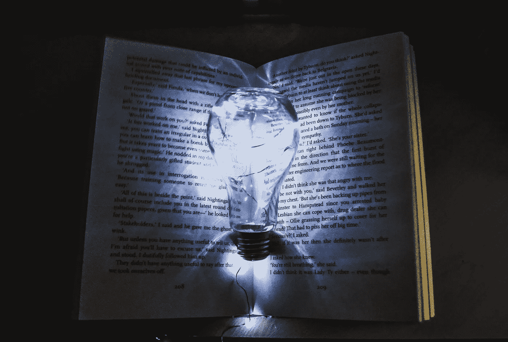

# 为什么你应该把你的手艺视为一种产品

> 原文：<https://medium.com/swlh/why-you-should-view-your-craft-as-a-product-6379eb02d14e>

Photo by [Clever Visuals](https://unsplash.com/photos/iMwiPZNX3SI?utm_source=unsplash&utm_medium=referral&utm_content=creditCopyText) on [Unsplash](https://unsplash.com/search/photos/product?utm_source=unsplash&utm_medium=referral&utm_content=creditCopyText)

我热爱产品开发。我热爱产品创新和产品设计。我喜欢阅读关于产品的书籍，它们是如何被思考的，制造它们的研究以及之后的市场营销。我个人有一本专门做产品管理的书，间接把自己培养成一个！

有人可能会说酷！我们也是，这就是为什么我们向创业公司捐款的原因，因为我们想创造一些令人敬畏的东西！(咄)。我从未通过培训成为产品经理，也不是一个组织的产品经理。我来自传统的金融服务领域，但我发现自己喜欢的东西是一个你无法获得学位的实际职业！

很神奇吧？我拿起一本书，着迷于企业家和组织如何真正实现创新。

在过去的几个月里，我顿悟了。

对我自己来说，我天生就是个作家(自然？是的，它是一个东西)，工艺和爱情。在某些方面，成为一名作家需要一个人*不仅仅是*拿起电脑，开始输入任何想到的东西，而是给*写信才有意义*。

理解概念、想法，尤其是当今重要的事实。

发挥作用的头脑风暴、合理化、思维导图，当然，如果我们要用事实来教育大众，我们不要忘记****研究！**研究构建不仅能引起市场或受众共鸣，而且能满足市场(即受众/读者)需求的内容。**

**当我在消化产品管理和开发书籍，确保我的技能与 21 世纪的技能相匹配时，我意识到了一些事情。我不仅直接或间接地把自己培养成了一名产品经理，而且我非常渴望成为一名成功的作家、作家和企业家。**

**在创作内容时，我发现自己本能地关注许多其他方面:**

1.  **研究市场**
2.  **研究趋势**
3.  **开发迭代**
4.  **组装一个最小可行的产品**
5.  **测试研究和收集的数据**
6.  **在产品发布后分析数据**
7.  **获得反馈**

**我在其他领域和行业采用了产品管理原则，但把它应用于我的第一爱好——写作和内容创作本身。**

**一个经过头脑风暴、研究、创造、测试、发布的产品，一个接受反馈的产品，为下一次发布更好的产品。**

*   **画家？**
*   **作家？**
*   **音乐？**
*   **有形产品？**
*   **服务？**

**开始将你的手艺视为一种产品，与市场分享。结果会随之而来。创造东西是一回事；将时间(希望如此)、资源和金钱放在一起；建造一些东西，然后**猜测**市场会接受它。**

**有时候这很管用！**

**不过，当你对你的手艺做一点市场调查时，不管它是什么，那就是另一回事了。不幸的是，对于我们自己的工艺，所达到的成功水平将由我的市场指标和底线来衡量。创造市场想要的东西。**

**你不仅会觉得有所准备，还会觉得有能力更好地了解你的消费者群的习惯和细节，从而制造出大众想要的东西。**

**谁不想这样呢？**

> ****“人生苦短，没时间去造没人想要的东西”——阿什·莫利亚****

****

**Photo by [Matt Krieg](https://unsplash.com/photos/OjbcvDlJxLg?utm_source=unsplash&utm_medium=referral&utm_content=creditCopyText) on [Unsplash](https://unsplash.com/search/photos/inventors?utm_source=unsplash&utm_medium=referral&utm_content=creditCopyText)**

***在推特上关注我:* [*amuneeb24*](http://www.twitter.com/amuneeb24)**

****

## **这篇文章发表在 [The Startup](https://medium.com/swlh) 上，这是 Medium 最大的创业刊物，拥有 297，332+人关注。**

## **在此订阅接收[我们的头条新闻](http://growthsupply.com/the-startup-newsletter/)。**

****