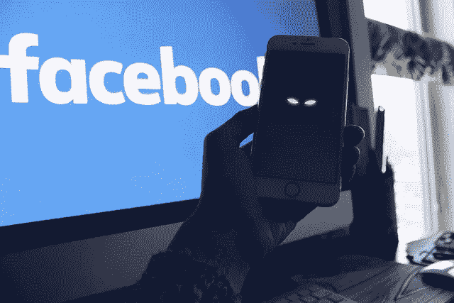
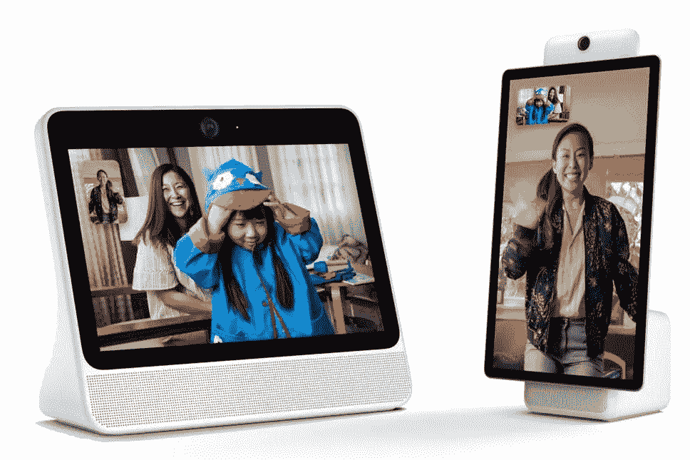

# 为什么你不应该购买脸书门户网站

> 原文：<https://medium.com/swlh/why-you-shouldnt-buy-into-the-facebook-portal-aec07cf6d78d>

## 一家因被入侵而闻名的公司的数据收集设备。

脸书是一家拥有超过 20 亿用户的大公司，但是如果你看一下他们的历史记录，你就会意识到也许他们不应该出售脸书门户网站。

鉴于最近影响 5000 万用户的[数据泄露事件](https://techcrunch.com/2018/09/28/everything-you-need-to-know-about-facebooks-data-breach-affecting-50m-users/)，脸书决定是时候销售另一种可以从你的房子内部收集数据的设备了。当然，它应该被用作给家人和朋友打电话的家庭枢纽，但任何事情都有时间和地点，对于脸书来说，没有一个合适的时间和地点作为他们的门户。

# 数据问题

数据收集有好的和差的方法。可以一整天都在非敏感数据上收集数据，而不必大惊小怪，但是敏感数据要么不收集，要么保持最低限度。

脸书对这两种信息都有一点了解，但他们最近宣布的门户网站将有利于敏感数据。脸书可能正在使用来自门户网站的[数据，这些门户网站在他们的其他平台上向你投放广告](https://www.recode.net/2018/10/16/17966102/facebook-portal-ad-targeting-data-collection)。使用应用程序可能不是非常敏感的信息，但这是他们用更多的广告轰炸你来赚更多钱的信息。

门户网站被伪装成一种让你与他们的家人保持联系的方式，但在我看来，它更像是一种脸书向你收取 200 至 350 美元的设备，这样他们就可以通过他们的其他产品从你身上赚更多的钱。他们收集的数据也可以出售给其他公司，以进一步增加他们的收入。

这是一个奇怪的方式来处理他们的声誉，当人们目前正考虑跳槽数据泄露摆在首位。

# 隐私问题

Photo from [Flickr](https://www.flickr.com/photos/stockcatalog/40563456314/in/photolist-24Nsjms-gwCzf-9jP2hb-5Jdxyt-9hEzqa-6D43GH-nfzaDo-q1gpKR-9jP2vo-9hEzht-9hHQvN-oiku3-9hEJ6T-dvgwB7-9hHG2A-eenhAm-dvgtDu-dvgtfo-9hHF9s-cE1tn9-dvgwFm-8UX4ev-dXUULH-d1ESMb-paP1hE-dvaUPc-dvaT5p-oEUhDQ-98xrMb-8QpkB8-dvgsGA-dvgvMQ-oGW7qg-oqrCq4-a8bykT-oqrCNi-dvgtZf-6q2grR-8PdXxK-dvguR7-9z7w8q-dvgusW-9zkZ6L-dvgy73-dvaX1K-9hEH8K-9gii7Y-9SM1RQ-9hHMKo-oGExY8)

隐私和数据收集是有道理的。在计算时代，隐私受到高度重视，但在收集非敏感数据时不应有任何损害。

谷歌搜索跟踪搜索历史，以便更好地定位广告。一般来说，网站会保存 cookies，这样它们就能知道你喜欢的特定项目。这并不是特别侵犯隐私。相反，这就像听一个朋友说话，知道他们喜欢什么。

但是说到脸书，谁想要记录你的对话、视频通话、关系、兴趣等等。，他们收集的数据可能是对隐私的侵犯。他们希望你通过连接你的银行账户来汇款，这也于事无补。

随着门户网站的发布，他们将有一个内部人士看你的房子，记录你的谈话，并成为另一个永远在线的设备。

亚马逊的 Echo 和谷歌的家用设备本身已经引起了足够的关注，而没有被黑客攻击的名声。再加上另一个名声不好的家用设备，这将是一场灾难。

# 门户问题

除了隐私和数据收集问题，门户本身并没有提供太多东西。这是一种只需花费几百美元就能做你的手机已经做的事情的设备。

当你可以打开手机上的 messenger 并完成同样的事情时，你有多少次想要站在厨房里给某人打电话？它确实有很好的功能，比如更大的屏幕，当你在房间里走动时跟踪你，但就我个人而言，我无法证明这些功能的价格。

传送门也不像 Echo 或 home 那样，把自己标榜成一个家庭控制者。它内置了亚马逊的 Alexa，但他们的注意力几乎完全集中在与他人交谈上。它本质上是一部不能随身携带的手机。

脸书只是没有提供足够的最新产品。

# 真正的问题是

Photo from [Flickr](https://www.flickr.com/photos/bookcatalog/40992060262/in/photolist-25sk2nG-9EhzwC-9v34dR-bL2gkH-7S5uB4-9tMj4F-cgZprY-cgZpzJ-UNNAgS-6tXitf-bJgLsk-5Ab8FQ-9kjjvJ-7Fpckg-9tMpN8-7eajxr-SGcAwD-9yZo5c-eiRCd3-5Pc1z8-91SPjt-6M96h3-byAkNY-9FVS7r-4tkzcR-ed6srL-jNXjQt-8yRdTe-bGMZo4-7LMoaq-6czpSP-ikAJLi-3jqyN1-7Jph4H-9AzJDL-35q2HN-bgyPnc-ko76U-VFcL8j-VXF6hW-apsYe4-5kjguD-amXrtH-oWzC59-95AiHs-HoahAf-dvuaSW-g6JYuT-c6ja17-oC5TGG)

最终，门户看起来像是在错误的时间由错误的公司出售的一个坚固的硬件。如果他们要等到他们宣布某种安全检查，让他们的声誉重建，这个设备可以更接近成为游戏的一部分。它还不足以成为真正的竞争对手。

在试用之前，人们(或者说我自己)需要确信这个设备确实符合他们所说的安全和隐私。

如果门户网站想要真正繁荣，它需要添加一些革命性的东西。尽管大多数事情都是如此，但对脸书来说尤其如此。

或许他们最好的选择是对整个脸书进行真正的品牌重塑。

## 这篇文章发表在 [The Startup](https://medium.com/swlh) 上，这是 Medium 最大的创业刊物，有+ 379，938 人关注。

## 订阅接收[我们的头条](http://growthsupply.com/the-startup-newsletter/)。

