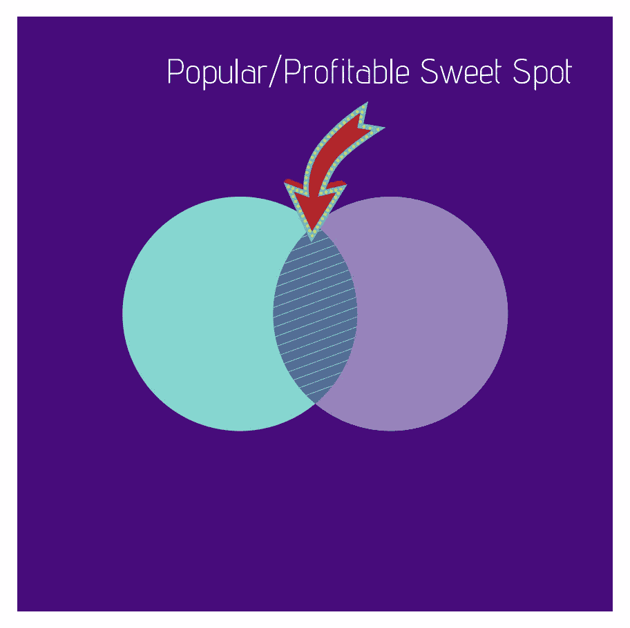
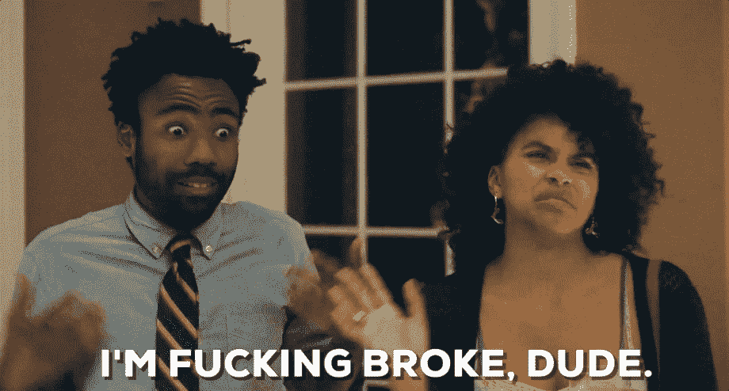

# 为什么你不应该在 2018 年开始写博客

> 原文：<https://medium.com/swlh/why-you-shouldnt-start-a-blog-in-2018-or-ever-ab23c7e9da8d>

## 这篇文章会触怒一些人…

Photo by [Courtney Clayton](https://unsplash.com/photos/8DaY274XqhQ?utm_source=unsplash&utm_medium=referral&utm_content=creditCopyText)

这篇文章会惹怒一些人…

但我觉得必须写下来。

我经常看到互联网上的作家和像 Medium 和 Quora 这样的网站出现在每个人屏幕的最前面。他们来了，枪炮齐鸣，点燃了电波。他们都热衷于宣扬他们对某一特定主题的专业知识。

*   他们提供研究。
*   他们讲述个人经历。
*   他们宣称自己是所有信息的仲裁者。

然后它们消失在网络寂静角落的黑暗深坑里。

> 再也找不到或听不到了。

我对自己说，“为什么这么多有天赋的作家都这么做？为什么我看到有人在博客世界提供了巨大的价值，却在几个月后消失得无影无踪？”

答案是…

**他们一开始就不应该开博客——他们不具备在这个行业取得成功的条件。**

理应如此。**这个行业真他妈的艰难。**无论是一个人经历的精神和智力紧张，与欺诈情结的斗争，还是缺乏创造的优先权，这个游戏都可以很容易地让你筋疲力尽，把你踢到路边。

以下是为什么你不应该在 2018 年开博客的主要理由…

# 你没有耐力跑完前面的马拉松

Photo by [Christopher Burns](https://unsplash.com/photos/T_on7kjpVss?utm_source=unsplash&utm_medium=referral&utm_content=creditCopyText)

写博客不是一个短期游戏。

我知道，我知道…

即使没有成千上万的人，也有成百上千的人提供有前途的课程、技巧、诀窍和秘密策略，帮助你一夜之间成为成功的病毒。

我真的认为博客是一个社区，它希望为相关的人培养一些积极的东西。这些课程/产品的大部分都将沿着这个波长。

然而，我也相信，如果你认为你会开一个博客，写几篇文章，然后在几个月内用它来赚钱，那你是在欺骗自己。

我花了大量的时间才取得现在的成就:

*   我的内容有[百万的浏览量](https://www.quora.com/profile/Jon-Brosio)
*   我卖我的产品已经赚了几千美元。
*   我和其他博客作者建立了很多有价值的联系(仅举几个例子，比如马丁·范多恩、T2、乔伦·范沙克、T4、玛利亚·米洛科维奇、安东尼·摩尔等等)
*   我写了不到 150 篇文章

我提出这些并不是为了炫耀…

事实上，上面列出的所有东西都是我花了两年多时间积累的(在我看来，这还真不算什么)。

写博客是一场马拉松。至少需要一年的时间来提高你的写作水平，这样你才能真正写出好的内容。最重要的是，一开始没有人知道你或者信任你。为什么他们会关心一个随机的人“有很棒的事情要说”？

他们不会…直到你建立信任。

建立这种信任需要时间，有时甚至需要数年。

# 你不会写市场想要什么

Photo by [Grace Madeline](https://unsplash.com/photos/-xQoTg250qk?utm_source=unsplash&utm_medium=referral&utm_content=creditCopyText)

如果你正在考虑写博客或者已经开始写博客，很有可能你已经写下了你的兴趣。

也许你已经写了一两篇文章，讲述了一些在你脑海中出现的令人振奋的想法。

也许你已经写了一个关于世界应该是什么样子的理想观点。

我走上了那条路…

我的第一个博客——始于两年前(我讨厌有时谈论它……太尴尬了:[Wheresthefidelity.com](https://www.wheresthefidelity.com/))到处都是。写的东西没有韵律或理由。

我有困扰许多失败博客作者的哲学:

> 如果我建造它，他们会来…

我讨厌这么说，仅仅因为你相信你的想法和想法是伟大的，并不意味着它就是伟大的。

当我这么说的时候，我总会得到一点回扣——作家和博客作者肯定也是伟大的营销者。

出于某种原因，对于作家来说，将艺术与商业相结合的想法会产生一种酸楚、不舒服的感觉。

如果你开始或想开始你的博客的唯一目的是让它像一个在线日志，你不在乎观点或最终把它变成一个赚钱的机器，那么无视我说的一切。

Find the meeting point of your interests as well as the market's

另一方面，如果你想加入这个游戏，因为你已经完成了朝九晚五的繁琐工作，想写一些你感兴趣的东西，同时教育大众并获得利润，你必须写一些市场想要的东西。

我不打算深入列举市场上哪些利基既受欢迎又有利可图，但有这么多的资源可以求助。比如这个:

 [## 7 个博客利基获得良好的流量和赚钱

### 以下是你通常从博客利基中得到的一般建议:追随你的激情。或者...找到一个你真正…

obstacle.co](https://obstacle.co/blog-niches/) 

你必须写一些足够有趣的东西，让你可以写很长时间，也是人们为了解决他们正在处理的问题而寻找的东西。

# 你不会进行必要的投资

Photo by [Christine Roy](https://unsplash.com/photos/ir5MHI6rPg0?utm_source=unsplash&utm_medium=referral&utm_content=creditCopyText)

似乎所有的*新手*作家和博客作者都有一个共同的误称。

每一个成功的博客作者从一开始就是一个优秀的作家。

伟大的作家和博主不仅仅是在他们所做的事情上有天赋(尽管有些人比其他人更有天赋)——伟大的作家和博主明白，为了变得更好，他们需要投资自己。

*   伟大的博主投资于他们的文案技巧。
*   伟大的博客投资于他们的在线营销策略。
*   伟大的博客投资于他们的行业教育。

大多数人看到了这些投资的价格标签。有些投资从几美元的[到几百美元的](https://www.tribeloyal.com/take-whats-yours-store/)，有些甚至几千美元。传说中的 Seth Godin 为他的 altMBA 开价高达 3000 美元。

但是很多教育课程充满了丰富的，改变生活的材料。

我知道我已经花了 1000 多美元参加了从博客到文案的多门课程，结果我不仅成为了一个更好的博客写手，也成为了一个更好的人。

It's about [priority](https://media.giphy.com/media/3o7TKRQMCYMqROPtpm/source.gif) of investment…

当然，我知道有很多人在阅读这一部分时会翻白眼。

他们的愤世嫉俗占了上风——他们要么认为自己不需要教育，他们自己就能骗过这座山，要么认为任何教育都没有价值。

同样地，如果你属于这一类，还有另一个你不应该开博客的原因。

# 你不愿意做出必要的牺牲

Photo by [Ian Espinosa](https://unsplash.com/photos/oXo6IvDnkqc?utm_source=unsplash&utm_medium=referral&utm_content=creditCopyText) on [Unsplash](https://unsplash.com/search/photos/sacrifice?utm_source=unsplash&utm_medium=referral&utm_content=creditCopyText)

我知道你一直在描绘你成功的博客生涯的未来:

> 想做什么就做什么的自由。对旅行的无拘无束的追求。一个美丽的浪漫伴侣在你身边，在你新冒险的所有社交照片中总是很好看。即使在睡觉的时候也能赚大钱的想法。

我也有过这样的幻觉。

妈的…我已经过了一点点了。

然而，没有人告诉你为了得到这一切你必须放弃什么。

当然，我已经概述了一些需要做出的必要牺牲——财务上的和战略上的。

**个人和精神上的牺牲肯定会超过所有其他可能坚持到现在的博客战士。**

当你独自创业时，舒适的薪水日子一去不复返了。

> 你掌握自己的命运。

和你的朋友一起出去悠闲地畅饮的日子已经一去不复返了。你有工作要做。

睡懒觉的日子一去不复返了。你需要早起，这样你就可以在一天的其他责任出现之前进行必要的写作仪式。

> 以写作和博客为职业会很孤独。

仅此一点就足以让人望而却步。

我数不清有多少次不得不对身边的即时满足说“不”。见鬼，即使说了“不”，我也常常不能马上从这种忙碌中得到有意义的回报。

根据上述马拉松式的演出，有时你会做出所有这些牺牲，为了什么？你会连续几个月看起来毫无进展。

你真的准备好过那样的生活了吗？

你知道了…

你不应该开博客的最大理由。

总而言之——你不应该开博客，因为大多数读到这篇文章的人肯定会失败，而且会失败得很惨。

虽然我没有为大多数人写这篇文章。

我为*你*写了这篇博客。

我写这篇博客是为了那些读到这篇文章的人，他们在脑海中一遍又一遍地说

> “去你的，乔恩。我确实有这个能力，我会让你知道的。”

如果那个想法，或者类似的东西，一直在你脑子里盘旋，我为你鼓掌。

If [you know](https://media.giphy.com/media/wrBURfbZmqqXu/giphy.gif) — you know…

如果你是一个准备好长期坚持的人，你准备好检查你的自我并写下市场想要什么，你准备好为了达到别人达不到的高度而牺牲你所需要的，太棒了——这篇文章是给你的。

理应如此。

因为现在世界比以往任何时候都更需要这个声音。随着经济的变化，在这样一个动荡不安的状态下，人们比以往任何时候都更需要你。

如果你是那种*会*向前推进的人，那就继续前进。世界会以你无法想象的方式感谢你。

# 👋🏻你好，我是乔恩

我是一个思考者，自由撰稿人和葡萄酒爱好者，写关于个人成长和心理优化的文章。我也鼓吹将你的作品货币化。**加入 1200 多名读者的行列**获得我的免费个人 6 天**“创业博客”**课程和我正在进行的时事通讯(你还将获得一份免费的 ***“如何撰写终极博文”*** ):

**🚨** [**> >世卫组织还想当自己的老板吗？< <**](https://mailchi.mp/4b982beed325/free-6-step-course) **🚨**

## 这篇文章发表在 [The Startup](https://medium.com/swlh) 上，这是 Medium 最大的创业刊物，拥有+366，567 名读者。

## 在这里订阅接收[我们的头条新闻](http://growthsupply.com/the-startup-newsletter/)。

