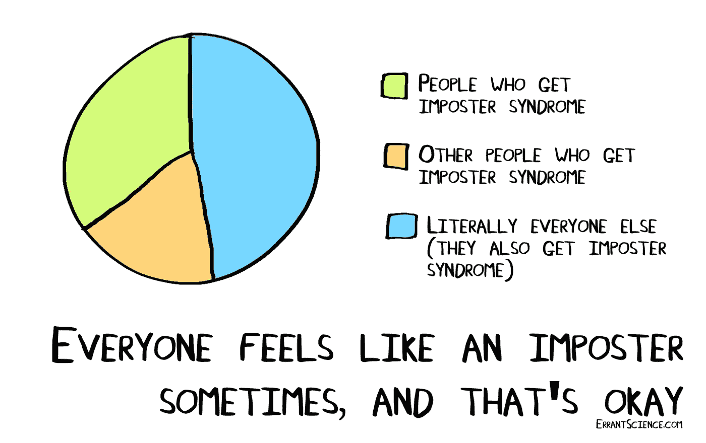
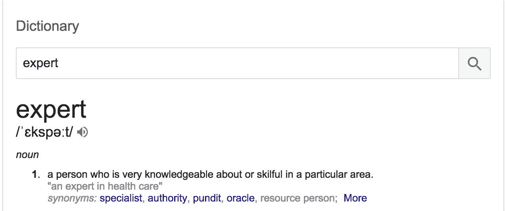

# 为什么你永远不会成为专家…

> 原文：<https://medium.com/swlh/why-you-will-never-become-an-expert-d3346fe7f2c8>

这篇文章是我的“每天写 31 天系列”的一部分，也是第四篇文章。点击这里阅读昨天的文章 [*。*](/swlh/my-relationship-or-lack-of-with-exercise-3ca8e98426ea)

我从小就开始给自己打工。事实上，我还在上学。

但现在回想起来，我肯定觉得自己患上了冒名顶替综合征。

冒名顶替综合症是指:

> **冒名顶替综合征**(也称为**冒名顶替现象**、**欺诈综合征**或**冒名顶替经历**)是一个概念，描述的是那些无法[将自己的成就内化](https://en.wikipedia.org/wiki/Internalisation_(sociology))并持续害怕被揭露为“欺诈”的人来源:[https://en.wikipedia.org/wiki/Impostor_syndrome](https://en.wikipedia.org/wiki/Impostor_syndrome)

Source: [https://errantscience.com/blog/2016/10/26/imposter-syndrome/](https://errantscience.com/blog/2016/10/26/imposter-syndrome/)

这绝对是我不得不面对的事情，因为我才 17 岁，和比我年龄大一倍的人一起工作，我必须表现得好像我知道自己在说什么。

然后，当你和 7 位高管坐在一起开董事会，有人在做笔记时，尽管你认为:“我真的不应该在这里”，尤其是当你在同一天早上上课的时候。

但是有人祝贺我，说他们为我所取得的成就感到骄傲。但是，出于某种原因，我就是没有那种感觉，我觉得自己像个骗子。

我认为我极端冒名顶替综合症的原因是因为我知道一个完美的作家是什么样的，但我肯定不适合它。我犯了错别字，我犯了错误，但在我看来，一个好作家不会这样做。

然而，我现在意识到，我不是一个冒名顶替者，我质疑自己的能力是正确的， ***因为为了成为一名专家，你必须首先接受自己是一名业余爱好者。***

## 什么是专家？

专家的定义是:

Source: [https://www.google.co.uk/search?q=what+is+an+expert&oq=what+is+an+expert&aqs=chrome..69i57j0l5.4450j1j9&sourceid=chrome&ie=UTF-8](https://www.google.co.uk/search?q=what+is+an+expert&oq=what+is+an+expert&aqs=chrome..69i57j0l5.4450j1j9&sourceid=chrome&ie=UTF-8)

在某一特定领域非常博学和熟练的人。

当你年轻的时候，或者刚进入一个行业的时候，你要和成百上千的人竞争。所以为什么要承认自己懂得不多呢？

因为当你承认你不知道某事时，你:

1.  看起来你没有你想象的那么有经验
2.  表现出你是最不适合做他们雇你做的工作的人

只是，在开始的时候，问问题正是你需要做的。如果你不问，你真的不会得到。

如果你不准备接受你是一个业余爱好者，甚至对你自己来说，那么你永远不会成为一个专家。

这意味着，你不必到处告诉每个人你不知道如何做这个和那个，但你需要接受自己，首先，你不知道，然后采取必要的步骤，以便能够胜任地完成任务。

写这些条目，日复一日(哈哈，才第 4 天)让我看到了对自己诚实的力量。当你一天中只有几分钟的时间来写作，并且手头只有你的想法时，你会对你想到的东西感到惊讶。

如果这篇文章引起了你的共鸣，或者你曾经有过冒名顶替综合症，请在下面的评论中告诉我！:)

明天见，伙计们！