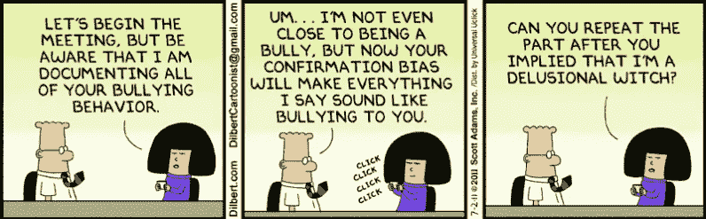
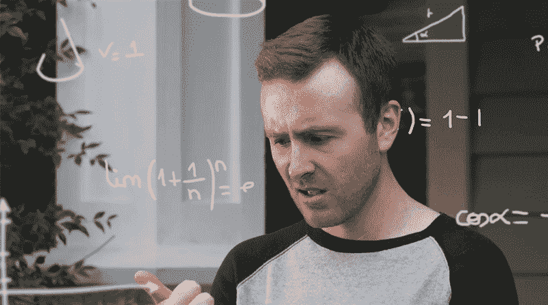

# 为什么你的应用想法只是“哼”而不会成功

> 原文：<https://medium.com/swlh/why-your-app-idea-is-just-meh-and-won-t-succeed-e3745c6fea3f>

*本文原载于* [*下期网*](https://thenextweb.com/contributors/2018/11/10/why-your-app-idea-is-just-meh-and-wont-succeed/) *。*

你没听错，我说的是“咩”

我说的不是用来讽刺描述美好/令人敬畏的事物的“meh”；就像你的朋友把美丽的日落上传到他们的 Instagram 故事上，并给它加了标题“meh”(是啊，是啊，我们知道你是这样一个喷气式飞机乘客)。

我说的是没有灵感、无聊、冷漠的“咩”当你看到一件事被重复做了一遍又一遍，只是用了不同的配色方案和品牌。当你看到有人发布了一个“创新”产品，却没有考虑他们的用户群真正关心的是什么。

从这篇文章的标题可以看出，在这种情况下，我说的是你的应用程序。

很有可能，你的应用想法只是 *meh* ，你不应该开发它。我相信明明白白的事实比拐弯抹角要好。但我是谁，一个来自营销界的随机女孩，来告诉你这些？

我来自移动应用分析行业，我见过许多创始人将大量时间和数千美元投入到无法运行或提供良好体验的应用中。这些创始人带着这样的问题来到我们的应用分析平台:“为什么我的用户不注册我的应用？”或者“为什么用户不利用这个特性？”通常我们( [Appsee](https://www.appsee.com?cpnid=701b0000000Wd7c&utm_source=medium&utm_medium=link&utm_campaign=why_your_app_idea_is_just_meh&utm_content=appsee_homepage) )已经有了答案，但有时现实就是这个应用程序完全是 *meh* 。

然而，我不想粉碎你所有的希望和梦想，因为你的移动应用程序想法有可能(很小)实现。不仅仅是工作，而是真正的成功。

为了让你抓住这个机会，我列出了五个你应该避免的错误。

警告:如果你更喜欢阅读一篇关于如何让你的创业公司成为独角兽的松散的、充满幻想的文章，下面的内容不适合你。

# 我需要它，我的朋友也需要它——所以这一定意味着很多人需要它！

大多数应用失败是因为应用创建者没有花时间与实际用户一起彻底验证他们的产品。大多数应用程序所有者开始开发一个带有特性和功能的应用程序，是基于他们的用户想要的感觉。通常这种感觉来自他们自己的亲身经历。

听起来熟悉吗？好吧，这让你的应用产品的背景故事更加“鼓舞人心”，但最终*鼓舞人心*并不自动等同于*活跃用户*。此外，当这个想法来自你自己的经历时，让你脱离这个概念，从一个客观的角度来看待这个应用，会变得更加具有挑战性。

大多数应用失败是因为企业家没有用足够多的实际用户来验证他们的产品。如果你有一个想法，走出去验证它，但要用正确的方法来验证。

为了做到这一点，你必须摆脱你的自我问题。不要再假设有这个需要。当你假设的时候，你就成了一个傻瓜…你知道我要说什么！自我的问题经常导致所谓的[确认偏差](https://taplytics.com/blog/confirmation-bias-is-killing-your-app/)。

确认偏见是有选择地搜索和考虑确认个人信念的信息的倾向。即使你认为你对数据和结果是客观的，你的人脑也在试图寻找证据来证明你已经认为是正确的。

简单来说，就是当一个应用程序的创始人认为他或她的解决方案是优秀的，并搜索信息来证明他们的观点。同时，他们拒绝任何不支持他们信仰的信息。这可能会完全扭曲你对产品市场适合度的评估。

一个很好的例子就是当你有目的地寻找你认为会成为你理想用户的朋友或潜在用户。你采访了 10 到 15 个人，得到了你想要的答案，然后决定就这样吧！产品已验证。不对。这种“验证”的方法也将导致主要的用户研究问题，我稍后会谈到这一点。

以下是我的两点意见:即使来自测试和采访的真实数据揭示了一些负面的东西，一些你可能不想听到的关于你的应用程序想法的东西，难道你不想尽早知道吗？如果你知道，你可以做点什么。正如美国大兵乔常说的，“知道是成功的一半。”

# 我需要在其他人听说这个想法之前赶快推出它。

现实检查:你并不特别。应用市场已经饱和了。它充满了各种可能的应用程序。另外，[Google Play 和 App Store 中有 580 万个](https://www.statista.com/statistics/276623/number-of-apps-available-in-leading-app-stores/)应用。你有一个“完全独特”的想法的可能性微乎其微。

现实是，不是每个想法都是独特的，也不一定是独特的。例如，看看食品配送类别。仅在美国，就有 GrubHub、DoorDash、Postmates 和 UberEats(仅举几例)。他们的概念几乎是一样的，他们只是提供不同的用户体验，餐厅选择，品牌等。不同之处在于*执行*。

即使你是第一个将想法带到你所在地区的人，执行也是一切。我是说一切。学徒可能犯的最严重的错误之一就是急于进入市场，并在这个过程中牺牲性能、测试和研究。你只有一次机会给你的用户留下好的第一印象，所以要珍惜。如果应用程序存在性能问题和/或没有引起用户的共鸣，那么先发布就没有任何意义。

我见过相当多的新应用程序发布第一个版本，当看到应用程序崩溃或以他们在发布前从未预料到的方式运行时，我感到震惊。友情提示:不要吝啬为你的新应用提供高质量的[崩溃监控工具](/@Appseecom/five-things-to-look-for-when-choosing-a-crash-analytics-tool-3f3fe8d0a83d)。以后你会为这个错误付出更低的保留率和转换率。

除了执行，如果有竞争呢？有可能，但这并不意味着你应该放弃你的想法。下载应用程序，研究它们的来龙去脉，然后*做得更好。确保你的构建质量不仅与现有的应用程序相匹配，而且比它们都高一个档次。明白吗？*

# 分析不是我的专长，也永远不会是。

我要打电话给 b.s .要求赔偿。是的，过去只有数据科学家、分析师和“对数字感兴趣”的人使用分析，但时代已经改变了。

随着用户标准的多样化和移动应用软件的增强，许多应用分析公司已经调整了他们的平台，以使他们的技术更加用户友好和开箱即用。我说的是预测未来趋势、提供自动洞察、事件跟踪和屏幕标记，甚至提供很酷的“新”功能，如[会话记录](https://blog.appsee.com/5-user-session-recordings-you-must-watch/?cpnid=701b0000000Wd7c&utm_source=medium&utm_medium=link&utm_campaign=why_your_app_idea_is_just_meh&utm_content=5_user_session_recordings_you_must_watch)和[热图](https://www.appsee.com/features/touch-heatmaps?cpnid=701b0000000Wd7c&utm_source=medium&utm_medium=link&utm_campaign=why_your_app_idea_is_just_meh&utm_content=touch_heatmaps_feature)。

这可能仍然需要一点学习曲线，但正如彼得·德鲁克完美地指出的那样，“可以衡量的，就可以管理。”你需要知道用户实际上是如何使用你的应用的，并且能够根据这些数据自信地做出决定。如果没有关于你的应用用户的可靠数据，当你评估你的应用在现实世界中的吸引力时，你将会进行完全的猜测。通过亲自跟踪您的应用程序的性能和用户行为，您可以更有信心和理解地确定产品的下一步行动。

我的小费？货比三家，有很多好的工具可以满足不同的应用需求。但是，不要只是跟踪来跟踪去。构建流程，为自己设定 KPI。

要获得更多建议，请查看我最喜欢的关于如何将[精益方法应用于您的分析](https://mobilegrowthstack.com/mobile-app-analytics-519f5719e283)的读物。

# 哦，是的，我们将迅速走向全球，这就是我们的计划

有一个扩展到其他市场的长期目标是很棒的。但这只是它，它应该是*的长期目标*。谈到用户获取和增长，你必须从小处着手。关注奖品，这首先是你当地的地理位置。如果你把重点放在未来市场，你可能会忽略当前市场的重要细微差别。

利用你当地的市场来完善你的产品，并在那里犯错。从这些错误中吸取教训，不断重复，然后为其他城市和国家制定一个更加明智、经过深思熟虑的游戏计划。然而，请记住，在你占领了当地市场之后，“走向全球”并不是下一个自动的步骤。

为什么？这里的关键问题是:你如何吃掉一头大象？(对不起所有素食者)

回答:一次一口。

这同样适用于你的移动应用“扩展”计划。你必须调整心态，从*全球化*到*本地化*。

[本地化](https://dzone.com/articles/the-only-app-localization-tutorial-you-will-ever-n)不仅仅是关于语言，它包括对图标、功能布局、用户偏好、视觉内容等等的全面反思。

请记住，你不会坐在办公室里就能获得你的应用程序的国际用户。把你的屁股从你的[尖尖的平衡球椅](https://www.bustle.com/p/the-5-best-balance-ball-chairs-for-the-office-8072611)上拿开，出去见见你的用户。你的 app 创意在其他市场“meh”吗？你能自信地回答这个问题吗？没有什么比直接了解他们的需求以及他们如何体验你的移动应用更好的了(你最好已经在你的当地市场这么做了)。

# 是的，这就是我的“最终产品”

没有所谓的“最终产品”发布一款手机 app 产品，只是持续改进的开始。你总是有进步的空间，总是。

如果你认为你的产品已经“完成”了，你可以洗手不干优化的事了，那么你的产品就真的完成了——为而*完成了。*

我的最终建议是，在这个词的每一个意义上都要积极主动。不要等到你的崩溃率攀升，或者有几个用户写了差评，你才能调整你的应用。

用最好的工具装备自己，收集定性数据，跟踪重要的指标，运行测试，并与您的用户交谈！

# TLDR

看，在一天结束的时候，你的应用程序想法可能只是*嗯*并且不会在移动应用程序世界中持续很久。然而，有一丝希望，一些应用程序可以获得成功。只有首先避免这些重大错误，才能实现这一希望。

也许你的应用会成功。证明我是错的，那会让我很开心。在与应用程序初创公司打交道多年后，我认为是时候说出我的个人观点了。要么接受要么把我放在你的黑名单上。

## 关于作者

汉娜·李文森是 [Appsee](https://www.appsee.com?cpnid=701b0000000Wd7c&utm_source=medium&utm_medium=link&utm_campaign=why_your_app_idea_is_just_meh&utm_content=appsee_homepage) mobile analytics 的负责人。作为一名 UX 和移动应用程序爱好者，她非常喜欢发现并与移动技术社区分享独特的见解和资源。汉娜还喜欢新闻摄影、经典摇滚，并假装自己是唯一一个拥有“美食家”Instagram 账户的人。你可以在推特上关注汉娜 [@HannahLevenson](https://twitter.com/hannahlevenson) 。

## 这篇文章发表在 [The Startup](https://medium.com/swlh) 上，这是 Medium 最大的创业刊物，拥有+396，714 名读者。

## 在这里订阅接收[我们的头条新闻](http://growthsupply.com/the-startup-newsletter/)。

