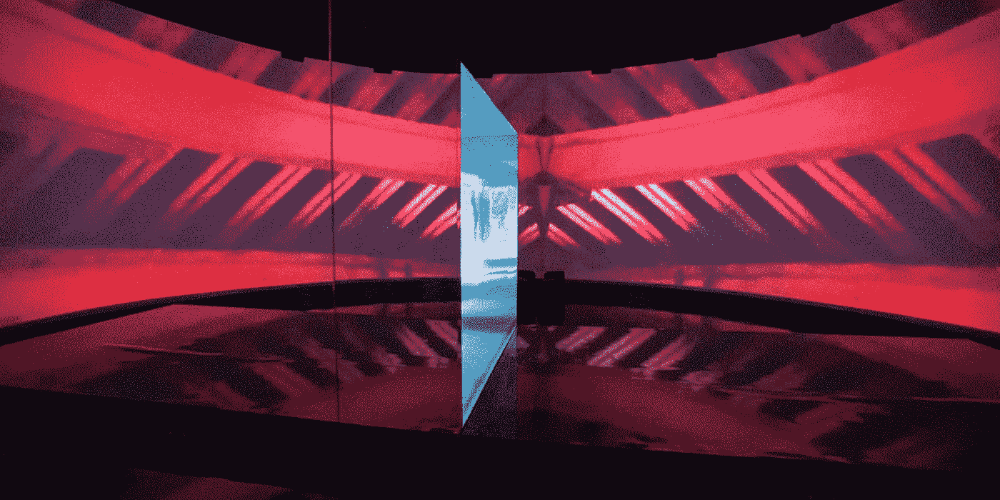
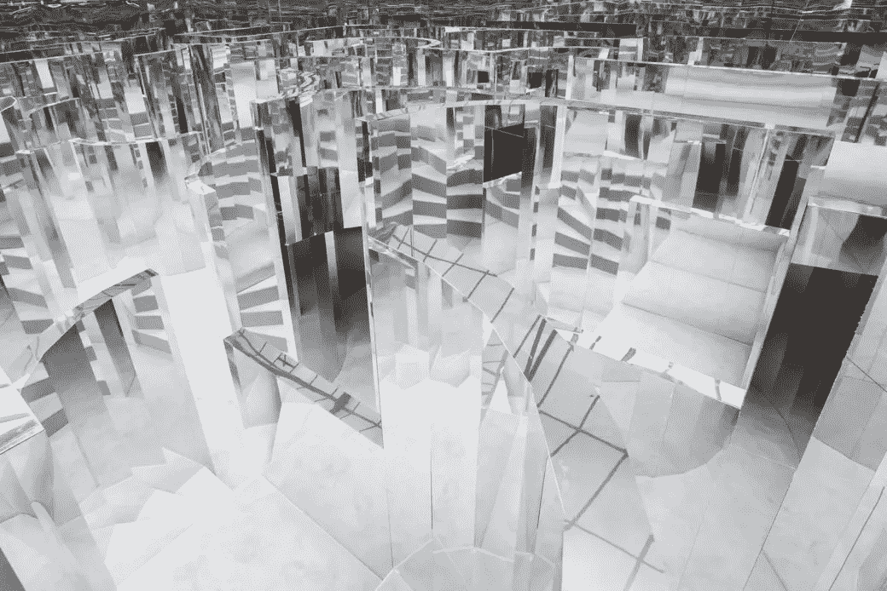
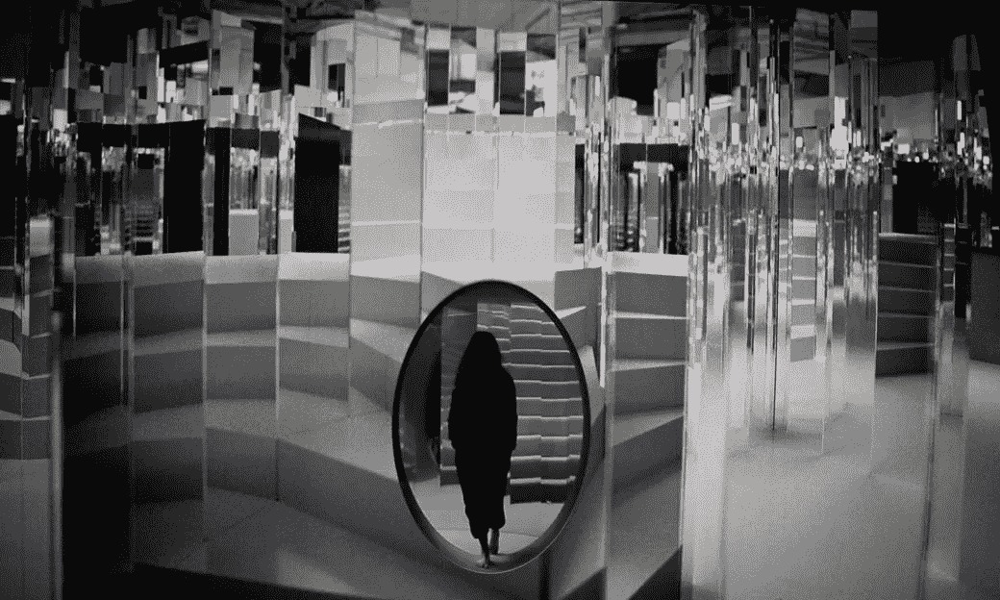
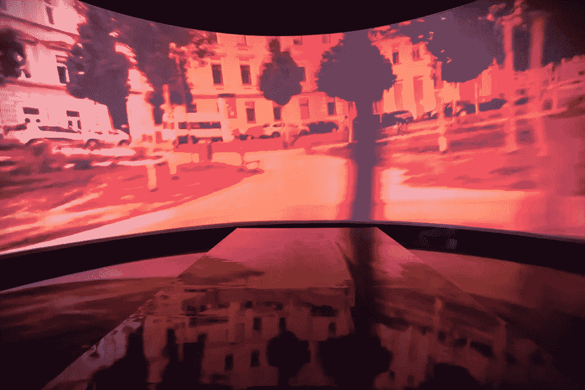
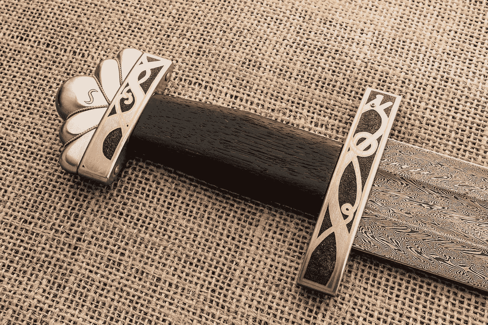
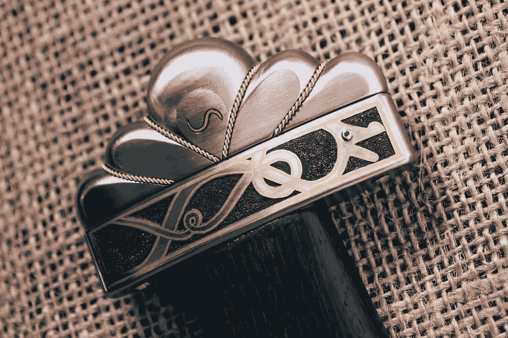
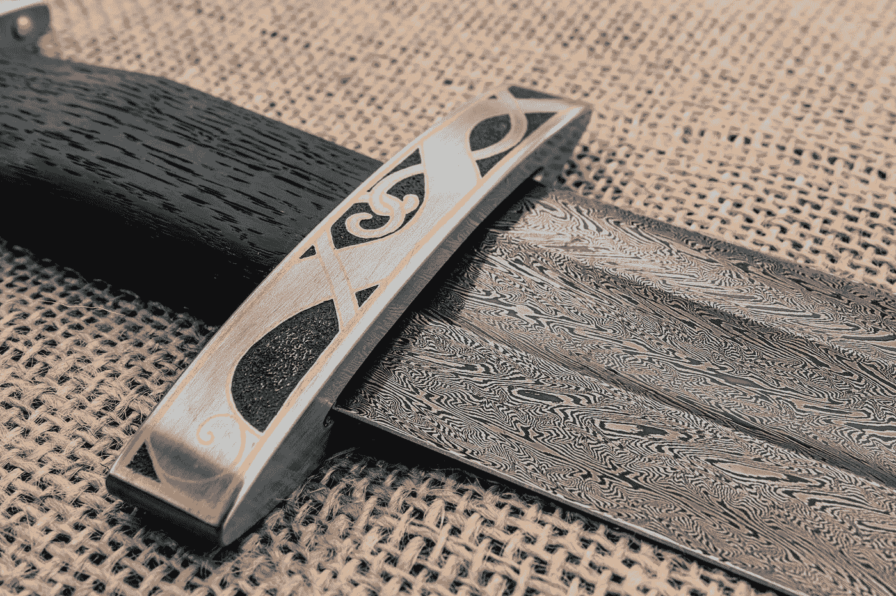
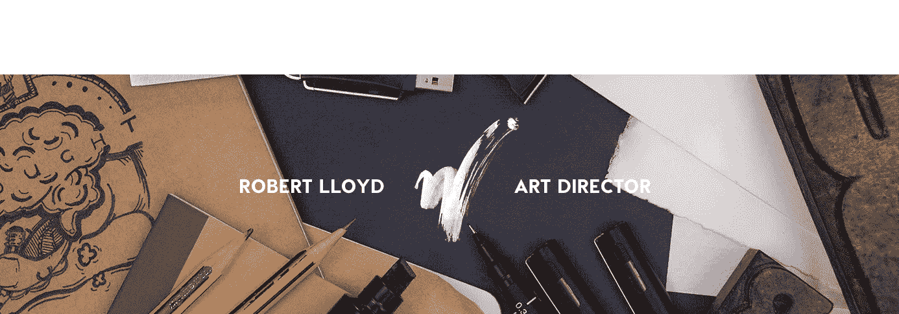

# 为什么你的背景故事如此重要

> 原文：<https://medium.com/swlh/why-your-backstory-makes-a-difference-b50a942eadc>

> 你可能不知道她的名字，但你见过她的作品。麦莉顺着自己的舌头滑上台？那是艾德弗林。阿黛尔在全英音乐奖颁奖典礼上，在闪烁的灯光下，她在一个飘渺的、闪闪发光的星空前大声唱着《当我们年轻的时候》？又是 Es。或者你可能看到碧昂斯在舞台上踢水，因为她在最后一次 BET 颁奖典礼上表演了“编队”*，或者里约奥运会的开幕式，或者本尼迪克特·康伯巴奇在巴比肯的*哈姆雷特*，或者基本上在过去八年里的每一次坎耶表演？是 Es 召唤出这些神奇的世界，让你最喜欢的超级巨星在其中玩耍。*
> 
> *~iD 杂志*

*正如你可能已经猜到的那样，Es Devlin 是一名布景设计师——而且是一名非常出色的设计师——他的经验丰富多样，有自己的星座(包括碧昂斯和本尼迪克特·康伯巴奇)。但早在 2016 年，她就获得了由《第五感》委托、香奈儿和《iD》杂志合作的公开简报，在那里，她终于有了自己承认的自由，不受其他艺术家的诠释和愿景的限制。这是为了什么？香奈儿创造了一种独特的气味，只是在展览进行的几天里才被公开。一旦它结束了，香味就会消散，永远消失，就像 Es 创造的装置一样。*

**

*(all installation images taken from [iD magazine](https://thefifthsense.i-d.co/en_gb/hero/es-devlin/))*

*她试图探索记忆的主题，一种穿越时间隧道或梦境的感觉，以及我们作为人，最终在一个镜像迷宫中迷失。迎接你的是一个舒缓迷人的转变，进入恍惚状态，然后是不祥的视频，你带着复杂的情绪进入装置，无法停止寻找新的角度和视角，不仅审视自己，也审视彼此。在这个空间里，你留下了一种视角感和身份感，但随后又发现自己被眼角的余光反射和瞥见。*

**

> *重力是所有人类经历中常见的一件事…我们睡着了，我们陷入了梦境。*

**

*现在，我为什么要写这个？好问题。简单地解释这个装置，是的，粉丝们把 es 当成一个创意，我能得到什么呢？嗯，虽然装置本身在真正意义上给人留下了非常深刻的印象，更不用说丰富了我的思考和感受，但幕后的内容更加鼓舞人心。es 及其团队投入其中的考虑因素、精神特质和方法给其他实践和行业带来了令人耳目一新的相似之处，而这些是无法通过安装本身来讲述的。从那以后，我在[网飞系列摘要](https://www.netflix.com/gb/title/80057883)中看到了她(并不意外地受到了她的启发)；收集了对不同职业的关键成员的深刻见解，提供了许多令人兴奋的观点，就像 Es' maze - aka 我推荐观看一样。然而，除了知名品牌和大预算纪录片赞助的装置，还有很多其他人。*

*以亚历克·斯蒂尔为例；这位 20 岁的英国铁匠是 YouTube 上一颗冉冉升起的明星，大约 7 年前他创办了自己的频道。在那段时间里，他的锻造技术自然有所提高，他的视频制作质量也是如此。最近，这两种技能再次达到顶峰，他完成了一个 28 集的日常电影系列，展示了一个巨大的自我挑战，即创造一把复杂的维京剑。最后一件作品用一句话来说是惊人的，以至于脱离了上下文，它看起来毫不费力地专业——几乎就像一件来自经验丰富的老手的不足为奇的作品。*

**

*(all sword images taken from [Alec’s website](http://alecsteeleblacksmith.com/))*

****

*事实上，在他完全没有经验的领域，有无数的重试、频繁的错误和陡峭的学习曲线——而这只是来自亚历克。还有来自其他铁匠的额外支持，通过各种媒体上的日常评论提出建议，更不用说他的摄影师和最终视觉效果本身的编辑了。*

*他创造的剑是独一无二的，但是看到它经历的过程，真正的灵感是亚历克真正的热情，对工艺的不妥协的尊重，以及他经常谦卑地感谢的协作社区的帮助。虽然他创作的作品往往令人望而生畏——希望你有一天能够接近这一水平——但他的态度是一种重新激发你自己的能量，让你充满乐观，庆祝每一项成就，同时保持谦虚的愿望，推动自己超越预期。这种精神状态赋予了他的成就以珍贵的背景，让人觉得可以立即达到，更不用说一些讽刺的是结尾部分根本无法传达的东西。*

> *他的态度是一种重新激发你自己的能量，让你充满乐观，庆祝每一个成就，同时保持一种谦逊的愿望，推动自己超越期望。*

*观看亚历克的视频制作，Es 的幕后和网飞的抽象系列(加上一系列其他纪录片)很可能比他们创造的最终作品更鼓舞人心和更重要，无论多么令人印象深刻，因为所有这一切都是一个坚实的提醒，在伟大的工作背后，你看到的物体或经历不仅仅是一个熟练的创造性的幻想，而是一个共同目标下的整个集体。人们很容易忘记，这些事情不是简单地“出现”的，它们背后有一个完整的思想和努力之旅——也不总是没有障碍。它们提醒我们，我们每个人每天的态度可以真正塑造我们自己的行为，也可以鼓励我们周围的人。*

**

*我是罗伯特·劳埃德，但你可以叫我鲍勃，我相信好的设计有能力改变世界。它可以改变人们的态度、环境和生活，所以我对创造力的态度就是 ***为伟大的人做伟大的工作*** *。哦，是的，我是一个获奖的艺术总监。**

*感谢您的阅读，如果您想了解更多或接触更多，请加入我的行列:
[www . Robert Lloyd . design](http://www.robertlloyd.design)
[insta/@ yes . Robert Lloyd](https://www.instagram.com/yes.robertlloyd/)
[LinkedIn/@ Robert Lloyd](https://www.linkedin.com/in/robert-lloyd-2809684a/)
yes.robertlloyd@gmail.com*

**

## *这篇文章发表在 [The Startup](https://medium.com/swlh) 上，这是 Medium 最大的创业刊物，拥有+398，714 名读者。*

## *在这里订阅接收[我们的头条新闻](http://growthsupply.com/the-startup-newsletter/)。*

**