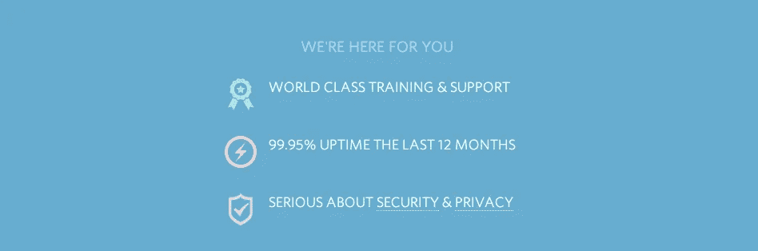
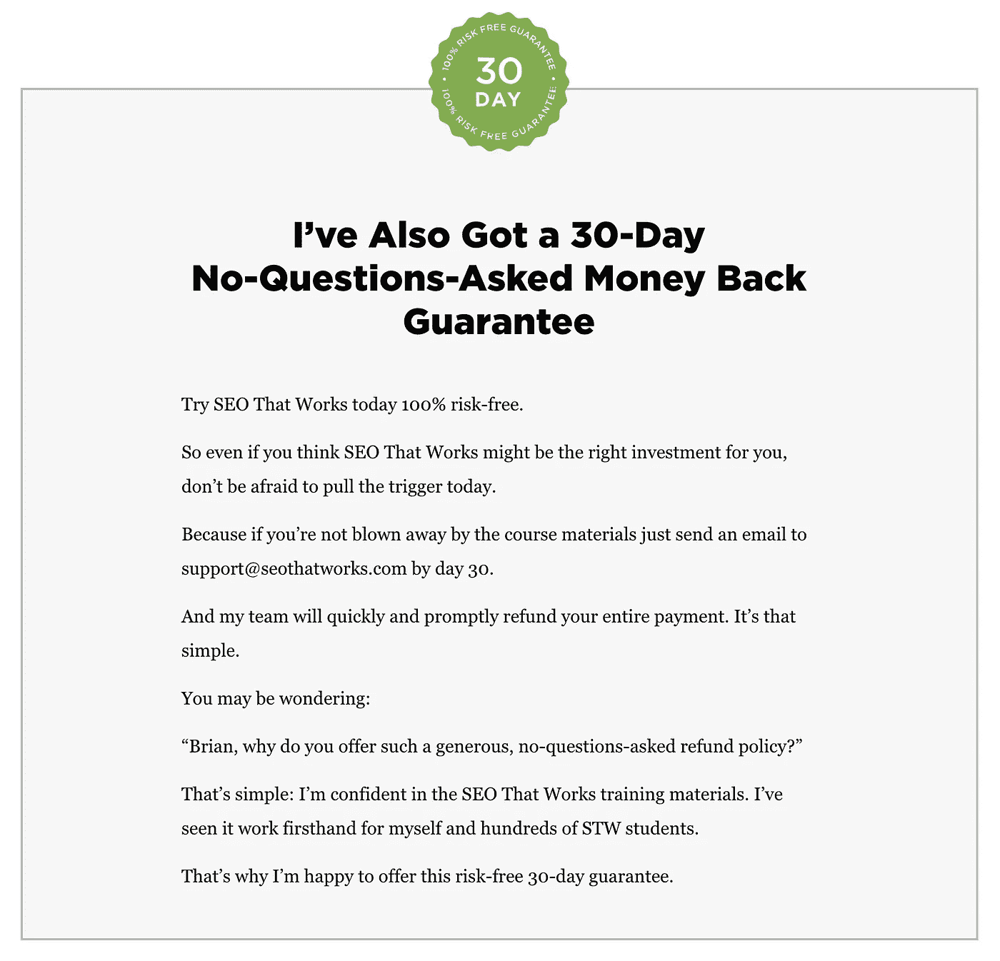

# 为什么你的教练网站没有产生新客户，该怎么办？

> 原文：<https://medium.com/swlh/why-your-coaching-website-is-not-generating-new-clients-and-what-to-do-5bcf24e38872>

你为你的教练业务创建自己的网站&展示你想提供给你的教练客户的课程、特定产品或服务。

但是网站好像不行。

网站上没有流量。

您没有任何电子邮件订户。

你似乎无法接触到需要你服务的人。

你开始担心，怀疑自己，认为自己陷入了无尽的失败深渊。

站住别动。担心是浪费时间。

今天，我将向您展示为您的教练业务创建转化优化登录页面所需的基本要素。

**下面是你将从这篇文章中学到的东西—**

1.  决定任何登录页面成败的基本要素
2.  适用于 2018 年登陆页面的技术
3.  影响网站访问者转化为教练客户的因素
4.  为您设计和开发自己的教练业务登录页面的工具和模板

# [什么是登陆页面？](https://sumo.com/stories/landing-page)

[Slack’s Landing Page](https://slack.com/)

[Sarah Peterson](https://sumo.com/stories/landing-page) 简单地将其描述为

*“用户第一次登陆的页面，上面有行动号召。*

通常，它会让访问者点击一个按钮，转到你网站的另一个页面，或者订阅邮件列表，或者获得折扣或免费赠品。

典型地，在一个登陆页面上，神奇的事情都发生在页面上方。就像一份折叠的报纸一样，报纸的顶部应该告诉你报纸的确切内容。

*这同样适用于登录页面，你不必向下滚动来获得更多信息。”*

# [您为什么会使用登录页面？](https://www.impactbnd.com/blog/landing-page-examples)

你可以使用一个登陆页面来做任何你想让你的用户做的事情。举个例子，

*   你正在送出一份赠品来吸引人们注册你的电子邮件列表。
*   你用它来收集电子邮件，然后再[推出你的教练网站](https://gleam.io/blog/launch-page/)或博客。
*   你只是有一个具体的行动号召，希望有人采取行动——比如报名参加网上研讨会或注册在线课程。

现在让我们考虑这三种情况:

*   假设有一个登录页面向徒步旅行者和露营者销售全地形帐篷。
*   另一个登录页面邀请内部营销人员参加在格拉斯哥举行的周末会议。
*   第三个登陆页面是让狂欢情景喜剧的观众做一个在线测试。

适用于这三者中任何一个的页面都不太可能适用于另外两个。

*这是因为他们的受众、目的、意图、产品、角度、关注点、行业、利基、认知、认同、成本、信息传递、* [*价值主张*](https://conversionxl.com/blog/value-proposition-examples-how-to-create/) *和推荐方法之间存在难以置信的差异。*

尽管存在巨大的变化潜力，但有些东西确实是永恒不变的。高转化率的登录页面通常有几个共同的特点。”——[*尼尔·帕特尔*](https://www.crazyegg.com/blog/landing-page-essentials/)

[如果你的关键信息与客户的需求相呼应，它们将真正引起共鸣。](http://blog.brandollo.com/customer-pain-points-and-marketing/)

*“当他们关心的话题摆在桌面上时，客户就会‘打开’。与其把钱浪费在无关的内容和广告上，不如先花点时间定制你的关键信息，让它们与你客户的需求相呼应。通过这样做，你可以用你的客户真正感兴趣的语言和话题说话。*——[布莱恩·麦卡锡](https://www.linkedin.com/in/brian-mccarthy-9722566/)

任何顾客或客户的钱主要花在两件事上。
首先，他们乐于花钱来对抗疼痛。第二，他们花钱是为了追求快感。

FastCompany 的 Jon Burgstone 和 Bill Murphy Jr .按顺序列出痛苦和快乐是有原因的。

> 在同等条件下，痛苦或问题越严重，你就越有可能提供一个令人信服的解决方案。解决方案越有吸引力，客户支付的速度就越快。

通过提及痛苦而不是需求或偏好来强调这一点: **顾客就是人。他们通过自己的经历来欣赏这个世界。他们能感觉到什么挑战或困扰着他们——他们的痛苦——但他们常常想不出解决方案——他们的需求。**

**找到理想客户的痛点—**

你如何知道他们的需求、问题和痛点是什么？

别猜了。你要做的就是问自己这个问题:

“当我的理想客户需要帮助时，他们会怎么做？他们会去哪里，无论是线上还是线下？”

Ilise Benun 在她的博客文章《如何找到你的理想客户的痛点》中，希望教练和顾问在每次试图了解他们客户的需求和主要的痛苦来源时，都集中精力问自己这个问题。

这些线上和线下的地方是潜在教练客户的繁荣中心，他们每天都在讨论和表达他们的不满。你所要做的就是去这些地方，耐心地解决问题，并根据你在[的教练位置](https://experts.chevaun.com/blog/blog-in-your-coaching-niche/)来决定优先解决哪些问题。

**你会问，你能从哪里开始？**

查看你所在行业的流行杂志。一个推荐的策略是浏览亚马逊上与你的教练定位相关的书籍评论。它们是很好的讨论来源，你会发现人们在网上寻找的问题和解决方案。

有许多小众博客已经在迎合读者&他们的痛点——[growth hackers](https://blog.growthhackers.com/)、 [StoryBrand](http://buildingastorybrand.com/blog/) 、 [HubSpot](https://blog.hubspot.com/) 、 [Neil Patel 的博客](https://neilpatel.com/blog/)仅举几个例子。

社交媒体(Twitter，LinkedIn，Instagram)也是很好的来源，但这些小众博客是次要的讨论论坛( [Reddit](https://www.reddit.com/) 是主要的)，它们有自己的专用读者群。坚持不懈地挖掘这些资源。

脸书小组也是一个很好的地方，你可以与潜在的教练客户进行交谈，并帮助解决人们每天彻底讨论的问题。

但是毫无疑问，了解你的听众的最好方法是直接与他们互动。面对面或通过在线视频通话，无论哪种方式，你都可以了解他们的确切情绪&更好地感受他们的痛点。

文案写作的第一条规则是研究你的目标受众。通过直接的互动，你可以获得你的听众在谈论他们的痛点时所使用的准确的单词和短语。使用观众的语言，你就能为你的教练网站创作出令人惊叹的文案。

你越深入地研究和理解你的潜在客户的痛点，你的登陆页面就会吸引越多的流量，每个月都会带来成功的转化/潜在客户。

**“深入了解你的产品和服务，更深入地了解你的目标客户”**——[伊丽莎白·麦克拉维](https://elizabethmccravy.com/how-to-speak-to-your-customers-pain-points-in-your-marketing-free-guide/)

一旦你有了一个专门的痛点列表，你就必须在你的教练网站上设置消息/文案，同时发起电子邮件活动来谈论这些问题及其解决方案。

正如 Ilise Benun 所写，通过这种方式，你的理想客户会知道三件非常重要的事情

*   *你明白他们在纠结什么*
*   *你以前见过它*
*   *而且你知道怎么处理。*

*如果你以这种方式进行自我推销，会对建立信任大有帮助，尤其是在那些还不了解你和你有多棒的客户面前。如果你不首先解决他们的痛点，你可能永远没有机会告诉他们你可以如何帮助他们。他们的痛苦是对话的入口。* — [伊利瑟·贝农，你好设计](http://www.howdesign.com/author/ilise-benun/)

# [客户痛苦测试](https://www.fastcompany.com/1844165/why-customer-pain-your-most-important-resource)

Jon 和 Bill 在他们的博客文章中— [为什么客户的痛苦是你最重要的资源](https://www.fastcompany.com/1844165/why-customer-pain-your-most-important-resource),强调了教练可以使用的最简单的方法来判断一个新的创业想法是否会真正解决现实世界中的客户痛苦。

所有以前的痛点研究都归结为一点:

*“你能用几句话描述一下你的公司解决的难题——以及为什么每个人都应该关心它——吗？然后，你能用简单的解释说服潜在客户购买你的产品或服务吗？*

需要用文字来描述市场或说服潜在客户的创新者和创始人证明他们没有充分完善自己的业务

如果你不能清楚地表达一个令人信服的客户痛点，这是致命的吗？最终可能是，但这也简单地意味着你还没有完全形成你的新的创业想法。许多伟大的企业家在找到创新的最佳用途之前会经历无数次反复。找到痛处需要时间。

> “伟大的信息不是当你的理想客户理解你的时候，而是当你的理想客户感到被你理解的时候。”伊丽莎白·麦克拉维

以下是由 [Strategyzer](https://strategyzer.uservoice.com/knowledgebase/articles/1194406-how-do-i-add-customer-pains-to-my-value-propositio) 提出的一些触发性问题，可以帮助您思考不同的潜在客户难题:

*   您的客户觉得什么东西太贵了？例如，这是否花费了他们大量的时间，花费了他们太多的金钱，或者需要付出巨大的努力？
*   对于您的客户来说，当前的解决方案表现如何不佳？例如，他们缺少哪些功能，是否有让他们烦恼的性能问题，或者他们提到的故障？
*   你的辅导客户遇到的主要困难和挑战是什么？例如，他们是否了解事情是如何运作的，他们在完成某些事情时是否有困难，或者他们是否因为特定的原因而抵制某些工作？
*   是什么让您的客户夜不能寐？例如，他们最大的问题、顾虑和担忧是什么？
*   阻止你的辅导客户采用解决方案的障碍是什么？例如，是否有前期投资成本、陡峭的学习曲线，或者是否有其他阻碍采用的障碍？

# 如何让您的品牌与客户的痛点保持一致？

你已经开始了解你的目标受众，他们的需求和愿望。现在你将这种理解转化为你的教练网站设计和信息(品牌和文案)。这成为你吸引教练客户和为你的企业创造商机的完美沟通媒介。

伊丽莎白·麦克拉维(Elizabeth McCravy)在她的颇有见地的帖子——[如何在营销中应对客户的痛点](https://elizabethmccravy.com/how-to-speak-to-your-customers-pain-points-in-your-marketing-free-guide/)，希望你在做痛点研究的同时，专注于探索更多关于你的品牌的信息。

*问问你自己:你通过教练网站提供的解决方案是什么？阅读你过去的评价，寻找解决问题的模式。*

当你和潜在客户交谈时，他们会说什么？他们在找什么？

*在社交媒体或邮件列表上调查你的受众，询问他们与你的产品/服务相关的问题。*

*问问自己:你的产品/服务如何能让别人的生活变得更好？*

*你的品牌正在挫败一个更大的问题吗？*

*如果你的理想客户得不到他们想要的，他们的生活会是什么样子？如果他们从来没有发现你的产品会怎么样？*

这里有一些很棒但很简单的方法，你可以在你的教练工作中展示你的权威。

*   推荐书— *让他人为你说话，证明你可以解决潜在客户寻求帮助的问题！*

[Kissmetrics’s Testimonial Example](https://www.kissmetricshq.com/)

*   [内容创作](https://www.animalz.co/blog/the-content-growth-cycle/) —每天创作与你的领域相关的内容。展示你说到做到，说到潜在客户的问题解决方案。展示这一点的媒介有很多——博客帖子、客座博客、播客、推文、Instagram 帖子，以及在论坛上回答小众问题
*   奖项和/或认证— *你所做的工作有认证吗？你“获奖了吗？”让我们展示一下！*
*   统计数据——它经常被忽视，但却能给你的教练网站访问者留下深刻的第一印象。客户成功、商业投资回报率、多年经验、服务的客户数量等。有几个[重要统计数据](https://www.asterix.com/en/portfolio/vitalstatistix/)是你应该在登陆页面上提到的。

[**关于营销的一个注脚&销售—**](https://growthlab.com/market-analysis-template/)

*“我知道有些人(好吧，很多人)在使用营销策略来销售他们的产品/服务时，会觉得自己很低俗。我明白了。我去过那里。你要考虑的一些事情已经完全改变了我自己的观点:*

你相信你的产品真的能帮助人们吗？你相信你有解决人们问题的方法吗，只要他们能找到你？

*如果你关心用你的解决方案帮助人们解决他们的问题，那么你的工作就是自信、大胆、有策略地推销你的产品。当你真的关心你的教练客户，并相信你在做什么，销售部分就变得容易了！伊丽莎白·麦克拉维*

痛点和客户研究已经完成。现在，让我们谈谈在 2018 年创建转化优化登录页面所需的基本要素。

> “您的登录页面设计越简单，您的访问者就越容易浏览和转换。”—尼尔·帕特尔

# 要素 1:标题

[Grant Cardone’s Hero Section](https://grantcardone.com/)

**“问题是，登陆页面的标题往往是事后想起的。或者更糟的是，它是由设计师写的，所以它“看起来”很好。这肯定会降低你的转化率，破坏你的登陆页面的有效性。”埃里克·斯隆，Unbounce**

页面上最容易改变的元素之一就是标题。如果你想提高转化率，这也是优化页面最重要的部分之一。

然而，当被要求为一篇营销文章写一个吸引人的标题时，许多营销人员都做错了。在一次采访中，MECLABS 董事总经理 Flint McGlaughlin 博士谈到了这个问题。

*表现最好的标题都强调读者会从更多的阅读中得到什么。他们传达的态度是(用麦克拉夫林博士的话说)“在我向你要求之前，你应该从我这里得到一些东西。”*

*这一点非常重要，因为正如 McGlaughlin 博士所指出的，“他们必须认识到你提供的东西比成本更有价值。”*

[营销实验](https://marketingexperiments.com/conversion-marketing/optimizing-headlines-2)列出了**营销人员在构思标题时应该使用的两个关键原则——**

**原则#1:** *所有的营销信息都必须以客户的利益为中心。因此，在构思标题时，要强调访问者得到了什么，而不是他们必须做什么。*

**原则#2:** *标题的目标类似于电影开场的目标——抓住访问者的注意力，让他们进入第一段。因此，使用“要点优先”的结构(即把价值放在标题的前面)*

**“标题是我们接触一条内容或行动号召的第一点，标题是吸引我们参与行动号召的东西。”**——[萨拉·皮特森，相扑](https://sumo.com/stories/landing-page#headline)

[这是一个完美的标题所需要的，正如 Unbounce 所列出的—](https://unbounce.com/landing-page-examples/successful-landing-page-headlines/)

*   **焦点** —一个有效的标题不会含糊。它将切入正题。丢掉琐碎，保持简单。
*   相关性——标题应该与你登陆页面上的报价相关。
*   任何好的标题都会立刻告诉访问者这个页面可以解决什么问题。

标题应该简短。不要超过 20 个单词，最好限制在 10 个以内。

加入一些有力的词汇和数字。正如[WordStream](https://www.wordstream.com/)----------------------------------------------------------------------------------------------------------------------------------《华尔街日报》的《华尔街日报》

1.  当我们读到“你”这个词时，我们的大脑会做出类似于听到自己名字时的反应。它们直接吸引我们的认同感，使它们成为与您的潜在客户联系的有力方式。这种方法也强化了潜在客户被视为个体的愿望，而不仅仅是另一个客户。
2.  如果你能解决一个潜在客户的问题，并让他们尽可能容易地解决，那么你就成功了。人们想解决他们的问题，但他们也想尽可能少地完成他们的目标。
3.  **#save** — *在承诺购买时，大多数潜在客户都希望最大限度地减少两件事:花费他们多少钱，以及需要多长时间。即使时间和金钱不是你的潜在客户最关心的，单词“保存”有强大的含义，可以使你的登陆页面更有说服力。*
4.  **#结果**——*最好的销售人员知道让产品为他们说话。因此，无论你想推销什么，都要包括你的产品或服务如何帮助现有教练客户的真实例子。这不仅是一个信任的信号，也证明了你的产品确实做到了它所说的。*
5.  保证——*你的前景更加担心可能会失去一些东西，无论是时间、金钱还是其他东西。这就是“保证”这个词如此强大的原因——当正确使用时，它有效地消除了至少尝试你正在出售的任何东西的风险。*

相扑有这些惊人的标题公式，你可以用它们疯狂地提高登陆页面的转化率。

这里有几个正确的登陆页面标题示例。他们吸引游客，向顾客宣传产品

[MailChimp Hero Section](https://mailchimp.com/capture-holiday-traffic/)

1.  距离 2019 年还有几个月，但他们清楚自己为目标客户提供了什么。事实上，他们已经成功地将新年决心与商业目标结合起来，这是非常聪明的。
2.  故事品牌(story brand)——在标题中为特定目标受众提供清晰的信息，以及一个干净的网站设计。谈到头条新闻，[唐纳德·米勒](https://www.linkedin.com/in/donald-miller-storybrand/)知道所有的微妙之处&帮助他将网站访问者转化为教练客户的甜蜜技巧。一个真正的优秀文案。

[StoryBrand Hero Section](https://storybrand.com/)

一些更棒的标题链接，对任何教练网站的转换率都有很大帮助

[管用和不管用的头条例子——尼尔·帕特尔](https://www.crazyegg.com/blog/landing-page-essentials/)

[成功登陆首页头条——埃里克·斯隆，拆封](https://unbounce.com/landing-page-examples/successful-landing-page-headlines/)

[5 个高转化率登陆页标题的经验证公式——布拉德·史密斯](https://www.wordstream.com/blog/ws/2016/06/20/landing-page-headline-formulas)

# 基本要素 2:有说服力的副标题

> “并不是所有的登录页面都有副标题，但是一个好的副标题会令人难以置信地引人注目，比标题更能吸引人。
> 你的标题抓住了访问者的注意力，副标题抓住了他们的注意力，引导他们根据你的行动号召采取行动。”—莎拉·彼得森

我们之前提到过，登录页面元素及其定位没有特定的规则。

是的，有说服力的副标题通常位于主标题的正下方。

它应该有一定的说服力。如果你的标题吸引了教练网站访问者的注意力，副标题应该抓住他们的注意力&引导他们按照你的行动号召按钮采取行动(我们很快就会深入讨论这个问题)。)

如果你的品牌需要，副标题可以比标题更深入和详细。

让我们来看一个很好的例子— [中](/)

他们的标题是**“欢迎来到媒体，文字很重要。”**，是精确的&活色生香。
他们的副标题可以让读者更多地了解他们的平台。很明显，用户可以随时随地访问媒体，这是使用他们的服务的一个额外好处。

所以标题和副标题一起会让访问者比单独阅读标题后更有可能点击“开始”按钮。

尼尔·帕特尔给了我们另一个可爱的例子，解释并不总是出现在页面最引人注目的陈述之后。

例如，服务台在下面的登录页面上翻转他们的标题和副标题。
该页面的主要标题是“愉快的客户体验”，用较大的字体和中心位置表示

*虽然“坚持团队帮助台”放在大标题上方，但它显然是副标题。它小得多，也不突出。
尽管如此，它还是通过解释这个平台是为谁服务来阐述标题的大意。*

*位置开关好像是故意的。综上所述，它形成了一个完整的概念是什么帮助台提供。另外，通过它的呈现方式，访问者的注意力首先会被引导到那句充满情感的话上:“愉快的客户体验。”*

# 基本要素 3: [证明书](https://sumo.com/stories/testimonial-examples)

作为一名教练，在任何领域或业务中，你都会与人打交道。而且，要让人们聘请你做他们的教练，他们首先需要信任你。

现在，有很多方法可以建立这种信任:

*   你可以通过时事通讯和博客为他们提供精彩的内容。但是，这需要时间。
*   你可以告诉他们你在某个行业工作了多久。这将利用权威偏见，人们会信任你。但是，这并不适合他们的现状。
*   在服务行业或任何类型的行业中建立信任的最佳方式是通过推荐和案例研究向他们展示你以前的顾客/客户的结果。

告诉他们你以前客户的故事。他们是如何处理你的潜在客户所面临的同样问题的。以及你的服务如何帮助他们克服困难。

*登录页面的推荐是其最重要的信任信号之一
值得信赖的推荐对培养他们的信任大有帮助。*

这很常见，也许你的教练网站上已经有一些推荐了。对吗？

但是，是什么让[成为伟大的推荐](https://experts.chevaun.com/blog/7-practical-marketing-strategies-for-your-coaching-business/#head1)？

**哪些推荐鼓励你的网站访问者采取行动？**

**哪些推荐增加了你的销售额？**

哪些推荐会帮助你建立终身信任？

[CrazyEgg](https://www.crazyegg.com/) 有这篇文章，提供了方便的技巧，同时还包含了证明材料——

*   使用真实人物的评价。名人和专家都很棒，但是你不需要这些人的证明。选择与你的目标受众最相关的人的评价
*   确保你使用了图片。照片是证明中信任的基石。重要的是，每份特色推荐都附有一张真人照片
*   *奖状要具体。闪闪发光的泛泛之谈不会成为伟大的证词。最好的证词是那些有真实数字、真实数据和具体应用支持的证词*

我们浏览了很多教练网站，但他们很少提到客户评价。如上所述，他们要么不展示任何证明(这丝毫不会增加你的信任和权威)，要么即使他们有，这些证明也不够有说服力。糟糕的设计、糟糕的布局、缺乏真实的图片或不相关的内容会降低你放在教练网站上的评价的质量。

你可以在这里看几个客户证明[的例子。](https://experts.chevaun.com/blog/how-to-create-an-effective-client-testimonial-for-your-website/#client-testimonials)

布莱恩·迪恩的最新课程是[有效的 SEO](https://seothatworks.com/)，包括文本或视频格式的各种客户评价。他也没有在登陆页面的某个部分塞满大量的推荐。不，相反，他收集了 2-3 条推荐(几条带有视频推荐的文字推荐)，并在任何与访问者相关的地方使用它们。

这很有效，因为访问者不必通读详细的 FAQ 部分，他们现在可以简单地阅读或查看评价，并立即消除他们的疑虑。

尽管如此，Brian 在最后还是有一个 FAQ 部分。但正如我们所料，他对此也相当聪明。他没有采用传统而枯燥的问答形式，而是很好地混合了优秀的文字和视频证明，以回答观众可能提出的任何问题。

他目前在自己的网站上展示的价值高得令人难以置信。这不是一个超载的信息，而是一个非常好的课程，他的访问者和目标受众。

*“有了奖状，你已经在强化你的服务的有效性，并建立你的权威。你可以更进一步，添加社交媒体上你的客户对你的服务能力大加赞赏的片段。展示这些。炫耀这些元素总的来说有助于提高你的权威&增加网站访问者的信任，从而增加你的辅导业务的电子邮件转化率/潜在客户。”*——[萨拉·彼得森，相扑](https://sumo.com/stories/landing-page#proof)

社交证明对于提高你的可信度和建立观众的信任同样重要。从喜欢，分享，订户，引脚，推文等任何东西。是你的公司及其受欢迎程度的社会证明。在你的登陆页面上突出显示这些内容。

# 基本要素 4:利益——产品或服务魅力

好处描述了你正在解决的问题，而特性描述了它的作用。不要认为它是一个额外的说明性文本块，可以放在英雄部分之后。

要将你的特色转化为引人注目的优势，你必须首先确定你的产品或服务的特色。如果你不确定这些是什么，先问这些问题:

*它比你的竞争对手花的时间少吗？是不是比较好用？你的产品比别人的性价比高吗？*

*你的结果更持久吗？*

> “潜在客户不想要功能。他们希望你让他们的生活变得更好。”—克莱顿·麦克皮斯

最终目标是让你的客户觉得你的产品或服务会积极改变他们的生活。

当然，你可以通过列举产品的特点来完成销售。但是你可以通过向顾客解释为什么你可以帮助他们来增加销售。无论是为了省钱，少担心，还是改善他们的生活！

*只要记住，人家不想被卖。但他们确实想变得更富有、更幸福。如果你能表达你的产品能让他们到达那里，你就有了一个渴望购买的顾客。瑞安·多姆-托马斯*

苹果总是以如此时尚和生动的细节展示他们的新产品，从你进入页面的那一刻起，你就被完全吸引住了。他们有聪明的动画，关于每个功能&模型的精确的文本量，然后就在页面的最后(如下所示)，他们列出了这些看似基本却引人注目的好处。当用户向下滚动到这一部分时，它们已经售出。这就是你希望你的产品或服务吸引眼球的程度。

[SweatBlock 的网站](https://www.sweatblock.com/)也很惊艳。他们有一个干净的网站设计。在正确的地方，他们展示了这种相关的现实世界的利益&产品魅力。

他们承诺 7 天无汗&清楚地描述了 SweatBlock 客户可以在日常生活中脱颖而出的情况。这非常简单，却非常有效。

# 基本要素 5:担保

我们谈到了最重要的词**#保证**
，事实上，你的客户，或者任何客户都喜欢保证。

*保证，不管它是什么或如何呈现，都可以帮助人们在登录您的页面时感到放心。*

这个词本身就提高了转换的可能性。

尼尔·帕特尔(Neil Patel)告诉我们，在为你的登录页面创建一个登录页面时，要记住以下几点:

*   *担保可以采取多种形式。选择一种适合您的业务类型的担保类型，并在您的登录页面上注明这种担保。*
*   *在没有任何明确的产品保证(例如，满意度、退款等)的情况下。)，您可以提供不同类型的保证:例如，“100%无垃圾邮件保证”*
*   *将您的保证书放在靠近 CTA 的位置。这种接近将有助于用户获得最后一点保证，并准备转换。*

当你写保证书的时候，你不需要深究它的法律性。直说吧。重点是你有保障，客户是知道的。

让我们以 Ramit Sethi 的课程— [如何与任何人交谈](https://go.iwillteachyoutoberich.com/how-to-talk-to-anybody)为例。他向客户提供了一个致命的保证，并详细解释了其工作原理:

这种退款保证对那些犹豫是否投资该课程的用户极具吸引力。

但是你的保证不一定需要这么极端。例如，看看帮助 Scout 在其登录页面底部包含的保证:

虽然它不一定给出明确的保证，但它们确实提供了类似于保证的舒适程度。奖励和盾形图标也让人想起信任徽章，进一步增强了这种保证。

Brian Dean 提到他的课程有 30 天的保证——有效的 SEO。

事实上，他在退款保证上加了一个“不问问题”的短语，这使得他正在出售的球场对感兴趣的游客更有吸引力。因为有了这样一个明确的保证，任何在购买这门课程之前有疑虑的人现在都愿意投资。

# 基本要素 6:强有力的行动号召

“行动号召”按钮是您的登录页面中最重要的元素。

*这是页面上的其余内容旨在吸引访问者注意力的元素。这是最终将访问者转化为教练客户的原因。*

在你的登陆页面上，你的按钮应该是第一个吸引访客眼球的东西。你希望它是人们最初登陆你的页面时注意到的东西。不是你的图片，不是你的标题，也不是你的副标题。 **你的按钮。**

> 在你的英雄版块提供选择加入的贿赂，或者只是邀请你的访客订阅，创造一个值得神魂颠倒的标题。它会疯狂地提升你的转化率！

这意味着不要让你的纽扣融入其中。它不应该是室内装潢的一部分。它需要爆炸。

*你可以使用一种动作颜色让你的按钮弹出页面，吸引访问者的注意。*

*动作颜色是你希望用户使用的任何颜色——你猜对了！—采取行动。链接、按钮和行动号召都应该是这种特殊的颜色——而且应该是明亮的、醒目的、在页面上突出的。* — [萨拉·彼得森，相扑](https://sumo.com/stories/landing-page#button)

[Sumo’s Hero Section](https://sumo.com/)

这是页面上第一个吸引你眼球的东西(即使你没有意识到！).

CrazyEgg 列出了几个 [CTA 必备](https://www.crazyegg.com/blog/call-to-action-examples/)—

*   *实际的 CTA 副本是您整个登录页面上最重要的副本。不要用“提交”这个词相反，使用一些爆炸性的、令人兴奋的、有说服力的东西*
*   *使用按钮。用户被训练成期望 CTA 是一个按钮。不要试图通过使用按钮之外的东西来强行收回多年的期望。坚持经过实践检验的真理。当人们看到一个按钮时，他们知道该做什么*
*   使用对比色。你的登陆页面、你的公司、你的样本和你的设计师都有他们喜欢的颜色。您的登录页面有一个配色方案
*   *在最基本的层面上，你的 CTA 需要具备色彩。此外，为了突出显示，该颜色需要与屏幕上的其他颜色形成对比。对比色有助于吸引眼球并引起点击*

[MixPanel’s CTA](https://mixpanel.com/mobile-ab-testing/)

Mixpanel 采用了类似的方法，将他们的 CTA 放在登陆页面的底部

你还会注意到，与 Sumo 告诉我们的在按钮上使用对比色相反，Mixpanel 设计师选择在整个 CTA 部分使用对比色。

对于每个登录页面上的 CTA 来说，定位是一个重要的考虑因素。用户是否点击它们将决定成败。

[SweatBlock](https://www.sweatblock.com/) 也有这个令人惊讶的高对比度 CTA 按钮。

通过这种对比鲜明的绿色，它从周围的灰色和黑色中脱颖而出。

[ElegantTheme 的](https://www.elegantthemes.com/) CTA 使用粉色代替绿色，但达到了同样的效果，即显示对比度&将访问者的注意力吸引到 CTA 上。

它很大，很大胆，不可能被忽视。这正是你的 CTA 应该达到的目标

有了以上这些例子和所有涉及 CTA 按钮的必要条件，HubSpot 的下面这个[清单应该可以帮助你创建你的登录页面的 CTA 按钮。](https://blog.hubspot.com/blog/tabid/6307/bid/34014/20-Critical-Do-s-and-Don-ts-for-Clickable-Calls-to-Action-SlideShare.aspx)

**登录页面 CTA 按钮的 20 个关键注意事项—**

1.  不要在你的表单按钮上使用“提交”。
2.  不要把你的 CTA 藏在别人看不到的地方。
3.  不要在 CTA 中使用与页面背景颜色相同或相似的颜色。
4.  不要使用没有人会注意到的微小的 CTA。
5.  不要让你的 CTA 设计看起来很扁平。
6.  不要在错误的时间错误的地点使用 CTA。
7.  不要太啰嗦。
8.  不要使用含糊、陈词滥调或被动的语言。
9.  不要卖得过多或过少。
10.  不要把你的 CTA 链接到你的主页上。
11.  不要在一页上使用太多的 CTA。
12.  不要忘记通过设计和复制来建立信任。
13.  不要错过推广您的 CTA 的机会。
14.  不要长时间使用同一个 CTA。
15.  不要忘记搜索引擎优化你的 CTA。
16.  不要使用 Flash 或复杂的动画。
17.  不要将品牌作为你的 CTA 的唯一目标。
18.  不要每个人都用同一个 CTA。
19.  不要把你的 CTA 塞进狭小的空间。
20.  不要沉迷于像素完美的设计。

# 按钮副本–

> “你的行动号召按钮是访问者已经感兴趣的内容和更高价值的报价之间的桥梁。你的 CTA 按钮必须有足够的相关性和吸引力，才能有说服力，所以要想做对需要付出一些努力。”——[尼尔·帕特尔，疯狂蛋](https://www.crazyegg.com/blog/call-action-buttons/)

当你开发你的 CTA 时，想办法为你的访问者提供即时的价值。

他们越早开始看到采取行动的好处，他们就越有动力这么做。

[Sumo CTA](https://sumo.com/)

创建有效的 CTA 按钮并不需要复杂的过程。在许多情况下，最明显、最合理的选择是最有效的。

只要你把用户放在心上，并致力于让他们尽可能容易地做你想让他们做的事情，你就在正确的轨道上。

但是如果你想让你的按钮比现在更有效，这里有一个由 David Zheng 列出的按钮特性的快速回顾

1.  它们是纽扣。把你的创意留给你网站的其他部分，比如你 CTA 周围的文案。
2.  他们有一份引人注目的文案。使用动词。一些最有效的是开始，停止，建立，加入，学习，发现。理想情况下，除了“提交”这个词
3.  将这些动词与前面提到的有力量的词结合起来，产生一些可以成倍提高转化率的短语。只剩 X 天了，限量供应，即将结束，而供应持续，只有今天，最后一次机会，优惠在“日期”结束，快点，马上。
4.  *他们有一个合理的位置。眼睛沿着路径移动，而不是跳跃。把你的 CTA 放在他们能看到的地方。*
5.  *他们使用对比鲜明的颜色。不要花太多时间去测试不同的色调，但是要确保你的按钮能从页面上的其他元素中脱颖而出。*
6.  *它们与前一个动作非常接近。头脑和指针有一种共生关系。你的 CTA 成为其中的一部分，因为它直接进入用户的认知和视觉流程。*
7.  他们不是被迫竞争的。不要因为其他不太重要的行为挤走了你的 CTA 而失去转化率。你的 CTA 应该是你登陆页面的焦点。

[Neil Patel’s Hero Section](https://neilpatel.com/)

*按钮复制是利益驱动。*

*当你写按钮文案时，保持简单和具体。你希望读者一眼就知道该做什么。*

*专注于一条信息，简单明了地传达。*

*还有不要自作聪明！你的意思应该是毫无疑问的。为读者做所有的工作，让他们确切地知道当他们点击按钮时会得到什么。*

*所以，对于你的时事通讯，不要仅仅使用“订阅”，试着清楚地说明他们会得到什么(“我想看案例研究”)*——莎拉·彼得森，CrazyEgg

[King Kong’s CTA](https://kingkong.com.au/)

> "文案是 CTA 最重要的部分."——郑大卫，CrazyEgg

# 要素 7:联系方式——值得信赖的页脚

作为一名教练，你绝对是在经营一个合法的生意。所以在你的登陆页面上要非常清楚。

提供多种联系方式，如你的电话号码、实际地址、电子邮件地址，如果有必要，甚至包括一份联系表格。

你甚至可以使用像[漂移](https://www.drift.com/#getademo)这样容易设置的聊天机器人插件，只要访问者在你的教练网站上，它就会弹出，并在需要时提供进一步的帮助信息&。

在您将联系信息添加到登录页面时，请记住以下几点:

在最基本的层面上，提供一些保证，你是一个真正的公司。通常，这包括一个物理地址和一个电话号码。

弹出窗口中的实时聊天可能会有所帮助，但[不是必备的](https://www.jeremysaid.com/blog/live-chat-vs-pop-ups-which-one-generates-more-leads-and-sales/)。使用实时聊天是[有点争议](https://www.crazyegg.com/blog/live-chat-bots/)。如果你坚持使用一个，做你的功课，并确保你有一些令人信服的理由让它存在。

提供这种多种联系方式背后的主要想法是表明你在场并对客户的需求和询问做出回应。

[ElegantThemes Chat System](https://elegantthemes.com/)

[ElegantTheme 的](https://www.elegantthemes.com/)支持相当高明和迅速。他们的论坛也很详细，聊天服务非常有用。

在联系信息之后，或者更确切地说，在任何登陆页面的底部都有一个重要的页脚部分。在此提及您公司的详细信息和联系信息很重要，但提及您的隐私政策和条款与条件页面的链接也同样重要。

希望使用你的服务的企业和个人无疑会至少浏览一次你的条款和条件以及隐私政策的合法性。所以在页脚中明确提及这些链接，可以增强你的可信度，展示你的专业性。

Slack 的页脚非常简单，但是拥有访问者可能需要的所有重要链接。这种优化的页脚是您应该尝试为您的企业实现的。

[Slack’s Footer](https://slack.com/)

**奖金—** 结账[你好吧](https://www.hellobar.com/)。这是一个非常方便的工具，您可以在您的登录页面上实现。如下图所示，Hello 栏出现在主导航上方。在这里，你可以有一个快速注册表格，或者你可以宣布一些销售或折扣，甚至提供免费赠品。这样你可以让你的网站访问者保持兴趣，并把更多的访问者转化为你的教练客户。

既然我们已经介绍了登录页面的基本要素，那么让我们快速回顾一下我们在本文中介绍的内容

*   [登陆页面的基础知识](https://experts.chevaun.com/blog/landing-page-for-coaches/#head2)
*   [客户研究—客户痛点](https://experts.chevaun.com/blog/landing-page-for-coaches/#head4)
*   [品牌与客户痛点保持一致](https://experts.chevaun.com/blog/landing-page-for-coaches/#head6)
*   [任何登陆页面的 7 个基本要素](https://experts.chevaun.com/blog/landing-page-for-coaches/#head7)

这里有**一些方便的工具**，资源&提示，帮助你创建完美的登陆页面

*   一键登录页面转换的 7 个最佳服务— [CrazyEgg](https://www.crazyegg.com/blog/best-landing-page-service/)
*   漂亮登录页面模板的 9 个优质来源— [WordStream](https://www.wordstream.com/blog/ws/2017/12/04/landing-page-templates)
*   2018 年你需要看到的 19 个最佳登陆页网站设计实例— [HubSpot](https://blog.hubspot.com/marketing/landing-page-examples-list)
*   在你的登陆页面中使用相关的图片、截图和视频来吸引访问者的注意力，并在必要时给予更多的强调——Unsplash， [Pexels](https://www.pexels.com/)
*   将截图变成整洁漂亮的设计模型— [非常清晰](https://www.screely.com/)
*   您可以在教练网站上使用退出弹出窗口。它不会扰乱网站的流动，只有当你的访问者将要离开你的网站时，它才会出现。他们帮助你为你的企业建立一个电子邮件列表，这可能是任何在线教练业务中最重要的事情。点击了解更多信息[。](https://experts.chevaun.com/blog/coaching-website-review/#head6)
*   使用浏览器通知增加流量。不到 10 分钟即可开始—[Subscribers.com](https://subscribers.com/)

> “高转换率的登录页面是你所有努力开花结果的地方。这是客户点击、人们购买、你获得收入的地方。”

# 最终想法-

我希望你从这篇文章中获得一些价值。

我能理解你作为教练或顾问做了这么多。照顾到每一件事肯定很困难——会见新的潜在客户，[了解他们的需求](https://experts.chevaun.com/blog/solving-two-major-problems-of-a-coaching-business/)，为发展你的业务创造内容，维护你的网站和社交媒体。

祝你的教练之旅好运！

## 这篇文章发表在 [The Startup](https://medium.com/swlh) 上，这是 Medium 最大的创业刊物，拥有+393，714 名读者。

## 在这里订阅接收[我们的头条新闻](http://growthsupply.com/the-startup-newsletter/)。

