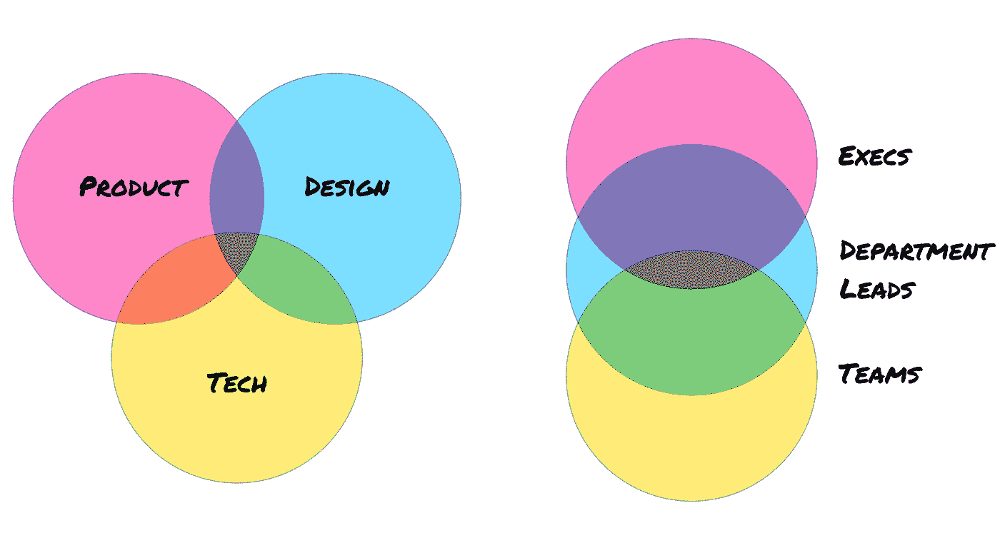

# 为什么你的公司变慢了，如何解决

> 原文：<https://medium.com/swlh/why-your-company-is-slowing-down-and-how-to-fix-it-89f5cf5bf7ce>

## 组织熵导论

在新业务或新项目开始时，每个人都有明确的角色和职责。但随着时间的推移，这种情况会发生变化。人与人之间原本清晰的界限变得模糊了。你雇佣一个热爱设计系统的开发人员。你雇佣了一个热爱数据可视化的设计师。你租用一个产品…