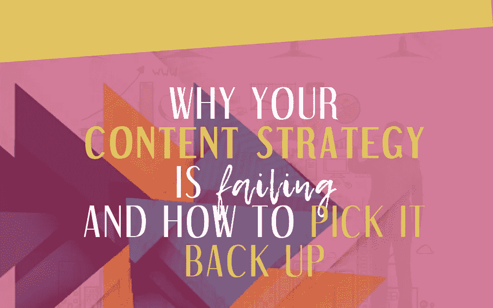
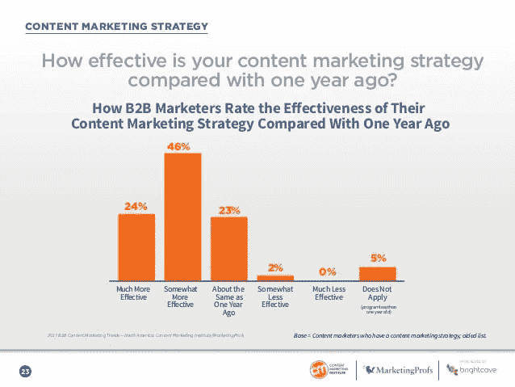
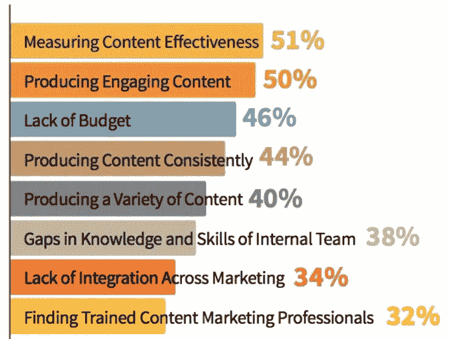
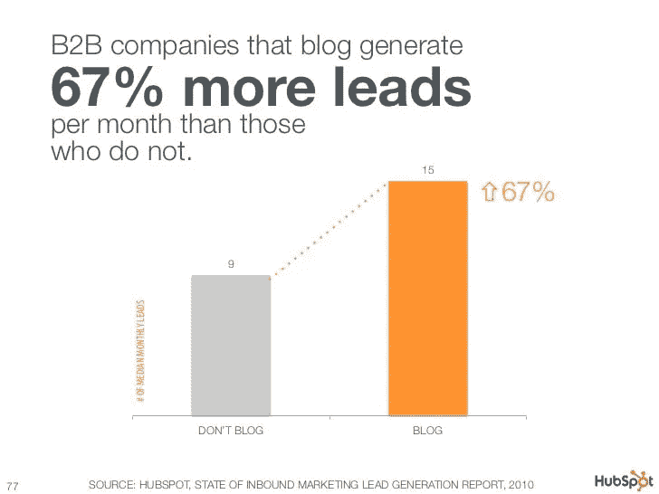

# 为什么你的内容战略失败了，你如何重新开始

> 原文：<https://medium.com/swlh/why-your-content-strategy-is-failing-and-how-you-can-pick-it-back-up-880494b99975>

这是新的一年，这意味着是时候反思了——既反思好的方面**也反思坏的方面**。

如果你的内容策略让你失望了——比如，它没有让你得到你想要的转化率或者你**需要**来维持你的生意——那么是时候做点什么了。

没有比现在更好的时机了，尤其是新的一年开始让你行动起来。

但是在我们深入探讨如何修复表现不佳的内容策略之前，你必须知道**为什么会失败。**

这可能有很多原因，无论是你没有衡量结果，你的观众都错了，还是仅仅因为你没有投入足够的时间和精力。

这么看:当被问及他们的内容策略与一年前相比有多有效时，只有 24%的营销人员说“有效得多”。

大多数人回答“稍微更有效”或“与一年前大致相同”。当你考虑到大多数营销人员对他们的内容营销策略的表现不满意时，这意味着**他们仍然对结果不满意。**

[来源](https://www.slideshare.net/mprofs/2017-b2b-content-marketing-benchmarks-budgets-and-trends)

是时候大换血了，对吧？

**为什么你的内容战略失败了**

[来源](https://www.siegemedia.com/strategy/content-marketing-statistics-that-actually-drive-action)

我会以不同的方式发表这篇文章。

我会假设你已经把你的观众了解得一清二楚，并且确切地知道他们想从你这里得到什么，你已经做好了一切准备**来**创建一个内容策略，比如品牌指南和一个功能齐全的网站。

我还会假设，营销人员在内容策略上面临的最大困难与他们失败的原因是一样的。

在上图中，你会看到内容策略给营销人员带来的八大挑战，我将逐一找出其中的四大挑战。

# **1。你没有衡量你的内容有效性**

在衡量内容策略的有效性时，最大的问题出现了。

许多营销人员知道他们需要一个战略，但是他们不确定他们需要衡量什么结果，甚至不知道去哪里衡量这些结果。

在你开始衡量你的内容策略的表现之前，你需要知道你到底想要衡量什么。为此，你需要一套切实可行的目标，这样你才能不断回头。

这将因业务而异，但可能是这样的:

*   销售额增加 20%
*   创建最多可关注 2000 人的 Twitter
*   每篇博文至少有 10 条评论
*   每月向我们的电子邮件列表添加 500 多人

一旦你心中有了一个坚实的目标，你就可以围绕它创建你的内容策略，这样你所做的一切都可以很好地与之结合。

另外，你有东西可以衡量。

如果每个月你的电子邮件名单上没有增加 500 个人，你知道有些事情需要改变了；同样，如果你正努力让每篇新博文都有 10 条评论。

# **2。你没有制作引人入胜的内容**

吸引人的内容似乎是当下的流行语，但如果你想建立一个忠实的粉丝和客户，这是**非常重要的。**

吸引人的内容是引人注目的内容，是你的观众积极互动的内容，最重要的是，**驱使他们采取行动。**

你没有制作吸引人的内容的一些关键指标包括:

*   没有人共享您的内容
*   没有人评论你的内容
*   当您发送简讯时，人们正在取消订阅
*   首先，您不会获得任何电子邮件列表订阅者

如果你认同这些，不要害怕！你可以很容易地扭转这个局面。

在三个快速的步骤中，你可以有一系列创造性的和引人入胜的内容想法，马上开始工作。

1.  第一步:真正了解你的听众。深入他们常去的论坛，记下他们问的常见问题。你也可以发送一份调查，找出你的受众在你的行业中面临的主要挑战。
2.  **第二步:**创建回答这些关键问题的内容，并挖掘受众面临的主要挑战。你的目标是为他们的问题提供解决方案- **这就是**吸引人的内容。
3.  **第三步:**确定你将如何传递内容。将所有内容分配到博客帖子状态很容易，但视频呢？信息图呢？认真思考你的观众如何消费内容，如何用不同的、互动的形式改变事物。​

# **3。你没有成功的预算**

这次我要叫你出来。

当然，这看起来像是你需要一个百万富翁的钱包来把你的内容战略带到顶峰，但是这与事实相去甚远，这很伤人。

一些最好的博客和资源完全是从零开始的，只是不断地向他们的受众提供有价值的和引人入胜的内容，直到它坚持下来。如果你因为没有时间自己动手而苦于找不到预算来雇佣内容创作者，可以考虑以下两个选择:

*   *投资内容创作者真的能让你赚更多钱吗？*

一开始，这似乎是一笔不必要的开支，但是通过雇佣一个专业的内容创建者，你更有可能创建吸引和转化你的观众的内容，从而增加你的销售额。

[来源](https://www.google.co.uk/url?sa=i&rct=j&q=&esrc=s&source=images&cd=&ved=0ahUKEwii2fm_5LvYAhWRSN8KHZMFC-AQjhwIBQ&url=https%3A%2F%2Fneilpatel.com%2Fblog%2Fbeginners-guide-to-content-based-lead-generation%2F&psig=AOvVaw3DrjKptDiVmEoDsEWtaxQy&ust=1515068597447750)

拥有活跃、持续博客的公司比没有博客的公司多产生 67%的潜在客户。雇佣一个内容创作者现在看起来并不是一个坏主意，不是吗？

*   *你能重新利用你***拥有的内容吗？**

*好吧，如果雇佣一个人是不可能的(即使这意味着你的业务以两倍的速度增长)，你可能需要重新利用你已经拥有的内容。*

***在你的网页副本、社交媒体和你写的文档中，你可能有大量有趣的信息和建议，你可以很容易地将它们转化为引人入胜的内容。***

*例如，你可以把一个客户案例研究变成一个视频，或者创建一个博客来突出你是谁以及你为什么创业。*

# ***4。您没有持续制作内容***

*创建一个成功的内容策略最困难的事情之一是保持它的一致性。当你在努力看到结果的时候，保持坚持是特别困难的，但是如果你想让它为你工作，这就是你需要做的。*

****偶尔发表一篇简短的博文是不够的。****

****如果你没有目标，每两周发表一篇博文是不够的。如果你是为了做而做，那就没有任何意义。****

*坚持一个时间表可以帮助你把你面临的所有其他斗争集中在一起。它可以帮助您:*

*   *衡量你的内容有效性*
*   *制作引人入胜的内容，因为你知道什么有用，什么没用*
*   *改变内容用途并制定预算*

*创建日程安排不仅仅是选择发布内容的日期；这是关于选择关注什么话题和什么时候关注，以及从整体上考虑你的销售漏斗。*

*如果那是你觉得难以理解的东西，我正好有适合你的东西。*

**

*[**创建电子内容**](https://wanderful-world.teachable.com/p/create-electric-content/) 为您提供所需的工具和材料，帮助您创建一个简单但非常有效的内容策略，帮助您增加销售线索并提高销售额。*

*如果这不是你 2018 年的目标，那是什么？！*

*[**点击这里**](https://wanderful-world.teachable.com/p/create-electric-content/) 了解更多关于该计划的信息，如果你已经准备好不再看到你的内容战略失败，并开始看到它飞速发展，请考虑加入我们。*

**本帖最早出现在*[*lizziedavey.com*](http://lizziedavey.com)*

**

## *这个故事发表在 [The Startup](https://medium.com/swlh) 上，这是 Medium 最大的创业刊物，拥有 292，582+人关注。*

## *在这里订阅接收[我们的头条新闻](http://growthsupply.com/the-startup-newsletter/)。*

**