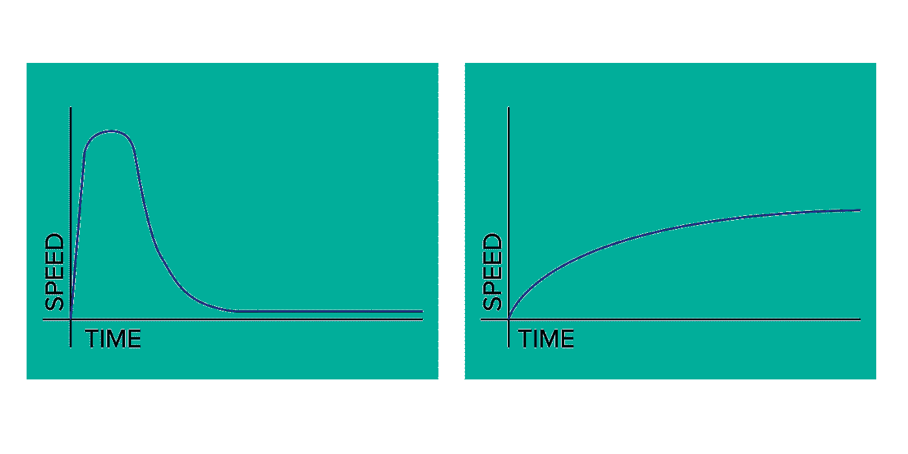
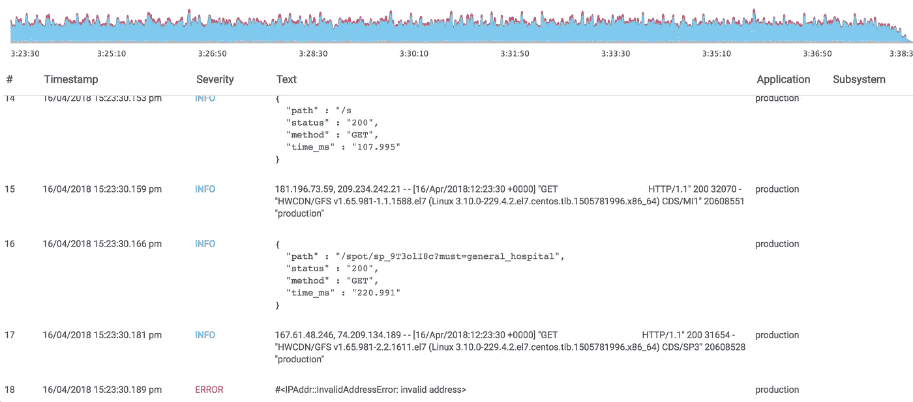
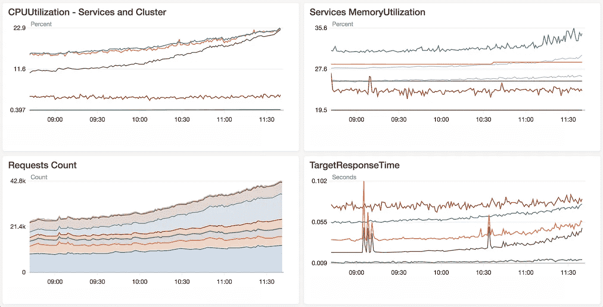
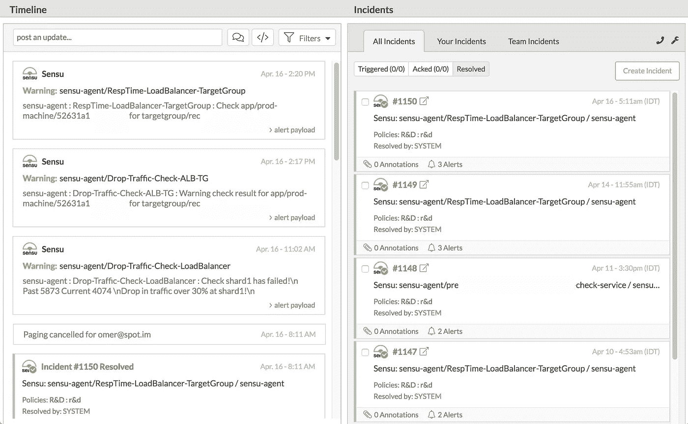

# 为什么你的初创公司从第一天起就要做开发运维

> 原文：<https://medium.com/swlh/why-your-startup-has-to-do-devops-from-day-one-a475ed937856>

## 消灭浪费。专注。创新。保持苗条。做个专业人士。

You can’t afford to do anything but win

2017 年创业公司的成功率是 2.5%。根据去年的统计，75%的美国风险投资创业公司都失败了。“成功”被解释为达到成功销售的程度。很明显，解读是客观的，但大体思路都差不多。
让我们谈谈更有趣的见解；97.5%的想法没有达到“成功”的程度。我不想过多地解释，我想从另一个角度来讲述这个故事——操作；软件运营。

Ops / DevOps / SRE 和生产工程都是软件运营的花哨名称。定义自动化过程开发的领域是构建、测试、交付、监控、构建弹性基础设施，有时甚至是[用混乱](http://principlesofchaos.org)等进行实验。

大多数创业公司(我所说的创业公司是指任何有一个想法和一行代码的≥ 1 人的团队)可能甚至没有考虑过实现上述领域的任何组件。“弹性”、“自动化”和“规模”这些可怕的术语听起来像是来自网飞或脸书等巨头的术语世界

恕我不能苟同。原因如下:

如果你有一个伟大的想法，已经制定了一个计划，甚至可能练习了一些投球，并基本上开始工作，你应该专注于开发你的产品，并独自完成**。请允许我假设你的公司还没有得到管理委员会的资助和支持(在这种情况下，这些想法甚至不是一个重要的建议，而是一个迫切的要求)，因此你没有浪费任何东西的奢侈。**

**如果在开发您的产品的过程中，您**手动**做了以下一项或多项:**

*   **测试触发**
*   **代码构建**
*   **集装箱制造/出版**
*   **重复性依赖项安装**
*   **重复性环境创建和配置**
*   **向团队报告新的发布/构建/测试运行**
*   **应用程序部署**
*   ***或任何其他重复性工作***

> **你是在浪费时间，真的！**

**听起来熟悉吗？不要被追上，改变方向，往前走。说起来容易做起来难，但是非常可行。
不管你是一个开发团队还是管理一个远程实体来开发产品，从工作的第一天起就需要做出某些决定。这不是小事，但是对于你的团队的生产力是非常重要的，对于你的产品脱颖而出的机会是非常重要的。**

## **放松呼吸**

**我的建议不容易被采纳，但是请听(读)完我的话:
花一周的时间在你的研发团队工作上，即使它只由一个开发人员组成，并投资于构建和设置自动化、交付管道和监控的工具。是的，“持续集成”不是一个可怕的时髦词，你不需要雇佣专家或支付大量的美元，你可以在一个下午就完成。如果你决定花一天时间，你甚至会得到一个系统的好处，这个系统将足够你在未来几年里受益，童子军的荣誉。**

**确保**整个**团队用一周的时间将资源集中在这个目标上；花费的时间和生产力的规模自然会产生反映您的团队规模及其需求的工具和过程。每个人都会参与进来，并对本周建立的系统共同承担责任。**

**为了说明自动化操作的想法及其对开发团队的影响，考虑团队进展的这两个模型。你想上哪一个？**

****

**Team speed over time; plan right, and you can make sure you never slow down**

****有多余的现金** **可以使用，想节省昂贵的时间**？** 

## **传递**

**准备好运行您的 CI 服务器了吗？太好了，花点时间建立你的交付管道:计划构建、测试和部署，这样你的应用程序就可以独立地通过每个推送或合并请求的每一个步骤。
确保需要报告的结果(如失败的测试或不可用的服务)通过电子邮件或您选择的最喜爱的消息应用程序直接报告。*个人推荐: [Slack](http://slack.com) FTW。**

## **试验**

**做 TDD！这一点怎么强调都不为过，投资一个好的测试套件并让它引领潮流，不仅可以节省时间和精力，还可以减少未来的挫折和通宵调试。这与您已经设计好的构建、测试、报告和部署流程密切相关。在产品经过全面测试的地方，自动化蓬勃发展(作为副作用，开发人员也是如此😉).**

## **原木**

**设计您的应用程序以生成详细且有意义的日志。报告应用程序活动和行为。分离到不同的日志级别，并尝试提供一个有用的结构，如常量 JSON 方案。想象一下在不久的将来，某种[麋鹿](https://www.elastic.co/elk-stack)将开始发挥作用，允许您简单地通过读取日志碎片来分析应用程序的任何部分，并提取已经被索引的确切字段，这要感谢您第一周的工作！**

## **分析**

**日志分析可以等等，但在决定是否分配本周范围内的资源之前，请确保您了解利害关系。

如果你可以开始*玩*你的日志，而不是简单地一个一个地读它们，会怎么样？→ [Elastic](http://elastic.co) 为 ELK 提供 SAAS 解决方案，但你也可以使用 AWS [CloudWatch](https://aws.amazon.com/cloudwatch/) 、GCP [Stackdriver](https://cloud.google.com/stackdriver/) 或功能丰富的替代产品，如 Coralogix 或 Logz.io，来实现同样的目标。每种产品都有自己的优势，并且可以在几个小时内完成托管解决方案的设置。
**做**:收集你的日志*集中存放*，无论是 Logstash 还是 S3 等。
**不要**:把日志留在机器/容器和 SSH 上阅读。你不仅会损害你的资源，这种调试和分析的方法也是不可持续的。至少使用外部服务或中央存储。**

****底线**:做吧。不出两周，你就会开始享受到与你的产品说同一种语言的好处；能够实际提问并获得有见地的答案，例如:**

*   **"在我们上一次重大事件中抛出了多少异常？"**
*   **"在 24 小时内平均看到多少条`CRITICAL`日志消息？"→“生成显示结果的月度图表”→“定位异常，从这些准确的时间段中隔离并提取误差”**

****

**Log analysis broken down by Application, Severity, Time or any other parameter required**

## **班长**

**随时了解您的应用程序正在经历什么。尽可能多地测量**相关**指标，以便能够在短周期内快速调试、响应和改进。了解应用程序的行为是至关重要的；您需要了解 CPU 强度、内存消耗和泄漏，以及请求的延迟和错误的级别和性质。
你不需要一个巨大的监控平台，你可以从你最喜欢的云提供商的托管解决方案开始，例如 AWS CloudWatch metrics。如果你是基于云的，一切都已经为你收集好了，你所要做的就是捡起来:投资几个小时，选择你想要明显意识到的东西。
**时间短？**建立一个类似于 [RunScope](http://runscope.com/) 或 [PingDom](https://www.pingdom.com/) 的服务，这将会非常容易部署，并且不断地测量您的服务的健康状况。你可能不知道每个问题的细节，但至少你会*意识到*。
**有多余的时间吗？**使用 [Prometheus](http://prometheus.io) 收集适用的指标，然后在 [Grafana](http://grafana.com) 等工具中查看。这对夫妇将提供更深入和定制的可视化的可能性，这将能够扩展到任何规模的生产资源，并处理未来的应用程序指标。
**或**:部署一个基于插件的监控工具，如 [Sensu](http://sensu.io) 并将其用于已安装的代理(推送)或探测信息服务(拉取)。**

**有多余的现金吗？试用 NewRelic / DataDog /任何其他应用监控解决方案。你将学到的关于你的应用程序的东西将会深刻地影响你的开发过程的质量，并最终影响你产品的质量。**

****底线**:即使你开始精益，也要从基础做起，了解你系统的指标。在大多数情况下，他们已经收集，只是组织和监测。**

****

**“Know what you application is going through at all times”**

## **警报**

**基于您已经收集的指标，在超过某些阈值时设置警报，并通知您自己/您的开发团队。准确地知道什么时候出了问题，不仅仅可以拯救你的生产。即使你仍在开发你的产品，你也能在错误发生时捕捉到它们，简化调试和历史搜索的过程，并在短周期的反馈中不断改进。
同样，在大多数云平台中，既然已经收集了指标，剩下的就是设置警报和通知，例如 AWS CloudWatch 警报。
使用 Slack(或类似工具):集成机器人和传入网络挂钩，从您的系统发送尽可能多的传入数据——警报、通知、报告——将它们全部呈现在一个易于阅读和跟踪的地方。通过在报警时*和*如何*应用逻辑来防止[报警疲劳](https://en.wikipedia.org/wiki/Alarm_fatigue)。***

**有多余的现金吗？添加一个类似[victor ops](http://victorops.com)/[ops genie](http://opsgenie.com)/[page duty](http://pagerduty.com)的产品，用于报告、随叫随到、团队报告管理和上报策略。即使您没有利用他们的全部特性集，您也能够在问题发生时得到通知并做出响应，并与团队的其他成员分享它们。**

****

**An example alerting dashboard for VictorOps, being triggered by Sensu**

## **沟通**

**归根结底，“DevOps”就是交流。能够提出想法、打破孤岛、协作并达成共识，这些都是开发和运营协同工作的基础。在团队之间建立沟通不是一件容易的事情。见鬼，即使是在两个人之间，你有时也会迷失。WhatsApp 或 Telegram 很适合私人聊天或讨论，但你的计划、任务和工作相关的聊天应该包含在一个易于使用的可搜索结构中。
减少电子邮件:使用 Slack 这样的交流应用程序来创建不同的讨论渠道，分享文档、设计、徽标、链接和与某个主题相关的一切，这样你就能很容易地回来找到它。**

**在一个中心位置进行规划和协作。使用像 Atlassian 的吉拉 T21 这样的产品来管理冲刺、门票、项目和整体时间表和进度。
*专业提示—将您的计划产品连接到 Slack，以便跟踪票据；无需登录系统即可移动、创建和更新它们。**

## **包装东西**

**经过一周的努力，你可以实现以上所有目标，如果有动力的话，你甚至可以做得更多。尽管这些工具和平台看起来与您的产品阶段有些遥远和不相关，但它们不仅会提高您的开发速度，还会使您的整个过程流畅、反应灵敏、有趣。这将节省大量重复工作、调试和搜索的时间。你会变得积极主动，掌握系统，而不是反过来。计划发展吗？一个新工程师的入职花费了他和他的向导大量的非生产性时间。自动化系统将花费一半的时间来解释和安装，同时防止预期的错误。**

**上述大部分解决方案在一定程度上是免费的，其余的将在一个月的运行时间内覆盖他们的成本。**

**即使你是一个只有一个开发人员的团队，尤其是如果你是一个人在战斗:拥有一个支持性的工具生态系统将帮助你不断地管理和提高你的产品质量。你将彻底*消灭浪费*，这将让你专注于你应该做的一件事——**创新**。**

**声明:我在这篇文章中提到了许多工具，它们都是基于个人经验。对你的选择负责，在将它们应用到生产中之前做你自己的研究。
但比这更重要的是；请记住，这个过程与工具或名称无关，它与想法和*方法*有关。专注于你的想法，在工作中讲究方法，并时刻做好计划。祝你一路顺风！**

***我叫 Omer，是*[*ProdOps*](http://prodops.io)*的一名工程师，这是一家全球咨询公司，采用 Devops 文化，以可靠、安全和简单的方式交付软件。
在下面的评论里让我知道你的想法，或者直接在 Twitter 上联系我*[***@****omer GSR*](https://twitter.com/omergsr)*。如果你喜欢鼓掌，它帮助我集中我未来的写作！***

****

## **这个故事发表在 [The Startup](https://medium.com/swlh) 上，这是 Medium 最大的创业刊物，拥有 318，983+人关注。**

## **在这里订阅接收[我们的头条新闻](http://growthsupply.com/the-startup-newsletter/)。**

****