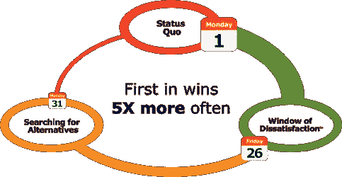

# 为什么您通过触发事件销售达成交易的可能性提高了 5 倍

> 原文：<https://medium.com/swlh/why-youre-5x-more-likely-to-close-deals-with-trigger-event-selling-ceb7b4575e7c>

触发事件销售允许您在潜在客户发现您的竞争对手之前，在他们最容易接受您的解决方案的时候接触他们。这是在有实际需求时提供解决方案的绝佳机会。本文将带您了解什么是触发事件销售，它是如何工作的，以及需要注意哪些触发事件。

任何销售人员或营销人员都知道，任何销售的关键是时机——在正确的时间、正确的地点找到正确的人。

不幸的是，这给我们留下了很多机会。你听过多少次“现在对我们来说不合适”？你可以拥有完美的数据、出色的产品、吸引人的信息，但你的努力却没有任何回报，因为没有人认识到你的服务或产品的必要性。

触发事件销售就是要发现需求——在条件合适且对您提供的解决方案有需求的时候接近潜在客户。在这篇文章中，我将分析你应该如何以及为什么利用触发事件作为销售策略，以及如何监控你可以利用的触发事件。

* *在我们进入“做什么”和“如何做”之前，简单提醒一下，如果您确实想监控触发事件，但内部没有这种能力，Taskeater 可以帮助您通过社交媒体渠道寻找机会。[联系我们这里](https://www.taskeater.com) **

# 但是什么是触发事件呢？

触发事件是为营销或销售机会创造机会的任何事情。环境的转变或变化——无论是对整个公司还是对个人来说——可能意味着对你的提议更有利的条件。

还在迷茫？

几个例子是:

*   雇佣渴望改变公司并留下自己印记的新高管
*   在新公司开始工作或改变角色的老联系人，他可能会推荐你的产品或服务
*   目标公司扩展到他们可能需要支持的新市场

所有上述情况都可能导致您的联系人或潜在客户寻求使用您的服务——条件变得对新业务和/或竞争更加有利。

# 触发事件是如何工作的？

**Craig Elias** ，触发事件贩卖的鼻祖和 [*Shift 的作者！:利用触发事件将潜在客户转变为客户*](https://www.amazon.co.uk/Shift-Harness-Trigger-Prospects-Customers/dp/1450240070) ，更清楚地描述了与买家之旅相关的内容，他将买家之旅分为三种不同的模式。

大多数买家都处于一种“维持现状”的状态。尽管他们对服务并不完全满意，但他们不会四处寻找替代方案，而是更愿意坚持他们所知道的和他们已经有的东西。B2B 服务安排经常出现这种情况——寻找替代方案需要研究和努力，结束一段持续的关系很尴尬。通常情况下，问题并不明显或痛苦到足以独立引发变化。

然而，当购买者因环境变化而对他们的产品/服务感到痛苦时，他们会进入一种更积极的模式**‘寻找替代品’。**他们将开始主动寻找解决方案——通常会联系多家公司。这就是进站的[限制之一变得明显的地方。潜在客户将会看到多种选择，而你的网页/产品可能不符合要求。Aberdeen Group 的研究表明，在这个阶段卖出一套房子的几率大约是 16%——或者说是六分之一或七分之一。](https://www.taskeater.com/insights/outbound-marketing-v-inbound-marketing/)

正如 Elias 指出的那样，在现代市场中进行销售有两个主要障碍:

1.  在潜在客户认识到他们的问题或痛点之前，销售人员过早地伸出手(也就是说，他们处于“现状”销售模式)
2.  销售人员接触潜在客户时为时已晚，在潜在客户的购买之旅结束时，他们实际上已经下定决心(也称为“寻找替代方案”)

然而，在“现状”和“寻找替代方案”之间，有一个关键阶段，你的潜在客户意识到了一个问题，但还没有开始寻找解决方案。伊利亚把这描述为 **'** [**不满的窗口**](http://shiftselling.com/webinars/window-of-dissatisfaction/) **'。**

(图片鸣谢: [SHIFT！](http://shiftselling.com/book/))

这就是触发事件出现的地方。你可以通过监控不同的社交媒体渠道和新闻渠道，了解可能导致这种转变的环境变化，从而确定潜在客户何时进入“不满意窗口”模式。我会进一步解释。

# 现在是关键问题——结果？

根本前提*转变！*建立在这样一个事实上，第一个到达现场的人通常会得到交易。正如你从他们官方网站上的图片中看到的，他们的口号是“先入者更胜 5X”。

这得到了 Forrester Research 的支持——在你的竞争对手将你的销售机会提高到 74 %之前，主动接触有适当动机的决策者。

这里的警告是，它必须是之前。

关键是你要行动迅速。一旦你找到了一个具有相关触发点的潜在客户，你必须立即利用它。你会在*转变中注意到！*进入“不满意窗口”和开始“寻找解决方案”之间的时间只有 5 天。你需要在别人行动之前，尽快采取任何基于触发器的方法。

这是 Taskeater 帮助我们的客户的事情——监控所有主要的社交渠道，在发现触发事件时通知客户。[在这里联系我们。](https://www.taskeater.com/contact-us/)

# 触发事件在我的销售策略中处于什么位置？

触发事件销售使您能够针对潜在客户的确切痛点定制您的信息。你及时解决了他们最大的问题。这意味着冷联系策略，如冷电话和冷电子邮件，可以个性化，并直接针对某个公司或客户。

触发事件还可以帮助确认和改善您的潜在客户名单，特别是对于那些陌生来电者，他们很少对被联系感到兴奋(如果您正在为呼出策略而挣扎，请下载我们的电子书:[为什么电子邮件提供的会议比电话多 11 倍](https://www.taskeater.com/downloads/outbound-strategy-why-emails-deliver-11x-more-meetings-than-calls/))。确定需求有助于确定在哪些销售线索上花费更多时间。

有了触发事件的知识，你的方法可以变得以问题为中心，而不是以解决方案为中心。不要以“让我简单介绍一下我的公司和产品”开头，你可以试试“我在 LinkedIn 上看到你最近获得了新的资金。恭喜你！我怎样才能帮你投资成长？”因为它们是个人的和及时的，触发器有助于创造一种个人联系的感觉，使你看起来更有人情味，让你的潜在客户参与进来。

# 如何找到触发事件？

监控触发事件是一项困难的工作，需要时间。你很少会在你的新闻订阅上偶然看到一条推文或 LinkedIn 帖子，宣布“我需要一种新的[产品/服务]——有人能帮我吗？”

通过各种渠道监测和跟踪触发事件，你将能够捕捉到明显和微妙的变化，这些变化有助于温暖你冰冷的外联方法。

我们收集了一些你可以监控这些变化的方法，但是如果你在这个过程中需要任何帮助，这是一项你可以外包的服务。我们已经通过自动化和专门的离岸团队的结合，帮助了全球数百家公司的前景和规模。在这里联系。

# 在我们进入“如何”之前，先解决“什么”。

关键的第一步是花时间找出哪些触发事件对您的公司有用。根据 Elias 的说法，[触发事件分为三类](http://shiftselling.com/trigger-event-selling/):

> "**糟糕的体验:**决策者对产品/服务、人员或供应商有糟糕的体验。例如，可能有一个产品/服务变更引起了不满意。
> 
> **变化/转变:**决策者在人员、地点或优先事项上发生了变化或转变。例如，某个客户的决策者可能发生了变化。
> 
> 意识:决策者意识到由于法律、风险规避或经济原因需要改变。例如:他们可能有了新的认识，从像你这样的人那里购买比继续从其他人那里购买他们现有的解决方案风险更小。"

# 一旦你知道你在寻找什么，开始监控适当的渠道。

您会注意到许多这样的项目符号在各种渠道中重复出现——这是故意的！

当你在监控触发事件时，很有可能会有东西从缝隙中溜走(如果你雇佣了一个任务承担者团队，就不会了；) )所以，在几个渠道上传播自己是很关键的。双重闹钟的把戏。

## 谷歌快讯

Google Alerts 让您能够及时了解最新的新闻发布、公司新闻、管理层变动和项目。你设置关键字，并在综合电子邮件中接收新闻剪报，然后你可以根据这些信息来确定你的活动时间和信息。这对于任何基于客户的事情都特别有用(尽管如果是那么具体的事情——确保你也经常查看他们的公司新闻和新闻稿)。

触发事件包括:

*   **公司扩张或搬迁**:正在扩张或搬迁的公司可能需要新的供应商、服务提供商或改变流程，以便在新的结构中更加有效。
*   兼并收购:这为新业务提供了绝佳的机会，尤其是如果其中一家公司是新客户的话。
*   **C-Level 或新高管的变化**:新管理层通常会寻求更好的交易或更高效的流程，这就是你的产品出现的地方。
*   **现任经理或领导离职**:管理层的变化为现有流程的变化创造了机会
*   **大客户公告**:如果一家公司获得了一个新客户，他们可能需要更多的供应商、服务提供商或新流程来支持工作量。
*   **新产品/服务发布或进入新市场**:公司正在进入未知领域，将需要新形式的支持(甚至可能是新的供应商)。
*   **竞争产品/服务公告**:如果竞争对手发布了一个吸引行业关注的公告，潜在客户可能会寻求新项目或改变

## 商务化人际关系网

LinkedIn 的帖子和更新与 Google Alerts 配合得很好——尤其是在你目标明确的基于账户的策略中。但是，它还允许您与个人联系人或关键目标潜在客户保持同步，这可以使您的外展信息更有针对性，更针对他们的具体经历/问题。

触发事件包括:

*   与 Google Alerts 配对以监控:
*   **公司搬迁和扩张**
*   **新产品/服务发布或进入新市场**
*   **C-Level 或新高管的变动**
*   **竞争产品/服务公告**
*   现有联系人搬家公司:对你的服务满意的联系人可能会推荐你去他们的新工作地点。
*   **提升现有联系人**:如果某个联系人被提升到管理层或更有购买力的职位，他们可能会接受新的服务/产品提议。

## 客户关系管理

实际上，我已经写了一整篇关于 CRM 清理如何促进触发事件销售的文章— [触发事件销售:如何利用 CRM 清理产生新业务](https://www.taskeater.com/insights/trigger-event-selling-crm-cleansing/)。我会阅读更多的细节，但总的来说，CRM 清理可以在联系人转移或晋升时进行标记，这使您能够在他们的新工作或团队中与他们联系。

## 社会监督

Taskeater 为我们的客户提供的社交媒体监控功能尤其强大，因为它允许您监控与您的业务相关的领域的兴趣。您可以大规模监控特定的触发事件，并直接从该平台吸引潜在客户。

触发事件包括:

*   与 Google Alerts 和 LinkedIn 配对以监控:
*   **公司搬迁和扩张**
*   **新产品/服务发布或进入新市场**
*   **C-Level 或新高管的变动**
*   **竞争产品/服务公告**
*   **现有联系搬家公司**
*   **现有联系人晋升**
*   **对当前供应商的不满**:如果潜在客户对当前供应商的评价是贬损的，那么这是接近他们的机会。
*   **兴趣证据**:监控对社交媒体上相关关键词、话题或产品的兴趣可以作为意向信号，提供一个很好的接触机会。它还可以帮助跟踪目标公司发布的任何内容，这些内容可能表明目标公司对你所在的领域感兴趣。

# Taskeater 如何帮助你？

对于小团队或初创公司来说，更广泛地监控渠道，如与竞争对手的负面经历、对相关主题领域的兴趣，甚至直接询问对某个问题的见解，都是一项艰巨的工作，内部运营成本也很高。然而，它是最有用和最需要监控的触发事件之一，并且可以在您的目标细分市场中扩展(而不是只关注一个客户)。

Taskeater 与全球 200 多家公司合作，通过支持您现有的工作流程来帮助简化流程和提高内部效率。将社交媒体内容监控等耗时的任务外包给我们，您的团队只需处理机会，无需跑腿。

[请联系我们的伦敦团队](https://www.taskeater.com/contact-us/)了解我们如何帮助监控社交媒体上的关键触发事件，以便您在销售策略中加以利用。

## 这篇文章发表在 [The Startup](https://medium.com/swlh) 上，这是 Medium 最大的创业刊物，有 320，131+人关注。

## 在此订阅接收[我们的头条新闻](http://growthsupply.com/the-startup-newsletter/)。

