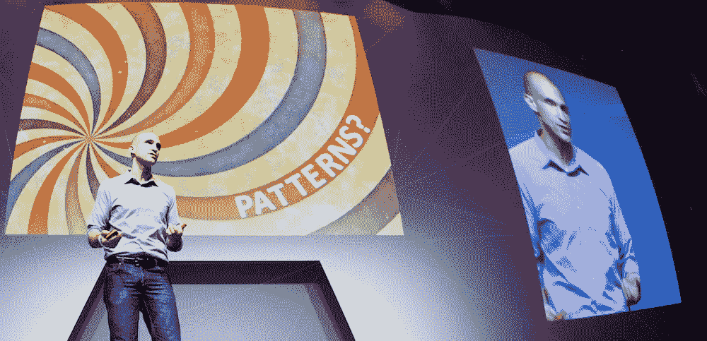

# 为什么你对技术不“上瘾”(这么说很危险)

> 原文：<https://medium.com/swlh/why-youre-not-addicted-to-technology-and-it-s-dangerous-to-say-so-18470785e87a>

## 行为设计师 Nir Eyal 关于如何重新控制你的技术的访谈

看一看新闻，很容易相信我们正在遭遇一场全球焦点危机。罪魁祸首？我们融入日常生活的技术。

脸书前总统警告[社交网络旨在利用我们的弱点](https://www.axios.com/sean-parker-facebook-was-designed-to-exploit-human-vulnerability-1513306782-6d18fa32-5438-4e60-af71-13d126b58e41.html)。苹果最大的两个投资者[敦促该公司采取行动对抗儿童智能手机成瘾](https://www.theguardian.com/technology/2018/jan/08/apple-investors-iphone-addiction-children)。

而像人道技术中心和阿里安娜·赫芬顿的茁壮成长全球这样的运动旨在帮助我们夺回被我们夺走的技术控制权。

这些对话的核心是 Nir Eyal。自从出版了他的*华尔街日报*畅销书*上钩:如何打造形成习惯的产品*，Nir 已经成为技术影响甚至设计我们行为方式的代言人。

然而，尽管他一直坚持认为这些做法应该合乎道德，但对他来说很明显，我们正在触及一个临界点。

在他即将出版的新书*不可分割*中，Nir 着眼于我们如何利用公司的策略让我们回来并重新控制我们的技术使用:

> “当我刚开始的时候，很多客户来找我的问题是，‘看，我们有这么好的产品，但是人们没有使用它。“我们如何让他们使用这个能改善他们生活的伟大产品？”
> 
> “今天，我们遇到了相反的问题。产品如此之好，以至于很多人都很难脱离它们。”

在这次采访中，我们请 Nir 带着他对产品如何设计的深入了解来*关注我们的焦点，并为*夺回*对我们生活的控制和平衡提供一些解决方案。*

# 关于技术和应用如何“吸引”你的初级读本

Nir 的职业生涯几乎恰好与脸书的崛起相吻合——这是有史以来最容易形成习惯和最普遍使用的应用程序之一([当前数据](https://s21.q4cdn.com/399680738/files/doc_financials/2017/Q4/Q4-17-Earnings-call-transcript.pdf)称**用户每天在脸书上总共花费 10 亿小时**)。

在发展和销售了多家初创公司后，Nir 开始注意到这个新兴的流行应用和技术群体中的一个趋势:他们不只是被动地等待你使用它们，而是主动试图改变你的行为，让你回来。

这种认识使他走上了研究之路，获得了斯坦福大学的工商管理硕士学位，并出版了他广受好评的书*上钩*——这本书是创造习惯形成产品的一步一步的指南。

首先，有一个**触发器**——Nir 称之为“整天通知你和给你发电子邮件的东西”

接下来是**行动阶段**——这是你在期待奖励时可以做的最简单的事情，比如滚动你的 feed 或下拉刷新 Instagram。

接下来是奖励，这是你来的目的。然而，大多数应用程序采用某种形式的可变奖励系统，这意味着我们总是不确定我们会得到什么，这使它更有吸引力，更容易养成习惯。

> *“如果你想一想是什么让老虎机如此有趣，那就是让我们看一场精彩的篮球赛、读一本好书，甚至是进行一场浪漫的同一件事。一切都是不确定的。不确定性是迷人的。”*

最后，是**投资**——我们，用户，向产品中投入一些东西——数据、内容、社会价值等——这提高了产品的价值。例如，你在脸书上的朋友越多，它就变得越好。

根据 Nir 的说法，这些产品的成功之处在于它们将触发因素从外部因素转变为内部因素:

“在经历了第一个连续的循环之后，我们开始使用这些产品，完全不需要外部触发。相反，是一种内在的力量把我们拉了回来。内部触发因素往往是负面情绪——所以恐惧、孤独、无聊、不确定性，任何这些我们都在寻找对我们使用的产品的不适的满足感。

“一旦一个产品能把自己和那种情绪联系起来——你就孤独了，所以你去找脸书；你不确定，所以你查谷歌；你觉得无聊，于是你查看 Reddit — *然后*，这个习惯就真正形成了。”

# 为什么你没有对技术“上瘾”(为什么说你“上瘾”很危险)

听 Nir 这样解释数字产品，会让科技公司听起来比他想的更不择手段。像任何一个超级大国一样，使用它也伴随着一定程度的责任。

然而，我们现在越来越多地看到的问题是，缺乏对养成习惯技术有多强大的理解。然而，尽管很容易将所有责任归咎于那些从我们的关注中获利的公司，但 Nir 表示，我们需要特别谨慎，不要给予他们超出他们应得的权力:

“从 2010 年开始，我就一直致力于此，所以我很早就知道我自己的行为正在受到技术的影响。我发现自己和女儿在一起的时候会查看 Twitter，和朋友或妻子在一起的时候会查看电子邮件。我非常清楚这个问题。

> “但人们和媒体不喜欢谈论的是，你拥有的代理和控制能力比他们表现出来的要多得多。”

Nir 说，技术“劫持你的大脑”或普通人对手机“上瘾”的想法是垃圾。

“是的，有一小部分人非常上瘾——这是一个完全不同的话题——但这种‘技术成瘾’并不是媒体和其他人所认为的普遍障碍。”

Nir 将我们今天看到的许多现象称为“技术恐慌”——担心我们完全无法控制如何以及何时使用我们的技术。大量使用“科技成瘾”这个词实际上对我们不利。

“几年前有一项关于酗酒者的伟大研究——记住，这是我们谈论的一个完全不同的范畴。你放在身体里的东西和一个 app 或者产品是很不一样的。但在这项研究中，他们想发现什么样的特质使酗酒者在治疗后最有可能复发，”他解释道。

“他们发现这不是身体依赖的程度。不是药物本身。这是他们对自己无能为力的信念。”

Nir 认为，同样的事情也发生在科技和我们没有科技的生活中。

**“绝望是走向失败的第一步。如果我们认为我们无能为力，我们就什么都不做。我们说，‘哦，这不是我的错。“是脸书，”或者，“这是电子邮件。"**

> “当你相信自己无能为力的时候，它其实就变成真的了。”

# 被科技分心不是你的错。但这是你的责任

让自己远离令人分心的技术的第一步是明白你*确实*可以控制你的使用。然而，虽然这将你从技术的严格控制中解放出来，但这也意味着解决问题的责任完全落在了你的肩上。正如 Nir 解释的那样:

> “如果你屏住呼吸，等着这些公司修正他们的产品，让它们变得不那么好，以至于我们不想那么频繁地使用它们，你会窒息的。”

相反，我们需要积极地改变我们的行为，在我们和这些技术提供的触发器之间建立一种隔离。

# 一个三步计划，在你和分散注意力的技术之间制造障碍

对我们来说，让技术回归原位如此困难的原因是，在大多数情况下，它不会让人感觉到它在伤害我们。

对于大多数用户来说，只有在回顾时(或者当使用像 [RescueTime](https://www.rescuetime.com/) 这样的工具来帮助你了解你在特定应用上花费了多少时间)，你才会意识到这个问题。

大部分技术没问题。它甚至可能是好的。但是到处都是。总是想引起我们的注意。

正如 Nir 解释的那样，打开手机或上网就像走在一条充满面包店的街上。你知道暴饮暴食碳水化合物和糖并不符合你的最佳利益，但这太他妈的好了，不能一直放弃。

“解决办法不是走进面包店，抓住面包师的衣领，摇晃他，然后说‘别烤这么好吃的东西了，我一直都想吃！’"

> “这同样适用于技术。你可能会说‘我喜欢这些工具。他们改善了我的生活。但当我过度使用时就不会了。然后，你必须决定何时以及如何使用它们。这是关于节制你的行为。这需要努力。"

# 第一步:“同步”你的日程表和你的目标

根据 Nir 的说法，第一步是做他所谓的“同步”——承诺并写下一个[的每日时间表](https://blog.rescuetime.com/daily-schedule/)，其中充满了你*想要*做的事情，但你觉得你的技术使用正在妨碍这些事情。

“人们对我说，‘这些产品太容易上瘾了。它们太让人分心了。我什么都做不了。我问他们，‘是什么分散了你的注意力？让我看看你的日历”。他们给我看了他们的日历应用程序，却是空白的！

> “在这个时代，除非你知道是什么让你分心，否则你不能称之为分心。”

“所以看在上帝的份上，计划好你的时间吧。如果你在生活中从一个任务到另一个任务，你当然会分心，因为你没有计划任何你想做的事情。”

要对抗数字干扰，第一步是要知道为什么你要对抗它。用你最重要的、[有意义的工作](https://blog.rescuetime.com/meaningful-work-guide/)以及[休息时间](https://blog.rescuetime.com/weekly-roundup-meaningful-breaks/)和不太重要的任务填满你的日历(Nir 说你甚至应该为脸书和电子邮件安排时间)。

花点时间和你生活中的利益相关者一起回顾这个时间表——无论是在工作中还是在家里——确保它是现实可行的。

“如果你不计划你的一天，别人会的。可能是你的老板，或者你的配偶，或者一场足球赛或者脸书。如果你不这样做，就会有事情占用你的时间。”

# 步骤 2:移除外部触发器

回到他的钩子模型，Nir 说我们实际上可以使用这些公司使用的相同方法来改变你的习惯，摆脱它们。

每个改变习惯的产品都是从一个触发器开始的——一些让你开始使用的东西。所以停止这个习惯的最简单的方法就是移除触发器。

“我们谈论了很多关于这些技术是多么强大和险恶，但当你从手机上卸载应用程序时，马克·扎克伯格无能为力，”他解释道。“一旦你检查了通知设置并将其关闭，扎克伯格就无法再重新启用这些通知了。”

但最疯狂的是。根据他的研究， **2/3 的智能手机用户从不改变他们的通知设置。**

“太荒谬了。为什么你会让这些乒乒乓乓和通知整天烦你？你应该按照自己的时间表使用应用，而不是按照应用开发者的时间表。**花五分钟时间，关掉所有你不想听到的通知。”**

# 第三步:深入了解注意力分散的根本原因

随着通知等外部触发器的出现，最后也是最困难的一步是理解你开发的内部触发器。

> “当谈到分心时，没有人愿意谈论的冷酷、冷酷、肮脏的事实是，它来自内心。”

“如果我把你放在一个密封、安静的房间里，让你坐在那里冥想并专注于你的呼吸仅仅 10 分钟，除非你已经练习冥想很长一段时间，这对你来说将是非常困难的。”

正如 Nir 解释的那样，我们的自然状态是注意力分散。如果不是脸书或社交媒体，那就是电子邮件、朋友、家务或电视节目。

“在一天结束时，你可以使用每一种很酷的注意力保持技术，你可以将你的手机变成一百万种不同的定制以减少分心**,但如果从根本上说你不专注于你自己脑袋里正在发生的事情，分心将永远是一个问题。”**

为了解决这个问题，Nir 提供了几个解决方案:

# 用承诺契约来约束自己

这可能很简单，就像和一个朋友一起工作一段时间，在这段时间里，你们互相负责。或者，使用网站拦截器、集中工作会议或“愚蠢”技术等技术来确保我们不会做我们不想做的事情。

# 建立一个系统来了解是什么让你分心

Nir 说，从根本上说，所有注意力分散的来源总是疼痛。是不舒服或者感觉到某种不舒服的情绪。我们需要建立某种系统来理解我们为什么会分心。每当你觉得自己被拉去查看电子邮件或谷歌一些你不需要的东西时，停下来，退后一步，写下你的感受。

# 问“这个产品适合我吗？还是我在为它服务？”

一旦你确定了注意力分散，下一个问题就是:这对我有帮助吗？现在使用这项技术会给你的生活带来动力吗——它会让你前进吗？或者这是一种干扰——它把你带走了？

# 几千年来，人类一直在做违背我们更好利益的事情

“这只是我们最近的分心，但分心一直是人类的一个问题，”Nir 说。“2500 年前，亚里士多德和苏格拉底就无意识状态的本质展开了辩论。他们谈到了我们做违背自己利益的事情的倾向。”

然而，尽管我们在历史上的大部分时间里都会分心，Nir 说我们也非常善于适应变化。这正是我们现在需要处理的数字干扰。

“如果我们相信我们有足够的力量去改变，如果我们采取措施确保我们没有滥用或过度使用这些产品，那么我们就能做到。好消息是，整个行业的产品和人员都在帮助你做出改变。”

# 嗨，我是乔里！

*我帮助公司和有趣的人通过聪明和专注的写作讲述他们的故事。想一起工作吗？在 hello@jorymackay.com 给我发邮件*

*这篇文章的一个版本最初发表在* [*改版博客*](https://blog.rescuetime.com/nir-eyal-digital-distraction/) *。查看更多关于生产力、专注和动力的文章。*

## 这个故事发表在 [The Startup](https://medium.com/swlh) 上，这是 Medium 最大的企业家出版物，拥有 296，127+人。

## 在此订阅接收[我们的头条新闻](http://growthsupply.com/the-startup-newsletter/)。

