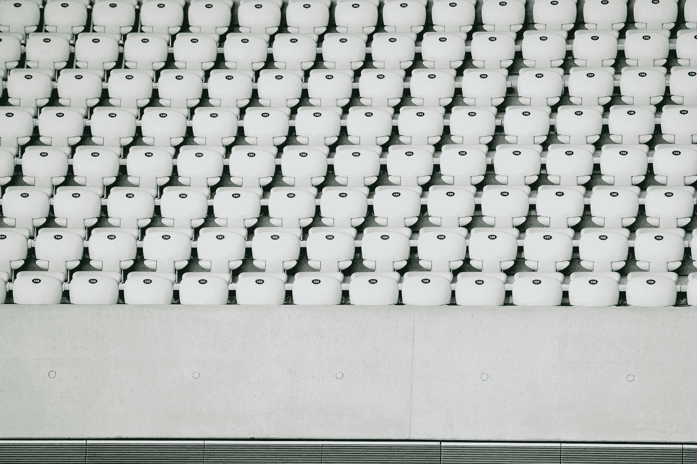

# 为什么你不能在媒体上获得浏览和阅读

> 原文：<https://medium.com/swlh/why-youre-not-getting-views-and-reads-on-medium-4be616b45d2a>

Photo by [dylan nolte](https://unsplash.com/@dylan_nolte?utm_source=medium&utm_medium=referral) on [Unsplash](https://unsplash.com?utm_source=medium&utm_medium=referral)

## 以及你能做些什么

用枪指着你的头，你会选择什么——一百万次浏览还是一千次阅读？

我们创造是为了表达和交流我们的想法，而我们所能得到的最糟糕的回应就是默默无闻。如果你充耳不闻，视而不见，即使你有十亿的浏览量也没关系。

以下是你应该问自己的问题:

> 我想影响谁？我想和谁合作？我想帮谁？
> 
> 他们在哪里消磨时间？我如何引起他们的注意？
> 
> 他们长什么样？他们有什么问题？他们脑子里在想什么？

同理心是我们需要培养的技能。企业家精神或创造力很少是单向的。这是一个不断的来回沟通。它需要两个人和着音乐一起跳舞。

自从我开始在我的媒体账户上每天写东西以来，现在已经四个月了，这是我表达自己和充实我的想法的方式。

现在，我已经到了想要帮助年轻版的自己的地步。我想帮助一个和我经历同样困难的孩子。我想训练或指导他们，就像我的偶像塑造我成为一个更好的人一样——没有附加条件，没有隐藏的议程。

所以这就引出了一个问题——他们是在媒体上花费时间吗？

**号**

我来自第三世界国家，企业家精神是我们文化中最遥远的东西。我们被教育成为好员工并服从命令。创业是疯狂的，因为它有风险。那条路只有处于社会上层的人才能走。我们没有加里·维纳查克、蒂姆·费里斯或史蒂夫·乔布斯这样的偶像。

我离成为偶像还有好几光年——我是商科学生，我在战壕里，满脸是泥。但是我想激励我的同胞们，如果像我这样一个简单的男孩可以尝试，他们也可以。

那么，如何在媒体上获得更多的浏览和阅读呢？我不知道。

这是个更好的问题:

你更关心庞大的数字，还是你给一小撮阅读你内容的人带来的影响？

选择后者而不是前者。一直都是。

回头见，我的朋友。

## 这篇文章发表在《T4》杂志《创业》(The Startup)上，这是 Medium 最大的创业刊物，有 323，834+人关注。

## 在这里订阅接收[我们的头条新闻](http://growthsupply.com/the-startup-newsletter/)。

