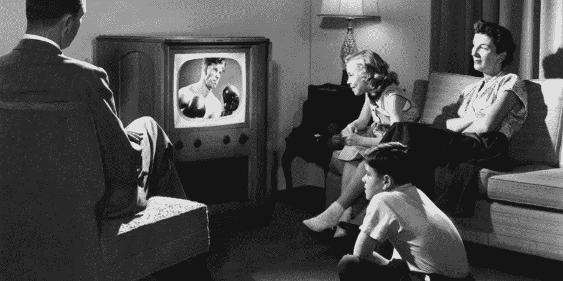
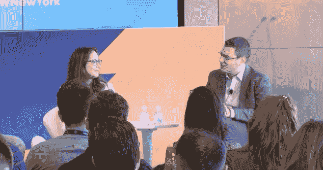
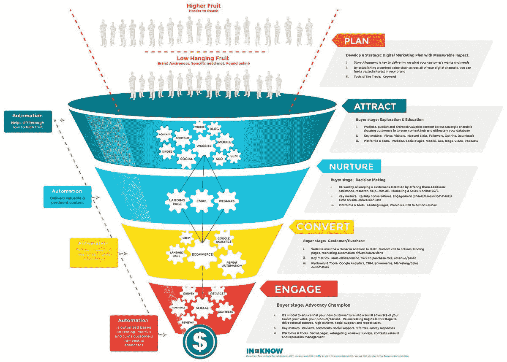

# 数据和数字会让电视重回我们的生活吗？

> 原文：<https://medium.com/swlh/will-data-and-digital-bring-tv-back-to-our-life-5807a2eb8e21>

2017 年纽约广告周的第一手记录

人们总是问这样一个问题:“电视死了吗？”一个更好的问题可能是:“数据和数字会让电视复活吗？”。在这个小组中，Cambridge Analytica 的全球数字负责人与 Mehmet Oz 博士以及来自网络和广告商的高管讨论了数据驱动的数字电视市场是如何出现的，以及它是否足以扭转电视的资金流动。

## 点击观看重播。

 [## 广告周——纽约[2017 年 9 月 25 日至 29 日]——数据和数字会让电视复活吗？

### 人们总是问这样一个问题:“电视死了吗？”一个更好的问题可能是:“数据和数字会让电视复活吗？”…

newyork.advertisingweek.com](http://newyork.advertisingweek.com/replay/-will-data-resurrect-tva-2017-09-25-1015#IaoIxAqFbTdBvd7d.99) 

> **Mehmet Oz 博士**心脏外科医生，哥伦比亚大学教授，作家，电视名人，
> 
> **莫莉·施韦克特**全球数字主管**剑桥分析**
> 
> **Zvi Cole** 美国综合媒体总监**拜尔斯道夫**
> 
> **李·博伊科夫** SVP，数据战略，数字分析& CRM， **A+E 网络**
> 
> **杜克·佩鲁奇**首席税务官**剑桥分析**
> 
> **斯蒂芬妮·艾布拉姆斯·卡丁**联席首席执行官**社交**

> 如何看待电视已死这一观点？ *穆罕默德·奥兹博士*

他不同意“电视已死”的说法。电视行业仍然竞争激烈，CBS、索尼的业务逐年增长，许多公司仍在努力寻找竞争空间。

电视的需求也很大程度上取决于消费者的收入水平。如果你处于美国最底层的财务状况，免费电视仍然很重要。

同样对于电视广告来说，他们都是来自长期的，他们是为特定目标受众选择的最终候选人。这就是为什么我们仍然需要对他们给予更多的关注。

> 如何看待电视已死这一观点？ *李·博伊科夫*

他已经听了 5 年的电视死亡。目前，美国人平均每天花 5 个小时看电视。视频消费最多的设备是客厅一侧的大屏幕。电视当然不是一个垂死的平台。我们所想的是跨平台的受众碎片化。

***关于电视的未来，令人兴奋的是引入数据分析来帮助影响我们如何将消费者与广告商联系起来，如何将内容与消费者联系起来，以及我们如何传递营销信息。目标是传递相关信息。*** — —我认为这就是数据分析的力量和电视的未来。

> 你认为电视的未来如何？T2【兹维科尔】

它仍然是一个实质性的角色。 ***电视帮助大众产品到达大众受众。我们所想的是如何协同其他技术和平台，如脸书或其他社交媒体，以触及更广泛的受众，并为客户提供更深层次的内容。***

> **电视可以向它的小表弟——数字平台学习什么？** *莫莉·施韦克特*

数据不是解决方案，它只是一个工具。有哪些数据可以对电视有帮助: ***1。如何更好的办理？2.从缺点中吸取教训。相比之下，电视是一个更有前途的平台。***

> ***把电视和社交平台结合起来可以创造很多协同效应，你能多谈谈吗？斯蒂芬妮·艾布拉姆斯·卡丁***

人们似乎更多地谈论电视和社交平台正在相互萎缩，但实际上我认为它们在相互加强，以使 ***获得更多的观众*** 。为营销和广告创造更好的机会。

例如，与有影响力的人合作，通过电视节目创作内容。因为很有可能会有一些自动观众。在看完电视节目后如何保持对话？社交媒体成为关键。人们在黄金时间观看电视节目后，社交媒体成为他们的第二个屏幕，他们希望在脸书上发布推文或进行互动，以继续讨论，了解更多关于角色的信息。所以数字电视帮助电视维持了这个话题。

> **如何投资数字和电视才能对营销漏斗产生影响？** *李·博伊科夫*

如果品牌想要提高知名度和建立品牌资产，他们真的需要考虑长期战略。无论是电视广告还是数字广告，声像的使用都与文字广告有很大的不同。用数据找到两者之间的平衡点才是关键。

> 更多关于电视**死亡的推荐文章**

 [## 电视死了？以下是数字流媒体是如何让它变得更加相关的

### 国家棒球作家，BBWAA 成员，20 多岁的体育商业记者福布斯撰稿人表达的意见是他们的…

www.forbes.com](https://www.forbes.com/sites/maurybrown/2017/06/22/television-is-dead-heres-how-digital-streaming-is-actually-making-it-more-relevant/2/#616112925322)  [## 不，电视业务还没有死。事实上，远非如此

### 在过去的几年里，媒体分析家哀叹电视的终结。一些人想知道，随着收视率逐年下降…

www.wired.com](https://www.wired.com/2016/05/nope-tv-business-isnt-dead-yet-far-really/) 

> 继续前进，不要停下来！

> *如果您从中发现了价值，如果您能加入我们并给我回信，我将不胜感激。还有别忘了关注我的微信官方账号阅读更多。
> 
> Search “盐和胡椒 SaltAndPepper” on WeChat.

# 顺便说一下，👏🏻*鼓掌*👏🏻如果你喜欢这篇文章，请举手(高达 50 倍)。它鼓励我坚持每天写作，并帮助其他人找到它:)

## 这篇文章发表在《创业公司》杂志上，这是 Medium 最大的创业刊物，有 311，185 人关注。

## 订阅接收[我们的头条](http://growthsupply.com/the-startup-newsletter/)。

