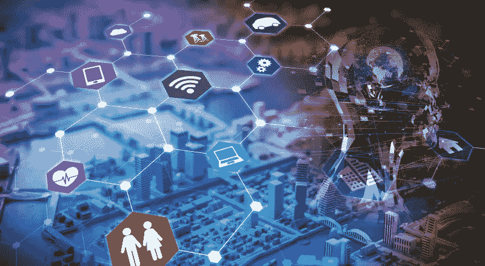

# 物联网需要人工智能才能成功吗？

> 原文：<https://medium.com/swlh/will-iot-require-artificial-intelligence-to-succeed-663384c11257>

即使你来自非技术领域，这些东西也是有意义的。

不，不要误解我们，一切都是在某种程度上与技术有关，但在这里，我们试图在这篇文章的帮助下传达一些不同的东西。

好吧，把这个放一边；你是 PUBG 的粉丝吗，PlayerUnknown 的战地游戏？你玩了几次？无数，我们猜测。

根据这篇 TechCrunch 的帖子，PUBG 与 **Minkonet** 联手实现了一个 3D 回放功能，该功能吸引了很多玩家，每天被使用超过 900 万次。现在，你可能想知道这是为什么？这是因为 Minkonet 正致力于利用**人工智能(AI)** 来自动化创建卷轴和构建反作弊人工智能算法的过程。

人工智能是一种展示智能的方式，不是人类的智能，而是机器的智能。它有时被称为机器智能，可以产生类似人类的智能代理来执行任务。

> 根据一份 Statista 报告，2018 年，全球人工智能市场预计价值约为 73.5 亿美元。

同样，不出我们所料，物联网也吸引了人们的注意力，无论是技术人员还是非技术人员。它吸引了许多人，让他们思考未来的概念，如物联网驱动的家庭(在我们的语言中，智能家居)，以及许多其他行业特定的场景。

> **到 2020 年，物联网设备将达到 300 亿台。
> 预计到 2020 年，物联网的全球市场价值将达到 1.7 万亿美元。
> –维基百科**

这仅仅意味着技术、物联网和人工智能的发展将影响大多数交易、行为和结构。那么，我们为什么要讨论 AI 和 IoT 呢？

你真的需要知道这些技术概念吗？

是的，因为这些技术将通过自动化、智能化和高效的实践改变行业格局。

***不，我们不打算讨论各自的优缺点，保持冷静，继续阅读，因为它肯定会让你朝着人工智能和物联网的结合方向思考，至少。***

让我们开始吧:

# AI(人工智能)能做什么？

*   人工智能算法可以自我学习
*   理解人类语言
*   光学字符识别
*   计算机网络中的智能路由
*   开车
*   语音识别、面部识别和对象识别
*   自然语言处理
*   让机器以智能的方式工作

## AI 可以用在哪里？

*   军事和国防
*   卫生保健
*   财经
*   广告
*   汽车工业
*   生产
*   审计
*   博彩业

## 我们对“智能家居”这个术语了解多少？是‘物联网(IoT)吗？

你没听错，但是物联网还有更多应用可以用来实现整个行业的自动化，例如制造业、基础设施、环境监测、医疗保健、家庭自动化、能源管理、农业等等。

# IoT 是什么？

最简单地说，物联网就是将你的电器、车辆、设备、基础设施和机器与软件、传感器、电子系统和执行器连接起来，以交换数据。

物联网形成一个互联的环境，以便收集或交换数据，然后使用人工智能、机器学习或分析将数据转化为价值。如果我们谈论目前的情况，物联网正在被用于*可穿戴设备、交通、商业建筑、农业、智能城市、家庭以及广泛的制造业。*

## 沃达丰发布了关于物联网的完整报告(2017/18 ),以下是一些令人兴奋的数字:

*   74%的人认为没有物联网就不可能实现数字化转型。
*   84%的企业(无论大小)开始采用物联网，并且这一数字还在增长。
*   95%的采用者通过在其组织中部署物联网获得了实实在在的好处。
*   53%的采纳者报告 2017 年物联网的投资回报率显著提高。
*   67%的人认为物联网项目对他们的业务至关重要。

## 还有呢？

> **82%的采纳者同意“物联网不是一项独立的技术；它与分析、人工智能和其他认知数字解决方案相关联。”**

***而这正是文章的核心所在:物联网与人工智能的结合。***

在我们深入了解这一革命性技术组合的细节之前，先看看一些由人工智能驱动的物联网初创公司 **。**

# 支持人工智能的物联网能让你的生活更轻松吗？

它可以，但现实世界中的问题和限制会削弱人工智能或物联网的力量。

*存在技术限制、文化障碍、缺乏适当的实施、技术范围不明确、组织障碍、机器无法解决若干问题，以及与这些技术的模型相关的其他哲学问题。*

关于这些问题还有更多要讨论的，但尽管有现实世界的挑战要解决，世界正在走向自动化和人工智能。

# 为什么只有 IoT 不行？

> 到 2020 年，地球上每个人每秒将产生大约 1.7 兆字节的数据。
> 
> 令人惊讶的事实是，99.5%的数字数据从未被评估过。

是的，现在怎么办？数据量和复杂性与日俱增，这就是人工智能需要发挥重要作用的地方。

人工智能有潜力推动物联网驱动的计划的主要原因是它能够从海量数据中获取洞察力。在这个数据驱动的世界里，这确实是有意义的。

它提供建议、见解、预测和解决方案:人工智能可以在几分钟内分析大量数据，并生成有意义的结果。

**实时快速响应**:为了决定未来的行动方针，AI 在与物联网设备连接时能够进行实时处理和响应。

# 企业如何利用人工智能和物联网的结合？

以下是一些需要考虑的要点:

*   人工智能和物联网可以创建更具适应性的学习和分析系统，帮助企业收集见解
*   它以更好的方式促进了同步、通信和集成
*   它通知企业为了跟上变化需要采取的主动行动
*   人工智能支持的物联网系统是智能的、自我学习的，能够建立高度认知的企业
*   自动化整个组织的流程并建立高度协作的氛围
*   提高生产力、性能和维护活动

世界各地的大规模组织已经接受了这种协同作用，使他们的业务更上一层楼。此外，人工智能将对人们如何在工作中被雇用以及他们拥有什么技能产生深远的影响，以便在这个机器驱动的自动化工作环境中产生更好的结果。

人工智能成为物联网的先决条件，因为我们不能只利用机器生成的数据做任何事情。应该有一种机制来高速分析、收集、处理大量数据，并从中获得深刻见解。

这完全是关于我们的系统如何智能地工作。

***为了在你的组织中激活一套新的能力和职能，使之成为成功的秘诀，你必须同等地考虑这两种技术。***

我们在这里提供必要的见解，如果有效实施数字生态系统，这些见解真的真的可以将您的业务提升到一个新的水平。如果您和我们一样对促进您的业务增长感兴趣，我们很乐意为您提供帮助！

不，我们不这样做。如果你有任何突破性的想法来利用物联网和人工智能，你可以告诉我们，并利用我们作为创业技术合作伙伴的专业知识。有许多资金充足的 AI 初创公司使用机器学习来自动化数据处理需求。创业公司正在利用这种结合来重新定义个人对过程、执行及其结果的看法。在[spec-india.com](https://www.spec-india.com/)上与我们分享您的想法，获取报价，看看我们如何从产品概念化到端到端部署和支持提供帮助。

***享受过吗？敬请关注更多内容。***

## 这篇文章发表在 [The Startup](https://medium.com/swlh) 上，这是 Medium 最大的创业刊物，拥有+366，567 名读者。

## 订阅接收[我们的头条新闻](http://growthsupply.com/the-startup-newsletter/)。

