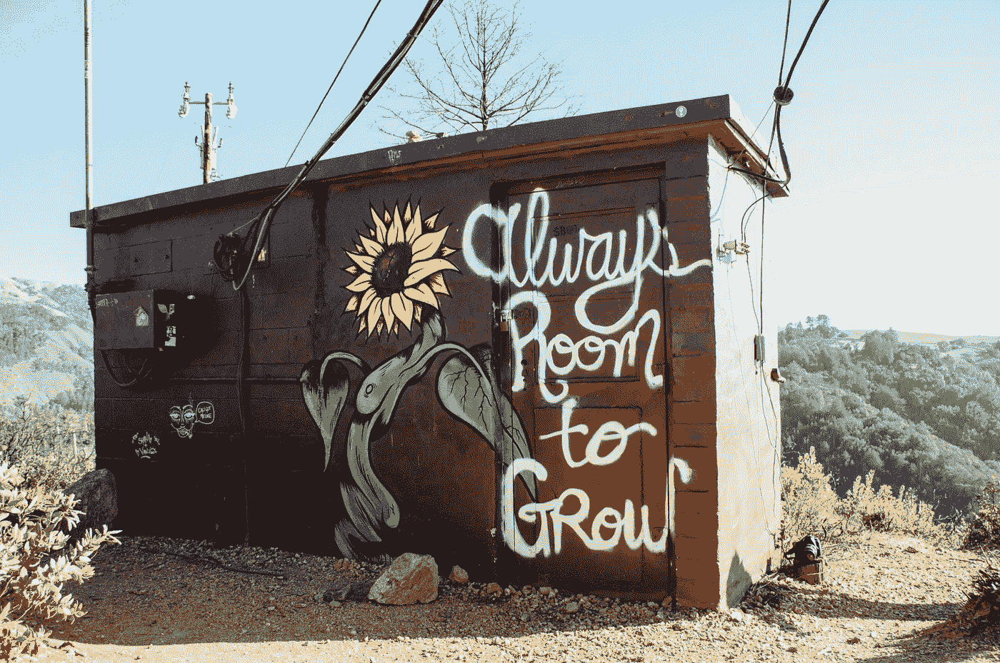

# 我的决定和行动会有好处吗？

> 原文：<https://medium.com/swlh/will-my-decison-and-action-do-good-fac08c8596d2>

如果每个人都问这个问题并就此采取行动，我们的世界会更好

Photo by [Kyle Glenn](https://unsplash.com/photos/-f8ssjFhD1k?utm_source=unsplash&utm_medium=referral&utm_content=creditCopyText) on [Unsplash](https://unsplash.com/collections/2226345/inspiring?utm_source=unsplash&utm_medium=referral&utm_content=creditCopyText)

每天，我们醒来都会听到更多关于破坏、犯罪、损失、歧视、痛苦、苦难、种族主义、仇恨言论以及几乎每一种可能发生的有害人类活动的消息。

我们的媒体存在于新闻中——我们对信息、新闻生成和轰动新闻的渴望。此外…