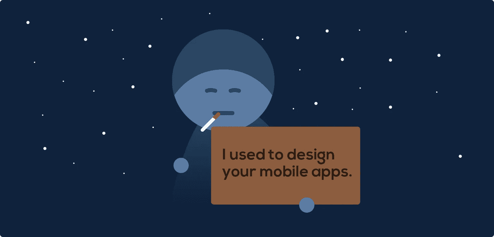

# UI 设计师会很快失业吗？

> 原文：<https://medium.com/swlh/will-ui-designers-be-unemployed-soon-edaffe9e5f1b>

## 2015 年可能是历史上成为一名 UI 设计师的最好时机，但如果你是一名 UI 设计师，那么可能是时候开始考虑你的下一步了。

2007 年第一代 iPhone 问世时，对 UI 设计师的需求暴涨。每个团队都需要有人来设计最热门的外形应用。大量的对话可能围绕着创建一个逼真的木制书架，使某个应用程序看起来就像真正的家具一样。

但是随着岁月的流逝，世界变得越来越平坦和简单，这变得非常清楚——所有设计师需要做的就是遵循规则。规则非常简单:

1.  靠[接吻原则](https://en.wikipedia.org/wiki/KISS_principle)生活
2.  坚持品牌指导方针
3.  确保不要拧紧 UX

这些都做对了吗？干得好！你可以在硅谷的顶级科技公司做 UI 设计师，赚很多钱。

但是等等，就一件事……**如果这些是你唯一做的事情，那我们为什么需要你呢？**我的意思是，有人已经为整个产品做了 UX，我们的设计团队的“组件”库中已经准备好了任何应用的所有组件。我们只需要替换一些图标(我们将从图标集中取出)和按钮文本，就可以了。

好吧，我告诉你我作为一个 UI 设计师的观点:

**你最好开始考虑新的方向，否则你会失业的。**

我说的新方向并不是指把圆形按钮改成方形按钮，因为方形按钮已经被其他设计师设计了几百万次了。是的，即使你原来的紫蓝色品牌的颜色。为了保持相关性，你还可以做其他事情。

世界正在改变。

我们看到越来越多的产品属于物联网、虚拟现实、增强现实、可穿戴设备和其他类别。每一个新产品对开发者来说都是一个新的工作机会，对设计师来说也是如此。不一定是 UI 设计师。

你需要考虑的是，你目前的技能如何让他们受益，你缺少哪些技能才能真正让他们受益。让他们受益于**“我的天啊，我们非常需要你，你想要什么我们都会付给你的”**。毕竟，他们可能刚刚从谷歌和其他人那里筹集了 5 . 42 亿美元，他们必须拿出惊人的东西，否则他们很快就需要面对一些愤怒的投资者。

所以，让我们来看看好消息:**如果你已经理解了 UI 设计，你将更容易提高自己的技能。**你可能已经和许多设计分支学科的专家一起工作过，你已经知道他们在做什么。

所以如果你想保住你的 UI 设计工作，即使在我所说的天启之后，你应该开始重新思考你的方向。

## 1.用户体验

作为一名用户界面设计师，[无论你喜欢与否，你已经在负责用户体验](/@arielverber/why-every-member-in-your-team-is-a-ux-designer-2bd470ea048e)，所以你最好擅长这个。每个公司都需要了解用户需求并将其转化为有意义的产品见解的人。**来自设计界的 UX 专家是一笔宝贵的财富。**

## 2.交互设计

到目前为止，我们与电脑互动的方式是相当标准的，但许多公司都在试图改变它，并多次获得成功。想想不同触摸屏、可穿戴设备、虚拟现实眼镜甚至网络中的交互。在接下来的几年里，作为一名交互设计师，意味着你有巨大的机会**改变人们与技术互动的方式。**

## 3.软件开发

这个世界不需要另一个“设计师应该编码吗？”文章，但我会这么说:**如果你会编码——这很神奇**，你不仅可以把你的想法可视化，还可以完全靠自己构建。你可以用设计师和编码员的母语和他们交流，成为每个公司的巨大财富。

## 4.说明

随着时间的推移，我注意到世界上最好的设计团队，如 Mailchimp、谷歌和脸书，越来越关注插图。**插图是一个品牌用强烈的视觉信息来支持自己的惊人方式。品牌不是即将消失的东西。**

## 5.3D 设计

我试了几次 Oculus Rift。每次我这样做的时候，我都会大笑，大叫，甚至差点哭出来。这让我相信虚拟和增强现实在未来几年会非常大。公司希望在那里生存，这意味着他们需要一个可以设计虚拟世界的团队。如果你有很强的视觉感知能力，可以**进入 3D 设计，做虚拟世界的神**。无论你设计什么，想想住在里面的数百万人。

我提到的每一件事都值得单独写一篇文章。显然，你并不需要所有这些，但如果这些都不能让你感兴趣，你应该开始考虑你职业生涯的新方向。或许可以考虑转做家居内饰什么的。因为即使 10 年后，人们可能还会继续建造房屋，但我不确定许多人还会如此关注界面的外观。

因此，我们今天用来解决的问题变得更容易解决，然而，新的问题出现了。它们要大得多，需要一些真正有才华、有创造力的人来照顾它们。

你们可以成为这些有创造力的人。

发表于*[**# SWLH**](https://medium.com/swlh)**(***创业、流浪、生活黑客)**

******