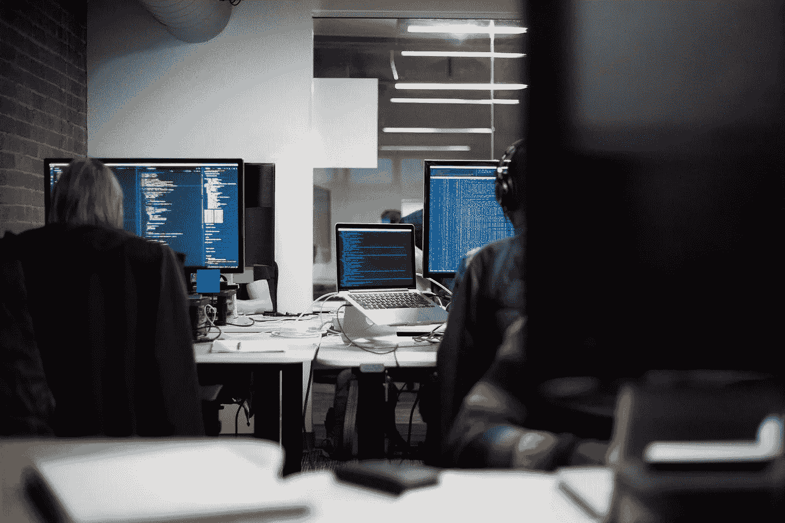

# 我们会用大数据解决大问题吗？为什么新兴技术正处于十字路口

> 原文：<https://medium.com/swlh/will-we-use-big-data-to-solve-big-problems-why-emerging-technology-is-at-a-crossroads-62885eecf3ab>

Originally published on [**GrowthBot**](https://www.growthbot.org/)

几天前，我和女朋友就咖啡因进行了一场辩论(姑且称之为讨论)。

我听说它会降低你的食欲。她不同意，说咖啡因实际上增加了我们洗劫冰箱的欲望。

谁是对的？

这不仅取决于你问谁，还取决于如何问。

这听起来是显而易见的，但是你使用谷歌搜索的方式会直接影响你的搜索结果。

像“咖啡因会增加食欲吗”这样的问题会增加咖啡因和饥饿之间的联系。如果包含“减少”或“抑制”这样的词，情况正好相反。

键入“咖啡因如何影响食欲”或“咖啡因和食欲”是你揭开真相的最好机会——或者至少是大多数研究人员现在理解为正确的。

我们的对话强调了一个事实，即搜索引擎是不客观的。它们是为人类使用而设计的工具，人们总是受到他们自己的信仰、偏见和经历的影响。

很容易看出我们的世界观如何影响我们熟悉的工具，如搜索引擎，但当我们看新兴技术时，这种联系变得更棘手，也更重要。

人工智能(AI)和机器学习现在已经赋予普通公民(即那些不一定富裕或强大的人)在很大程度上影响人们心灵和思想的不成比例的能力。

我们正处于历史的关键时刻，我们可以集体选择利用这项技术做好事，或者利用人们的偏见和信仰体系。

# 一系列机会

这是数据科学和机器学习的早期。随着个人和组织开始尝试新兴技术，出现了各种各样的应用。

在光谱的一端(姑且称之为极右)，有 2016 年美国大选。近两年后，[我们仍在学习](https://www.nytimes.com/2018/03/17/us/politics/cambridge-analytica-trump-campaign.html)川普竞选团队如何利用心理特征来激励选民。

分析海量数据集使川普的团队能够制作有针对性的脸书广告，强化一些选民的政治和文化信仰。许多人认为这是对日益强大的技术的滥用。

像 [DataKind](http://www.datakind.org/about) 这样的群体生活在连续体的另一端。这个数据科学社区与社会变革组织合作，应对教育、贫困、健康、人权、城市和环境等方面的挑战。

大多数应用程序都处于中间位置。公司正在学习如何使用数据和机器学习来获取资本收益。

这不一定是件坏事。毕竟，大多数公司都有动机尽可能多赚钱，为员工、利益相关者和/或创始人服务。

当公司使用社交平台追求弱势人群时，数据支持的资本主义感觉更黑暗；散播不快。

我们一直都有广告，但我们在网上遇到的利基目标和庞大的数据量正在扼杀我们的注意力。这也助长了对即时满足的需求。

我领导着 HubSpot 团队，该团队正在开发一款用于营销和销售的聊天机器人。如你所知，机器人是一种自动化的计算机程序，旨在模拟与人类用户的对话。

它使用 AI(一种可以执行通常需要人类智能的任务的计算机系统)来处理数据。GrowthBot 集成了十几个系统和 API，帮助人们以更少的分心完成更多的工作。

我们在用 GrowthBot 赚钱吗？是的。HubSpot 是一家营利性企业。与此同时，我们正在开发这项技术来帮助人们重新获得注意力。

每个人都被噪音和数据淹没了。我们的机器人在幕后工作，进行研究、连接账户、提取文件和执行常规任务，因此用户体验到了[难以捉摸的心流状态](https://blog.growthbot.org/how-bots-can-help-us-win-the-battle-against-distraction)。

# 对大数据的抵制

随着技术的飞跃发展，对机器学习的抵制越来越强烈。有些人认为人工智能将是人类的毁灭。其他人担心[它会取代他们的工作。](https://blog.growthbot.org/what-does-a-future-with-no-jobs-look-like)

我明白。我们都看到了从汽车制造到娱乐业的技术革新。

然而，人和机器之间有着本质的区别。

计算机擅长处理、储存和解释数据和信息。

人类有独特的能力来发展洞察力，审查数据，决定下一步，并创造性地思考。

计算机不可能有“啊哈”时刻或提出见解，就像人类将永远难以存储和处理大量数据一样。

我们可以对人工智能和算法做出同样的区分。如果你担心它们如何影响行为，让我们澄清一个常见的误解:单靠技术不能改变人们的心灵和思想。

相反，它让有动机的团体(如特朗普竞选团队)能够识别并潜在地利用我们的偏见。我们在网上分享、搜索、喜欢和发布的一切，都为我们是谁和我们相信什么建立了一个全面的轮廓。

结合我们的社交图——我们创造和培育的在线网络——数据科学可以对我们最深层的心理做出惊人准确的结论。

例如，数据科学家可以根据他们对全国步枪协会(NRA)的支持(以很高的准确度)预测某人是否相信气候变化。

# 如何才能让机器学习变得更聪明？

正如我前面所说，我们已经到达了一个重要的十字路口。我们会使用新技术来改善每个人的生活，还是推动有权势的人和组织的议程？

我当然希望是前者。我们中很少有人会竞选总统或领导一个社交媒体帝国，但我们都可以帮助推动事态发展。

## 用批判的眼光消费信息

大多数人不会停止使用脸书、谷歌或社交媒体平台，所以保持适度的怀疑。记住互联网永远不可能是客观的。提出问题，得出自己的结论。

## 从专业记者那里获得头条新闻

寻找可靠的渠道来报道当地、国家和世界事件。我依赖纽约时报和华尔街日报。你可以选择自己的来源，但不要相信你的玛姬阿姨刚刚在脸书上发布的“文章”是合法的。

## 用开放式问题搜索

研究人员发现，咖啡因通常不会增加饥饿感。我的女朋友通常是对的，但我想这次辩论轮到我赢了。一句话:尽可能客观地使用互联网。使用中性词和开放式问题。不要鼓励你的语言带有偏见的链接。

## 教育孩子关于网络的主观性

在线素养越来越重要。所有年龄段的孩子(甚至许多高年级学生)都需要了解如何进行开放式搜索，如何审查信息来源，以及如何更批判性地思考他们在网上看到的内容。

## 超越利润思考

也许你是一个试图将机器学习、机器人或大数据集成到你的产品中的企业主。或者，你是一个积极与人工智能合作的技术创始人。无论是哪种情况，你都有机会帮助我们使新技术更加道德、公平和高效。

看文本分析软件。我们可以利用这项技术来分析古代历史，了解人类是如何进化的。相反，我们试图纠正语法编辑和建议销售文案，将浏览者转化为购买者。

显然，这些应用程序没有任何问题。他们可能不会伤害任何人。然而，他们可以推动我们的世界前进。文本分析可能有助于破解棘手社会挑战的密码。

如果你有机会增加价值，丰富生活，那就让它发生吧。尽你所能利用数据做好事。

# 我们都在一起

请知道，我不是在给我自己或我的公司一张通行证。我知道生长机器人不能治愈癌症。但是，我们正在努力帮助人们集中精力，完成更多工作，实现他们自己的天赋。

例如，如果我们能够帮助一名癌症研究人员深入研究他们的工作并发现新的见解，那么我们就实现了我们的目标。

人工智能和机器学习仍处于初级阶段。这就是为什么这一刻如此关键。我们都可以影响新技术的发展。我们可以管理自己的消费，并游说将大数据用于建设性的追求。

尽你所能地学习，观察政治、商业和你自己的势力范围内发生的事情。保持消息灵通。我知道很容易感到不知所措或幻灭，但我们负担不起退房。我们需要你的声音。我们需要你的想法。

*最初发表于*[*【blog.growthbot.org】*](https://blog.growthbot.org/will-we-use-big-data-to-solve-big-problems-why-emerging-technology-is-at-a-crossroads)*。*

感谢阅读。

> 如果你喜欢这篇文章，请随意点击那个按钮👏帮助其他人找到它。

.