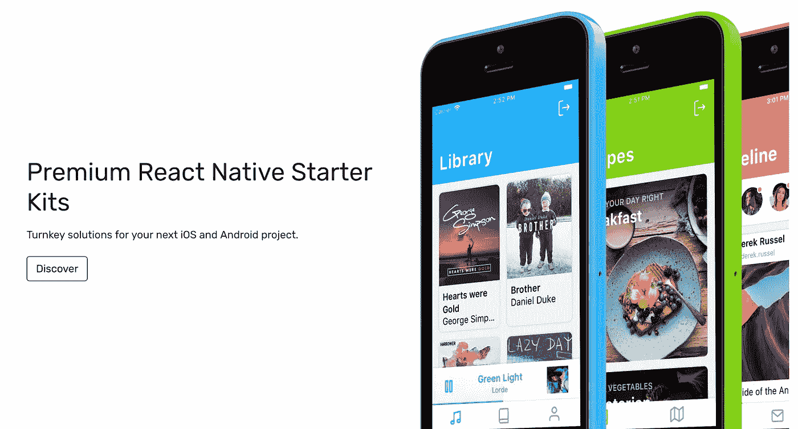

# 威廉·坎迪隆谈透明度、目标市场和开发商创业

> 原文：<https://medium.com/swlh/william-candillon-on-transparency-target-markets-and-developers-building-businesses-5420cbb5fede>

*本文首发于我的简讯* [*查询*](https://www.jrdnbwmn.com/query/) *。每周，我都会向一家成功企业的创始人提出三个问题。*

威廉·坎迪隆是一名来自法国的 31 岁软件工程师。他在休假期间开发了 [React Native Starter Kits](https://react-native.shop/) ，现在有 [repos](https://github.com/wcandillon) 、[编写](/@wcandillon)和[以 React Native 开发为中心的视频](https://www.youtube.com/channel/UC806fwFWpiLQV5y-qifzHnA)。威廉目前居住在美丽的瑞士苏黎世。

## 你很喜欢透明。透明有什么好处？

在 React 本地初学者工具包的例子中，透明性在两个方面有所帮助。它使我能够在对产品投入大量工作之前验证产品/市场的适合性。一旦产品准备就绪，透明度帮助客户更好地了解他们正在购买的东西，以及更好的支持。

从一开始，我就与社区分享了我的计划。我构建了一个包含成品截图的登录页面，尽管还没有编写一行代码。人们可以留下他们的电子邮件，如果他们有兴趣在工具包准备好的时候得到它。这个登陆页面链接到了我在 React Native 上的媒体故事。

在那之后，当这个产品势头越来越猛时，我开始在 YouTube 上现场编写初学者工具包。这不仅是一个令人愉快的过程，而且来自社区的反馈也很好，这真的让潜在客户了解了他们会购买什么。它还极大地帮助了客户支持。许多问题都可以通过指向正确的 YouTube 视频来回答。

## 你是如何找到你的目标市场的？

React Native app 的市场已经存在: [NativeBase 市场](https://market.nativebase.io/)。这非常方便，因为建立自己的销售渠道需要时间。如今，一半的销售是直接完成的，但却花了好几个月才达到这个结果。因此，拥有一个现有的产品市场是非常有价值的。

React Native 社区的规模很大，但是在这些初学者工具包中有很多不信任，这是应该的！😅社区中的初学者可能没有足够的知识来理解这些工具包所提供的价值，而那些足够高级来理解这些价值的人可能会考虑自己动手，只是因为这样做很有趣。所以这个大社区里的目标细分人群比较小。

## 作为一名试图创业的开发者，你经历过哪些独特的挑战和优势？

作为一名开发人员，我专注于代码质量，试图尽可能减少技术债务，并尽可能交付最好的产品。这种对优秀软件工程的热爱的负面影响是产品的其他方面，如在线营销被忽视了。

开发人员总是希望构建很酷的东西，并在其上不断改进。但是有了 React 原生初学者工具包，我现在清楚了，有时商业数据应该驱动这个过程。

注册我的时事通讯查询，每周我都会向一个成功企业的创始人提出三个问题。

*想获得更多这样的采访，* [*订阅查询快讯*](https://www.jrdnbwmn.com/query) *。*

## 这篇文章发表在 [The Startup](https://medium.com/swlh) 上，这是 Medium 最大的创业刊物，有 319，283+人关注。

## 在这里订阅接收[我们的头条新闻](http://growthsupply.com/the-startup-newsletter/)。

