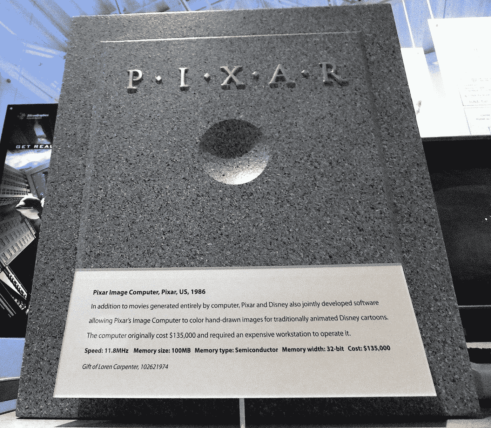

# 赌小赢大

> 原文：<https://medium.com/swlh/win-bigger-by-betting-smaller-84ad640d37f7>

职业算牌人、克里斯·洛克和皮克斯有什么共同点？

> 他们都有一个在下大注之前先下小注的成功过程。

通过“小赌注”消除不确定性的风险看起来像是一种直觉策略——然而，在实践中，我已经多次看到这种策略失败。情绪会碍事。

这种情况发生在我和我的一些朋友身上。在这篇文章中，我将反思我作为一个游戏工作室的创始人所犯的错误，并看看抑制情绪和在这 5 个常见的商业功能中应用小赌注的方法:

1.  招聘
2.  促进
3.  补偿
4.  品牌宣传
5.  产品开发

1986 年，皮克斯公司以每台 1.35 万美元的价格出售皮克斯图像电脑。特效合同和定制硬件是该公司当时的主要业务。1988 年，皮克斯打了个小赌，制作了一部名为*铁皮玩具的五分钟动画短片。*这部电影赢得了奥斯卡奖，为皮克斯在长片 CGI 电影上投入了更大的赌注铺平了道路。所有人都知道那是怎么回事。:)

克里斯·洛克将小赌注的做法推进得更远。他不是一次只测试一两个小赌注，而是在全国范围内推广他的材料之前，在小的地方单口相声场所测试几十个甚至几百个新笑话。这种方法并没有什么迷人之处，但它很有效，它确保了只有“赢家”才能进入摇滚的最终套路。

# **那么，是什么使得*小额赌注*在实践中如此难以实施呢？**

乐观。自信。兴奋。同理心。这些都是每个创始人都应该想要拥有和利用的积极情绪，尤其是当涉及到[做出重要决策](/@paley/celebrate-the-slow-decisions-312f53283b9)的时候——对吗？

不完全是。

# 情绪往往会迫使创始人过早下大赌注。

作为一名创始人，我亲眼目睹了无节制的自信或激情是如何欺骗人们仓促做出重要决定并犯下错误的。以下是我个人犯过的一系列重大错误，也是我见过其他人犯的错误:

# **大赌注错误 1:太快进行大规模雇佣**

许多人都经历过这种情况——我知道我经历过。面试完一位出色的候选人后，你感到一阵兴奋。他们在书面上看起来很可靠——有着被证明的记录和有价值的技能——所以你马上就雇佣他们。

*   问题:这可能是创始人最常犯的仓促错误。原因与广泛的潜在未知因素有关:有问题的雇佣可能被用于更大的团队，他们可能需要广泛的支持才能有效，或者他们的专业知识可能只适用于不同类型的公司。

不要马上雇佣这个人，你可以用以下方式来代替这个大赌注:

*   **小赌注选择** —咨询工作:让他们做顾问，或者兼职雇佣他们来帮你解决最困难的问题。观察他们的表现，以及他们与团队成员的互动情况。这将让你有更多的时间来衡量他们如何与队友互动并融入文化——洞察力面试和测试并不总是能提供。我们在我的游戏创业公司和我们的许多员工一起这样做了——从 3D 建模师到工程领导。
*   **小赌注选项**——付费试用期:雇佣双方同意的 90 天试用期，在此期间，他们以较低的费率开始，如果试用期通过，他们将获得加薪和潜在的奖金。

# **大错特错之二:提拔某人太快**

当你的团队中有人完成了伟大的工作，或者当有人作为个人贡献者(IC)不断地贬低它时，你会感受到很多积极的情绪。因此，你可能想奖励他们一个责任更大的更重要的角色——一个他们可能还没有准备好的角色。

*   问题:这种仓促的决定经常发生在员工直接要求升职的时候。如果他们是 IC，你会感到有压力去满足这些要求。然而，过快提升某人的问题是，他们可能会成为一个糟糕的经理。这意味着你最终会有一个糟糕的经理，还会“失去”你的一个顶级贡献者——他现在被迫在贡献和管理之间分配时间。

您可以尝试一种解决方案，而不是立即推广它们，比如:

*   **小赌注选项** —特性所有者:让 IC 成为一个特性所有者，暂时拥有一个大型流程或服务的一个小组件，并观察它们的沟通和执行情况。
*   **小赌注选项**——延迟头衔:先发制人地让 IC 知道你在考虑给他们升职，但希望他们开始处理没有头衔的职责。在两到三个月的时间里，每周进行检查，只是为了看看他们做得如何，并提醒他们如果事情进展顺利，他们将获得头衔——如果没有，你将指导他们，并在未来重新考虑。

# **大错特错#3:过早提供高薪、奖金或加薪**

这是当你想给一个优秀的员工或吸引新的潜在客户一大笔奖金或薪水的时候。

*   问题:看，科技行业的劳动力市场竞争非常激烈，很难找到并留住优秀人才，尤其是在旧金山湾区。这就是为什么向人们砸钱试图留住或招募他们是如此诱人。当然，问题是给某人加薪的好处是暂时的:当人们获得大幅加薪时，他们会在几个月内感觉良好，充满动力，但随后很快就习惯了新的现状。

相反，请尝试:

*   **小赌注选项**——里程碑式现金奖金:为新员工提供较低的基本工资，但与实现特定目标、里程碑或指标的现金奖金挂钩。这有助于激励整体绩效，并帮助高绩效者进行自我选择。华尔街在吸引顶级人才方面非常擅长使用自由支配的现金奖金，越来越多的科技公司(如中国的腾讯)也采取了类似的做法。
*   **小赌注选项**——里程碑股权奖金:提供与明确定义的里程碑相关的股权奖金，而不是基于连续归属的结构。
*   **小赌注选项**——奖金/加薪讨论日历:设定一个非常清晰的时间表，说明奖金/加薪讨论将在何时进行，这样就可以消除情感因素。

# **大错特错#4:宣传未经测试的品牌**

我称之为“必应问题”，这是我在微软工作时亲眼所见。这是当你开始向一个你个人相信的新产品、品牌或营销活动投入大量资金，但你不知道会成功，因为你没有做任何“小赌注”研究来确定你的受众将如何反应。

*   **问题**:看多了。一个创始人想出一个新的名字、标志或外观，他们只是*确信*会成功——然后他们就一头扎进去。这里的问题是，大多数时候，你最终得到的是一个中庸的品牌，它存在定位问题，转化率低，营销承诺和实际交付的产品之间有太多的脱节，以及没有共鸣或感觉不真实的信息。

在这种情况下，一些最好的小赌注解决方案是:

*   **小赌注选项** —测试营销与广告的契合度:针对不同的名称、徽标和视觉风格投放定向广告，并衡量谁在点击什么——哪些兴趣群体、人口统计数据等。在这篇关于[获得有价值的反馈](https://theascent.pub/heres-the-easiest-way-to-get-the-best-customer-feedback-b9d6a94adf58)的文章中，我将谈论我们如何在游戏行业进行这类测试，从应用图标到游戏本身的名称。
*   **小赌注选项** —慢慢增加:慢慢增加你的支出*以确保你的信息符合你的产品所能提供的。不这么做的公司痛苦地认识到了后果。问问冰就知道了。当微软推出必应时，它展开了一场声势浩大的营销活动，以至于几乎每个美国人都尝试了这个新的搜索引擎。一次。尽管该产品自发布以来已经有了很大的改进，但当时它并没有实现其作为“决策引擎”的大胆宣称。许多早期用户非常失望，以至于此后的营销支出都无法让他们回来。*

# ***大错特错 5:开发专有技术，而不是使用现成的工具***

*这是你从零开始在内部构建一切的时候，因为你相信这会给你带来竞争优势。如果你是一家资本有限的初创公司，你不能自信地说你的内部基础设施将是你公司最大的竞争优势，你应该优先考虑上市速度。*

*   *问题:这个问题困扰着科技公司，因为大多数公司都有很强的工程精神。事实上，虽然构建专有技术可能会给你带来优势，但在大多数公司的早期阶段，构建过程会耗费时间，让你慢下来。在早期，你的瓶颈很可能是销售/营销/分销方面，而不是技术方面。我们在 Dairy Free Games 犯了这个错误，在我们自己的游戏引擎和工具上花费了大量的精力，而我们本可以把这些时间花在社交系统和市场测试上。*

*要先小赌一把，请尝试:*

*   ***小赌注选项** —利用现有平台:基于提供集成的现有平台构建。在游戏中，Unity 是一个很好的例子。你获得的速度将超过几乎所有其他的缺点。*
*   ***小赌注选项**——使用现有工具:使用预制工具，而不是构建自己的工具，即使它们看起来很贵。对于分析，使用类似 MixPanel 的东西；对于客户信息，选择类似对讲机的东西。当你确切地知道你想要改进什么并且确实需要它们的时候，你总是可以在以后构建你自己的工具。*

*这是我自己或看到朋友犯的五个最常见的错误，但我肯定还有其他的。我也很想听听其他创业者的故事。*

*不过，希望这五条能为你提供一个起点，让你反思并确认自己在经营企业的过程中没有犯任何重大错误。*

**

## *这篇文章发表在 [The Startup](https://medium.com/swlh) 上，这是 Medium 最大的创业刊物，拥有+368，366 名读者。*

## *在这里订阅接收[我们的头条新闻](http://growthsupply.com/the-startup-newsletter/)。*

**