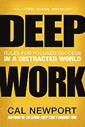
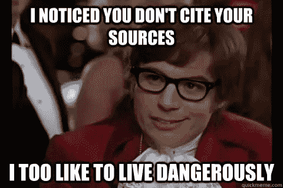

# 赢得早晨。赢得胜利。

> 原文：<https://medium.com/swlh/win-the-morning-win-the-day-80c9d6024441>

## 成功晨练的秘密。

寻求提高生产率是徒劳的。我们一点一点地将巨石推上山，只是偶尔会绊倒，失去对那块花岗岩的控制，然后被那该死的东西当场砸死。

是的，没错，我们直接走出大门，用我们怪异的，奇怪的类比走向栅栏。系好安全带，比利。

研究一致表明，如果你想最大化你的生产力，你必须利用常规的力量。今天我们要谈谈如何善用这种力量，让我们变得更有效率，而不仅仅是更忙。

> ***不要把忙碌误认为是生产力。***

我们中的很多人每天都在做一些非常平凡的事情。我们一次在收件箱里埋头数小时，误以为电子邮件，你知道，在某种程度上，让世界(以及你自己)变得更好。

剧透警告:*不是。*

电子邮件是我见过的最大的生产力障眼法之一。当然，毫无疑问，电子邮件有时是非常重要的，我不是说建议你轻点鼠标就毁掉你的雅虎账户。

但是要认识到有两种类型的工作要做:

# 浅层与深层

卡尔·纽波特写了一整本关于 [**深度工作**](http://amzn.to/2wxCZh5) 的书，我强烈推荐你去看看。

给一些快速和肮脏的工作定义:

肤浅的工作是那种你可以训练实习生去做的工作。那些邮件？是的，除了极少数例外，你可以在几周内训练某人来处理这些。

相比之下，深度工作是对认知要求很高的工作，需要长时间的极度专注。只有*你*有能力做增值工作。你在写的那本书？是啊。不能外包这种垃圾。除非你是詹姆斯·帕特森。

但如果你是詹姆斯·帕特森，你他妈的在这里做什么？真的吗？你今年不是有 52 本书要出版吗？去吧，吉米。饭桶。这里不再需要你了。

不管怎样？对你每天所做的工作进行客观的评估。扪心自问，这是浅功还是深功？如果答案很肤浅，那就把它推到日程中，直到你完成了当天的深层工作。

为什么？

**因为认知负荷，哟。**

认知负荷是一个心理学原理，与我们只能在工作记忆中发挥这么多能量这一事实有关。具体来说，你一次只能记住这么多东西。但是这个原则也可以扩展到决策和意志力，因为它们也像我们的工作记忆一样，有有限的储备。

没错。让我重复一遍:

> 你一天中可以使用的意志力是有限的。

这是科学。不要争辩。请上帝不要让我引用我的消息来源。现在是周二早上 5 点 32 分，这听起来是我目前能想象到的最糟糕的事情。

要知道你一天的意志力是有限的，因此，重要的是要合理安排你的时间，把你思维敏捷的全部力量集中在最重要的任务上。

你可以通过创建例程来做到这一点。嗯，事实上不是。你通过建立一个惯例来做到这一点…然后坚持下去。

# 创造日常生活

你在生活的某些方面做得越例行公事，你就有越多的精力、意志力和决策能力供你在追求高层次、认知繁重的任务时使用。

世界上已知的一些最成功的人已经利用了日常事务的力量。

> ***例子:史蒂夫·乔布斯几乎每天都穿同样的衣服，以节省他每天早上必须“决定”的精神负担。***

不管我们谈论的是你穿什么，吃什么，什么时候锻炼……围绕你一天中看似无关紧要的小任务建立常规将提高你的整体生产力，因为你现在浪费的时间和认知能量更少了，你不得不不断地做出决定。

我为 Medium 写了一整篇名为[决策的力量](/@OneLazyRobot/the-power-of-decision-74f0d8ca78d2)的文章，深入到你可以围绕其创建日常事务的三个领域。

即:*吃饭，睡觉，运动。*

# 赢得早晨，赢得一天。

尽管我患有严重的多动症，但我是一个相当有效率的人。这只能通过严格遵守日常生活来实现。现在，我不会用我一整天的进进出出来烦你(是的，我确实每天早上坐下来，用 15 分钟的时间来计划我的一天，因为我是个超级怪异的人)，但我会分享一点我早上的例行公事，希望你能为自己的生活收集一些有价值的东西。

早晨是创造的时间。至少对我来说是这样。这有很多原因，但实际上可以归结为:没有人醒着来分散我的注意力。而且，我的认知能力是前所未有的新鲜。

## **闹钟**

我在手机上设置了 5 个独立的闹钟。这降低了贪睡按钮的整体效果，这是一件小事，但足以让我的策略奏效。

第一号闹钟在 4:45 响。我很快就粉碎了那东西。

第二次警报在 4:50 向我昏昏沉沉的小脑开火。妈的，我不是刚买了最后一个吗？

警报系统在 5 点爆炸。现在，我或多或少地完全清醒了，并对自己遭受的这种折磨感到愤怒。即使我醒着，我还是会按小睡/取消键。

第四个闹钟在 5 点 10 分响起，现在我想，不管怎样，我都不在乎了。我醒着，但我仍然把头靠在枕头上，因为我知道我还有 5 分钟的放松时间。

最后的闹钟在 5:15 响起，在这一刻，我有将近 15 分钟的时间来准备，这是关键时刻。

这是我今天必须赢得的第一场战斗。也是最难的。

我提醒自己这个事实，然后我们在运动。

## **启动发动机**

咖啡时间。没有如果，和，或者但是。这列火车在 5:15 离开车站，在 5:15.02 停在咖啡机外面。我曾经在床边放了一个咖啡机，它会在 4:45 开始自动冲泡，这很好，因为它让我醒来时闻到新鲜的爪哇咖啡豆的香味，但这对于当时碰巧和我同床的人来说是一种残酷的折磨，所以我把咖啡机搬到了厨房。我是一个善良的灵魂。

## **电话**

哦，对了，顺便说一句，我睡觉的时候会把手机放在飞行模式下，这样就不会有人在我睡觉的时候打扰我了。我不需要那些脸书警报每五秒就响一次。

当咖啡准备好的时候，我重新连接到世界，只是为了确保我们可怕的总司令没有把我们带入第三次世界大战。你知道，因为在那种情况下，写一篇晨间例行的博客文章让位于打包汽车搬到加拿大。

## **查看社交媒体和财务**

不管是什么原因，在我检查我的存钱罐以确保我没有在晚上被抢劫之前，我不能在早上充分发挥我的智力。很奇怪，但让我安心，不要妄加评判。在这一点上，我通常啜饮我的咖啡，等待咖啡因发挥作用。

## **5:45 开始写**

没错，我已经浪费了将近 30 分钟的早上喝咖啡，上网，上厕所。但是我的引擎是柴油的，需要一个滴答来加速。喝完咖啡后(方便的标志是 5:40 准时去洗手间)，我准备坐下来，以过度戏剧化的训练蒙太奇方式敲打我的指关节，然后开始工作。

## **写到 7 点**

到了 7 点，我饿得要命，该休息了。我边听播客边去做几个鸡蛋，然后在 7:30 回到椅子上继续一个半小时的写作。

通常我在第一节课写小说，第二节写非小说/博客相关的东西。我发现像这样的分块任务更容易保持注意力和动力。

## **音频刺激**

就像之前逃避的一样，我有相当严重的多动症，如果给我一点机会，我的沙鼠大脑会不管微风吹向哪个方向都乱窜。为了尽量减少分心的机会，我总是戴着耳机工作。

不幸的是，我不是那种可以边写作边听音乐的人。我倾向于过分关注声音或乐器。相反，我听的是直接的白噪声。我最喜欢的曲目是 YouTube 上的一个 10 小时循环，过去 5 年来我一直依赖它。说真的。我喜欢它。

点击这里查看！

**感谢阅读！:)**

**你准备好释放你的全部潜力了吗？**

按照这个免费的电子邮件课程一步一步来，我会教你如何建立更牢固的关系，提高生产力，实现财务自由。

[**点击此处参加免费的 5 个势力范围电子邮件课程！**](http://www.thehyperfocusedmind.com/)

## 这个故事发表在 [The Startup](https://medium.com/swlh) 上，这是 Medium 最大的企业家出版物，拥有 288，884+人。

## 在此订阅接收[我们的头条新闻](http://growthsupply.com/the-startup-newsletter/)。

