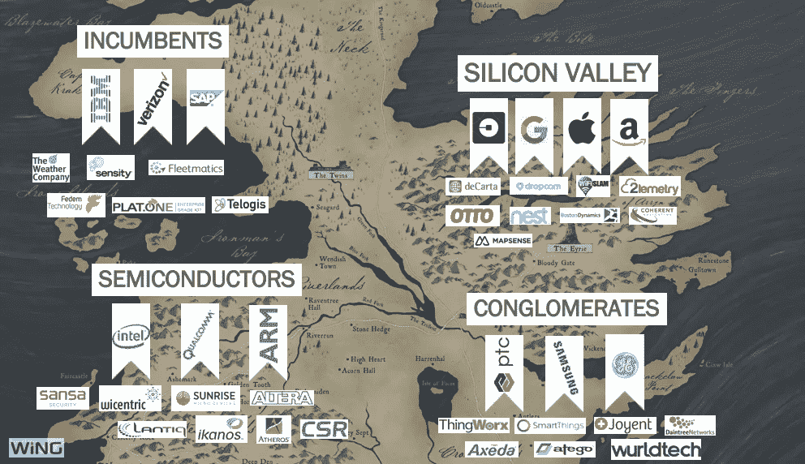

# Wing 的物联网初创公司国情咨文

> 原文：<https://medium.com/swlh/wings-iot-startup-state-of-the-union-79a37879b278>

每年，Wing 都会通过我们的物联网初创公司国情咨文调查物联网状况。我们这样做是为了了解头条新闻之外正在发生的事情，并与我们的社区分享这些见解。今年，我们在 2013 年至 2017 年间将数据集扩展至 3670 笔交易，涵盖 68 个物联网子类别。

以下是整个研究，或者继续读下去，快速浏览一下:

在最早的阶段，建造者还在建造。过去一年，GitHub 物联网回购数量翻了一番，这得益于更易访问的物联网基础设施、平台和设备。在 GitHub 的下游，我们的 Wingdex 显示交易稳步增长，投资金额大幅增加。随着早期物联网赢家的出现，这一美元飙升来自一波超过 2000 万美元的融资。Ubtech(机器人)、Auris Surgical(健康)、Ring(家庭)和 Mapbox(基础设施)都是这方面的例子。

在最高级别，我们跟踪商业、可穿戴设备、家庭、基础设施、无人机、机器人、健康和汽车/运输。今年，其中三个领域表现突出，交易数量大幅增加:商业、基础设施和汽车。汽车和基础设施领域的投资增幅最大。

我们的第一个惊喜是:面向消费者的物联网，如家庭、无人机和可穿戴设备，实际上在交易数量上正在下降，不像它们的商业兄弟。

这标志着技术的健康成熟，因为我们已经从业余爱好者应用程序进入核心业务应用程序。

我们发现，汽车吸引了最大的投资者兴趣，平均交易规模约为 2500 万美元，几乎是第二大类别*的三倍*。这个首都正在迎接最艰难的技术挑战:自动驾驶汽车。但在这背后，三场战斗正在进行。首先是中国和西方之间的战争，中国驱动的 32 亿美元资本只投资于 3 家公司:法拉第未来、Nio 和 LeEco。第二是汽车行业的守旧派和优步、谷歌和百度等技术驱动的挑战者之间的战斗。第三场战斗是关于交通本身的未来，因为我们重新想象它会是什么样子。虽然我们不能指望每年都有巨额交易，但随着这些战斗的结束，汽车行业在可预见的未来将会保持强劲。

下一个突出的领域是商业物联网:在交易数量上，它正在脱离所有其他类别。商业物联网的崛起是健康的，广泛分布于制造业、医疗保健、建筑和城市、物流、农业和其他类别。然而，一个重要的趋势是从地毯转向油毡、混凝土和泥土。

随着物联网服务于更恶劣的环境，针对重工业的交易比例在短短 5 年内从 48%增加到 65%。像 Actility(公用事业)、Geekplus(物流)和 Rethink Robotics(制造)这样的公司是这种转变的缩影。

物联网基础设施在 2017 年表现出强劲的增长，特别是在两个核心层:传感和连接。

我们正在超越从个人电脑和移动设备借用的技术，进入本地物联网基础设施。随着物联网覆盖范围和效率的提高，我们预计这一趋势将会继续。基础设施物联网领域的重要交易包括 Royole(传感)、Sigfox(连接)、Brain Corp(数据、分析和人工智能)和 Qadium(安全)。

物联网安全还是个问题。我们看到自动驾驶汽车安全性的最大差距。总体物联网安全有所进步，集中在网关和网络层。

鉴于物联网终端的广泛差异，这是有意义的。它还借鉴了前物联网时代的网络安全历史。我们预计未来几年将在设备、云和应用程序层面看到更多物联网安全。著名的物联网安全交易包括 Qadium、SparkCognition 和 Bastille Networks。

随着物联网初创公司投资的升温，收购也在升温，这是由四个核心阵营之间的战争驱动的:技术巨头(IBM 和 SAP)、硅谷(优步、谷歌和苹果)、半导体巨头(英特尔和高通)和企业集团(通用电气和 PTC)。2017 年，收购者收购了近 200 家公司，比前几年有所增加。

最后，在我们结束之前，先偷偷看一下我们正在做的事情:努力更好地理解物联网创始人。通过观察近 2000 名有才华的创始人，我们发现他们比其他类别的人受教育程度更高，行业经验也更多。基础设施创始人在创办公司前拥有 12 年的经验，相比之下，商业物联网初创公司的创始人需要 8 年，无人机公司的创始人不到 5 年。

我们正处于向物联网驱动的计算、数据和流量增加 10 倍的世界转变的过程中。我们称之为 IoT = IT X 10。在汽车等领域，我们只是看到了这些转变的开端，但影响将会更广泛，遍及许多行业。

随着我们完成这一转型，Wing 将继续调查当前和未来的初创企业物联网活动。

明年见。

[要了解更多见解，请查看 Wing 博客上的博文](http://wing.vc/blog/iot-startup-state-of-the-union-2017)。

## 这个故事发表在[的创业](https://medium.com/swlh)上，这是 Medium 最大的创业刊物，有 307，871+人关注。

## 订阅接收[我们的头条新闻](http://growthsupply.com/the-startup-newsletter/)。

