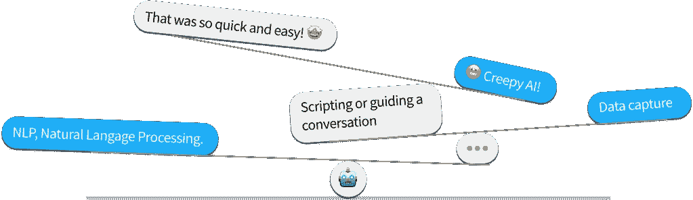
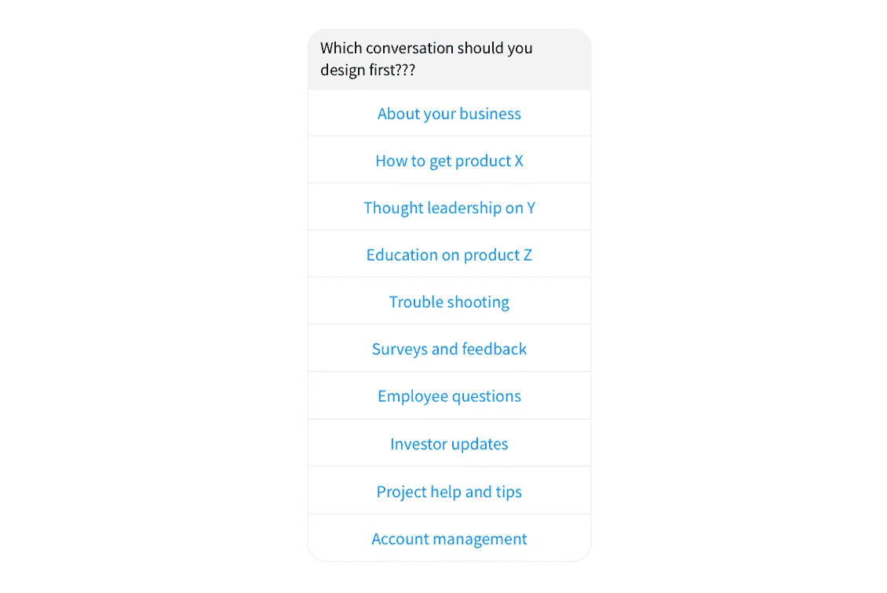
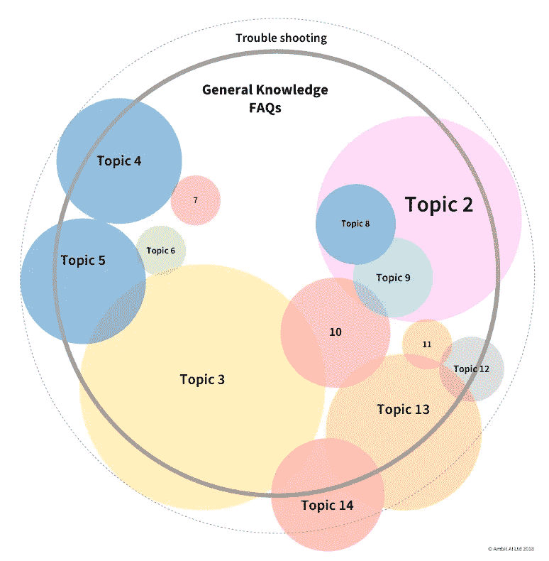
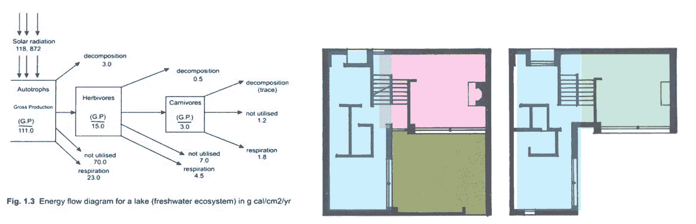
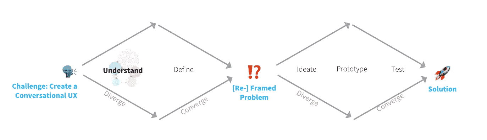
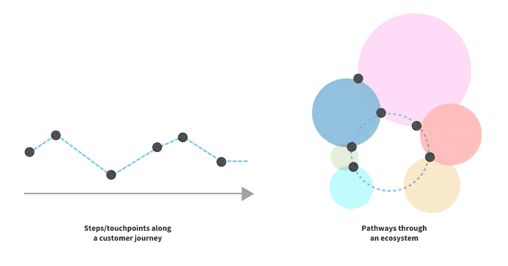

# 赢得对话:如何设计影响他人的对话

> 原文：<https://medium.com/swlh/winning-conversations-how-to-design-conversations-that-influence-people-d32b215c32b>

对话式用户体验(UX)需要做很多工作。这就是为什么许多人说“我像个孩子，还在学习”，同时努力在出生后几个月甚至几周内进行成人级别的对话。即使是基本的聊天也需要平衡 NLP 与脚本，简化完成任务的步骤，在适当的位置捕捉数据，并平衡人工智能和大数据的“爬行”因素。这个领域和规则都在快速发展，本文打算给你一些强有力的指导原则。

很多事情都可能出错(甚至有一个网站刚刚上线[聊天机器人就失败了](https://chatbot.fail/)！).设计师必须仔细考虑每一次对话——我们希望选择最有利的地方开始构建、测试和学习。

***但#1:先造哪个钻头？***

***How do you quickly get a view of all the possible conversations that any of your customers or employees might possibly need to have with your company?***

# 介绍—对话生态系统！

对话很复杂。他们漫步和编织，随机改变上下文，涵盖许多不同的方面和主题。在机器中复制这一点并不是一件容易的事情——这也是人工智能从“图灵测试”到现在花了 70 年时间的众多原因之一。

对话式生态系统图为您提供了客户和员工需要与您的组织交流的所有内容的高层次视图。我们创建了对话生态系统，以快速获得业务对话机会的整体视图，以及它们如何相互关联。

可视化的对话关系可以让你在开始设计聊天机器人时做出明智的决定。他们还可以帮助你更好地设计第一次对话，了解它需要链接到什么，或者人们接下来可能需要进行什么其他对话。例如，假设一个旅游聊天机器人有预订飞机票的话题。该主题中的主题仅仅是订票的方法。例如，从机器人获得推荐或搜索机器人以找到特定的目的地。一旦你有了这个计划，就很容易看到潜在的联系和附加值。

***但是#2:对话设计不应该是火箭科学！***

生态系统模型在科学中是用来理解生态学的，所以它不是火箭科学！设计师已经在多个行业使用它们来理解系统和场景。建筑也经常以这种方式表现。正如你需要设计一个房子，让人们可以以一种实用的方式在房间之间移动一样，你也可以使用生态系统图来帮助你以这种方式设计你的对话和内容。

但是#3:为什么不直接设计对话步骤呢！？

你的聊天机器人/对话 UX 是你生意的另一个窗口——人们会问它#allthethings。因此，如果不了解所有的对话是如何组合在一起的，你就无法从一开始就为自己的成功做好准备。“理解”是设计思维不断流行和实践过程的第一步。

> *“通过使用* [*的设计思维*](https://en.wikipedia.org/wiki/Design_thinking) *，你根据* [*未来客户真正想要的东西*](https://hbr.org/2008/06/design-thinking) *做出决策，而不是仅仅依靠历史数据或基于直觉而不是证据进行冒险的押注。”* [*视频*](https://www.ideou.com/pages/design-thinking#ldt) *。*

用生态系统的思维来理解各种转换之间的关系和联系，可以让你获得长期的成功。这些图表赋予你选择的权力；为每个主题设计一个轻松的接触(MVP ),专注于一个特定的领域，或者设计一条特定的路径。这使你能够更自信地设计最初的几次对话，以发展成更完整的 UX 对话。

另一种方法是绘制客户旅程图—设计对话步骤或接触点—虽然这是设计流程中非常有用的一个方面，但在深入定义和设计对话细节之前，这种线性视图并不能给你鸟瞰的信心。

***但是#4:我不知道关键对话是什么？！***

以下是确定你的关键谈话话题的一些方法:

*   查看现有的网上聊天或电话数据，了解常见问题
*   看看你最喜欢的网络搜索词或谷歌搜索词
*   集体讨论客户和员工需要/想要在你的组织中完成的关键任务

一旦你确定了关键的对话主题/任务，你就可以使用[信息架构](http://www.uxbooth.com/articles/complete-beginners-guide-to-information-architecture/)设计技术来确定关键的主题组及其关系——例如[卡片分类](https://www.optimalworkshop.com/optimalsort)。

但是#5:我有非常不同类型的客户！？

好消息——对话 UX 的设计可以适应不同的角色/用户档案/客户/细分市场。很容易改变语气或调整内容！Ambit 的平台使您能够轻松地针对不同类型的客户/员工进行个性化对话。例如，购买对话可以用于消费者和企业——只需改变产品信息、链接，并针对不同的受众调整语气。

## 图像的力量。

可视化表示对话为您提供了一种开始设计和构建对话用户体验的强大方法。像任何项目一样——开始时要考虑到结果。了解你的客户，他们想要什么，以及他们如何与你沟通是赢得对话的关键。

如果你想到任何“如果”和“但是”！?"请便——或者[联系](http://ambitai.com/)。

请关注 Ambit 的下一期**成功对话**如何**定义**你的前几次对话。

## 这个故事发表在 [The Startup](https://medium.com/swlh) 上，这是 Medium 最大的企业家出版物，拥有 295，232+人。

## 在这里订阅接收[我们的头条新闻](http://growthsupply.com/the-startup-newsletter/)。

