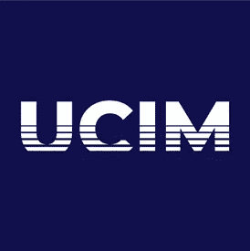

# 有了 UCIM，Fanfare 将利用区块链释放社交商务的真正价值

> 原文：<https://medium.com/swlh/with-ucim-fanfare-will-unlock-the-true-value-of-social-commerce-using-blockchain-161da263e0b2>

社交媒体的流行创造了一种新的电子商务模式，称为社交商务。社交商务是电子商务的一部分，利用社交互动和社交媒体用户在网上购物中的贡献。社交媒体是一个有利可图的平台，让企业和消费者进行交易并建立密切的沟通。

> "*采用社交媒体的一个重要考虑因素是互动性，因为互动性可以弥合卖家和消费者之间因时差和地理位置造成的差距"* (Michaelidou，2011)。

商务人士使用社交商务有几个好处，如持续的受众增长，社交媒体在搜索引擎中的排名较高，因为社交媒体上的流量更拥挤，所以更能够培养与客户的关系，客户忠诚度和保留率。然而，电子商务行业和社交媒体仍然存在仍然普遍存在的经典缺陷。但流行的社交媒体和电子商务行业仍然存在典型的缺点。Fanfare 提供的解决方案不仅独一无二，而且对所有参与者都同样有益。Fanfare 是第一家利用区块链发掘社交商务真正价值的公司。 [Fanfare](https://tokensale.fanfare.global/) 提供了一个独特的平台，能够为品牌及其所有者提供与粉丝密切直接的关系。Fanfare 已经与互联网货币联合会( [UCIM](https://www.ucim.io/) )达成战略合作伙伴关系，这将引发另一场新革命。

关于 UCIM，UCIM 设想通过将相信权力的人和专家聚集在一起，从本质上催化权力下放。通过这样做，这一事件将在传统的集权结构和新兴的分权经济思想之间提供一个中间地带。有了这个无边界、无摩擦的网络，世界将见证技术、商业、思想和梦想的融合。

**UCIM 是区块链和加密货币大会，将于 2018 年 11 月 26 日和 27 日在新加坡举行。**

这次会议是一次非常大和非常有趣的会议，值得期待。加密货币和区块链领域的专业人士出席。如果你想提前开始创业，我建议你加入 UCIM。

**获取门票。** UCIM 门票类别已经定制，以满足学生、专业人士和行业巨头的需求。来自全球各地的 500 多名利益相关者和独特的网络机会，该活动提供了一个随着您的放松而发展的体验。

**了解更多关于 UCIM 的信息**

网址:【https://www.ucim.io/ T3

https://www.facebook.com/ucimofficial[脸书](https://www.facebook.com/ucimofficial)

推特:[https://twitter.com/ucimofficial](https://twitter.com/ucimofficial)

电报:[https://t.me/UCIMIO](https://t.me/UCIMIO)

## 这篇文章发表在 [The Startup](https://medium.com/swlh) 上，这是 Medium 最大的创业刊物，拥有+ 380，756 名读者。

## 在此订阅接收[我们的头条新闻](http://growthsupply.com/the-startup-newsletter/)。

