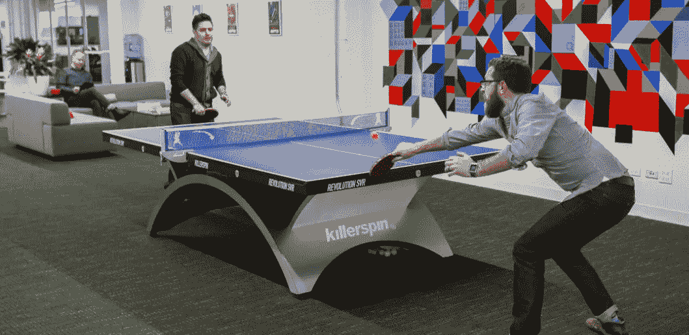
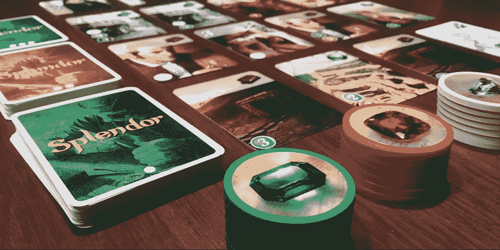
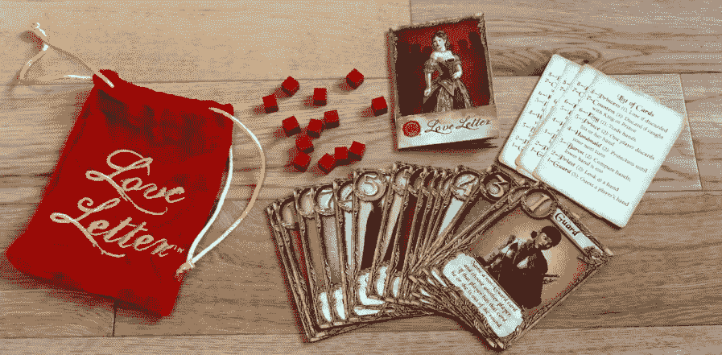
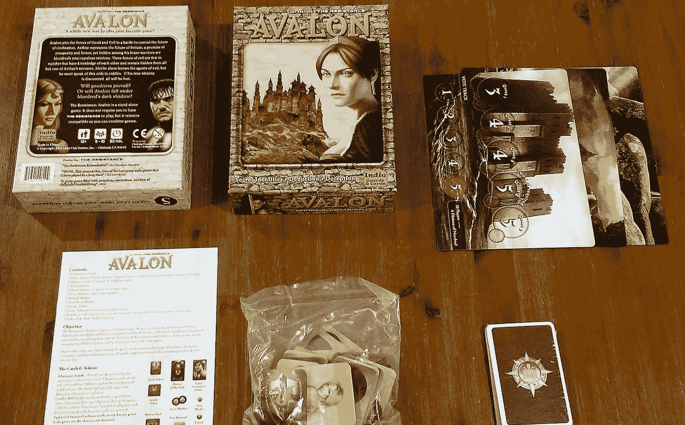

# 为什么你应该在办公室玩更多的游戏。

> 原文：<https://medium.com/swlh/work-less-play-more-in-the-office-ade3e37e4ba>

*少即是多*是在 1855 年罗伯特·勃朗宁的诗《 [**完美无瑕的颜料**](https://en.wikipedia.org/wiki/Less_is_more) **r** 中引入的。自从*以来，少即是多*已经与我们生活的许多方面息息相关。我们很多人都没有实现这个概念的一个地方是在工作中。我们工作更多。然而，我们生产的更少。

如果少即是多，也许我们应该少工作，多生产。世界上许多国家正在通过缩短全职工作周来适应这种情况。经合组织发布的全球竞争力报告显示，工作时间较少的国家在全球竞争力排行榜上名列前茅。就我个人而言，作为一个移民到美国的荷兰人，这个话题在很多方面都是真实的。

Draugiem Group 最近进行的一项研究追踪了员工的工作重心。理想的工作休息比是工作 52 分钟，然后休息 17 分钟。这个比例符合 [**番茄工作法**](https://en.wikipedia.org/wiki/Pomodoro_Technique) 。这项技术使用一个计时器将工作分成若干间隔。

软件设计中使用的其他概念如[时间盒](https://en.wikipedia.org/wiki/Timeboxing)和[迭代和增量开发](https://en.wikipedia.org/wiki/Iterative_and_incremental_development)正在被应用于不同行业的不同领域。

> 我们注定要度过一个漫长而低效的工作周吗？

人们普遍认为，谁工作的时间越长，谁的生产率就越高。现在我们知道这不是真的。然而，在许多工作场所，这种文化不会很快改变。根据盖洛普调查，美国全职员工平均每周工作 47 小时。

[**帕金森定律**](https://en.wikipedia.org/wiki/Parkinson%27s_law) 强调了这样一个事实:当一个人有更多的时间去完成一项更短的任务时，他就会利用这段时间。我们都参加过许多长达 60 分钟的会议，但它本可以在 20 分钟的会议中完成。

除了在会议中浪费 40 分钟是一种犯罪的事实之外，它还消耗了每个参与者的能量、动力和注意力。这 40 分钟的一部分可以用来重新激励每个人。

> 在工作场所，我们能做些什么来解决这个问题呢？

许多现代工作场所现在都接受在办公室里为员工提供一个玩耍空间的理念。例如，在 [**芝加哥的 Pivotal Inc .**办事处的](http://www.chicagotribune.com/bluesky/series/office-tours/chi-office-tour-pivotal-labs-bsi-photos-photogallery.html)。，乒乓球台和游戏一应俱全。对于一个局外人来说，乒乓球桌似乎占用了工作时间，但事实上这是一个重新充满活力的时刻，将使工作时间更有效率。

在工作场所提供这种逃避有更多积极的副作用；团队建设，增加个人联系和积极的竞争精神。

Pivotal Inc. Chicago Office

不是每个工作场所都有空间或资金来设立一个乒乓球台，也不是所有人都喜欢追逐一个似乎总是缺少球拍的小球。这里有一些很棒的替代方法，可以在工作空间中创建一个*****时刻*** 。**

> ****游戏时间到了救援？！****

*****一副牌(＄1)***
玩家:1–4
时长:5-30 分钟**

**一副标准扑克牌永远不会出错！你可以用一副标准牌玩无穷无尽的游戏。很好的例子有 [**阿格拉姆**](http://www.bicyclecards.com/how-to-play/agram/#filter) 或 [**六张牌高尔夫**](http://www.bicyclecards.com/how-to-play/six-card-golf/#filter) ，当然，一个人可以玩所有版本的扑克、桥牌或刚刚好的老式 [**接龙**](http://www.bicyclecards.com/how-to-play/solitaire/) 如果你需要从工作中休息一下和你的同事！**

****

*****辉煌($30)***
玩家:2–4
时长:20-30 分钟**

**荣华是一个收集筹码和开发卡片的游戏。玩家是文艺复兴时期的商人，试图购买宝石矿、交通工具、商店——所有这些都是为了获得最多的声望点数。如果你足够富有，你甚至可能在某个时候受到贵族的拜访，这当然会进一步提高你的声望。**

*****旋钮&鞋跟(Cribbage) ($20)***
玩家:1–4
时长:20-30 分钟**

**克里比奇是一种已经玩了几个世纪的经典纸牌游戏。克里比奇起源于一种叫做 Noddy 的游戏，最初是水手们玩的游戏。这是为数不多的可以在波涛汹涌的海面上玩的游戏之一，因为它使用的钉子可以沿着船上几乎任何部位都可以刻出的洞的轨迹移动**

****

*****情书(30 美元)***
玩家:2–4 人
时长:20–25 分钟**

**情书是 2-4 个人玩的风险、演绎和运气的游戏。你的目标是把你的情书交到安妮特公主的手中，同时避开竞争对手的来信。从只有十六张牌的一副牌中，每个玩家开始时手里只有一张牌；一张牌被移出游戏。在一个回合中，你抽一张牌，然后出一张牌，试图暴露其他人并将他们从游戏中击倒。强大的卡导致早期收益，但使你成为目标。然而，太长时间依赖较弱的卡片，你的信可能会被扔进火里！**

*****谜题(＄1—＄50)***
玩家:一对多
时长:5—30 分钟**

**这是办公室聚会的地方。得到一个大的，复杂的难题，所有人一起工作，随着时间的推移解决这个难题，因为每个人都在一点点地，一点点地。**

****

*****阻力:阿瓦隆(20 美元)***
玩家:5–10
时长:30 分钟**

**抵抗:在一场控制文明未来的战斗中，阿瓦隆将善与恶的力量对立起来。亚瑟代表着英国的未来，繁荣和荣誉的承诺，然而隐藏在他勇敢的战士中的是莫德雷德肆无忌惮的爪牙。这些邪恶的力量数量很少，但是他们互相了解，除了亚瑟的一个仆人之外，其他人都不知道。只有梅林知道邪恶的代理人，但他必须只在谜语中提及。如果他的真实身份被发现，一切都将失去。**

**这只是所有选项中的一小部分。去玩吧，休息一下，邀请你的老板加入进来！**

> ****作为领导者树立榜样！****

**你是一个坏老板吗？树立榜样！做一个领导者，邀请你最宝贵的资源(你的员工)和你一起玩游戏，让他们重新振作起来，准备好解决下一个问题。**

**最后，除了这些帮助你恢复精力的选择，你还可以去散步！出去，呼吸一些新鲜空气，让阳光打在你的脸上。步行 20 分钟总是一个好主意。**

**如果你有任何伟大的游戏建议或打破想法，请在评论区分享。**

****

## **这篇文章发表在 [The Startup](https://medium.com/swlh) 上，这是 Medium 最大的创业刊物，拥有 277，994+读者。**

## **在这里订阅接收[我们的头条新闻](http://growthsupply.com/the-startup-newsletter/)。**

****