# 工作流自动化:6 个 SaaS 应用程序，每天将为您节省一个小时

> 原文：<https://medium.com/swlh/workflow-automation-6-saas-apps-which-will-save-you-an-hour-every-day-91d1fc2cbebf>

“时间就是金钱”。我们每天都听到这句话，不仅仅是在商业环境中。

尽管如此，意识到这一点，**我们在许多可以轻松自动化的手动和例行任务上浪费时间。**

每个创业者都在乎时间。我想向你展示我用来提高工作效率的工具，这些工具帮助我每天至少节省一个小时。

工作流自动化是否意味着有一天我们会变得多余？

肯定不是。我们可以将节省下来的时间用于其他更具创造性的任务，如建立关系、为您的企业寻找新的增长机会，或者只是休息一下，为新的挑战积累耐力。

# 向您的团队更新项目状态

“我们已经准备好材料了吗？”“我们计划什么时候启动营销活动？”，“谁负责图形？”

如果这些也是你听到的问题，你可能也会对你的团队或公司的项目结构感到烦恼。

如今，只要你至少有一个以上的正在进行的项目，项目管理工具就成为合理组织和管理工作的必备工具。

**你可以使用类似 [Trello](https://picksaas.com/project-management/trello?utm_source=blog&utm_campaign=automate%20workflow-6-saas-apps) 或 [Monday](https://picksaas.com/project-management/monday.com?utm_source=blog&utm_campaign=automate%20workflow-6-saas-apps) 的在线项目管理应用程序，帮助你的团队组织日常工作流程，轻松地为你的项目**建立框架。

## 灵活的项目定制在周一

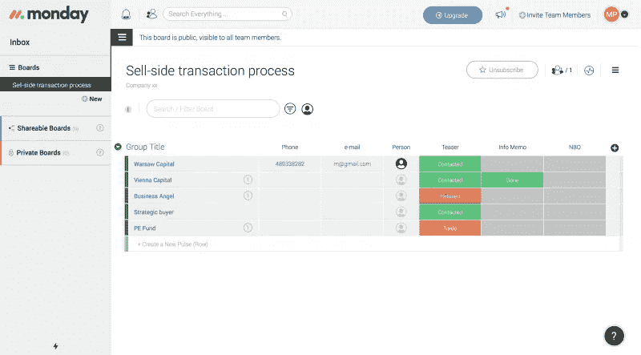

使用 Monday，您可以根据当前的需求轻松定制项目的结构。需要为每个项目的阶段增加一个负责人？想给每个部分设定截止日期？这是你可以使用周一应用轻松做到的。

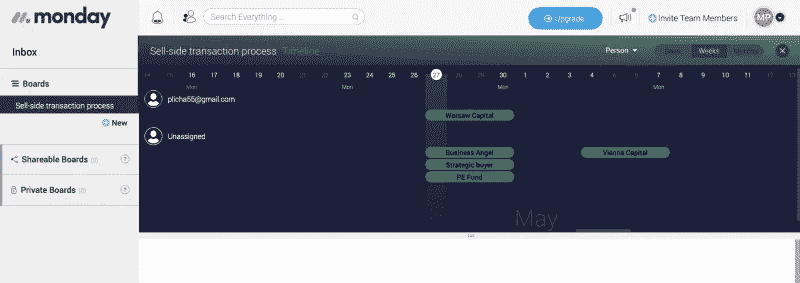

我们喜欢以可视化的方式呈现数据。周一是少数几个让你用简单的甘特图直观展示项目的应用之一。

**提示！**在项目管理应用程序中记录所有项目笔记，以便您的团队可以随时查看，即使您不在身边。

# 再次重复同样的事情

你觉得你总是向你公司的人解释同样的事情吗？

你不认为你可以更有效地同时将信息传递给多个人吗？

有时候，重复最重要的事情对于更好地解释我们的想法和意图至关重要，但尽量减少重复的次数是值得的，将所有团队成员聚集在一个地方，将信息清楚地传递给每个人。

**你可以轻松地与更多的观众**联系，例如使用一个 [Slack](https://picksaas.com/communication-tools/slack?utm_source=blog&utm_campaign=automate%20workflow-6-saas-apps) 应用程序，它可以让你轻松地为特定的项目或团队建立频道。

## 松弛状态下的通信渠道

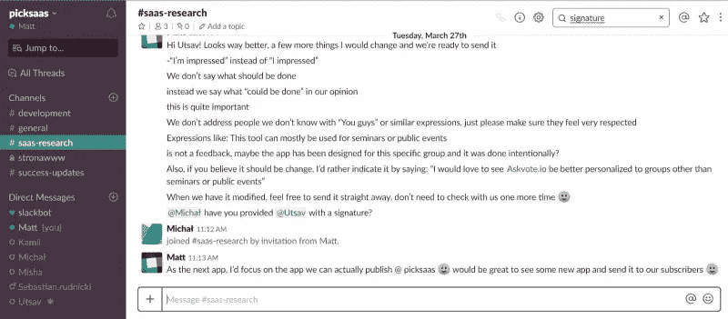

Slack 让你可以轻松地与你的团队交流，但它最大的特点是能够为你的项目或团队创建特定的渠道。这意味着，您可以创建一个“销售”渠道，在这里您可以向您的销售团队传达销售机会。

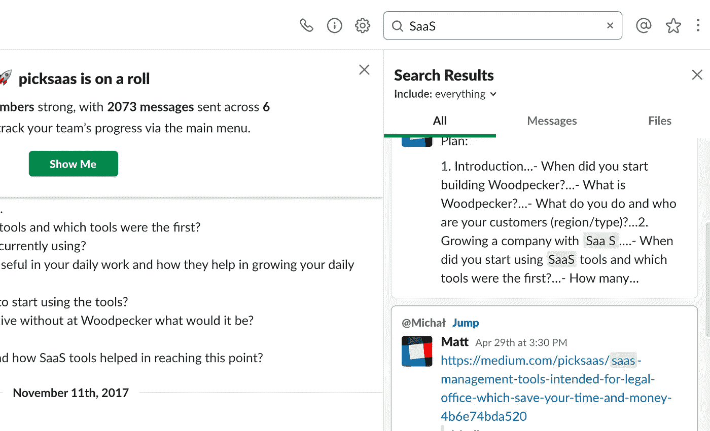

Slack 最有趣的功能之一是搜索对话的能力。你最重要的数据永远不会在数百条信息中丢失！

**提示！**不要创造太多的渠道。它们应该相当笼统，否则，你可能会发现很难浏览你的对话(Slack 浏览器允许你通过特定的渠道进行搜索，而不是通过“整个”Slack 应用程序)

# 发送安排会议时间的电子邮件

确定合适的会议时间，尤其是使用电子邮件可以持续到永远。

当日期不适合一个人时，从头开始设置时间，这可能会使整个团队都不愿参加会议，甚至在会议开始之前。

这个问题的一个很好的解决方案是一个[日历](https://picksaas.com/scheduling-apps/calendly?utm_source=blog&utm_campaign=automate%20workflow-6-saas-apps)应用程序，它可以帮助你设置一对一会议的时间，还有一个[涂鸦](https://picksaas.com/scheduling-apps/doodle?utm_source=blog&utm_campaign=automate%20workflow-6-saas-apps)应用程序，它可以让你轻松地为大型团队设置**合适的会议时间**。

## 使用日历轻松安排会议

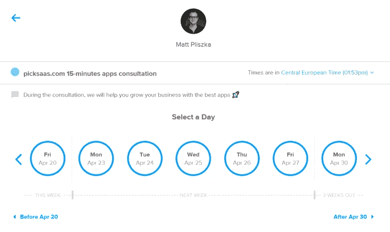

一个很好的日历功能是一个“登陆页”,让你的访问者可以在你的时间范围内很容易地与你预约一个会议。

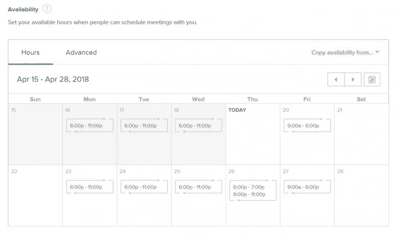

作为组织者，您可以设置每小时和每天的空闲时间。

**提示！**将 Calendly 与您的谷歌日历集成，这将让您在一个地方管理您的所有活动。

# 联系新的销售线索

联系潜在客户需要时间，尤其是如果你通过电子邮件沟通。尽管如此，这仍然是那些不能完全自动化的活动之一。毕竟，我们希望使我们的交流个性化，并与我们的潜在客户建立持久的关系。

然而，当向更大的收件人群体发送群发电子邮件时(例如，带有一些营销材料)，我们可以使用像[啄木鸟](https://picksaas.com/cold-mailing/woodpecker?utm_source=blog&utm_campaign=automate%20workflow-6-saas-apps)这样的应用程序轻松**个性化群发邮件**。

## 通过啄木鸟自动邮寄

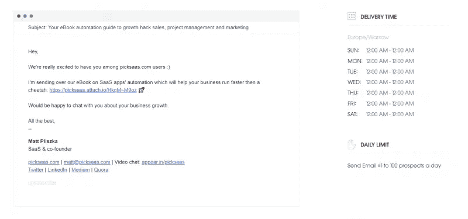

啄木鸟让您轻松地计划个性化的电子邮件信息给许多收件人。如果你已经有了你的订户/客户群，他们的名字，工作职位，你可以很容易地给你的电子邮件写地址，自动输入你的收件人的名字或他/她的企业名称。

**提示！**仅将此邮件用于简单的营销邮件。不值得将整个交流自动化，因为我们每个人都期望个人的态度，我们希望建立一个真正的、持久的关系

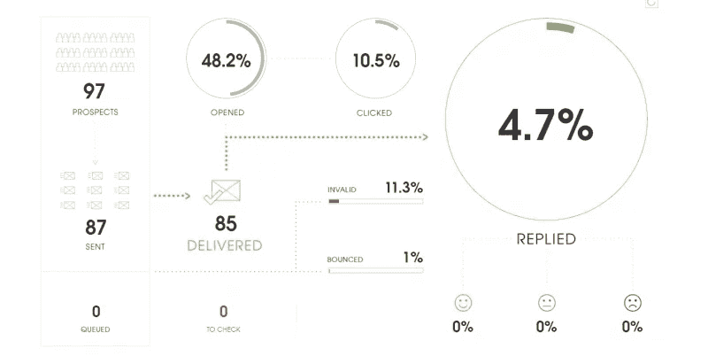

啄木鸟应用程序可以让您轻松地跟踪您的电子邮件的统计数据，这为您提供了谁点击了您的邮件中包含的电子邮件的信息。

**提示！在收件人可以真正坐在电脑前的时候计划你的后续工作，这样可以增加打开和阅读邮件的机会。**

## 另一个自动邮寄活动的应用程序

[Saleshandy](https://picksaas.com/cold-mailing/saleshandy?utm_source=blog&utm_campaign=6-saas-apps-to-automate-workflow) 是发送自动化和[个性化电子邮件活动](https://saleshandy.grsm.io/SalesHandy)的替代应用。它可以为您提供一系列附加功能，如为您的活动预定义的模板(如果您正在寻找灵感)和一些更高级的附件发送功能。

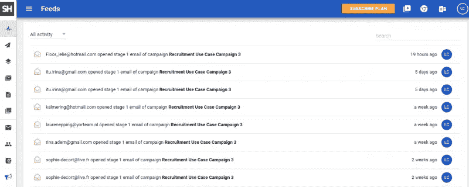

**提示！**在邮件活动中发送附件可能并不总是明智之举，因为这可能会降低电子邮件的送达率。

# 管理您的联系人列表

通常，我们会记下想要联系的人的名单，以便向他们提出一些问题或者只是聊聊天。虽然写有人员或任务清单的纸质卡片似乎是一种有效的日常解决方案，但从长远来看，它可能会成为真正的问题，不仅对你，而且对你的整个企业都是如此。

当有人离开你的公司，没有留下任何信息，说他/她联系了某个公司的某个人，会发生什么？

一个很好的解决方案是一个**简单的 CRM 应用程序，如**[**sales flare**](https://picksaas.com/crm/salesflare?utm_source=blog&utm_campaign=automate%20workflow-6-saas-apps)**或**[**piped drive**](https://picksaas.com/crm/pipedrive?utm_source=blog&utm_campaign=automate%20workflow-6-saas-apps)，每个人都可以使用，这要归功于通过互联网浏览器或智能手机轻松访问云。

## 使用 CRM 应用程序规划和安排联系人

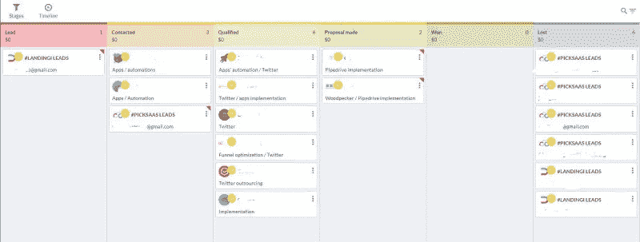

Salesflare 允许您将所有联系人存储在一个位置。借助这款应用，您可以轻松规划与特定账户相关的活动，并监控联系人的“状态”。

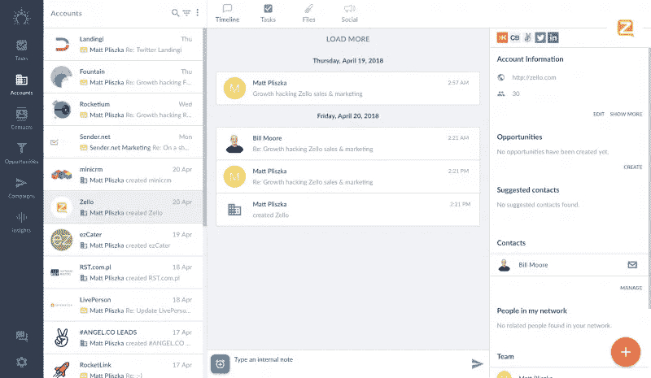

CRM 应用程序还允许您在组织内共享您的联系人和电子邮件，这将帮助您避免多个团队成员重复联系同一个人

**提示！**为了让您的 CRM 发挥作用，您和您的团队必须使用它！说服每个人使用 CRM 是困难的，但是你会很快发现它可以更好地管理工作时间，更容易地获取信息。

# 尝试通过 Skype 连接…

“有东西坏了……”“您的 Skype 登录名是多少？”，“我无法安装应用程序……”，视频对话中的这些问题意味着我们失去了很多本可用于有效对话的时间。

我个人使用 [Appear.in](https://picksaas.com/communication-tools/appear.in?utm_source=blog&utm_campaign=automate%20workflow-6-saas-apps) 应用程序，它让我可以使用一个简单的链接轻松地与一群人联系，该链接可以使用任何浏览器输入。

## 通过 Appear.in 组织会议

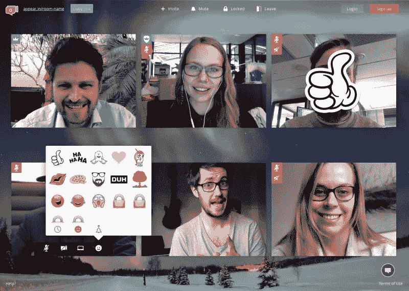

没有什么比使用 Appear.in 应用程序组织会议更容易的了。所有参与者都有一个链接，每个人都可以使用任何互联网浏览器轻松加入对话。

当所有人都在房间里时，您可以使用视频、聊天或贴纸轻松交流。

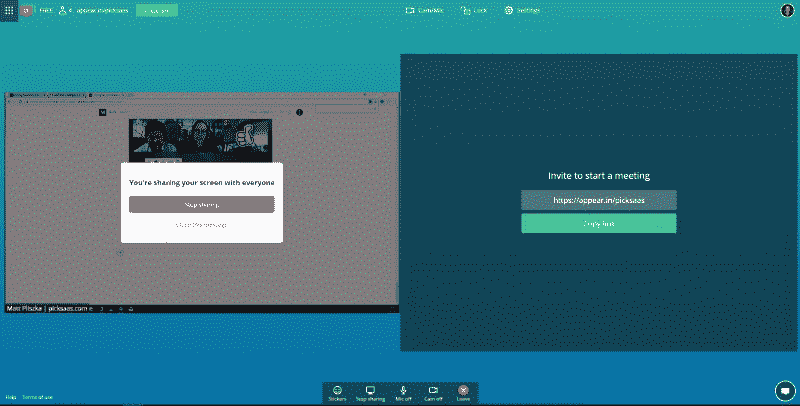

有了 Appear.in，只需轻轻一点，你就可以分享你的屏幕，向每个参与者展示你在电脑上的动作。

**提示！你可以用一个房间举行所有的会议。如果您决定不希望任何人进入房间，您可以点按锁以“锁定房间”。然后，您必须手动接受每个参与者。**

# 连接应用程序以自动化您的工作流程

单一应用程序在更好地管理时间和任务方面非常有帮助，但只有当你将 SaaS 应用程序连接起来，实现公司内部特定流程的自动化时，你才能从这些应用程序的全部功能中受益。

## 监控 CRM 中的链接点击

你可以轻松地将啄木鸟应用程序连接到其他应用程序，如 CRM 系统，让你自动在这些系统之间传输数据(例如，如果收件人点击了你电子邮件中的链接)。由于在一个地方收集数据，您可以轻松地监控对您的产品或服务感兴趣的潜在客户。

## 关于闲置渠道中新客户和潜在客户的通知

让你的团队了解最新的成功和新事件是值得的。但是，您不必每次都手动向他们发送消息。您可以将其自动化，以便在 CRM 中赢得一笔交易时，向您的 Slack 团队发送通知。

## 向您的会议参与者自动发送邮件

让您的参与者通过 Calendly 预订会议，并将其与啄木鸟应用程序连接，您可以轻松发送自动化的个性化消息，例如附加的教育材料。

# 每天一小时只是一个开始

使用合适的应用程序和“构建”你的工作流程，你可以轻松地每天节省至少一个小时。在我看来，这只是你工作时间完全自动化的开始。

如果您使用许多不同的工具，您可以很容易地找到它们之间的更多联系，让您创建一个自动化的过程，从而节省更多的时间。

实施这些应用程序需要时间，而且看起来可能无关紧要。然而，随着时间的推移，意识到自动化对你的舒适性以及最重要的日常工作和团队沟通的满意度的积极影响并不容易。

在 picksaas.com 的***，我们帮助您找到最好的 SaaS 软件来发展您的业务。***

**我们发现、研究和分析 SaaS 应用。**

*   **>与我们一起* [*为您的销售、营销和项目管理实施自动化 SaaS 解决方案*](https://picksaas.com/saas-application-implementation/?utm_source=blog&utm_campaign=Monday) *。**

**

## *这篇文章发表在 [The Startup](https://medium.com/swlh) 上，这是 Medium 最大的创业刊物，有 322，555+人关注。*

## *在这里订阅接收[我们的头条新闻](http://growthsupply.com/the-startup-newsletter/)。*

**