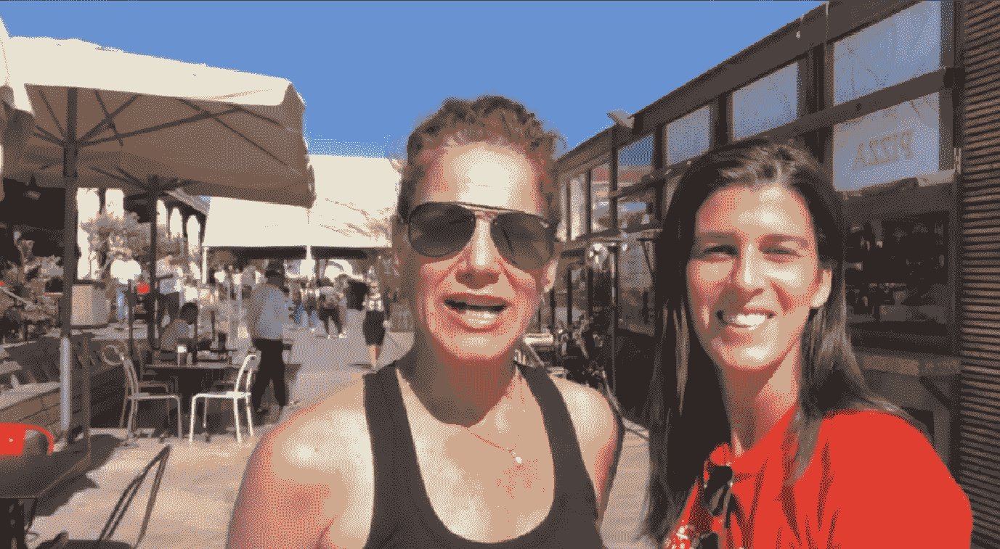

# 世界仁慈日:是时候赋予仁慈更高的价值了

> 原文：<https://medium.com/swlh/world-kindness-day-the-time-has-come-to-attach-a-higher-value-to-kindness-87188c950190>

我们需要改变我们的优先事项，以提高注重增进人际关系的倡议的重要性。只有通过增加人类属性的价值，如善良、同情和对他人的同情，我们才能在下一阶段的进化中享受所有的新技术。

Dance for Kindness founder **Orly Wahba** & Choreographer **Adi Gordon** **Rawlings** (left)in Jerusalem #[DFK2018](https://www.facebook.com/orly.wahba/videos/10157367919095961)

在过去的几个月里，我一直在帮助社会企业家 Orly Wahba 从以色列首次推出她的 [**善良之舞 2018**](http://www.danceforkindness.com/jerusalem) 活动。从第一天起，我们的目标就是利用这一事件来宣传一个来自以色列心脏的团结的好例子。

到目前为止，友善之舞已经在超过 65 个国家，247 个城市举办，横跨 6 大洲，培训了超过 400 名团体领导人。

去年的活动在 50 个国家的 120 多个城市举行，有 20，000 多名参与者。今年是第七届年度全球慈善舞会，将于 2018 年 11 月 11 日周日**举行。**

本次活动在[**2018**](https://en.wikipedia.org/wiki/World_Kindness_Day)**世界善良日的前两天，发生在**2018 年 11 月 13 日**。**

**为善良而舞的目的是超越我们自己，超越我们国家的边界，超越我们的文化，我们的种族，我们的宗教；意识到我们是世界公民。**

**今年的赞助商包括赞助商: [WeWork](https://www.facebook.com/WeWorkIsrael/) 、[舒斯特曼家族基金会](https://www.facebook.com/schustermanfamilyfoundation/)、科伦丹妮尔基金会。**

****以色列高科技资金如流水****

**作为以色列的一名高科技顾问，我可以告诉你，在我们这个小小的国家，有数百万美元在流动，这个国家正好处于所有网络安全、自主和 IOT 创新的中心。这里总有很多关于 VC 出资和退出的言论，被认为是成功的高度。**

**许多以色列最富有的公司和国外领先的犹太商业领袖被接洽来支持奥利的“为善良而跳舞”活动，但只有少数人站出来。**

**我所能做的就是希望并祈祷我们能尽快恢复理智，并理解我们必须更加重视旨在加强人类联系的倡议。**

**善良很重要。重要的是人们要团结起来，明白我们可以通过互相尊重来解决很多问题。**

**为耶路撒冷舞蹈为善活动捐款可以在这里进行:**

****通过奥利注册的 501(c)3 非营利、 [**生命背心内**](https://www.lifevestinside.com/donate/#donate) 可以为世界各地的慈善舞蹈捐款。****

********

## ****这篇文章发表在 [The Startup](https://medium.com/swlh) 上，这是 Medium 最大的创业刊物，有+384，399 人关注。****

## ****在此订阅接收[我们的头条新闻](http://growthsupply.com/the-startup-newsletter/)。****

********