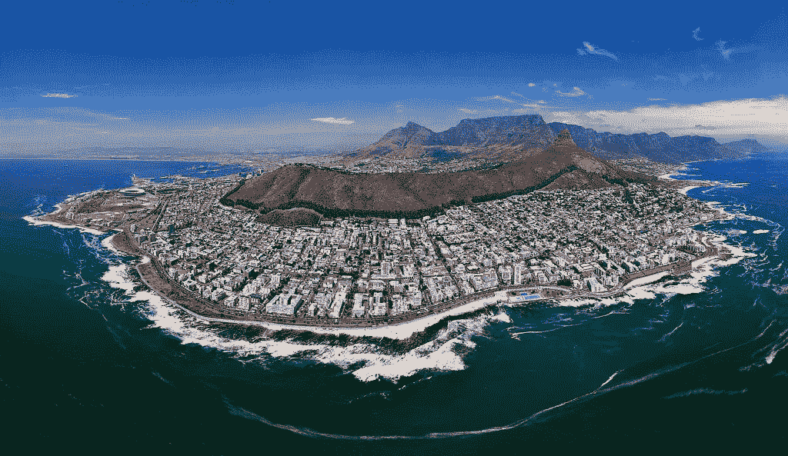

# 2018 年世界巡回赛:有没有想过世界各地的创业公司有什么不同？

> 原文：<https://medium.com/swlh/world-tour-2018-ever-wondered-how-startups-differ-around-the-world-aca79c90a8d3>

Cape Town, South Africa

“创业不插电”博客系列的一部分:博客 1

我要找出…🌎 ✈️ 🎉

五年前，几乎就在同一天，我成为了一名企业家，开始了人生的新篇章。几个月前，我还在公司做管理顾问，我决定拿出月薪的 60%来启动我的创业公司。把这一大笔钱放在一边是可能的，因为我知道我的公司工作只是一个临时的解决方案。很难表达我被困在一份我讨厌的工作中，却没有一条清晰明确的出路来摆脱痛苦时的绝望和恐惧。当我想得更多，并开始从我的公司工作中转移出来时，我感觉好像是要离开我的安全和高薪职位，去做我当时只能描述为完全不确定的事情。尽管如此，我对激情和承诺驱动的生活有一个浪漫的想法。我的目标是在宇宙中留下一点痕迹。

2012 年年中，我在哈佛商学院(Harvard Business School)工作时，为了更好地了解公立和私立医院高管职位的晋升模式，我在[哈佛创新实验室](https://i-lab.harvard.edu/)第一次接触到了企业家精神的整个概念。我参加的第一批公开活动关注的话题包括如何为你的企业选择合适的法律实体，或者如何找到合适的联合创始人。当时，我对这个领域一无所知，我很感激我能得到的任何建议或信息。当离开学术界的安全港时，这种不知道该做什么的感觉很可怕。不能再躲在头衔和职位后面，比如我的医学学位或约翰霍普金斯大学的公共卫生硕士学位，给了我一个艰难而重要的教训。成为一名企业家意味着在一个全新的领域重新创造和证明自己。当然，我必须赞扬创新实验室让我看到了一种叫做“企业家精神”的新生活方式。

**五年后:下一步是什么？**

五年后，我们的旗舰产品[口袋里的医生](https://doctorinyourpocket.info/)已经扩展到全球 180 多个城市，并与 [HomeAway](https://www.homeaway.com/) 等公司合作。随着各大新闻媒体的曝光和特写，许多奖项和认可(如安永(Ernst & Young)年度企业家奖的决赛选手)，以及头发花白的早期阶段，我花时间反思我作为企业家仍然年轻的旅程，问一个问题:下一步是什么？😅

在硅谷的寒假期间，在所有我可以去的地方中😀，我明白了，2018 *必须*与众不同！多年来，我非常荣幸能够接触到一些非常成功和知名的全球企业家，他们已经做了我正在完成的事情:他们已经取得了成就。我怎么强调接触合适的、知识渊博的、才华横溢的企业家的重要性都不为过，我认为他们的建议是“流动的金子”。

我计划让写博客成为我生活中的常事，而诸如“如何在仍有工作的情况下启动你的公司”和“创业:如何雇佣你的第一批关键人物”等功能将是我在未来几个月思考的主题类型。我想建立一个由年轻企业家和其他商业头脑组成的社区，希望能分享我在创业经历中学到的东西。我的见解已经在博客上完全展示出来了，我希望读者能从我的重要经验中吸取教训，指导他们的旅程。

在反思过去五年的经历时，我意识到，我对创业各方面知识的完全缺乏，使我的经历成为一条陡峭的学习曲线。作为一名年轻且缺乏经验的创业者，最困难的挑战之一是消除 99%接近你的人或公司的噪音。他们提供廉价和有偏见的建议，要么卖给你不需要的服务和产品，要么只是试图扩大他们的用户群。对我来说，我对筹款、会计、销售和业务发展、数字营销等话题了解甚少；你说吧。我没有知识和经验来做出明智的决定，就像我在医学上习惯的那样。老实说，我早期的大多数决定都是凭直觉做出的。

所以，我的博客系列的目的是为企业家提供一个资源，让他们从我的成功时刻，更重要的是，从我的错误中学习。

**一次创业世界之旅**

这还不是全部:展望 2018 年，我选择今年作为我回馈全球企业家社区的一年。我在风险投资公司 [Techstars](https://www.techstars.com/) 担任了几个导师的角色，并将前往世界各地的主要创业中心。与我职业生涯中遇到的许多演讲者不同，“不插电创业”研讨会的唯一目的是解决年轻和有抱负的企业家的问题和业务需求。这些工作坊的基础是三重的:诚实、直接和经验驱动。

创业中心的所有者和经营者的反应速度惊人。在第一轮计划的活动之后，全球创业社区的支持给我留下了深刻的印象，因为他们组织活动并向他们的同行和社区推广这些研讨会。我的旅行今天将从迪拜开始，随后是中东的许多其他地方。我生命中的这一新篇章将会通过推特、T2、LinkedIn、博客和即将开通的 YouTube 频道分享，每天更新，每周反思。

我很兴奋能再次环游世界！尤其是在这一切的核心有这样一个特殊而独特的目标:帮助年轻和有抱负的企业家追求他们的商业梦想，了解更多关于创业生态系统的经济和文化影响，并获得关于全球创业中心成熟度的知识。

我希望所有阅读这篇博客的人都支持并跟随我在 2018 年的旅程。我很想听听你对我应该去的创业中心、应该联系的公司或应该了解的创业项目的建议。如果有任何指导请求，请随时联系我，我很乐意与您联系。

我期待你的评论，喜欢和其他参与方式🙏

波浪形卷发

➡️每周从你的收件箱里收到一篇值得一读的文章。[在这里报名](https://goo.gl/forms/p6gnR2OTUiZc47in2)。🙏

PS:大家可以拍手跟我来，这样会有更多的人在 Medium 上看到这篇文章(见下面的视频)。👏 👍

.

**通过**联系我

推特: [@marcelmuenster](https://twitter.com/marcelmuenster?lang=en)

个人网站:[about.me/marcelmuenster](https://about.me/marcelmuenster)(了解更多关于我的信息并安排通话)

LinkedIn: [马塞尔·明斯特](https://www.linkedin.com/in/marcelmuenster/)(给我发一封电子邮件或直接信息)

## 这个故事发表在 [The Startup](https://medium.com/swlh) 上，这是 Medium 最大的企业家出版物，拥有 307，492+人。

## 在这里订阅接收[我们的头条新闻](http://growthsupply.com/the-startup-newsletter/)。

