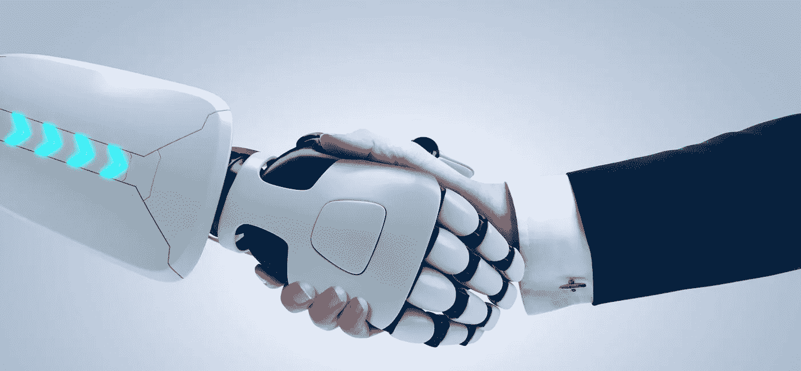

# 未来的首席执行官

> 原文：<https://medium.com/swlh/worried-about-a-robot-taking-your-job-actually-it-will-be-your-next-boss-734c4441b08d>

## 如果机器是首席执行官，并雇佣人类为他们工作，这个世界可能会是什么样子。

最近有很多关于就业前景黯淡和“自动化革命”的言论——机器将取代你的工作。毋庸置疑——机械机器人(像那些令人毛骨悚然的人形机器人或无人机)和人工智能软件程序，预计将在未来 5 年内减少美国 6%的工作岗位。

而且不仅仅是明显的低技能劳动力或制造业岗位岌岌可危。

甚至[白领岗位](https://futurism.com/researchers-ai-could-take-over-much-more-than-blue-collar-jobs/)都有可能被机器取代；在某些情况下，像法院裁决或医疗诊断这样的事情，通过数据算法比专业律师或医生更好地衡量。

机器人不仅在执行特定任务时更加准确和精确，而且效率也更高:自动化带来的潜在未来成本节约几乎相当于[15 万亿美元的工资](https://www.mckinsey.com/global-themes/digital-disruption/harnessing-automation-for-a-future-that-works)。

因此，自动化革命当然是由雄心勃勃的商业领袖、企业家和企业高管推动的，他们试图用尽可能少的资源创造尽可能多的价值。

当然，他们不会被机器人接管，对吗？

再猜。

# 机器也可以扩大公司规模。

它是这样工作的:商业领袖利用机器来增强人类生产力的弱点——高度技术性、可重复和可预测的任务。在这方面，机器比人类好得多，但在工作场所的基本动态任务方面，人类(目前)表现更好:管理和发展人、决策、战略和规划或创造性工作。

但是如果这个模型完全颠倒了呢？想象一下，如果机器在最高水平上运营公司，利用巨大的计算能力来优化利润，并雇佣人类来增强他们的弱点，会怎么样？

就像人类首席执行官一样，机器将监督公司的客观表现，处理数量庞大的销售和市场数据，进行无限量的模拟，以确定人力资源、财务、运营、营销和销售决策的最佳可能结果。

是的，你没看错。一家公司的愿景和战略，以及资源分配，将完全基于计算机模拟。

一旦确定了实现最大利润水平的行动方针，机器就会将任务分配给人类(它以前根据一套最佳性格类型和技能取向的标准来分配任务)。

我知道你在想什么，没有机器不会创造悲惨的机器人式工作场所文化。使用主观幸福感来创造心理上安全的工作环境符合机器的最佳利益。毕竟，我们可以量化地得出结论，这些东西会给人类带来更好的生产力和工作表现。

# 利润将用于造福人类。

机器取代我们工作的想法如此荒谬的部分原因是，我们关于工作场所自动化的许多对话完全忽略了长期利益。如果我们设计机器来以最大化利润的方式运营公司，从而在市场上评估价值，它会给社会带来一些非常重要的东西。

首先，它将导致更有意义的商业实践，高度关注为人类提供价值(而不是由情绪激动的自我中心做出高影响力的商业决策)。

其次，它会彻底改变你花费时间和精力的方式。当然，这引发了围绕薪酬结构和普遍工资的辩论，但现实是，当人类不再追求利润时，仍有大量工作要做。

想想看:你花费了我们醒着的大部分时间和精力，恶性循环地解决问题，以帮助其他人赚更多的钱。你做的工作我们不会感兴趣。在股票行情显示器前度过一生或者卖保险是一种有意义的生活方式吗？更重要的是，它对人类的积极进化有任何贡献吗？

相反，如果你能把我们的时间花在解决世界上真正的问题上呢？如果你每天的任务都是消除贫困或世界饥饿，那会怎样？或者，如果解决悲伤的问题不符合你的想象，如果你可以每天都思考如何改善社会——制作艺术或教育下一代人类，会怎么样？

你能想象如果这个星球上最聪明的头脑都集中在人类的问题上，而不是想办法让你买更多的东西，会有什么成就吗？

此外，代表一家公司创造的利润将被完全再投资于两件事之一:扩大公司的能力或公共基础设施。

因为人类不会为了个人利益而囤积利润，所以机器会被编程来寻找为顾客增加更多价值的方法。例如，随着时间的推移，一家网上书店会将每年 100%的利润进行再投资，以扩展到几乎每一个垂直业务领域。

但是，一台机器也可能认为，发展公共基础设施能更好地服务于它的商业利益。通过以优化人类功能和环境可持续性的方式推进城市环境的演变，某一特定类型的企业可能会运作得更好。例如，一家电动汽车公司可能会决定将其大部分利润用于建设充电站或提高公共交通的效率。

## 等一下…

实际上，现在想来，一家由机器运营的公司的愿景听起来是不是与杰夫·贝索斯和埃隆·马斯克的公司非常相似？奇怪。

## *感谢阅读！这篇文章最初发表在* [*公司杂志*](https://www.inc.com/yazin-akkawi/the-key-lesson-from-cambridge-analytica-scandal-internet-knows-you-better-than-you-think.html) *上，但是我在这里发表，这样我可以得到更好的反馈。有想法/反馈请评论或者* ***觉得这个作品有意思就拍*** *！*

## 这个故事发表在 [The Startup](https://medium.com/swlh) 上，这是 Medium 最大的创业刊物，拥有 316，638+人关注。

## 在这里订阅接收[我们的头条新闻](http://growthsupply.com/the-startup-newsletter/)。

