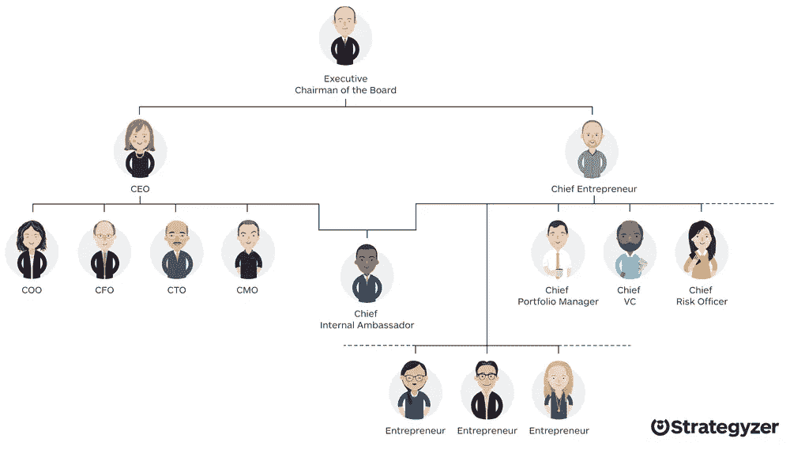

# 你会为了一个更好的职称而接受一份工作吗？

> 原文：<https://medium.com/swlh/would-you-take-a-job-for-a-better-job-title-2b21141f7d26>

## 为什么我们需要更多的字母在 CXO 标题中

Source: Strategyzer

不久前，一家高科技公司打算从一家财富 500 强公司招聘一名高管。除了一件事，一切都很顺利。这不是钱的问题。候选人想要首席技术官的头衔，但这个头衔已经被别人拿走了。他们不能从其他人手中夺走首席技术官的头衔，所以他们向候选人提供了一个…