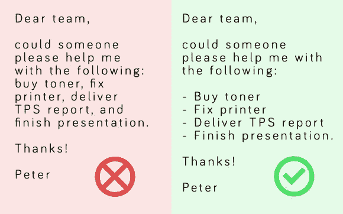

# 用这 5 个可用性技巧写出更好的电子邮件

> 原文：<https://medium.com/swlh/write-better-email-with-these-5-usability-tips-1636de97be92>

如何通过电子邮件更清晰、更有效地传达你的信息。

可用性原则不仅仅是设计应用或网站时需要考虑的重要因素。可用性的概念——也就是说，确保你的用户或观众能够明白如何使用或理解他们面前的东西——也可以应用于其他数字平台。包括电子邮件。

以下是你如何将可用性概念应用到你的电子邮件中，使它们更容易阅读，并确保你的信息被收件人理解。其中一些似乎显而易见，但是在起草下一封邮件时考虑这些会有很大的不同。

# 1.不要让我思考，不要浪费我的时间

在几秒钟之内，你的电子邮件的接收者应该能够识别出*****为什么*** 他们正在接收它，最后 ***他们应该采取哪些*** ***行动*** (如果有的话)。首先要选择一个合适的主题，用几句话概括你邮件的精髓。对我来说，一个好的主题并不是骗你的读者打开你的邮件，而是想出一些合适的词来为邮件的内容定下基调。**

****

**Don’t be that guy.**

# **2.重要的事情优先**

**考虑一下你的邮件中最重要的是什么，把它放在最上面。通过这样做，你将有助于确保读者在开始浏览电子邮件，甚至关闭或删除它之前，获得你的信息的关键部分。**

**这与大多数网站、杂志文章或报纸的结构相似。标题奠定了基调，最重要的信息放在正文的第一部分，第二重要的细节放在后面，以此类推。**

# **3.把你的邮件分成几个部分**

**如果你的邮件超过 50 个单词，考虑一下你的文本结构。把它分成几大块文字。这使得它更容易阅读，并帮助收件人获得电子邮件的整体概述。我们都知道当打开一封邮件，面对一大堆文字时的焦虑感。这不是一个美丽的景象。你会惊讶有多少商业人士这样做。**

****

**My eyes, my eyes!**

# **4.使用项目符号**

**项目符号是另一个方便的工具，可以拆分邮件内容并增加结构。如果你列出不同的项目或描述一个过程中的步骤，它们是以一种易于阅读的格式展示它们的好方法。每当我向客户发送报告并希望强调不同的发现时，我都会使用项目符号。或者，如果一封电子邮件包含我希望收件人接下来要做的不同行动要点。**

****

# **5.突出重要的单词或数字**

**如果你的邮件包含某些你希望读者注意到的单词、短语或数字，突出显示它们可以帮助你做到这一点。通过加粗你的邮件文本的一小部分或者给文本添加背景色，当读者浏览你的邮件时，它会突出出来并且立刻被注意到(就像网站一样)。**

****

**What stands out to you as you scan this email?**

**下次你写电子邮件的时候，试着使用这些方法。你很可能会发现，你的信息会更清晰，你得到的回应也会更有用。**

**电子邮件是一种混乱的格式。没有什么限制，所以作为一个沟通者，你完全可以确保你的信息清楚地传达给接收者。我认为写好邮件的关键是遵循简单和常识性的可用性原则。**

****感谢阅读！我很想听听你关于如何通过电子邮件更好地交流的建议。如果你想合作，谈论生产力，或者只是想打个招呼，请在** [**Twitter**](https://www.twitter.com/davidoa) **，**[**insta gram**](https://www.instagram.com/davidoadesign/)**或在**[**Linkedin**](https://www.linkedin.com/in/davidoandersen/)**上联系我。****

****

## **这个故事发表在 [The Startup](https://medium.com/swlh) 上，这是 Medium 最大的企业家出版物，拥有 306，792+人。**

## **在这里订阅接收[我们的头条新闻](http://growthsupply.com/the-startup-newsletter/)。**

****