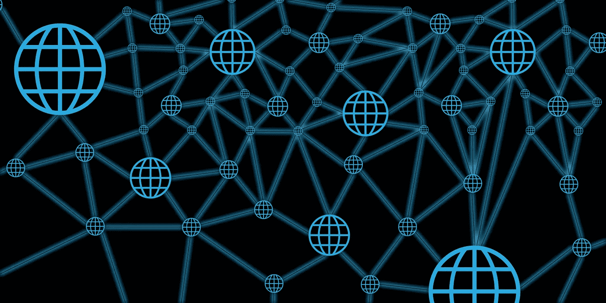

# WTF 是去中心化人工智能？

> 原文：<https://medium.com/swlh/wtf-is-decentralized-artificial-intelligence-1c8259f5d87c>

TL；大卫:这是未来

人工智能革命已经开始，制造、运输、零售、金融、娱乐、教育和几乎所有其他行业的组织都在转变其核心流程和业务模式以利用这一优势。人工智能不仅正在改变行业和公司，它在我们的日常生活中发挥着巨大的作用。我们如何出行，我们决定吃什么，我们为一瓶啤酒支付多少钱，通常都依赖于人工智能解决方案。

与人工智能(特别是机器学习)一起工作是一场爆炸，利用像 [PyTorch](http://pytorch.org/) 和 [Tensorflow](https://www.tensorflow.org/) 这样的工具可以非常容易地构建真正有趣和有价值的工具。从人工智能中可以获得巨大的优势，我们刚刚开始看到个人、组织和政府获得回报。

我一直喜欢与人工智能打交道，但当我开始尝试在区块链实施人工智能解决方案时，我的血液才真正开始沸腾。对于任何不熟悉区块链的人来说，这是一种数字化和分散的分类账技术，以公开的方式记录所有交易。这是加密货币建立的基础，因为它透明，加速结算，降低交易成本，并且由用户控制。尽管这项技术还没有完全成熟，但它已经被证明是人工智能进步的关键部分。

这是因为“守旧派”或传统的人工智能遵循一种集中的分布模式(一个代理控制世界)。我们通过一个 API 来访问，它是基于云的服务的一部分，软件包在不同人工智能提供商的远程服务器上。

谢天谢地，我们正在走向“新学校”。想象一下，人工智能是一组分布式智能代理的协作解决方案。人工智能可以在像区块链这样的分散网络中的本地设备上运行、训练，甚至做出决定。

那就是去中心化的 AI！随着我们向前发展，我看到了分散式人工智能相对于传统人工智能的三个巨大优势:

1.最小延迟(不依赖网络连接)

2.培训效率更高(以分散的方式进行)

3.功耗更低(同样，不依赖网络连接)

这个概念正在迅速普及。最近，电脑(谷歌的 TPU)和手机已经在考虑人工智能的情况下进行了优化。此外，谷歌真的通过他们的[联合学习概念](https://research.googleblog.com/2017/04/federated-learning-collaborative.html)走上了正轨，该概念拥有一种分散的、协作的方法来处理训练数据。通过将所有训练数据保存在设备上，不需要将数据存储在云中。我们正在为“新学校”人工智能奠定基础。一定要记笔记。

就个人而言，我最感兴趣的是在分散自治组织(Dao)中利用人工智能。简而言之，Dao 承担了区块链上智能代理所做的部分或全部决策职责。但那将是改天的博文:)

未来是光明的，因为它比你想象的更近。

向前，

[本·史都华](https://www.linkedin.com/in/benstewart2008/)

## 这篇文章发表在[《创业](https://medium.com/swlh)》上，这是 Medium 最大的创业刊物，有 293，189+人关注。

## 在这里订阅接收[我们的头条新闻](http://growthsupply.com/the-startup-newsletter/)。

