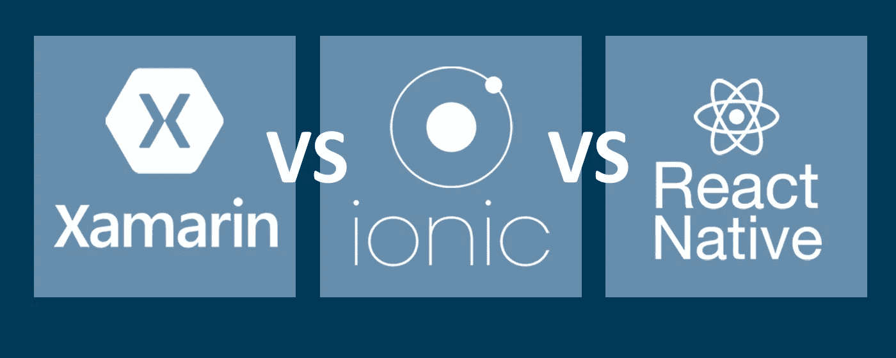

# Xamarin vs Ionic vs React Native:本质上的区别

> 原文：<https://medium.com/swlh/xamarin-vs-ionic-vs-react-native-differences-under-the-hood-6b9cc3d2c826>

传统上，Android 应用程序是用 Java 开发的，而 iOS 应用程序是用 Swift 和 Objective-C 编写的。尽管如此，还有许多其他工具可以替代使用。Xamarin、React Native 和 Ionic 是这类工具的常见示例。他们的目的是什么？他们有什么不同？他们中哪一个最好？我们将在下面的文章中尝试回答这些问题。

# 跨平台开发

你经常需要为 iOS 和 Android 开发相同的应用程序。有时你还需要支持其他操作系统，比如 Windows Phone，但这里我们只关注 iOS 和 Android。

其中一个解决方案是开发两个完全独立的应用程序:一个用 Java 编写用于 Android，另一个用 Swift 或 Objective-C 编写用于 iOS。这种方法有其优点，例如:

*   使用为此平台设计的官方工具。只要操作系统本身还在开发中，它们肯定会得到支持。此外，他们首先获得新功能。
*   本地 UX 和 UI。通过使用官方工具，更容易符合平台人机界面指南(HIG)。最终用户获得了与您的应用程序交互的熟悉体验，并且它的外观与为该平台设计的其他应用程序相匹配。

然而，这种方法有一个严重的缺点:您必须两次编写相同的代码！考虑到不同的编程语言(Java 和 Swift)，在 iOS 和 Android 上做相同事情的不同方法，构建 GUI 的不同方式，很难做任何事情来避免两次编写相同的代码。如果两个不同的开发人员创建 iOS 和 Android 应用程序，情况会更糟，因为两个人可能会以稍微不同的方式实现相同的功能。

Xamarin、React Native 和 Ionic 解决了这个问题，并提供了强大的工具来实现一个目标:使用单一技术堆栈来开发 iOS 和 Android 应用程序。这个想法看起来很简单，但它释放出一堆好东西:

*   开发者不需要学习两种完全不同的技术。当然，他们仍然需要了解每个平台的特性和限制，但是没有必要再用两种不同的语言编写和使用不同的工具设计 GUI 了！
*   共享代码库允许大量重复代码删除。两个应用程序通用的代码，如业务逻辑、网络等。可以分离到它自己的模块中，并且您仍然不会失去为每个平台创建自定义 UI 的机会，甚至可以添加一些特定于平台的特性来构建 UI。
*   仍然可能有两个或更多的开发人员在开发应用程序，一个更了解 iOS 的开发特定于 iOS 的部分，一个更了解 Android 的做 Android 的东西，他们中的任何一个都可以做通用的平台无关的东西。由于通用的东西只写了一次，所以在这段代码中不会出现平台间的不一致。

然而，拥有所有这些特性的代价是什么？让我们仔细看看上面提到的框架。

# 概述

当 React Native 和 Ionic 基于 JavaScript/TypeScript 时，Xamarin 是 C#框架。

Xamarin 可以有不同的用法。一种选择是尽可能保留，只将语言切换到 C#。也就是你用 Xamarin Studio 工具设计 xib、故事板和 Android 布局文件，用 C#而不是 Java 或 Swift 写代码。iOS XIBs 和故事板也可以用 Xcode 设计。所有本机框架都可以轻松访问。不依赖 UI 的代码可以在 iOS 和 Android 项目之间共享。但是，如果您想体验 Xamarin 的所有功能，还有另一个选择:您可以使用跨平台的 Xamarin。表单，甚至可以同时为两个平台设计 UI。

另一方面，React Native 和 Ionic 选择了基于 JavaScript 的语言。但是它们有什么不同呢？

嗯，核心区别是 React Native 的工作方式更像 Xamarin:你使用一种特殊的模板语言来制作 GUI，它最终会创建本机小部件。相反，Ionic 根本不使用原生小部件。相反，它只是显示一个用 HTML 编写的网页，模仿本地小部件的设计。如果你深入观察，React Native 使用了一种新颖的方法:你将 UI 声明为当前状态的函数。React Native 现在的工作是在每次状态更新时找到 UI 中发生变化的部分，并只重画它们。在复杂布局的情况下，它可以简化很多事情，因为当状态改变时更新 UI 的逻辑不再遍布代码。

正如我们所看到的，每个框架使用的方法都略有不同。下表是一个简短的总结。我们将在接下来的小节中讨论每种方法的优缺点。但是现在让我们来谈谈跨平台编程可能存在的陷阱。

## 常见陷阱

一旦你开始开发一个跨平台的移动应用，一些众所周知的问题就会开始出现。

首先，你可能已经注意到你不能使用你熟悉的库。您可以使用一些库，例如用于联网，但现在您可以注意到，网络层变得对 iOS 和 Android 都通用，并且您不能只绑定仅支持 iOS 或仅支持 Android 的库来进行联网。解决方案是在 C#中使用专门为解决这个问题而设计的跨平台库。一个可能的问题是，iOS 或 Android 专用库中的一些功能可能没有替代品。

第二个潜在的问题是特定平台代码的行为不一致。我们上面提到过，重复数据删除逻辑可以防止两个平台之间出现不一致。但是由于操作系统不同，有些事情需要做两次，例如请求许可。iOS 和 Android 有不同的权限集，在请求权限时有不同的 UX，尽管有些库至少为 C#存在，试图为两个平台创建一个单一的接口，但考虑到平台的特性和差异，编写一个单独的代码通常会更好。在这种情况下，很难谈论一些不一致的地方，因为该流程在 iOS 和 Android 上被故意做得不同，但问题无论如何都是存在的。一些常见的部分，如请求相机许可，需要执行两次，可能会出现潜在的错误。无论如何，大多数潜在的不一致都是通过对代码的最大部分进行重复数据删除来消除的，当您需要编写代码两次时，您需要做的就是格外小心。

# 表演

## JIT 和 AOT

C#和 JavaScript 都没有编译成目标 CPU 的本机代码。C#被编译成一些字节码，JavaScript 被解释。因此，出现了性能问题。

有两种提高这类语言性能的常用方法:JIT 和 AOT。实时编译(JIT)是在运行时将字节码或源代码编译成本机代码的过程。因此，一段代码(字节码或源代码)并不是每次执行时都被解释，而是在运行时只被解释一次，每次执行时，都会运行一段快速的本机代码。提前编译(AOT)是在编译时启动应用程序之前执行的相同过程。

你可能认为 AOT 总是比 JIT 好，因为你只需要编译一次，而不是每次启动程序的时候。但是让我们记住 JavaScript 是一种动态类型的语言，这就是为什么 JIT 在 JavaScript 案例中能胜过 AOT 的原因。

让我们看一个简单的例子:

(代码摘自文章中的[，在那里你可以找到关于 JavaScript JIT 如何工作的更多细节。)](https://hacks.mozilla.org/2017/02/a-crash-course-in-just-in-time-jit-compilers/)

即使是一个简单的加法运算符实际上也可能有不同的含义，例如数字加法或字符串连接。当解释器面对代码中的加号时，它会做所有必要的类型检查，AOT 编译的本机代码也会这样做。如果这段代码被多次调用，并且每次 arr 都是一个数字数组，那么 JIT-compiler 可以提供一个优化版本的代码，它只能处理数字。大多数检查可以在进入循环之前执行，如果检查失败，还有一个解释代码的后备方案，否则将运行本机代码，这比 AOT 编译器产生的结果要高效得多。

因此，结果是，当热门代码被 JIT 编译时，JavaScript 通常工作得最好。JIT 可能比 AOT 更好的另一个原因是 C#的一些特性，如动态代码生成(系统。Reflection.Emit)只能与 JIT 编译器一起工作(显然，您不能预编译运行时生成的一些代码)。

## 操作系统问题

iOS 的安全特性之一是不允许可写的可执行段。由于在运行时输出本机代码并执行它对于所有的 JIT 编译器都是至关重要的，所以我们不能在 iOS 上进行任何 JIT 编译。然而，有一个例外:在 WKWebView 中运行的 JavaScript 服从于 JIT 编译(WKWebView 在一个单独的进程中运行，该进程可以有可写的可执行段)。

另一方面，Android 没有这样的限制，所有的 JIT 编译器运行起来都不会有任何问题。

## 64 位支持

现在出现了许多具有 64 位 CPU 的手机设备。通常，64 位代码运行速度更快，内存占用更大。由于我们主要关心的是速度，我们将假设最好支持 64 位目标，考虑到苹果要求它用于 iOS 应用程序。

## 图像使用者界面

有一个普遍的观点是 HTML DOM 比 Android 或 iOS 原生 widgets 慢。在 HTML 中，有很多事情会导致布局的重绘，这需要相当多的时间。这里，我们优先考虑使用本地小部件来呈现 UI 的框架。

## 比较

考虑到上面所说的一切，让我们比较一下 Xamarin、React Native 和 Ionic 的性能特点。

***Xamarin***

C#可以是 JIT 编译的，也可以是 AOT 编译的。由于 iOS 无法进行 JIT 编译，所以 Xamarin AOT 在针对 iOS 时会默认编译应用程序。在 Android 上，它默认使用 JIT，但是可以配置为使用 AOT。AOT 编译的代码应该运行得更快，但是有一些限制(例如，不能通过系统生成动态代码。Reflection.Emit)。

参考链接:

*   【Xamarin 是如何工作的
*   [iOS 架构](https://developer.xamarin.com/guides/ios/under_the_hood/architecture/)
*   [安卓构建流程](https://developer.xamarin.com/guides/android/under_the_hood/build_process/)

重要限制列表:

*   [iOS 限制](https://developer.xamarin.com/guides/ios/advanced_topics/limitations/)——AOT 造成的限制同样适用于 Android
*   [安卓限制](https://developer.xamarin.com/guides/android/advanced_topics/limitations/)

好消息是 64 位支持对 Xamarin 来说根本不是问题！

如有必要，可以强制将代码编译为 32 位目标。

Xamarin 的另一个巨大优势是它使用本机小部件来呈现 UI。您可以以特定于平台的方式(即 Android XML 布局文件和 iOS XIBs 和故事板)设计用户界面，也可以使用 Xamarin.Forms。使用原生方式来布局 UI 与编写标准 Java Android 或 Swift/Objective-C iOS 应用程序一样快。另一方面，Xamarin。表单允许你使用一些好的东西，比如只设计一次公共布局，数据绑定等等。，而且无论如何它都使用了本机小部件。

***反应原生***

不幸的是，React Native 没有提供任何东西来替代 iOS 上缺失的 JIT，而是退回到解释 JavaScript 代码。内部使用 iOS 提供的 JavaScriptCore。尽管 JavaScriptCore 也在 Android 上使用(与应用程序捆绑在一起)，但没有什么能阻止 JIT 在 Android 上使用。

在撰写本文时，至少在 Android 上不支持 64 位模式。我们在 iOS 上找不到任何关于 64 位支持的信息，但它应该在那里，因为苹果[强制它](https://developer.apple.com/news/?id=06282017b)。

React Native 为布局 UI 和定制样式表提供了一个基于 XML 的定制语法。两者都嵌入在代码中(XML 使用 JSX 语法，样式表只是用作字典的普通 JavaScript 对象)。React 原生定制 DOM 比 HTML DOM 更简单、更快，样式表默认情况下不级联，这也使它们更快(您可以手动实现级联)。它有一个自定义的小部件层次结构，好的方面是它们没有被翻译成 HTML，而是 React Native 解析 DOM 来创建 Android 或 iOS 原生小部件的层次结构。

***离子型***

Ionic 的情况可能会更好，因为它使用 web 视图进行渲染，而 iOS 上的 WKWebView 支持 JIT。然而，默认情况下，它在 iOS 上使用 UIWebView，但有一个[插件](http://blog.ionic.io/cordova-ios-performance-improvements-drop-in-speed-with-wkwebview/)可以让它使用 WKWebView。当然，Android 上支持 JIT。

注意:不要混淆 JavaScript JIT 和 Angular 模板 JIT/AOT。Ionic 基于 Angular 框架，它的模板也需要编译。它们也可以被 JIT 和 AOT 编译，但最终结果是 JavaScript 代码，而不是原生代码，所以它与 iOS 限制无关。默认情况下，模板在发布模式下是 [AOT 编译的](https://angular.io/guide/aot-compiler)，在调试模式下是 JIT 编译的。

从 Cordova 3.4.1 开始，iOS 上的 64 位模式被[支持](https://cordova.apache.org/announcements/2014/11/25/ios-64bit.html)。不幸的是，我们在 Android 上找不到任何关于 64 位支持的提及。

UI 是用 CSS 中的 HTML 创建的，Ionic 提供了一组模仿平台小部件的有角度的组件，使您的应用程序看起来很自然。

## 摘要

Xamarin 显示了允许在 iOS 和 Android 上运行最快代码的最佳结果。如果你只为 Android 开发，也没有理由担心。最差的结果是由 iOS 上的 React Native 显示的。Ionic 需要一些额外的设置来加速应用程序。

64 位模式似乎在 iOS 上所有框架都支持(如苹果所要求)，但 React Native 暂时在 Android 上不支持。Xamarin 完全支持 64 位模式。

Xamarin 提供了最快的 UI，因为它允许直接使用本地工具。此外，Xamarin 和 React Native 为您提供了定制的 UI 设计框架，这些框架在幕后使用快速的本机小部件。然而，Ionic 使用 HTML 带来了明显的后果(性能下降和可能的外观差异)。

# 开发便利性

开发人员的便利与框架的技术优势同等重要。如果用框架写代码太难，那么所有的框架特性都没有意义。

## 再装

在开发过程中，你总是要写一些新的代码。当然，您希望观察结果，因为这是一种反馈，您可以使用它来修复错误或进行实验。你越早看到你的结果，写代码就越容易。

使用 Xamarin，您只能使用传统方法:编写代码，构建代码，部署到设备或模拟器，然后查看结果。它的工作方式几乎和在 Xcode 或 Android Studio 中一样。尽管存在一些差异。

在 Android Studio 中，有一个功能叫做[即时运行](https://developer.android.com/studio/run/index.html#instant-run)。它允许根据已更改的代码，通过热交换、热交换或冷交换来节省部署应用程序的时间:

*   热插拔是在不重启应用程序的情况下替换部分代码。
*   热交换仅重新启动当前活动。
*   冷交换会重新启动整个应用程序，但不会重新部署整个 APK。

还有一个名为 [JRebel](https://zeroturnaround.com/rebellabs/jrebel-for-android-and-instant-run-compared/) 的工具，它的功能甚至比 Instant Run 还要多。

Xamarin 在调试模式下提供了 Android 上可用的[快速部署功能](https://forums.xamarin.com/discussion/comment/6235/#Comment_6235)，其工作方式类似于 Android Studio 中的冷交换。通过将程序集(dll)放入应用程序的数据目录中，可以节省一些部署时间。因此，没有必要每次都浪费时间创建 APK 并重新安装它。但是有一个警告:清除应用程序数据会使应用程序不可启动，这就是为什么这种模式不用于生产构建。

在网络世界中，使用实时重载功能是很常见的。这意味着，如果您更改一些 HTML、CSS 或 JavaScript 文件，只需完成必要的构建步骤(例如，缩小所有 CSS 文件或捆绑所有 JavaScript 文件)，这是自动发生的，网页上的监视脚本会重新加载整个页面(如果只更改了 CSS 文件，则只加载样式表)。这就是离子的工作方式。它可以在浏览器和真实设备上运行，你也可以在设备上运行应用程序而不需要观察变化。所以，Ionic 给了你一个选择:要么使用传统的方法并在必要时重新构建一切，要么让应用程序随着代码的变化自动更新。

React Native 支持多种启动应用程序的方式。调试和开发 React 本地应用程序的最常见方法是使用 Expo mobile 应用程序，该应用程序连接到您的计算机，下载应用程序并在必要时重新加载。当然，也可以构建独立的应用程序。这些方法允许您使用经典方法或实时重装，但是还有一个更有趣的特性:[热重装](https://facebook.github.io/react-native/blog/2016/03/24/introducing-hot-reloading.html)。实时重载和热重载的区别在于，热重载不涉及整个应用程序的重载。相反，它使用热模块替换来只替换应用程序中发生变化的部分。此外，您甚至可以保存组件的状态！这使得尝试布局成为一件有趣的事情。当然，一些深层的改变将需要手动完全重载(例如，如果状态对象改变了很多)，但是对于需要即时反馈的许多小的改变，这是一个非常方便的工具。

## 浏览器开发

使用像 HTML 和 CSS 这样的网络技术可以让你直接在电脑上的浏览器中运行你的移动应用程序。你可以忘记设备和模拟器，尤其是如果你可以[模仿硬件](https://ionicframework.com/docs/native/browser.html)。是不是很酷？由于 Ionic 使用 HTML 来制作 GUI，它支持在浏览器中运行应用程序。

但是不要太早兴奋。众所周知，所有浏览器呈现某些网页的方式都略有不同。如果只在桌面浏览器中开发和测试，结果在真实设备上可能会有所不同。此外，即使是 Ionic 的模仿原生部件的组件也只能在该平台上正常运行。以下是一个标准 Ionic 警报在不同浏览器中的外观示例:

iOS simulator

Safari

Firefox

正如你所看到的，Firefox 的渲染甚至没有接近预期的结果(不同的大小，右边的灰色矩形是一个滚动条)。Safari 看起来更接近预期的结果，因为它使用了与 iOS web view 相同的引擎，但你也可以看到滚动条，尽管由于其颜色和高度很难注意到。Firefox 显示更大的滚动条，因为它不能无限缩小，这是其高度的下限。

结果是，你可以用 Ionic 在浏览器中开发，但是它不能反映应用程序的真实外观。

## 即时更新

对于开发者来说，快速发布软件更新是很重要的。它可能是关键的错误修复或一些定期更新，只需要首先在一些用户组中分发。然而，苹果公司需要一些时间来审查申请和批准更新。幸运的是，苹果允许下载和更新 JavaScript 代码[，绕过](https://developer.apple.com/programs/ios/information/iOS_Program_Information_4_3_15.pdf)正常的应用程序更新机制。

这使得基于 JavaScript 的框架可以利用这一特性。以下是一些提供此功能的服务:

*   [AppHub](https://deploy.apphub.io/) 。支持本机反应。拥有服务器(开源)或托管。
*   [码推](https://microsoft.github.io/code-push/)。支持反应天然和离子(科尔多瓦)。似乎只有托管。

## 摘要

一般来说，基于 JavaScript 的框架提供了更多的特性，使得开发更加方便。Xamarin 的工作方式类似于经典工具，它只缺少 Android Studio 中可用的热插拔功能。

# 集成到操作系统和现有代码中

重要的是与平台框架、库、操作系统特性等的集成。如果您的移动应用程序缺乏与手机硬件和操作系统功能交互的可能性，它就不太可能非常有用。应用程序还应该有一个本地的外观，并且应该以用户熟悉的方式运行。另一个要点是使用现有第三方库的能力，因为这些库中可能有一些小部件和其他东西。

## 传统代码绑定

好消息是，这三个框架都支持在 Android 上绑定 Java 代码，在 iOS 上绑定 Objective-C 代码。Swift 代码也受支持，但它必须满足一些限制，比如类必须从 NSObject 继承并具有@objc 注释。尽管我们仍然可以比较这些框架，因为支持的级别不同。

Xamarin 非常擅长绑定。可以绑定 iOS 静态库(有头文件可用)、iOS 框架、Java JARs 和 Android AARs。好的一点是，它不要求源代码可用(但如果可用，您可以将其构建到静态库或 JAR/AAR 中)，也不要求对其进行修改。以下是一些有用的链接:

*   [绑定 Java 库](https://developer.xamarin.com/guides/android/advanced_topics/binding-a-java-library/)
*   [绑定 iOS 库](https://developer.xamarin.com/guides/ios/advanced_topics/binding_objective-c/)
*   [绑定本地框架](https://developer.xamarin.com/guides/cross-platform/macios/binding/objective-sharpie/platform-features/native-frameworks/)
*   [在 Xamarin.iOS 中绑定 Swift 库](https://stackoverflow.com/documentation/xamarin.ios/6091/binding-swift-libraries#t=201709011119296466891)

然而，React Native 和 Ionic 不能绑定任何你想要的随机代码。您需要创建一个插件，这意味着必须编写一些原生适配器代码，这使过程有点复杂。以下是为这些框架创建插件的一些信息:

*   [React Native —原生模块— Android](https://facebook.github.io/react-native/docs/native-modules-android.html)
*   [Cordova — Android 插件开发指南](https://cordova.apache.org/docs/en/latest/guide/platforms/android/plugin.html)
*   [React Native —原生模块— iOS](https://facebook.github.io/react-native/docs/native-modules-ios.html)
*   [Cordova — iOS 插件开发指南](https://cordova.apache.org/docs/en/latest/guide/platforms/ios/plugin.html)

## 标准库绑定

访问标准 Android 和 iOS 库和框架的能力不是一个很好的特性，而是绝对必要的。但是 Xamarin、React Native 和 Ionic 能给我们提供什么呢？

嗯，Xamarin 似乎有一个非常完整的标准库绑定。在用 Java 或 Objective-C 编写时，你可以使用任何你可以使用的东西，唯一的区别是语言。一些 iOS 方法被重命名，因为 C#不支持 Objective-C 风格的选择器，但一般来说，每个 iOS 框架都是可用的。

反应原生和离子选择了不同的方式。他们不试图进行一对一的绑定，而是在标准库和 JavaScript 应用程序之间有自己的抽象层。这导致只能部分支持操作系统功能。基本特征是有的，但是缺少一些部分。这些缺口可以用第三方的 React Native 和 ionic-native 插件库来填补。例如，你不能仅仅在 Ionic 中创建一个 Android 服务。有一个后台代码执行特性(如下所述)，但它是不同的。

拥有这个抽象层有一个优势，因为它试图隐藏操作系统的差异，并使它们成为实现细节，但在实践中，这种方法存在一些问题:

*   无论如何，移动操作系统是非常不同的，在一个操作系统中允许的东西在另一个操作系统中是不允许的。这导致在公共抽象层中有一些仅适用于 iOS 或 Android 的方法，或者限制了应用程序可用的功能。
*   开发人员必须学习如何使用这个新库做熟悉的事情。

## 与 Android Java 和 iOS Swift/Objective-C 代码的关系

React Native 有一个有趣的特性，使用 React Native 只编写应用程序的一部分，而使用传统技术编写主要部分。通过这种方式，您可以轻松地利用 React 在有限数量的屏幕上最适合 React 的优势，并用一些传统的架构编写应用程序的主要部分。

这是 React Native 的一个特性，其余的框架似乎都没有提供这样的功能。您可以在[文档](https://facebook.github.io/react-native/docs/integration-with-existing-apps.html)中了解更多关于此功能的信息。

Xamarin 和 Ionic 支持将 Java/Objective-C 代码绑定到它们，但反之则不然。实际上，如果您喜欢使用 Mono 库，有一种方法可以从 C 代码中调用 C#方法，但这并不简单，而且 Xamarin 没有正式宣传这一功能。如果绝对必要，你可以在 iOS 中从你的 Objective-C 代码中使用，或者在 Android 中从由 [JNI](http://www.mono-project.com/docs/advanced/embedding/) 连接的 C 代码中使用。

## 图像使用者界面

Xamarin 的 GUI 绑定是最全的。如果直接使用原生小部件，可以使用其中任何一种，如果使用 Xamarin。表单，并且觉得缺少一些小部件，可以插入一个原生的。

React Native 有自己的小部件层次结构，尽管它们最终出现在本机小部件中，但并不是所有东西都可用。尽管在幕后使用了本机小部件，但 UI 元素看起来并不是本机的。当然，您可以努力为所有本机小部件创建绑定，但这与创建一个新的跨平台 GUI 框架一样耗时。因此，这里我们缺少原生的外观和感觉，除了像 Ionic 这样的解决方案的一些性能改进之外，什么也没有。

爱奥尼亚采取了不同的方法。它根本不使用本机窗口小部件(显然除了 web view)，而是以 HTML 呈现所有内容。然而，它试图模仿原生窗口小部件，看起来确实接近原生窗口小部件。当然有一些弊端，但还是好的。

## 后台代码执行

移动应用在后台执行一些代码是非常重要的。iOS 和 Android 有不同的限制:在 Android 上，你可以在后台执行任意代码，而 iOS 有很多[限制](https://developer.apple.com/library/content/documentation/iPhone/Conceptual/iPhoneOSProgrammingGuide/BackgroundExecution/BackgroundExecution.html)什么可以在后台运行。

每个讨论的框架都允许在后台运行一些代码；然而，支持的级别和实现是不同的。

Xamarin 允许您使用一组熟悉的平台原生特性在后台运行代码。不需要学习新的东西，iOS 和 Android 都必须考虑所有的平台限制。因此，您需要编写不同的代码，但是您不会因为只使用更具限制性的平台特性而受到限制。

React Native 只支持在 Android 上运行后台代码。这里称之为‘Headless JS’，接口不同于使用后台服务，但要简单得多:

*   [Android 中的无头 JS](https://facebook.github.io/react-native/releases/next/docs/headless-js-android.html)
*   [iOS 功能请求的无头 JS](https://react-native.canny.io/feature-requests/p/headless-js-for-ios)

Ionic 有一个背景模式 Cordova 插件:

*   [离子原生—背景模式](https://ionicframework.com/docs/native/background-mode/)
*   [科尔多瓦背景插件](https://github.com/katzer/cordova-plugin-background-mode)

这个插件没有提供实际运行一些后台作业的方法，但是它有方法防止中断后台运行的应用程序。看起来更面向 Android，因为大部分方法都是 Android 专用的，我们对它在 iOS 上是否行得通有所怀疑(iOS 不允许无限时间在后台做任意的工作)。

# 摘要

Xamarin 与操作系统和现有的东西的集成是最好的。然而，如果您不需要某些特性，并且希望利用它们的优势，其他框架可能仍然有用。另一个缺点是 React Native 不提供本机外观，因此如果您希望应用程序看起来像本机，则需要手动对其进行样式化。

# 结论

正如我们所见，Xamarin 是这三个中最快、最完整的框架。它接近于传统的移动应用程序开发方法。那就意味着很多东西都是熟悉的，platform 的特性可以不受限制的使用，开发过程和用 Xcode 和 Android Studio 差不多。Xamarin 是我个人的选择。然而，如果你想尝试一些新的开发方法，比如热重装和即时更新，你应该试试 React Native。设计时考虑了一些有趣的想法，这是一个非常有趣的框架，让你以不同的方式思考。但是有一个缺点:React Native 的性能较差，并且不能为您的应用程序提供本机外观。性能和现代开发过程之间的折衷可能是离子的。有了 Ionic，你的应用看起来就像是本地的，但是用 HTML 和 CSS 创建 UI 可能会很痛苦。

*最初发表于*[*【cruxlab.com】*](https://cruxlab.com/blog/reactnative-vs-xamarin/)*。*

## 这篇文章发表在《T8 创业》(The Startup)杂志上，这是 Medium 针对企业家和创业公司的领先出版物。

# 加入+12，417 名[在此](http://growthsupply.com/the-startup-newsletter/)获得头条新闻的人。

