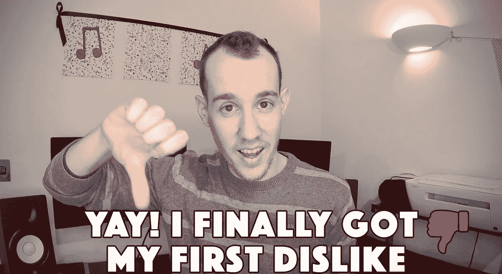
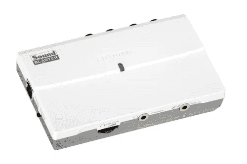
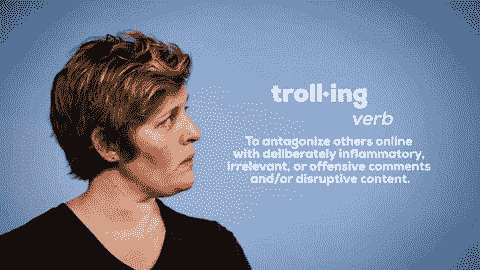

# 耶！我终于有了第一次不喜欢

> 原文：<https://medium.com/swlh/yay-i-finally-got-my-first-dislike-f843666598d2>

## 是的，我确实为此感到高兴！

最近我创办了一个新的 Youtube 频道叫做 [***生命迹象***](https://www.youtube.com/channel/UC4211nC0IOB0FS6eGWM7x7g) ***。*** 我开始它的原因和我写在 Medium 上的原因一样:**帮助你开始或继续你的自我实现之旅。**

**Read? Watch? Maybe both?**
*You can now find my content on Medium (read below) and Youtube (watch above via my channel —* [*Sign of Life*](https://www.youtube.com/channel/UC4211nC0IOB0FS6eGWM7x7g)*). Enjoy!*

2018 年 12 月 6 日，[我的第五个*生命迹象*视频](https://youtu.be/NwyazGT49AE)发布。它在发布后的头几个小时里就有了几十次浏览和几个赞。第二天早上，在检查视频播放效果时，我突然想到了一件事:

# 有人不喜欢我的视频！耶！

Watch the video [here](https://youtu.be/j1FYQ5POJH8)

*注意:在 Youtube 上，有一个喜欢(投票赞成)或不喜欢(投票反对)视频的选项。*

你可能想知道为什么我对此如此高兴。我的意思是，不喜欢是一个明确的信息，有人不赞成我的视频内容，对不对？
嗯，可能是这样。但尽管如此，我还是很开心。更重要的是，我全心全意地拥有它。

我之前的四个视频都被喜欢过。这是一件好事，因为每一次向上投票实际上都促进了视频的传播，并帮助它接触到更广泛的观众。我感谢那些选择支持我的频道的人。谢谢大家！但是那个决定不喜欢我的视频的人传达了我一直在等待的确认:人们对我的内容感兴趣。

不是每个人都会喜欢我的视频，这没关系。在我的视频中，就像我的文章一样，我不会回避生活中一些最敏感的话题。我知道这让很多人不舒服，但这正是问题所在。
那些我们平时不谈的东西，所有我们排斥和否定的思想，都是最重要的。我并不是为了让你感到不舒服而创作内容，但这是在真诚地谈论生活和成就感时的一个既定事实。
**自我提升的过程需要我们面对不同的不适并克服它们**。让我们承认吧——你在舒适区内的任何改变都不是重大改变。

所以当我第一次看到这种不喜欢的时候，我意识到一件重要的事情:那个看我视频的人发现这真的很令人不安。或者她/他只是不同意我的观点。不管怎样，我的信息传达给了她/他。这一点至关重要！

# “去自杀吧”

早在我开始写作和直接处理自我提升之前，我就已经在创作音乐了。[长官。O](http://sir-o.com) 是我创作歌手项目的艺名。音乐，尤其是音乐创作，是我实现自我的另一种方式。

我十一岁开始弹吉他。两年后，我写了第一首歌。**在我十几岁的时候，我写了几十甚至几百首歌，并录制了其中一些**。当时录制音乐并不像今天这样方便，但在 21 世纪早期，这绝对是可能的。支持我的父母给我买了一个电容麦克风，一个有创意的外置声卡，一个小型的百灵达混音器。我大部分时间都在写作和录音。很快，我开始将我的歌曲上传到一个面向创作者的在线网站，有点类似于 Myspace。*(还记得 Myspace 吗？)*

起初，我得到了像*这样的好评:“你太有才了！”*或*“你的前途一片光明。”* 在加入这个在线平台后不久，我就登上了网站的首页，并开始获得更多的订户。由于网上的成功，我甚至被邀请去一家电台表演并接受采访。我当时只有十五岁。

但是这种广泛的认可也吸引了一些巨魔的注意。
*“去自杀吧，”*一个人写道。十几岁的我感到非常可怕和震惊。我记得我父母是如何试图解释这个人只是嫉妒我的成功。*“别让他影响到你。他不值得，”他们说。*

# 天哪，他们是对的！

如果你期望每个人都支持你的创作，那么你会发现很难向世界展示你的音乐或作品。我花了几年时间和几十次伤人的言论才完全理解。那些刻薄的评论更多的是在说写这些评论的人，而不是我。今天，我真的觉得收到巨魔对我创作的东西的评论或厌恶是一种授权。

当有人不喜欢你的东西或对它做出负面评论时，你可以选择被冒犯。你会感到受伤。你可以生气。但是你也可以决定利用这一点。这个人实际上花了她或他自己的时间对你创造的内容作出反应。这让他们感觉到了什么。不管是嫉妒、恐惧、愤怒、不舒服还是怨恨——那个与你的内容互动的人。这是一个巨大的成就！

当你创作并出版你的作品时，你就给了这个世界一些东西。尤其是当它是个人的脆弱部分，迫使你超越你的舒适区。

如果有人不喜欢你的帖子、视频、歌曲或图画，那绝对没问题。只要你对自己创造的东西感到满意，那才是最重要的。世界上有 700 多万人，有人会觉得这很有意义。有人会看到你创造的价值。
你必须拥有自己不喜欢的东西，就像你拥有自己喜欢的东西一样多。
记住:你不是为了取悦每个人而创作。你也不应该。世界上那么多人，总会有人不同意你，嫉妒你，羡慕你，怨恨你或者更糟——叫你去自杀。**你无法控制它。就这样吧。**

不，人们真的希望自己创造的东西得到负面反应。
但是能够拥有那些可恶的评论，才是我们成长的方式。面对负面信息会让我们处于不舒服的境地。只有克服这些不适，你才能进步。

> 我想听听你的意见！有人评论你的帖子/视频/歌曲/图片最糟糕的是什么？加油，拥有它，分享它:)

## 感谢阅读！你可能也会喜欢阅读/观看这些:

 [## 这个假期要避免的 3 件最糟糕的事情

### 别等到明年，好吗？

medium.com](/swlh/3-worst-things-to-avoid-this-holiday-season-4218dc351e22)  [## 为什么冒大风险是你的职责

### 你与你的舒适区之间的长期冲突

medium.com](/swlh/why-it-is-your-duty-to-take-big-risks-b48a33d66b6f) 

## 这篇文章发表在 [The Startup](https://medium.com/swlh) 上，这是 Medium 最大的创业刊物，拥有+398，714 名读者。

## 在此订阅接收[我们的头条新闻](http://growthsupply.com/the-startup-newsletter/)。

