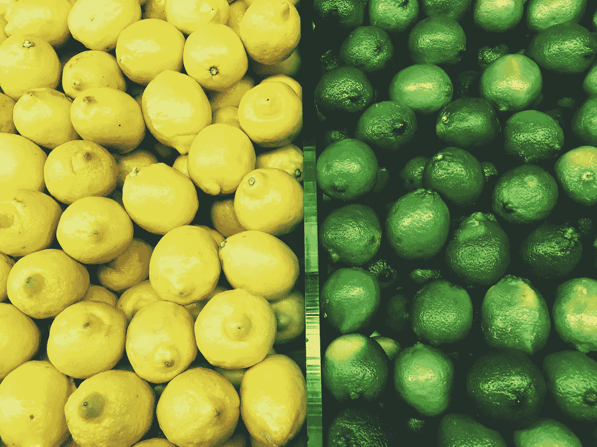
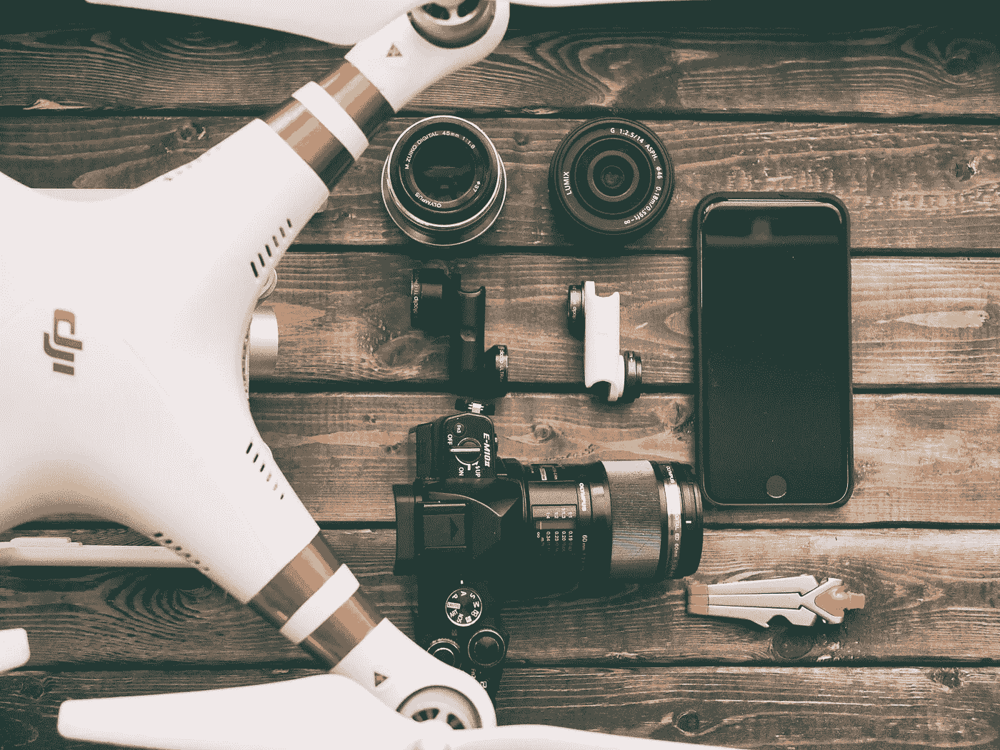

# 昨天的方式和明天的结果:2018 年做生意

> 原文：<https://medium.com/swlh/yesterdays-ways-and-tomorrow-s-results-doing-business-in-2018-d40c1c41930c>

人类住在洞穴里，然后发现如何生火、烧水、吃任何不会伤害他们的东西，然后开始建造房屋，搬到城市，并没有就此停止。不知何故，在这一切之间，人们理解了做生意的概念:而且它在不断地演变。而现在，2018 年年中，我们还在想办法充分利用它。事实是:过去的方法不再能带来需要的结果。他们带来的是几个客户，太多的债务和窒息的感觉。那么我们来学习一下今天的工作原理怎么样？

# 营销从未如此重要

我知道你读了很多关于营销的书:不是人们没有别的东西可谈，而是他们怎么强调它的重要性都不为过。我们已经从线下转移到线上有一段时间了，所以这不是我想和你谈的。我们了解了社交媒体营销、电子邮件营销、内容营销、搜索引擎优化等等。

问题是，一些当时看起来写在石头上的规则实际上是写在岸边的沙滩上。我们以黑帽 SEO 为例。曾几何时，人们能够歪曲事实，操纵谷歌。但那已经过去很久了。因此，我们实际上可以做的是专注于伟大的内容营销。你明白我在说什么吗？

此外，还有社交媒体渠道，比如脸书，它会不时改变算法。在脸书做杀手级营销的唯一方法是及时了解什么样的帖子、视觉效果和内容在这个平台上表现良好。

在 2018 年，仅仅在社交媒体上是不够的，你还必须在你的网站上展示你的在线形象:不是任何一个网站，而是一个有反应的网站。如果曾经创建一个网站是件大事，现在已经不是了。大多数企业求助于网站建设商，甚至不会花太多钱。

接下来是将永远保持相关性和有效性的营销类型。其中之一就是口碑营销:人们总是会说的。如果你让他们高兴，他们会高兴地说话。如果你惹恼了他们，他们会连续几天向几乎所有他们认识的人抱怨你。

哦，我怎么能不谈视频营销呢？这是目前最热门的，它只会接管世界。但是人们并不欣赏各种视频。他们需要你的营销视频是高质量和精心编辑的。去脱颖而出吧。幸运的是，有令人惊奇的[在线视频制作和编辑工具](https://www.renderforest.com)来帮忙了。

# 昨天的方式，明天的结果？

我是这样看的:起初，企业只是按照他们想要的方式制造产品，然后顾客就会购买。从来没有真正的客户服务，企业也不太关心客户想要什么。由于这一切都很新，没有或几乎没有竞争，客户没有其他选择。

然后事情发生了一些变化:新的品牌出现了，并开始相互竞争。因此，企业主被迫在他们的业务中加入[定制和个性化](https://www.towerdata.com/blog/what-is-the-difference-between-personalization-and-customization)，因此开始按照客户想要和需要的方式制造产品。

但这也改变了。在市场营销的帮助下，我们开始明白，我们实际上可以让客户相信，他们需要和想要的东西就是我们制造的产品。所以现在，企业仍然制造他们想要的产品，并“操纵”他们的客户，让他们相信没有产品他们就无法生存。以苹果为例:一旦我们尝试了，我们就成为了忠实的顾客。一旦一种新的、更先进的产品推出，我们别无选择，只能立即拥有它。

这是伟大营销的结果。嗯，这也是拥有强大品牌的结果，但让我们把它留到以后再说吧。

# 没有技术你什么都不是

智能手机、智能背包、智能手表，这样的例子不胜枚举。当我们告诉孩子我们需要用手洗衣服时，他们永远不会相信我们。这还只是最低限度。

事实是，我们已经离不开科技了:我们已经太习惯科技了。这一切让我们的生活变得轻松多了。作为企业主，你需要明白，你为用户提供什么样的产品/服务并不重要，你仍然需要跟上先进的技术，并将它们应用到你的业务中。

# 几乎不可能在人群中脱颖而出

竞争，这就是我说的。如今，每一种产品和每一种服务都有其替代品和竞争对手。但以前不是这样的。人们会想出一些以前从未有人做过的东西，然后将整个市场份额据为己有。今天，我们至少要成为天才。

但是我不打算谈论你如何能想出一个前所未见，前所未有的产品。我要讲的是微分。看起来，在 2018 年，人们不仅想要也需要一个品牌的真实性:他们想看到真实的你，现成产品背后的东西，谁是你的员工，等等。

所以现在，试着做真实的自己，不要隐藏任何你认为不适合公众视线的东西，试着和你的顾客成为朋友。

# 了解最新的业务法规

现在我们都知道，除了设计产品的有趣部分，营销和推广的激励部分，以及内容写作的创意部分，做生意还有一个不那么有趣的部分:[监管部分](https://www.businessnewsdaily.com/7671-regulatory-issues-changes.html)。这不仅仅是 2018 年:及时了解你所在地区的商业法规始终是一件大事。

无论是联邦和州许可，不同的就业法律或税收，了解你的权利是非常重要的。当然，你可以随时雇人，他们会处理好一切。但历史教会我们一件事:信任但要核实。如果你真的不知道你作为一个企业在你的市场中的权利，会计师可以很容易地欺骗你。所以，花一个周末，把一堆监管信息塞进你的大脑:这些额外津贴是值得的。

2018 年为商人带来了一堆不同的东西。现在，由于技术进步、在线营销机会等原因，与您的客户取得联系变得更加容易。它也带来了很多竞争对手，这可能很难让你的用户知道你是最好的。让我们看看接下来会发生什么。

## 这篇文章发表在[《创业](https://medium.com/swlh)》上，这是 Medium 最大的创业刊物，拥有+367，690 读者。

## 订阅接收[我们的头条新闻](http://growthsupply.com/the-startup-newsletter/)。

