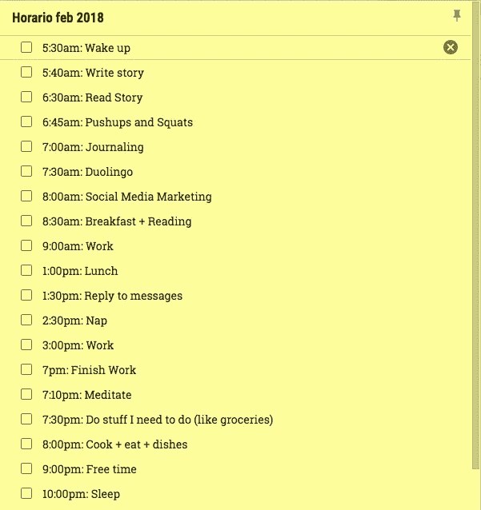
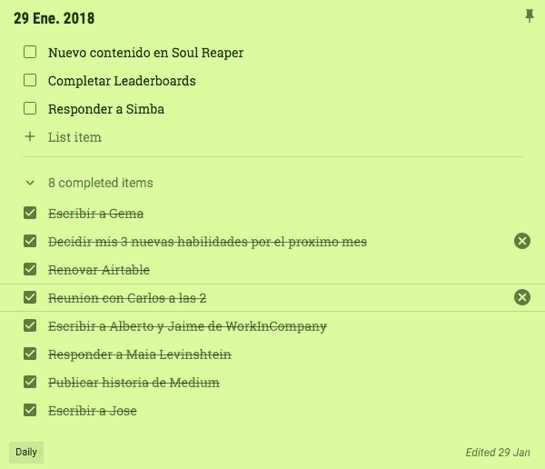

# 你是，或将成为你所做的

> 原文：<https://medium.com/swlh/you-are-or-will-become-what-you-do-e56878c6ab5d>

Photo by [Kaboompics // Karolina](https://www.pexels.com/u/kaboompics/): [https://www.pexels.com/photo/grey-felt-journal-to-do-list-on-a-white-desk-6423/](https://www.pexels.com/photo/grey-felt-journal-to-do-list-on-a-white-desk-6423/)

在你有限的 24 小时里，你是如何度过的？

你计划好了吗？

你预先知道你第二天要做什么吗？

你最经常做什么？

以下是我个人的回答:

这个月我是这样度过的:

Pasted from my Google Keep notes

如你所见，相当详细。下面是我第二天计划的一个例子:

Pasted from my Google Keep notes. Sorry for the Spanish, but I’m learning it, so I’m writing it!

我最常做的事情:[研究灵魂收割者](http://powerlevelstudios.com)。

# 如何做得更多

> *“拖延是时间的窃贼，抓住他。”查尔斯·狄更斯*

如果你分析了我每天的日程安排和一天的计划，你应该很清楚我是什么样的人，或者会成为什么样的人。

如果你知道我的故事，你就会知道[我每个月学习 3 项新技能](https://www.forestco.co/blog/i-learn-3-new-skills-a-month-and-so-can-you)。这个月，我将学习:

*   播客(见早上 6:30:阅读故事)
*   社交媒体营销(见上午 8:00)
*   挪威语(见上午 7:30[多林哥语](https://www.duolingo.com))
*   额外奖励:写日志(见早上 7:00)

上个月，我的一项技能是写作。我想成为一名更好的作家。在 1 月 1 日之前，我没有真正的经历。

嗯，通过每天写作，我真的成为了一名作家。我为《创业与提升》撰稿，并成为媒体领域的顶级作家，涉及灵感、生活、人生课程、自我提升、企业家精神和创业。我现在热爱写作，一些人知道我是一名作家。

几个月前我练习的另一项技能是摄影。我从零开始。我研究了所有的术语，如何拍出好照片等等。我分析了专业人士。不久后，我被邀请去乌干达为 Sundarafund.org 拍照，现在我半专业地做着这件事。

不是所有的技能都能变成金子，但如果我没有做到，我就不会成为一名作家或摄影师。我从没想过我会擅长这些。摄影和写作是创造性的东西。我的职业是软件工程师。

你总能做得比你想象的更多。你有时间。为此做好计划。做一个详细的时间表，并坚持下去。你会浪费更少的时间，更有效率地去做那些让你更接近梦想的事情。

# 结论

我们大多数人都想超越现在的自己。然而，我们没有采取任何措施来实现这一目标。

试试 3 技能法。敢于尝试你舒适区之外的事情。你会发现你比自己想象的要好。

计划你的日子，至少提前一天。对时间要精确。执行一致。

在你意识到之前，你会成为你一直在做的事情。

你能做到的！

# 感谢阅读和分享！:)

**如果你喜欢这个故事，请随意**👏👏👏**几次(最多五十次。说真的)。要获得自我提升的额外帮助和更多，请查看 dannyforest.com 的******。****

# **你可能也喜欢**

**[你是，或将成为你所读到的](https://www.forestco.co/blog/you-are-or-will-become-what-you-read)**

**[你是，或将成为你所听的](https://www.forestco.co/blog/you-are-or-will-become-what-you-listen-to)**

****

## **这个故事发表在 [The Startup](https://medium.com/swlh) 上，这是 Medium 最大的企业家出版物，拥有 293，189+人。**

## **在这里订阅接收[我们的头条新闻](http://growthsupply.com/the-startup-newsletter/)。**

****