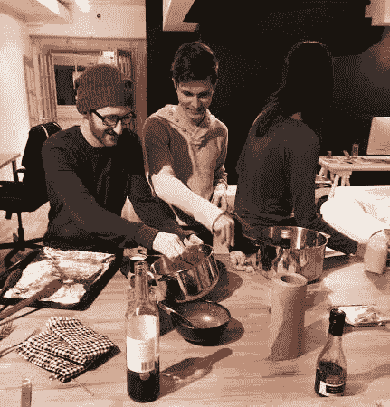

# 问太多问题

> 原文：<https://medium.com/swlh/you-can-never-ask-too-many-questions-6d9926988f82>

## 为什么“为什么”是你的产品工具箱中最重要的工具

*这是第 4 部分的* [*一个 6 部分的系列*](/@mikaelcho/every-mistake-we-made-building-the-last-version-of-our-product-7b086cb8ae77#.69ascbcw8) *在这里，我们分享了我们在剧组制作产品的一切。隐私见鬼去吧。建筑队在公众面前不仅仅充满了荣耀。它充满了我们在创造产品时所面临的挣扎和怀疑。*

当我们第一次考虑如何完全重新设计我们的应用程序时，我们从未定义的问题开始。

然后，我们用[粗略的定义了毛发最多的种类](https://backstage.crew.co/building-in-public/#meeting-2)。这些碎片怎么会流到一起呢？

虽然这导致了更多的问题，但我们回答的每个问题都有助于我们更好地定义每个产品问题的解决方案。我们离采取行动和创造最佳效果的目标更近了。

崇高的、未定义的事物面临的挑战是需要开始的行动通常是不清楚的。

如果你设定了今年写一本书的目标，并把“写书”放在你的待办事项清单上，你可能会继续推迟，因为“写书”不是你可以采取的明确行动。

> 你是从列出所有章节的大纲开始写书，还是从写第一章开始？

“写书”未定义。而未定义的东西是可怕的。他们让你的大脑运转。通常是发到你的收件箱或者脸书。

每天，重要的、未定义的任务都输给了看似紧急的事情，比如电子邮件。这是待办事项列表的陷阱之一。

为了赢。为了做我们想做的影响大、长期的事情，我们必须将目标/任务分解成更小的部分，直到我们有一套具体的有序行动。

如果你想写一本书，不要把“写书”放在你的待办事项清单上，而是把你应该做的第一件事放在上面。比如，“为我的书的主题想三个点子。”

那好多了。现在开始更容易了。

相比之下，当构建 Crew 的下一个版本时，我们开始为我们的产品设定崇高的目标，并将它们分解成更小的部分。现在是时候定义我们的行动了，这样我们就可以开始建设了。

我们或多或少知道我们想要构建什么，但是每个特性仍然需要更深入的讨论才能知道它将如何工作。

某样东西要起作用，必须满足哪些具体条件？

我们是否考虑了所有的用例？

如果 X 不做 X 会怎么样？

我们拿出问题清单，列出了与每个项目应该如何构建相关的问题。

我们这样做是作为一个谷歌文档，这样我们可以先单独评论每个问题，然后讨论我们对如何将它们结合在一起的看法。

对我们来说，这是头脑风暴最有效的方法之一。首先花点个人时间，社会压力就不太可能去迎合别人的想法。我们可以形成自己的观点，不受群体的任何影响。

这允许更多的观点被带到桌面上，这有助于发现更好的方法来构建一些东西。

# 我们都有盲点。这是你抓他们的方法。

例如，这里有一个与创建项目协议相关的问题(该协议规定了在项目开始之前将完成什么、何时以及如何完成工作):

对于协议应该如何运作，我们都有不同的观点。通过给我们每个人单独的时间来思考协议如何运作，我们能够考虑更多的选择，并在一起进行更深入的讨论。

在整个文件中，我们还有许多类似的辩论。

在单独回答了这个谷歌文档中的所有问题后，我们见面讨论每个问题，以确保我们对每个问题都有相同的看法。这是一次很长的会议。大约 7 个小时(中间有做饭和吃晚饭的休息时间)。

这次会议至关重要。一个转折点。我们定义了许多我们一直想建立但没有时间去实现的想法和疯狂的想法。

以下是我们几个月来收集的想法列表(为了保护客户信息，一些项目被模糊了):

理论变成了现实。我们可以开始建造。

是的，我们现在找到的答案很可能会在未来随着我们的构建而改变，但至少我们已经铺好了路。

# 建筑工人在公共场合

*隐私见鬼去吧。《公众中的建筑工人》是一系列 6 篇关于产品设计哲学和我们在设计自己的产品时所面临的斗争的短文。可以在* [*剧组后台博客*](http://backstage.crew.co/building-in-public/) *上阅读正版，在路上启发版。*

## 1.[我们都在销售经验](/swlh/were-all-selling-experiences-58ae13a8a0bc)

## 2.[从问题入手。不是解决方案。](/swlh/start-with-problems-not-solutions-8521c53264b2)

## 3.[约束，而不是障碍](/@mikaelcho/constraints-not-barriers-84629bf49ce2#.1v68qdh2z)

## 4.你在这里

## 5.[剖析一个主页](/@mikaelcho/anatomy-of-a-homepage-redesign-9d911e832c4b#.lhlspqtoa)

## 6.[旅程比目的地更重要:设计最佳入职流程](/@mikaelcho/the-journey-is-as-important-as-the-destination-ddc598989eaf#.ddxqmqyga)

# 又及:新成员

我们最近在 Crew 为我们的产品的一个全新版本再次经历了这个过程。你可以在这里阅读全部内容[。](http://backstage.crew.co/building-crew-2/)

