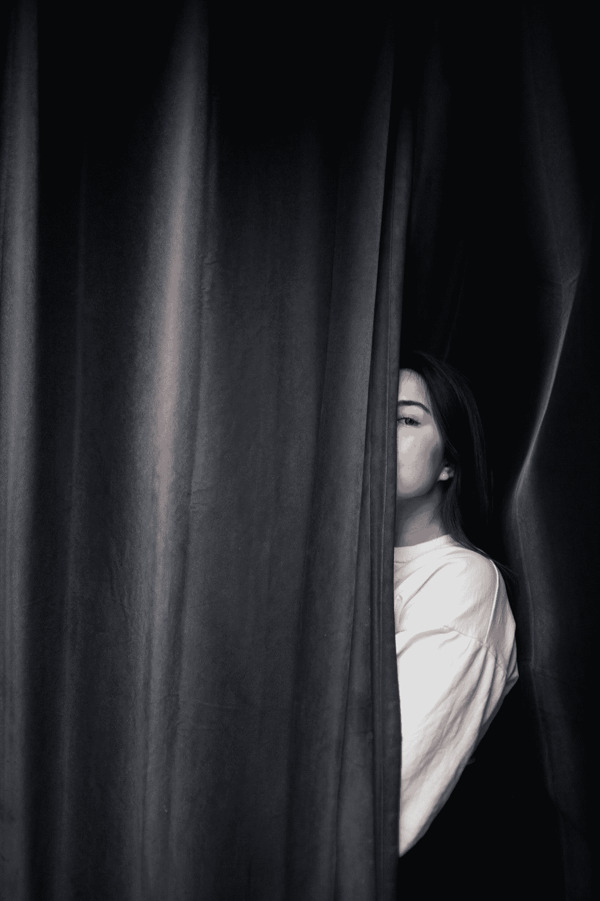

# 你不可能同时成为一个讨人喜欢的人和一个真正的作家

> 原文：<https://medium.com/swlh/you-cant-be-a-people-pleaser-and-an-authentic-writer-at-the-same-time-f283b4df877>

Photo by [Nik MacMillan](https://unsplash.com/@nikarthur?utm_source=medium&utm_medium=referral) on [Unsplash](https://unsplash.com?utm_source=medium&utm_medium=referral)

通常，作者必须决定他们的作品是否会对一些读者产生负面影响。

对我自己来说，这是一场持续的斗争。作为一名作家，这可能是我做真实的自己或想取悦所有人之间的一个障碍。