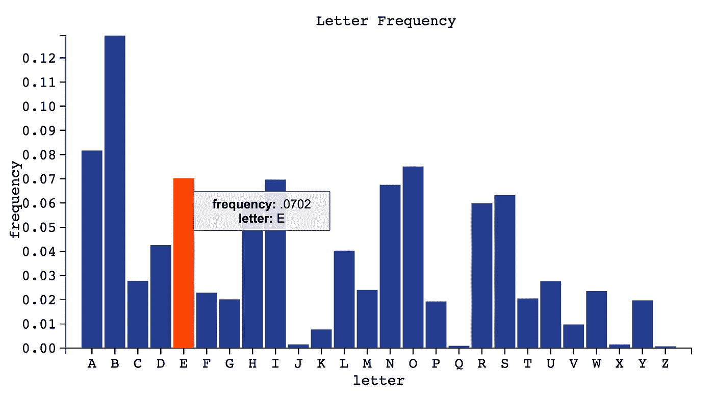
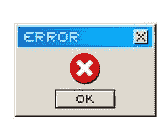

# 你不必成为一个编程奇才来构建一个开源库

> 原文：<https://medium.com/swlh/you-don-t-have-to-be-a-programming-wizard-to-build-an-open-source-library-8b788fa51bf3>

如果说在过去的几个月里，我从编程中学到了什么的话，那就是你不必成为一个编程奇才就能创造出有用的东西。

例子:我的队友[巴农·伊德里斯](https://twitter.com/banunatina?ref_src=twsrc%5Egoogle%7Ctwcamp%5Eserp%7Ctwgr%5Eauthor)，科林·希尔和我花了几周时间建立了我们的第一个开源库。我们称之为 [tld3.js](https://iam-peekay.gitbooks.io/tld3/content/index.html) 。这使得开发人员更容易用 [d3.js](http://d3js.org/) 构建图形。

…这有什么关系？这很重要，因为我们三个全职编码还不到一年，但我们仍然成功了！

构建一个开源库与构建 web 应用程序或网站完全不同，我们在这个过程中学到了一些重要的经验。

Web 开发充满了不必要的痛点，通过开源项目解决它们比你想象的更容易(也更有回报)。

…不一定要改变世界。不一定要完美。说实话，甚至都不用。最糟糕的情况是你作为一名开发人员来培养你的技能。

我希望这篇文章对任何有兴趣为开源社区做贡献的人都有用。

## 设计模式和 API 设计:让它变得简单

我们很早就决定，我们库最重要的目标是*让不熟悉 d3.js* 的初学者或程序员尽可能容易地使用它。

没有面部融化。没有困惑。只是一个简单、最小的 API，向最终用户公开足够多的方法，使它们更有效率。

现在，不要误解我们——“最小”不一定意味着“不太有用”这只是意味着确保最终用户不会在他们不愿意的时候被卷入其中。

这可能是我们在这个项目中做出的最好的决定。为什么？因为这迫使我们时刻关注最终用户——找出理想的用户体验，然后从那里开始逆向工作。

## 未来展望:使其可扩展

我们的第二个目标是使我们的库可扩展，这样将来添加特性和修复错误就容易了。唯一比编写代码更重要的事情是使它可维护——这不是一个我们想完成就束之高阁的项目。

在使我们的库可扩展的过程中，我们在前 10 天一遍又一遍地结对编程构建和重构代码。每一次都变得越来越好，直到它最终感觉“正确”我们对自己的要求很高，因为我们知道深入思考和迭代设计从长远来看会对我们有所帮助。

我们在整个开发阶段保持自我检查的方法之一是不断地问自己:“如果我们在 GitHub 上偶然发现它，我们会想要使用它吗？”

…所以我们不断重复，直到答案是“他妈的是的！*npm 安装 tld3*！"

## 认真对待测试和 CI

我们知道测试和持续集成(CI)对于构建一个健壮的库至关重要。

因此，不言而喻，我们必须编写干净的模块化代码，并牢记测试。CI 在这里真的救了我们:我无法想象用任何其他方法来处理这样的项目。

对于更广泛的受众:持续集成是指开发人员将代码集成到一个共享的存储库中，然后通过自动化构建过程进行验证。这样，如果构建失败，我们会立即检测到它——提示构建失败的贡献者修复错误并重新提交。

除了有助于减少集成问题和加快添加新功能的时间，我们在这种方法中看到的最重要的好处是增加了可见性。如果构建失败了，团队中的每个人都知道。这让我们保持警觉，更重要的是，让我们负起责任。

经验教训:没有比自动化基础设施运行测试用例更舒服的了。

## 架构问题:使用“正确的”文件夹结构

当您构建 web 应用程序时，目录结构或多或少可以是自由格式的。当然有惯例和最佳实践，但在大多数情况下，您可以按照自己喜欢的方式来做。

当你在建图书馆时，情况就不同了。老实说，我不知道从何说起！直到我花了一些时间研究我最喜欢的开源库(lodash、Backbone、jQuery、Redux 等等)，这个结构才真正“点击”起来。

为什么它如此重要？开源项目本质上是面向公众的。它们是为很多人共享和修改而设计的，所以使结构在某种程度上与社区规范保持一致会让其他人更容易理解你的代码库——尤其是其他贡献者。

(请关注稍后的后续帖子！)

## 翻书:(医生)^ 747。

你可能知道，[我喜欢文档](/@preethikasireddy/documentation-is-scary-for-newcomers-7599294a96b9#.rfjeh9452)。所以我是团队中的文档忍者是很合适的。

在这个项目中，我希望每个功能都被记录下来:

*   输入是什么？
*   输出是什么？
*   为什么它会首先存在？

当他们遇到一个库时，没有人应该问这些问题，所以我知道 docs 对未来的贡献者来说是至关重要的——坦白地说，当我们从现在起几周或几个月后看代码库时，对我们来说也是如此。我们都知道，过一段时间后回头看你的代码，并确切地知道你为什么做某事，真的很难。

我很高兴地说，我们已经有了一些[令人惊奇的文档](https://iam-peekay.gitbooks.io/tld3/content/index.html)和[源代码注释](http://iam-peekay.github.io/tld3/)。:)

## 工具是艰苦的:但是你必须做

如果用户无法使用库，那么库就没有用，所以我们必须学习如何将包发布到 npm。我们有很多问题:

*   我们应该将 node_modules 文件夹签入 git 吗？(快速回答:没有)
*   典型的文件夹结构是什么样的？
*   我们如何向 GitHub 发布新版本？去 npm？
*   我们如何实现语义版本控制？
*   在拙劣的发布之后，我们如何纠正错误？
*   还有很多很多…

幸运的是，一些仔细的谷歌搜索能够回答我们所有的问题。开源的一大好处是它“无处不在”即使当你感到困惑时，在某个地方也可能有详细的答案(或探索)!

## 环境问题:数十亿的选择

挑选工具来管理我们的林挺、测试、构建和部署过程是非常棘手的。(主要是因为生态系统中工具的多样性以及对什么最好的看法不同。)

例如，我们选择了几种不同的客户端捆绑器，并在此过程中构建工具，包括 Webpack、Browserify、Gulp 和 Grunt。很难找出哪种组合最适合我们，所以我们都尝试了一下。最终我们决定使用 Webpack 和 Gulp——web pack 是因为我们喜欢它与 Babel 和 Gulp 的配合，因为我们更喜欢编写代码而不是配置。

这些事情没有对错之分。这只是取决于您在寻找什么，以及您愿意为一种工具和另一种工具做出什么样的权衡。在这方面，尝试不同的工具有助于我们学会在系统中导航，并理解不同方法的利弊。

## 错误处理:生成有用的错误消息

作为一名开发人员，我讨厌含糊的错误消息。满怀激情地憎恨他们。如果你正在读这篇文章，你可能也在读。

考虑到这一点，我们希望编写对用户真正有意义的错误消息。而不是“错误发生”的消息，让你在一个森林中。

其次，错误处理也意味着识别和规划边缘情况。我们知道开发人员(和人们)不会按照完美的意图使用产品(或库)。差远了。

…我的意思是，想想你最后一次阅读说明书的时候；)

我们特别注意对所有类型的输入进行编码错误处理——有效的或无效的——并向最终用户提供尽可能描述性的错误消息。

## 结论

建立一个开源库让我们超越了极限。

我们在这个过程中犯了一大堆错误，tld3.js 确实有一些明显的缺点。但最终，构建一个完美的库并不是重点——重点是展示我们在编程之旅中获得的承诺和自信。我最喜欢的部分是，它加深了我们对 JavaScript 以及如何编写好代码的理解，这比获得特定工具或框架的经验更重要。

…在这个过程中，我们发现“凡人”也能像“编程奇才”一样构建有用且实用的开源库:)

## 接触

如果你对如何使用 [tld3.js](https://github.com/pbc-labs/tld3) 有任何问题或者想要帮助我们，发推特给我 [@iam_preethi](https://twitter.com/iam_preethi) 或者发电子邮件给我 iam.preethi.k@gmail.com。

最后，如果我能一如既往地帮上忙，请联系我:)