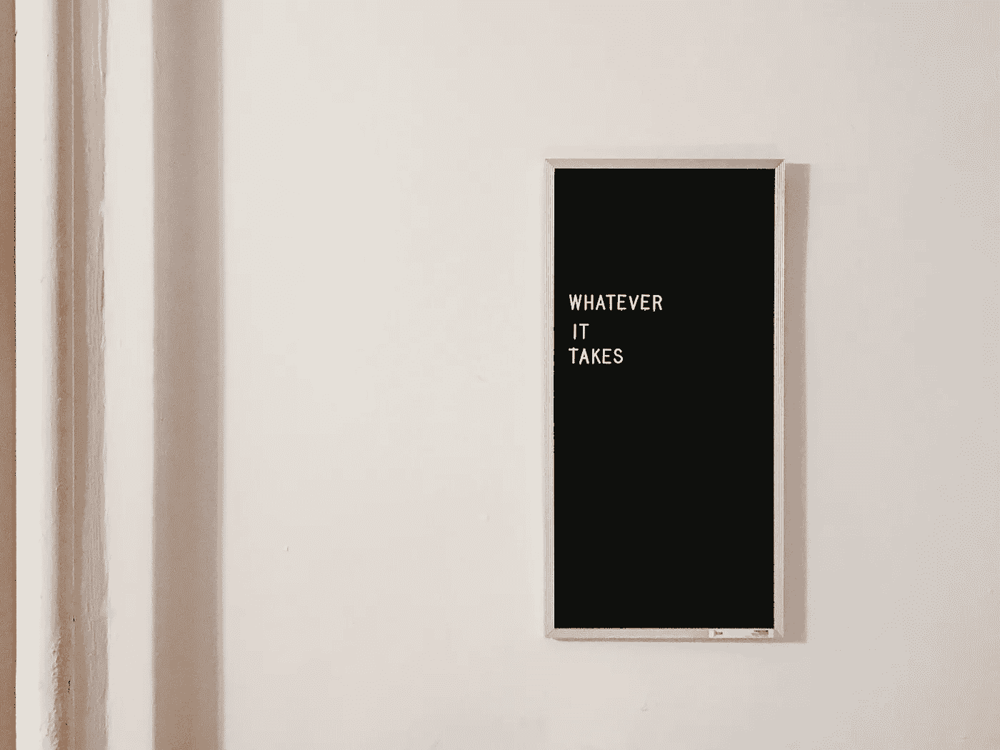

# 你不必喜欢它

> 原文：<https://medium.com/swlh/you-dont-have-to-like-it-46733f807fbb>

## 你只要去做就行了

> "力量和成长只有通过不断的努力和奋斗才能获得."~拿破仑·希尔

为了一些真理，和自己赛跑……有些时候你并不喜欢。你可以过着每个人都梦想的生活，拥有所有的资源、独立和来自梦想成真的喜悦，但仍然会有你醒来后不想做什么的时候。那里 ***将是*** 你在通往创造性独立的旅程中不得不做的事情，而你 ***将不会*** 喜欢。如果你是一名作家，你可能会讨厌商业方面的东西。如果你是一名画家，你可能会讨厌网络。摄影师？也许你不喜欢写作，不喜欢做营销。大多数创意者只喜欢创造，但世界并不是这样的。

## 区别在于心态

我十几岁的时候读过一本关于海军海豹突击队的书，书中描述了他的训练，他在军队的时光，以及他的一些哲学，其中一个在过去的十五年里一直困扰着我。也就是“不一定要喜欢，一定要做。”这句话的美妙之处在于它的简洁。即使你作为一个创意者“成功了”,也会有你不愿意去做的任务。你不需要喜欢他们，你只需要做他们。

这是成功人士和失败人士之间的主要区别。那些取得成功的人展示了决心和勇气去做那些需要做的事情，即使他们讨厌这样做。今天，当你度过一天的时候，想想你不想做的事情，你不喜欢的事情，问自己几个问题。

*>我为什么不喜欢？*

*>我是因为不喜欢而懒惰还是冷漠？*

这个任务是否阻碍了我完成一些重要的事情？

思考这些问题，诚实地回答，然后采取相应的行动。如果你被忽视的任务仅仅是因为不喜欢，如果你懒惰或冷漠，或者如果它们阻止你在一个项目或目标上前进，咬紧牙关去做。你不需要喜欢/享受这个过程，你只需要去做！请记住，你越快完成令人沮丧的任务，你就能越快回到你热爱的工作中。

做一些不愉快的事情需要努力。正是坚持不懈和愿意参与任何需要做的事情，区分了专业人士和业余爱好者，区分了成功者和失败者。一切都归结于一个选择。

即使不好玩，你也会选择去做吗？

创造力是一生的旅程，有起点也有终点。通常，创意人员感到孤独和脆弱，他们被困在一个盒子里，太害怕了，不敢出来。他们害怕消极的声音，不知道如何开始，不清楚自己是谁，厌倦了开始项目却不知所措，丢下项目不管。我创建了一个简短的免费下载，讨论这些趋势，并给你一些实用的想法和提示，你可以今天就实施*，做出改变，在你的创作之旅中前进。您可以通过下面的链接获得免费下载。*

*[在这里获得电子书！](http://www.michaelehenson.com/opt-in)*

**

## *这篇文章发表在 [The Startup](https://medium.com/swlh) 上，这是 Medium 最大的创业刊物，有 273，384+人关注。*

## *订阅接收[我们的头条新闻](http://growthsupply.com/the-startup-newsletter/)。*

**