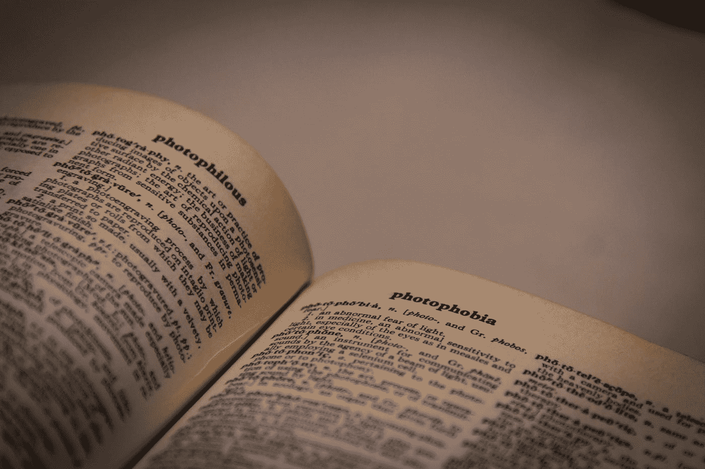

# 你不需要华丽的词藻就能成为伟大的作家

> 原文：<https://medium.com/swlh/you-dont-need-big-shiny-words-to-be-a-great-writer-4e491ddcb347>

Photo by [ActionVance](https://unsplash.com/@actionvance?utm_source=medium&utm_medium=referral) on [Unsplash](https://unsplash.com?utm_source=medium&utm_medium=referral)

当我开始在 Medium 上的写作之旅时，我发现了很多关于我写作风格的东西，并对这个平台上的人才感到惊叹。我们都有相同的优势，因为我们可以强迫对方，交流，唤起，并用一种可以理解的语言写下我们的作品。这实际上是我选择成为付费会员的第一个原因。