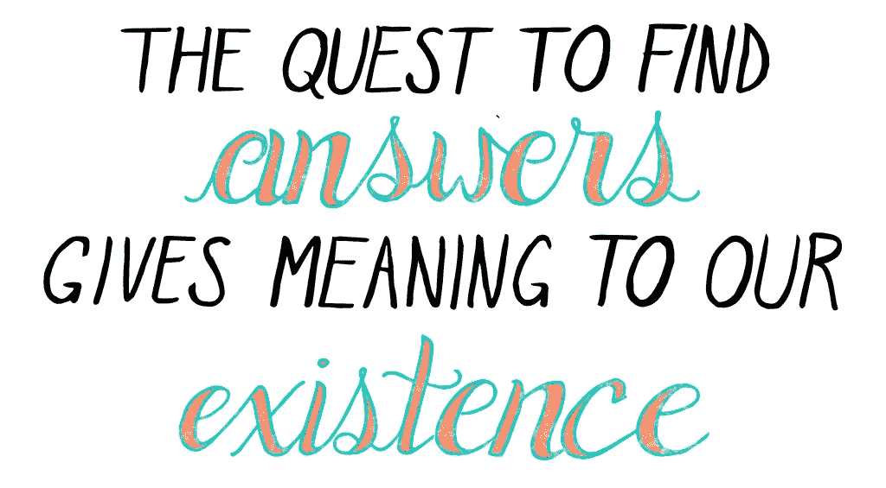

# 你不会直接获得成功，这两句话揭示了成功之路

> 原文：<https://medium.com/swlh/you-dont-reach-success-directly-these-two-quotes-reveal-the-path-43cd8928f699>

Art by Emily May Rose

这两个由两个改变游戏规则的思想家提出的改变游戏规则的名言是一个很好的例子，说明了作为你练习质量的副产品，成功是如何间接达到的。

正如传奇精神病学家维克多·弗兰克尔所说:

> “不要以成功为目标。你越是瞄准它，让它成为目标，你就越是会错过它。因为成功和幸福一样，是不可追求的；它必须随之而来，而且它只是作为一个人献身于比自己更伟大的事业的意外副作用，或者作为一个人屈服于一个人而不是自己的副产品。”

我一直致力于将我们所做的一切提炼为可以影响他人的简单原则，当我看到这些顶级思想家分享相同基本原则的引文时，我受到了启发，写下了这篇文章并分享。

最近几周，全球最大对冲基金的全球宏观投资顾问亚当·罗宾逊和多伦多大学心理学教授乔丹·彼得森提供了两个引语，这两个引语进一步挠了我的痒处，我继续[探索是什么驱使我们最大限度地发挥我们的潜力](/swlh/the-surprising-secret-to-changing-the-world-dd4d2519f940)。

这是罗宾逊在《脸书邮报》上的报道:

> 听着，揭示成功的终极秘密
> 
> 用 10 个词概括生活的方方面面！
> 
> 扔掉所有的入门书籍——遵循这个原则，
> 
> 我保证世界是你的:
> 
> "真诚热情地关注你遇到的每一个人."
> 
> 其他一切随之而来。
> 
> 就这么简单。

当你对周围的一切和每个人都感兴趣时，你就是好奇的。结果就是在创建你想要的高质量联系的同时，更多地了解他人。这种联系表明你在乎，因为你是一个有爱心的人，而不是因为你想要什么。

这种意图被感受到了——能量是[丰富而有吸引力的](/@ARTaghavi/the-secret-to-getting-what-you-want-9a3448d5490)。

对你来说，结果是你在短期内对某人有了更多的了解，但是从长远来看，那个人的世界(和网络)已经变成了你的世界。

那个人拥有的一切对你来说都变得触手可及。

我们想要成功的任何努力最终都需要其他人的合作，这需要他们之间的信任。

如果你把这个原则作为日常生活的一个习惯来思考，随着时间的推移，你会信任你需要的每一个人——实现你想要的一切。

那么，仅仅通过好奇和对你周围的每个人充满热情的兴趣，你收获了多少呢？

这样做，它将会对你的生活产生深远的影响。

# 为自己学习历史

我意识到我最近对历史着迷了，好几次贪婪地阅读了哈拉里的《智人》(T0)和戴蒙德的《枪支、细菌和钢铁》(T2)以及亚当·斯密的《国富论》(T5)。

每天早上，我都完全遵循自己的创造本能，花几个小时仔细阅读五到七本书，让我的心流引导我。

我喜欢学习任何一门学科，但是我发现我每天都越来越被历史所吸引。

我对生命意义的最新结论如下:

Art by Emily May Rose

历史会重演，因此这是积累宏观知识、学习发现趋势以及这些趋势在大众广泛采用周期中所处位置的最佳方式之一。

在我在 Youtube 上看的乔丹·彼得森的演讲中(抱歉，我没有把视频加入书签，因为我刚刚受到启发写了这篇文章，并记住了这句话！)，他说:

> “你应该学习历史来了解你自己”。

它和罗宾逊一样强调好奇心，对过去的人真诚和热情的兴趣是了解自己的途径。

我突然意识到，这两个原则都是最大化我们潜力的间接方式[，如果每天都考虑，它们可以作为伟大的路标。](/swlh/the-surprising-secret-to-changing-the-world-dd4d2519f940)

对我来说，它们已经正式成为“方式”——当我对我职业生涯的最后十年进行案例研究时，我知道每一个伟大的成果都是因为我最感兴趣的人。

然后，我把它们与我的成功率联系起来，因为成功率越来越高，我越来越喜欢阅读我日常技能之外的书籍。当然还有更多，因为在过去的十年里，我显然获得了其他的经验。

然而，我学到的最重要的一件事是

> 带着了解自己的动机学习知识会增加自我意识——这种自我意识需要理解自我实现不是一个终点，而是一个永无止境的成长之旅。

你是一个人，仅凭这一点你就有无限的潜力。凭借想象力和复杂的目标设定。

鸟儿不需要“学习”飞行，它们只需飞行 1000 英里，因为那是它们的“成功本能”。就像松鼠不需要学习储存坚果过冬一样，这是它们天生的成功本能。

我们是唯一能够想象复杂计划的哺乳动物，为成千上万的人建造飞船和军队，执行协调一致的任务。

承担更大更复杂的目标完全取决于你。为了实现这些目标，你需要做的就是实践这些原则！

## 结论

我们对周围的每一个人都感兴趣，因为我们渴望了解、想要学习、渴望知道——这让我们超越了个人潜力。

我们阅读历史是为了渴望理解，渴望学习，渴望知道——这导致了超越我们的潜力。

这些主要思想家的两句引语都指出了好奇心本身的特点。

这些主要思想家的两句名言都指向了对学习的热爱，因为我们知道的越多，我们就越成功。

考虑把这些名言贴在你的电脑上或墙上，每天沉思。

体现它们，直到它们成为你的一部分，这个世界就会找到你的门。

## [每周一次点击接收我承诺的改变游戏规则的文章，这是你在互联网上其他地方找不到的。你还会收到我的 36 条原则指南，指导你如何掌控他人，以你希望被对待的方式被对待——并在你所做的事情上成为世界上最好的。我保证你不会后悔的。](https://betreatedhowyouwanttobetreated.com/optin-main)

## 这篇文章发表在《T4》杂志的《创业》(The Startup)上，这是 Medium 最大的创业刊物，拥有 315，628 名读者。

## 在这里订阅接收[我们的头条新闻](http://growthsupply.com/the-startup-newsletter/)。

