# 你不懂复合增长

> 原文：<https://medium.com/swlh/you-dont-understand-compound-growth-6454537b6070>

爱因斯坦曾经([大概是](https://www.snopes.com/fact-check/compound-interest/))说过:

> *复利是宇宙中最强大的力量*

对于复利，沃伦·巴菲特[宣称](https://www.marketwatch.com/story/this-warren-buffett-rule-can-work-wonders-on-your-portfolio-2016-04-26):

> 随着时间的推移，它完成了非凡的事情

复利或增长是自然界中最强大、最有影响力的力量之一。

然而，这也是商业世界中最常被误解的事情之一。

为什么

简单地说，我们错误地将“复合增长”这个术语用于那些实际上并没有复合增长的事物。

让我们首先确定“复合增长”到底是什么意思。

我提出以下有效定义:

> *复合增长~持续增长*

事实是，很少有物体、有机体或组织能够在一个较长的时期内维持真正的复合增长。

从一个观察者或投资者的角度来看，很容易欺骗自己认为复合的，指数增长比它实际上更常见。考虑到这个词经常被提起，这是可以理解的。处于快速增长短暂阶段的公司可以用无处不在、臭名昭著的“[曲棍球棒](https://andrewchen.co/the-most-common-mistake-when-forecasting-growth-for-new-products-and-how-to-fix-it/)”图表直观地展示他们的飞速发展。

谁会反对呢？

作为一名企业家或经营者，你也可能成为自己虚构故事的牺牲品——当你真正破解了存钱罐时，你会说服自己“破解了密码”。非理性繁荣最终变成了凹形，最终以线性的平稳状态结束。

通过一些例子，我希望证明复合增长 1)意味着持续增长 2)极其罕见，3)对于建立一个大的、有价值的企业是极其重要的。

但是在我们进入正题之前，我们先来谈谈——细菌。

# 细菌和砌砖工

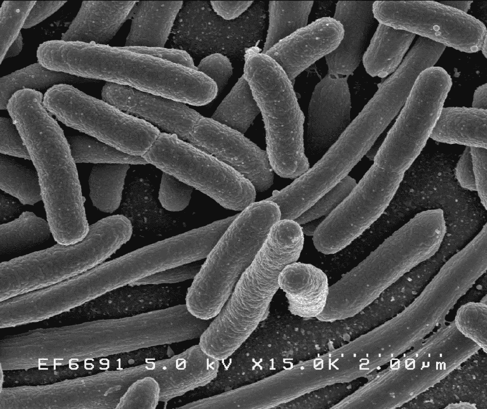

在细菌群体中，生长是固定的。细菌受制于其栖息环境的资源限制，无限期地以恒定的速度生长。

举一个简单的例子来说明这一点:

假设我们有一些细菌按照固定的时间表繁殖，每分钟繁殖一次以保持数量简单。

我们从单个细菌细胞开始。一分钟后，我们会有两个细菌。随着时间的推移，人口增长如下:

现在我们问这个问题，我们的细菌数量增长有多快(以百分比计算)？

一分钟后细菌细胞的数量是:

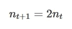

这意味着每分钟的增长率是:

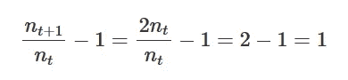

或者 100%。

这是一个完美复合增长的例子，也被称为指数增长或几何增长。

简单地说，细菌生长的速度完全与种群大小无关。换句话说，增长和规模完全不相关。

重要的是，**大多数事情不是这样运作的**。

# 在…上分层

让我们看另一个例子——建造一堵砖墙。

假设一个砌砖工每小时能砌 10 块砖。砖块计数将按如下方式进行

砖块数每小时增加 10 块。

从上面开始进行相同的增长率计算:

从现在起 1 小时后的砖块数量将为:

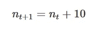

这意味着每小时的增长率是:

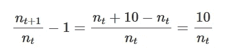

注意增长率取决于我们已经砌了多少块砖。这就是**线性**或**算术增长**。因为随着时间的推移，每小时砌的砖的数量是静态的，所以增长(以百分比计算)必然会放缓。规模是分母。所以，成长和规模是负相关的:规模多- >成长少。

当然，最初我们增加砖块的数量相当快，事实上是 100%。但是到了 30 块砖的时候，我们的前瞻性增长率已经降到了 33%。100 块砖时，我们只会增长 10%——这与我们科技记者和风险投资家看着我们不断增长的(科技支持的)砌砖业务的好日子相去甚远。

# 两种口味的增长

砖块和细菌之间的关键区别在于，一个有**尺度不变生长(SIG)** 而另一个……没有。

好吧好吧，在发表之前评论过这篇文章的朋友说，这是一个突然下降的大词/短语。因此，让我们先退后一步，从视觉上审视这一现象，然后再继续。

一个很好的方法是绘制细菌和砖块随时间的生长率:

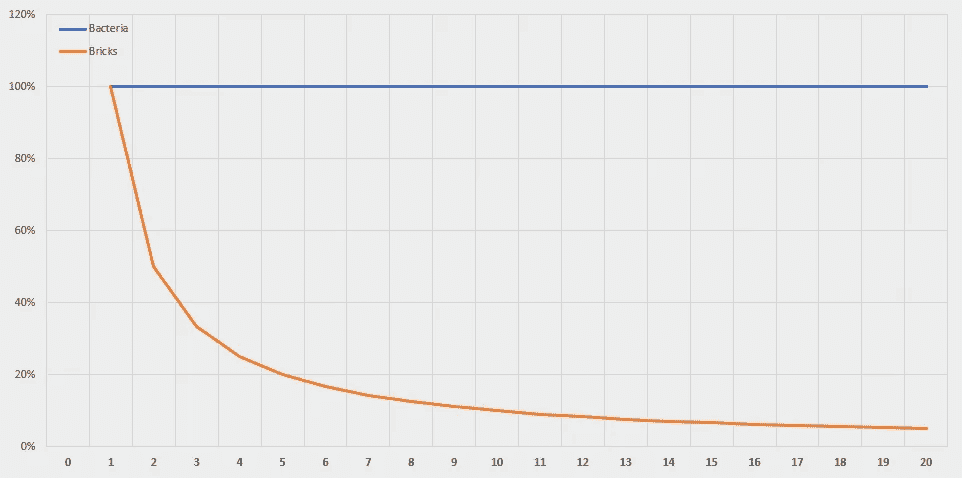

随着时间的推移，细菌以恒定的速度生长。对于砖家来说，增长只是……崩溃。

这些年来，我已经绘制了这个图表数百次，对于大多数初创公司来说，增长曲线看起来与这里的砖块惊人地相似。

成长不是自然规律；不能认为增长是理所当然的。随着我们变得越来越大，我们变得越来越慢。

我之前提到过相关性。就细菌而言，生长和规模之间的相关性是**0**——完全不相关。

对于砖块数，相关性是 **-0.7** ，非常强的负相关性。

我们现在已经建立了一个光谱的两端，可以用来描述各种形式的增长。

一边是线性/加法/算术/相关增长，另一边是指数/乘法/几何/不相关增长。

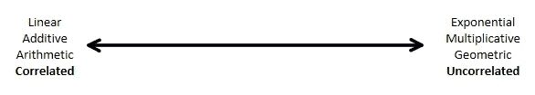

现在的问题是，各种各样的东西在这个光谱上属于哪里？换句话说，说“XYZ”以复合方式增长有多准确？

让我们再看一些例子。

# 债务

复合增长通常用于指某种金融工具的复利。

任何经历过不断增加的信用卡债务的人都非常清楚这一点。债务像细菌一样增长——它以完全取决于利率而完全不取决于当前余额的速度无止境地增长。

1%，5%，10% —不管利率是多少，除非还清，否则债务会无止境地增长。如果只是部分还清，剩余余额还会继续增长。

如果你问我，我觉得这是个不错的商业模式。

# 世界人均国内生产总值

成长不是事物的自然状态。在人类历史的大部分时间里，普通人的生活水平没有显著的经济增长或提高。直到最近，生活还是令人厌恶的，野蛮的，短暂的，静止的:

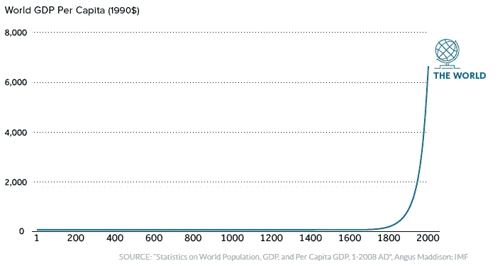

除非增长确实是契约性的，就像债务和利息的情况一样，否则我们不能想当然，历史清楚地表明了这一点。

这不仅仅是轴线大小的问题。如果你放大那条长直线，你不会看到一个曲棍球棒增长模式。事实上，对于这个星球上的绝大多数人类来说，T2 的生活水平并没有随着时间的推移而有意义地提高。

几年的恶劣天气，黑死病(细菌再次来袭)等重大流行病，社会动荡——这些事件极大地影响了我们祖先的日常福祉和生活，往往会抹去几十年的进步。

即使在今天，世界上许多地区的增长率仍在大幅波动，尤其是在发展中国家。一些地区和国家可能会陷入严重的经济低迷，导致整整一代人的失落。

多次停停走走，时好时坏。

然而，在我们变得太沮丧之前，让我们看看最好的情况。

# 美国国内生产总值

A(实际国内生产总值)的优点:

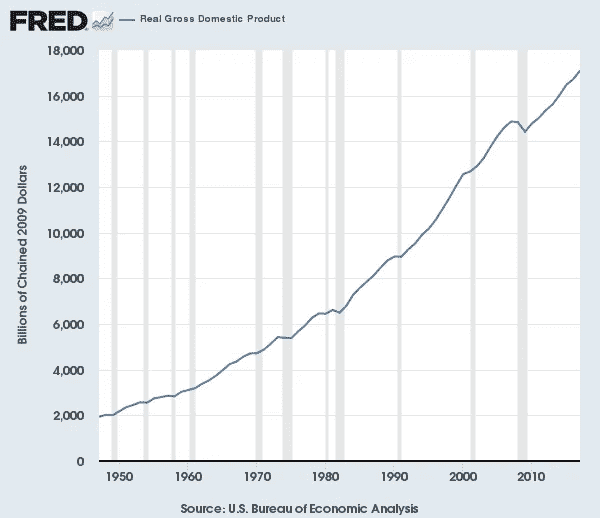

看起来不错吧？让我们来看看增长图:

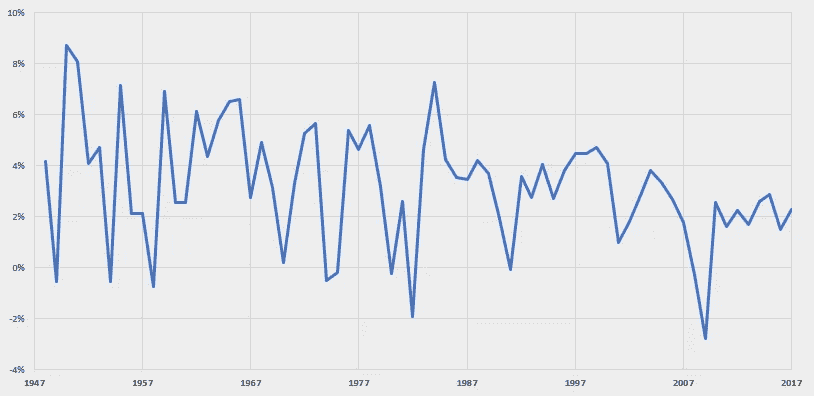

呃，这太吵了。很难判断每年的增长率是否有显著的变化，或者是否在某个值附近有总体变化。

这个视图隐藏了一些有趣的细节。一个巧妙的数学技巧——取自然对数重新标度一个指标，这样，当绘制成图时，*线性意味着恒定增长*。

这样做，真实的 GDP 图表就变成了:

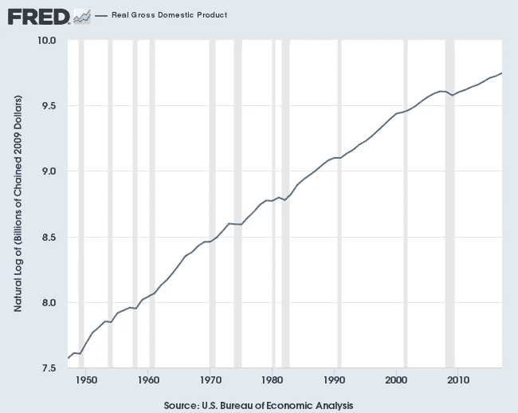

在此期间，我们可以进行一些有趣的观察:

*   对数实际国内生产总值是令人印象深刻的线性——人们可以很好地用一条线性线来拟合上述数据，这意味着相当稳定的增长
*   也就是说，根据我们之前的定义，它不是完全线性的，因此也不是完全复合的
*   我们可以看到与衰退(1970 年、2008 年)相关的多个不同的增长拐点

利用曲线中的这些拐点，让我们通过分段线性回归(即每个时期的“最佳拟合线”)来估计每个时期的增长:

年实际增长率从 1947-1970 年期间的 **3.9%** ，到 1970-2008 年期间的 **3.1%** ，再到 2008-2017 年期间的 **2.1%** 。

在最近的经济衰退之后，经济学家们大喊大叫说我们正处于持续走低的轨道上。

所以不完全是持续增长，但鉴于实体经济在此期间增长了 8 倍以上，这仍然令人印象深刻。在 70 年的时间里，增长大约减半。

就增长与规模的联系而言，这里的相关性是 **-0.3** ，这当然表明有关系，但不是很强的关系。

因此，我们可以得出结论，美国 GDP 以合理的复合方式增长。

# 收入

随着时间的推移，大多数企业的收入增长率都会下降。对于如今快速成长的公司来说，更是如此。

另一方面，一些杰出的企业成功地推动了真正的长期复合增长。

以亚马逊为例，随着时间的推移，其收入呈现出难以置信的增长(10 亿美元):

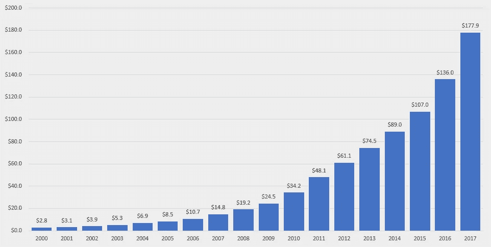

这是一张令人印象深刻的图表。但实际上，对数转换后的图表给我留下了更深刻的印象，它几乎是一条直线:

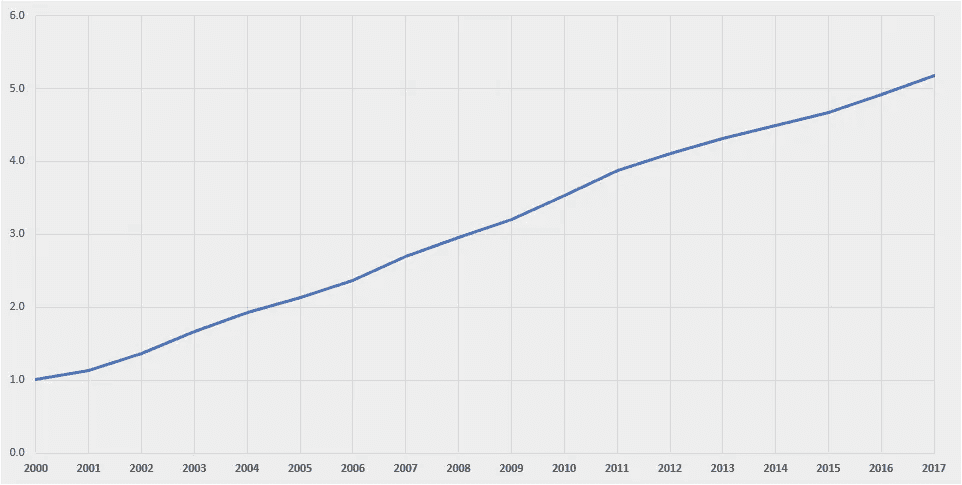

**亚马逊在近二十年的时间里以近乎恒定的速度增长**，尽管在此期间规模增长了 64 倍。

在最好的情况下，人们可以看出 2011 年的增长出现了轻微的拐点。复制分段分析，我们可以看到亚马逊从 2000 年到 2011 年同比增长约 30%，从 2011 年到 2017 年同比增长约 23%。

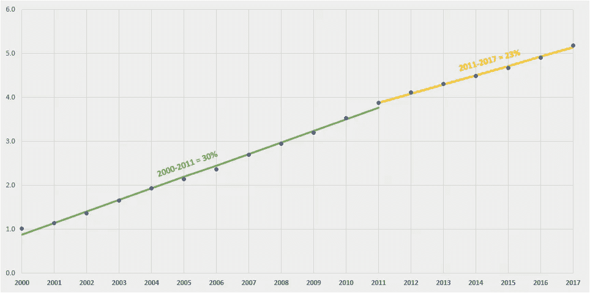

亚马逊的增长规模相关性？ **-0.1** ！

很难用语言来描述这个数字有多令人印象深刻。值得重申的是:**大多数事情并不是这样运作的**。

亚马逊是一家与众不同的企业，它显然已经找到了一条多年来以近乎恒定的速度增长的道路。利用电子商务的长期增长和向看似正交的空间(例如，通过亚马逊网络服务)的灵活扩张相结合，实际上利用了该公司长期以来建立的核心基础设施，使其能够以细菌般的方式增长。

# 增长函数:是加法还是乘法？

对于这个问题，每个成长中的企业都需要一个诚实的答案:你的企业是像亚马逊细菌一样通过增殖来成长，还是像砖墙一样通过加法来成长？

根据我们之前概述的简单数学，简单“增加”的企业必然会减慢速度。规模开始对你不利，让你越来越难保持快速的增长速度。**最后，打个比方，你会碰壁**。

加法增长函数的一个例子是通过像 Google Adwords 这样的渠道获得付费客户。

在 Adwords 上花 100 美元会产生一定数量的用户。再花 100 美元可能会产生类似数量的用户，以此类推。

**这里没有“魔法”。这是最直接的“购买增长”。**

如果说有什么不同的话，通过你无法控制的付费渠道获得客户(Adwords 就是这种情况的缩影)往往会随着时间的推移而变得越来越低效，因为你会让关键词等变得饱和。

就像一个瓦工在漫长的一天结束时一样，依赖这种增长方式的企业迟早会耗尽天然气。

当然，你可以尝试以越来越快的速度堆砌砖块，当你无法再自筹资金时筹集风险资本，把墙建得更高…

但是这也会过去的。最终，这些用户中的一部分人*必须*留在你身边，继续从你那里购买，而不需要你额外支付有意义的费用，否则，你会发现自己陷入了众所周知的**“收购跑步机”**，无法在不对业务造成重大干扰的情况下起步。

订阅电子商务领域的许多公司“给我发送一个装有伪随机商品分类的盒子”就属于这一类。用户高速流失，需要越来越多的燃料浇在付费收购的火上，才能让列车继续前行。

另一方面，**“倍增”的企业可以无限增长**。他们的“增长函数”天生具有乘法性质。用户产生更多的用户。收入带来更多的收入。

经典的指数倍增增长函数是**病毒式口碑(WOM)** 或**推荐项目**。

PayPal 在早期建立了一个病毒引擎，用户每推荐一个新朋友就可以获得一笔钱。

Dropbox 复制了这一点，为注册好友提供了额外的空间:

与还不是用户的人分享 Dropbox 文件或文件夹的行为会产生更多的注册用户:

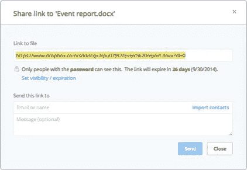

无论采用哪种方法，每个企业都要积极寻找和发现指数增长的机会，这一点对 T21 来说至关重要。数学上不可避免的是，一个不能自我复合的线性增长引擎最终会逐渐消失，甚至像一堵建得太高的墙一样倒塌。

类似地，投资者必须努力筛选噪音，找到少数能推动真正的长期价值创造的细菌。忽略短期内的陡峭轨迹。相反，关注地平线的**曲率。**

**规模不变的增长**是建立一个大而有意义的企业的关键。

去找吧。

## 如果您想了解最新的未来内容，请在下面输入您的电子邮件💌

*如果你喜欢这篇文章，请用掌声表示你的支持*👏👏👏或者与朋友分享。

*最初发表于*[*whoisnnamdi.com*](https://whoisnnamdi.com/you-dont-understand-compound-growth/)

## 这篇文章发表在 [The Startup](https://medium.com/swlh) 上，这是 Medium 最大的创业刊物，拥有+ 375，985 名读者。

## 在这里订阅接收[我们的头条新闻](http://growthsupply.com/the-startup-newsletter/)。

