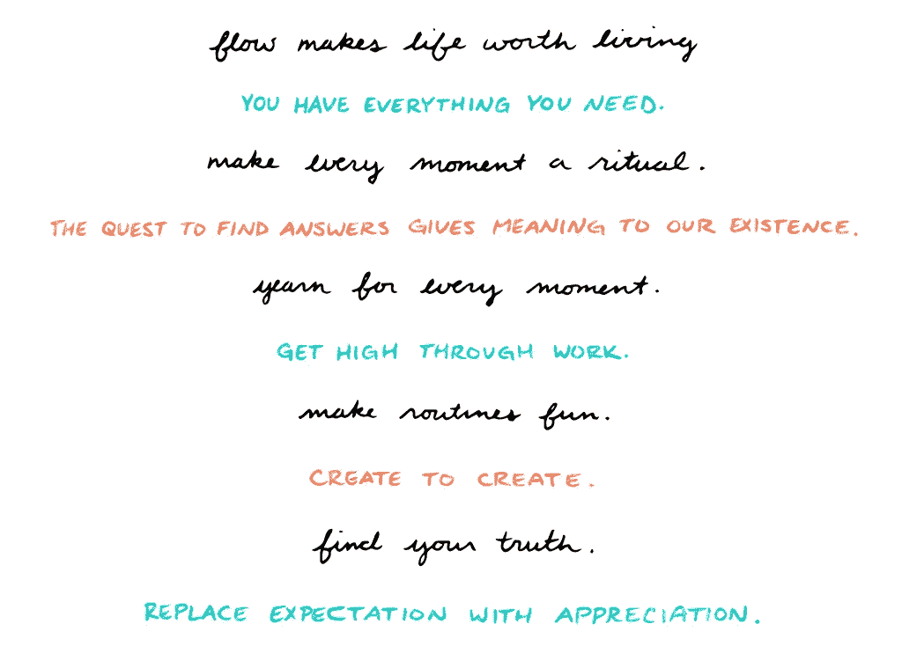

# 你在生活中得到你认为你应得的——以下是如何提升这种信念的方法

> 原文：<https://medium.com/swlh/you-get-in-life-what-you-believe-you-deserve-heres-how-to-upgrade-that-belief-7a77dedeeeaf>

掌握自己的心理对于获得长期的成功和成就感至关重要——而投资于自己在这个过程中起着至关重要的作用。

你的行动主要是执行潜意识程序的命令，你对自己投资的方式，你认为自己有多大的价值和权利——给你周围的世界和你日常生活中接触到的每个人创造了间接的交流和其他无意识的信号。

正如传奇精神病学家大卫·霍金斯爵士所说:

> “人们只是简单地反映出你内在的信仰体系”。

所以成功始于相信你所说的，而相信你所说的，始于你的行动。坚持行动创造自信。

所以，毫无愧疚地接受按摩会让你相信这是你应得的。动手吧。

投资那个你不得不借钱的课程，因为你把学习看得比什么都重要。动手吧。不要感到内疚。

表现得像你应得的那样，打算 100 倍地偿还，然后看着它实现。

如果你想从雇员变成企业家，参加一个战略会议，在会上我们构思并创建你的新公司(或参观你现有的想法),设定目标以帮助你达到收入要求，安全地、可预测地、确定地辞掉工作——点击我的日历，打电话告诉我具体如何做！

我今天早上醒来发现房间很乱，我想知道一个大师级作家和亿万富翁企业家是否应该有这样一个乱七八糟的房间。

以前的我会说“世界著名的作家和亿万富翁企业家没有凌乱的房间，所以你不是那样的人。”

这是绝对错误的。

我内心真实而忠实的能量全心全意地相信，世界知名的作家和亿万富翁企业家甚至不会花一秒钟去考虑那些东西。

获胜者相信“我想要一个干净的房间，这样我醒来时可以有一个更干净的头脑和更好的精神空间，但解决方案是把它从我的盘子里拿走，让别人帮我做，我应该立即为自己得到它，因为我值得。”我现在已经把它添加到我的列表中。

虽然我在经济上还负担不起，但我知道这就是答案，也知道这是我应得的。因此，我拥有它，我知道它会跟随，很快。

这是这个过程中最重要的部分——心态。

事实上，我可能会这样做，并把它作为一个[力函数来增加我的支出，这样我就可以开始生产更多的](/the-mission/6-behaviors-to-become-the-person-you-need-to-become-to-achieve-every-goal-56dbadf2b53b)。想象一下，每天都有人打扫和整理你的房间，这样你就再也不用担心了。

如果这对你来说听起来很疯狂，你不相信你值得拥有它。相信你有。

它应该是标准的，对许多高水平的生产者来说也是如此。

“当然，我会把花在清洁上的时间省下来，进一步投资自己，生产更多产品。”

我们都应该得到它，不应该说什么，但。

莱昂纳多·迪卡普里奥醒来后认为这是他应得的。我可以向你保证，当他负担不起的时候，他仍然相信这是他应得的，并且知道这是迟早的事。

冒名顶替综合症对我们的影响令人难以置信。

*   我不配待在这里。
*   我有什么资格拥有它？
*   为什么那些人会和我一起工作？

相信你值得拥有是得到你想要的一半，所以行动起来，相信你值得拥有，投资自己。

如果你想从雇员变成企业家，参加一个战略会议，在会上我们构思并创建你的新公司(或参观你现有的想法),设定目标以帮助你达到收入要求，安全地、可预测地、确定地辞掉工作——点击我的日历，打电话告诉我具体如何做！

**以下是你必须投资自己的 7 种方式，向世界表明你值得拥有你想要的东西**

# 1.给自己留些闲暇时间

我的时间，这是唯一的也是全部的时间，让你去做你不会做的事情，这是必须的。你值得拥有，也需要相信你值得拥有。给自己一点闲暇时间，不要有一丁点儿内疚。

你只有一次生命，在它结束时，你想知道你有一个悠闲的生活，没有一丝内疚。

正如布龙尼·威尔报道的[所说，临终者最大的遗憾之一是“我希望我没有工作那么多。”](http://www.bronnieware.com/blog/regrets-of-the-dying)

工作、职位或职位的风险越高，你实际上需要的休闲时间就越多，因为休息和恢复至关重要。

这就是为什么美国总统和公司首席执行官们把度假当成他们的工作。这实际上要求他们尽最大努力做好自己的工作，他们领域的大师们知道这一点。

# 2.决定你永远不会再感到内疚

> 内疚是一种无用的感觉。这永远不足以让你改变方向——只能让你变得一无是处。—丹尼尔·纳耶里

这是一件大事，因为我们中的许多人对不工作、不高效、不休假或其他事情感到内疚。无论是我和我的许多同龄人面临的“移民内疚感”，还是作为美德标志传递给我们的“负罪感”，这都是对时间的最大浪费。

决定你永远不会再感到内疚。

成功的人不会有负罪感。成功的人有资格并且相信他们值得。这就是为什么他们中的许多人经常表现得“有权”甚至“傲慢”。你可能认为这对他们不利，但实际上并非如此。人们会给你你认为应得的东西。如果你认为自己应该成为首席执行官，你就应该去做。如果你不这样做，你就不会成功。申请首席执行官的职位，像首席执行官那样行事(像对待首席执行官那样对待自己),永远不要为此感到内疚。

我在上一家公司见过的升职最快的员工是我见过的最有进取心和权利的人。起初我无法忍受他，但我逐渐开始尊重他(你总是这样，当时我天真得多)。我只是不明白为什么这个 25 岁的人认为他应该是董事，然后是副总裁，然后是首席运营官，现在是首席执行官。他的名字叫[威尔·弗莱德，在他的帮助下，这家公司以 5000 万美元的价格被出售，如今他还在继续经营这家公司。](https://therealdeal.com/2016/05/05/bisnow-sells-for-50m-to-private-equity-firm/)

# 3.投资外部帮助

我投资教练。[本杰明·p·哈迪](https://medium.com/u/5153880ce2ee?source=post_page-----7a77dedeeeaf--------------------------------)投资教练。比尔·克林顿在教练上花费了数百万美元。大多数财富 500 强的 CEO 在教练上花费数百万。赌注越高，你就越需要一个教练。比尔·克林顿在第二天被弹劾的前一天晚上给托尼·罗宾斯打了电话。Josh Waitzkin 是数十亿美元投资基金的对冲基金经理的教练，他们的决策价值数十亿美元，影响数万人。你越成功，你就越能利用教练。尽管你很想成功，但你需要指导。

某人经历过“去过那里并做过那件事”并把它传递给你的价值是无价的。就这么简单，尤其是一个关于某个特定主题的教练，比如写作、目标实现或其他任何特定的主题。

教练有时会被误解为有一个导师或老师，但这是不同的。教练只是一个客观的人，可以在你需要的时候直接给你。越严厉越好。他们的经验越多越好。

你的朋友不会为你这么做，他们会告诉你你想听的，因为他们必须永远和你做朋友。你的家人不能为你做这些，因为他们也必须永远和你生活在一起。当你如此既得利益并沉浸在你所做的事情中时，很难做到客观。

一个好的教练可以缩小视野，充满自信地告诉你‘不，那不是怎么想的，这是怎么决定的’。或者“如果你正为此纠结，这里有一个策略你要记住，并在下周练习，直到我们再次见面。”

好的教练会用标准衡量你的成功，并让你负起责任。他们自己也很成功，并且毫无疑问地证明了这一点。记住，永远要听取那些你只想与之交换位置的人的建议。

如果你想从雇员变成企业家，参加一个战略会议，在会上我们构思并创建你的新公司(或参观你现有的想法),设定目标以帮助你达到收入要求，安全地、可预测地、确定地辞掉工作——点击我的日历，打电话告诉我具体如何做！

# 4.投资奢侈生活和产品

> “除了我们内心深处认为我们应该拥有的东西，我们在生活中无法获得更多。”—詹姆斯·鲍尔

再说一次，投资于你自己，这样你才能得到你想要的。

如果你还没有得到你想要的东西，你就不可能得到它。我以前肯定把我银行账户里有限的钱的很大一部分花在奢侈品上了。为什么？因为这是我应得的，我的成功就是世界的成功。

你所拥有的有形地传达和信号给其他人。人们想工作，想和已经拥有财富的人在一起。我花了六个月的时间寻找一个新的工作包。我无法决定是选择信使、背包还是公文包——我对设计和产品充满热情。

鉴于我正在创业，最近搬到了旧金山，我最终决定选择更休闲的背包。然后我去了所有我喜欢的品牌，世界上最好的。我坚持要一个完美的，因为那是我应得的。即使我的最低启动工资(我保证只支付生活在大城市的账单)，我去爱马仕和其他品牌。我看到的理想背包是 8000 美元。是的，你没看错。这听起来可能很疯狂，但有很多人不会畏惧一个 8000 美元的背包。怎样才能让你不退缩？不要退缩！

我当时经济上负担不起，但我知道我很快就会买下每一种颜色。

我最终选择了 300 美元的 Tumi，它非常时尚，即使是 300 美元也不是一个小数目。我一直在这上面得到补充。

以下是工作原理:

就在上周，我去哥伦比亚参加朋友的单身派对，咖啡店里有人问我关于包的事，我们最终在包和其他共同兴趣上聊了一个小时，坐着喝咖啡。

原来，他是蒙大拿州的博士，想学写博客。我现在推荐他加入我的写作训练课程，考虑到我们都喜欢高端产品，我知道他是一个完美的客户。

你看，物以类聚，我相信他会为博客课程投资。

# 5.投资学习是为了你个人的成长——而不是因为你必须“为工作而培训”

学你喜欢的，就这么简单。尽可能自私一点。我关于为什么我在个人成长方面表现出色的重要理论是因为我一直在努力让自己成长，这也许是因为我是世界上最自私的人。

这是不是意味着我很自私？我不知道，但我知道我一直在寻找一种方法来提高自己，并喜欢写这方面的东西。阅读任何你喜欢的能拓展你思维的东西。

学习和实践你知道你一直都有的深度倾向，如果钱不是问题，你会 100%追随。动手吧。你应得的。如果你能创造条件和环境，在开放的市场上取得成功，那也一样。但是基础需要先在那里。我阅读历史、精神、金融等等，都是因为阅读很有趣。我将它应用到日常生活中的方式有待决定。

我应该在企业中学习软件和培训吗？也许吧，但我不知道。也没关系。反正我会成功的。

# 6.投资赚取更多，而不是消费更少

你值得每天早上喝拿铁咖啡。房屋清洁服务让你不必打扫卫生，厨师制作最高等级的食物，让你的机器以正确的速度运转，你需要以如此高的速度生产。

你花时间做的每件事都有机会成本。在一个 70 亿人口不断增长的世界里，每天都有越来越多的竞争，你需要尽一切努力优化你的最佳作品，这样你才能赚得越来越多。

最终你会到达一个金钱不再重要的地方，所有这些东西都将是事后的想法。我曾经富有过，也曾经破产过，所以我很清楚多少钱也买不到幸福。

我住在 6000 英尺高的顶层公寓里，从未像那时那样快乐过。

有趣的是，我们总是在最重要的时候才真正认识到金钱在我们的长期满足感中是多么的无意义。

事物变成了常态，变成了必需品，并且经常从一百个不同的角度创造出新的义务，无论是保养、朋友还是强制维护。

一旦你习惯了它们，它们就不再有趣了。成就感来自于掌握免费的硬东西。

内在成长，创造性输出，克服恐惧，拥有良好的人际关系。没有关系，钱是没有意义的。没有关系，一切都没有意义。如果没人看得见，艺术就不值得创作。

# 7.投资你的身体/心灵

你的身体是你思想的物质表现。拥有一个强大的身体和大脑是必须的。投资于最优质的食物和补充剂来增强你的大脑和身体。不要等到你“买得起”好的食物或医疗保健。

是的，如果没有现金，你就不买，但是当你买得起的时候，你就会买。这是你应得的。你赚了你的第一笔钱，这样你就可以支付这些东西，因为你值得拥有它们。

不用担心那些鼓吹节俭和‘节约’的人。节俭当然有它的位置，储蓄是一种策略，但它们不会让你最终去你想去的地方，谁想拒绝自己最好的生活。

节俭和储蓄都是相对的，这与建议四处奔波，不要生活在预算或财务纪律中相去甚远，因为这是获得你想要的东西所必需的。

如果你无法控制自己的财务，你就不会成功。用最少的钱，你应该有预算，感觉在控制中，甚至储蓄。

这是真正的富足。

富足的诀窍在于感恩。我在一周的开始去 Trader Joes 买杂货，这是一个控制花费的功能。我当然欣赏我在 Trader Joes 购买和烹饪的美食，通常认为餐馆是不必要的。

这是我生酮饮食和间歇性禁食的结果，这帮助我欣赏简单的食物，就好像它们是奢侈品一样。尽管我很喜欢餐馆，但我并不需要它们，我宁愿呆在酮症中，这样我价值 3 美元的鸡蛋和菠菜味道就很好了。

然而，如果我想的话，我当然想每天都在一个地方吃饭，但我就是不想。确实有些细微差别。

做一个预算，感激和欣赏你所拥有的，得到你想要的任何东西，但要有正确的理由。

如果你想从雇员变成企业家，参加一个战略会议，在会上我们构思并创建你的新公司(或参观你现有的想法),设定目标以帮助你达到收入要求，安全地、可预测地、确定地辞掉工作——点击我的日历，打电话告诉我具体如何做！

# 结论

人们反映出你对自己的看法。相信你是最棒的。

专业人士与有资格在那里的人一起工作。相信你值得。

伴侣希望与爱自己并且相信自己值得爱的人交配[。爱自己。](/the-mission/this-5-minute-daily-habit-will-get-people-to-treat-you-how-you-want-to-be-treated-be5cf1a52828)

以你希望被对待的方式对待自己，别人也会这样做。

它始于全心全意地投资于你自己，相信任何你想要的都是可能的，并且你值得拥有它。

## 你对自己投资多少，你就有多少！

## [如果您已经准备好在工作、健康、人际关系等方面加速取得成果](https://calendly.com/aramtaghavi8/60min) [，请点击此处与我安排一次现场教练会议。](https://calendly.com/aramtaghavi8/60min/01-27-2018)

## 这个故事发表在 [The Startup](https://medium.com/swlh) 上，这是 Medium 最大的企业家出版物，拥有 284，454+人。

## 订阅接收[我们的头条](http://growthsupply.com/the-startup-newsletter/)。

