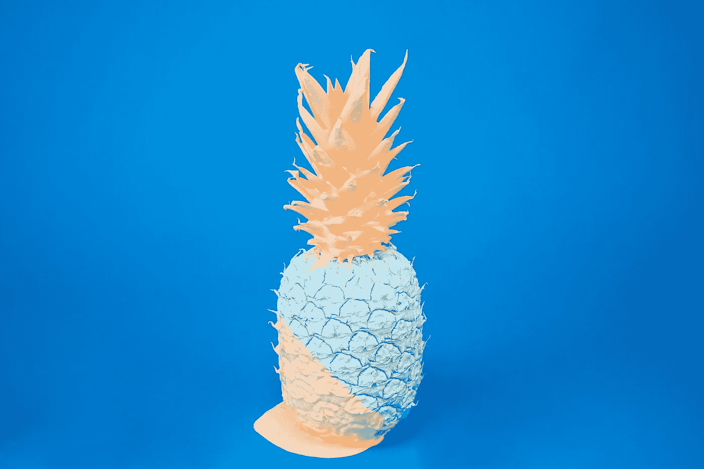

# 你只有一次生命来创造你的杰作

> 原文：<https://medium.com/swlh/you-have-one-life-to-create-your-masterpiece-2ea37cfe1d73>

[https://unsplash.com/@allenaltiner](https://unsplash.com/@allenaltiner)

## 我实现最高理想的 4 步路线图

不久前，我还在后悔自己工作太努力却没有得到相应的结果(听起来很熟悉吧？)

但我想起了马可·奥勒留的话-

> 行动的障碍推动行动。挡在路上的东西会变成路。

每当我发现自己在抱怨时，这些台词一直伴随着我，一次又一次地指引着我。渐渐地，我不再抱怨，开始寻找*此刻我能做什么*。

但是，让我们不要急于求成。

**这篇文章是关于神圣的项目——改变你的*项目，赋予你短暂存在的意义*** 。

[https://unsplash.com/@codytdavis](https://unsplash.com/@codytdavis)

对我来说，一个神圣的项目就是写一本书。我上高中时告诉一个朋友，“我想有一天写一本小说。”当然，我不知道该写些什么，但我知道我想写一本书。

然后，生活发生了。

大学，1.5 个硕士学位，几份工作和关系之后，我回到了我的灵感- *我决定我要写*。

虽然写一本书并不一定意味着寻找一个出书的机会，但任何有抱负的作者都开始梦想着它。我读到过一些人在 12 个月内将一个博客变成了一本书，还有一些人花了超过 15 年的时间试图找到一个出版商却没有成功。

*是随机的吗？我能做些事情来提升自己而不完全依赖于机会吗？*

一天晚上，当我在阳台上看着淅淅沥沥的雨点时，我突然想起了另一件事。夜晚很宁静，有嗡嗡的细雨，月光下的黑暗，偶尔有外面街上的汽车声。

我开始反思我过去的选择，试图找到最能激励我的东西。

我意识到迄今为止让我感到充实的所有事情都是在逆境中发生的。在经历了不和谐婚姻的低谷后，我找到了离婚的勇气，找到了自己的幸福。在离开令人乏味的工作，努力创业两年多后，我在学者战略中获得了成功，这给了我财务自由和巨大的满足感。

这背后有一个简单的原因——我们奋起应对我们面临的挑战。直到我们被迫去做，我们才知道我们能做什么。

我能利用这些知识培养出我最好的一面来实现我的最高愿望吗？

许多这样的瞬间和反思之后，我找到了实现我的神圣计划和目标的大致路线图。我用它来写我的新书，并在这个过程中获得了巨大的满足感。

我不能说它对你是否有用，但是我相信它会让你走上自我发现的道路。

所以，我们开始-

# 1.尝试看起来很难，需要更高努力的事情

2016 年 11 月，我设立了一个目标——我将写一本关于初创公司的书，回答印度创始人最迫切的问题。它会讲述那些不容易被分享的故事和细节。这本书太好了，所有有抱负和真正的企业家都会想看。

一个艰难目标的目的是鞭策自己，因为真正的满足感是知道你已经尽了全力的副产品。

# 2.分解成可操作的步骤

下一个任务是把它分解成细节。鉴于我擅长什么和我喜欢读什么，我决定采访成功的创始人，并把它们编成一本书。我进一步把它分解成每月的里程碑，这样我就可以衡量进度了。

*让成功的创始人同意我的采访请求是下一个挑战*。

我还记得我给 Girish Mathrubootham 先生(Freshworks 的创始人兼首席执行官)的第一封邮件——我没有媒体或创业新闻的背景。我只能告诉他我的想法，以及为什么我是采访他的最佳人选。我敢于接近印度最成功的图书代理商之一，请他代理我的书。

当我敢的时候，这两件事都发生了。

# 3.预料会失败

当我尝试看起来力所不及的事情时，我开始时没有任何期望，这让我没有任何获胜的压力。我几乎预料到自己会默认失败。这样很容易以无拘无束的热情开始，等待下一个‘不’。

从第一天开始我就没有回头。有时人们说是，有时说不是。我每天都问，等着得到拒绝。这教会了我不要被拒绝所困扰。一位智者说过，“如果你失败得不够多，你就没有尝试更大的事情。”

在这个过程中发生了很多“不”,但是他们已经失去了控制我的力量。

为什么梦想很小？如果你失败了，至少在值得失败的事情上失败吧！如果我会得到一个不，我宁愿从理查德布兰森爵士那里得到一个不(我这样做了，但这个故事是另一天！).

我还了解到:

> 没有并不意味着永远没有。拒绝是同意的一个暂时的陷阱。

同一位拒绝接受采访的首席执行官后来同意为这本书背书。拒绝了我第一部小说的那位文学代理人同意了这本书。我从来没有把他们的拒绝放在心上，也没有任何怨恨。

当我向他们提出新的要求时，我已经把过去的拒绝从脑海中抹去了。我尽可能让他们轻松地说“是”。但是因为我已经厚着脸皮拒绝了，所以即使他们不同意我的要求，我也做好了心理准备。

早些时候，每一次拒绝都让我陷入自我怀疑的漩涡，让我无法朝着自己的目标前进，但这次不是。也许这是最大的不同。

**我在寻找继续的理由，而不是停止的借口。**

# 4.保持流动

当采访在 2017 年 8 月结束时，我很感激，但斗争并没有结束。我现在必须找到一个出版商。不是任何一个出版商，而是能理解我对这本书的看法并公正对待它的人。毕竟，这是一个神圣的项目，你不能妥协。

我用同样的方法把它分成具体可行的任务，每天都继续做下去。但是这花了很多时间。

虽然，我想去巴厘岛进行另一次单独旅行，但我的计划被推迟了，因为我在等着先签一份出版合同。我已经搁置了我的一生，等待这本书的出版。

*但是在二月份，我订了一张去巴厘岛的单程票。*

我决定继续做我想做的事情——不管有没有合同。如果到了那一步，我甚至做好了自我出版的心理准备。

> “等待被选中的悖论是，当你最终停止等待时，你就被选中了。”—斯里尼瓦斯·拉奥(绝对的创意)

碰巧的是，在 4 月份飞往巴厘岛的前一天，我在*签下了出书合同。当事情注定要发生的时候，当我不再绝望地希望它们发生的时候，事情就发生了。*

所以，我要出版一本书，由一个我一直想与之合作的人代表，由一个同样对这个项目充满热情的出色的编辑编辑，并以 15 位成功的印度创始人(他们中的许多人非常成功和天才)为特色。我有时会停下来，让自己慢慢理解。两年前，这还是一个遥远的梦想。

## 如果我必须回到 25 岁的自己，我会告诉它:

*   去他妈的惯例。任何常规的东西都不会让你到达一个非常规的地方。
*   如果你不尝试，你永远不会知道。
*   创造你想消费的东西。放下你的控制欲。通过去更新的地方旅行，走出你有限的世界观，去那些人们有不同想法的地方，让你觉得你的信仰不是唯一的信仰。你的做事方式不是唯一的。你的观点并不代表所有人的观点。
*   对宇宙的宏伟感到谦卑是件好事。
*   从微小开始。感到渺小。从那里开始生长。和你的想法一起成长，因为它们是唯一能带你穿越有限存在的海洋的载体。
*   成长，成长，超越。超越你自己有限的信念。超越你的限制。
*   意识到自己潜力的伟大是很好的。
*   在你死之前在这个星球上留下你的签名。不要过平凡的生活。

失败的创业不是失败的你。

失败的关系不是失败的你。

失败的银行账户不是失败的你。

成长中的你是唯一的你，你需要成为。

所以，如果你每天都在努力成长，那就是你能做的和需要做的。魔法将是它的副产品。图书交易将是它的副产品。

所以，总结一下，我的神圣项目到了。我已经为我的创业书籍 **签了一份协议，没有捷径** (omg，它甚至有一个名字！).

这一次，我把 15 位超级聪明的创始人的智慧浓缩在我的话语中。我们在媒体上听到很多天花乱坠的故事，但创业需要血汗。此外，印度也不容易做到这一点(在 190 个经商便利度国家中排名第 100)。我想记录这些创始人的真实历程，我想我做到了。

生一个孩子要九个月。我花了将近两年的时间才看到这本书变成现实。从任何意义上来说，这都是一次构思、培养和付出的旅程。我喜欢这样做，我迫不及待地想看到它是如何在纸和墨水中出现的。封面仍在设计中，否则我会在这里分享:)

## 想成为更好的创业者？

我列出了 **15 本你没听说过的商业书籍**，这些书都是极其成功的创始人所推崇的(除了老一套的《零比一》和《精益创业》!)

[*在这里获取秘商书单*](http://startupbookindia.com/readinglist/) *。*

## 这篇文章发表在 [The Startup](https://medium.com/swlh) 上，这是 Medium 最大的创业刊物，拥有 339，876+的读者。

## 在此订阅接收[我们的头条新闻](http://growthsupply.com/the-startup-newsletter/)。

